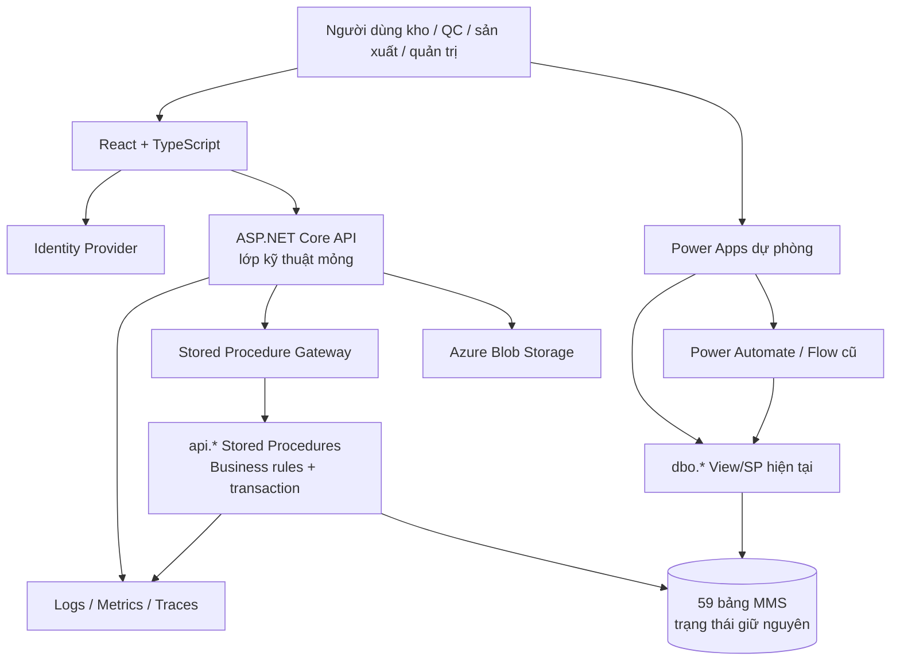
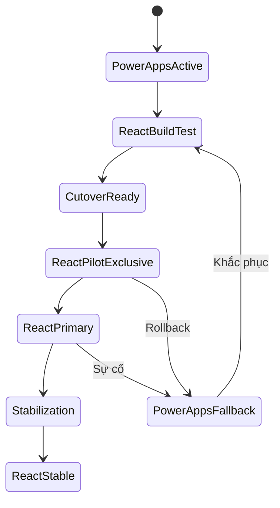
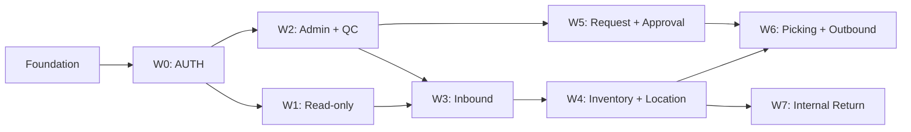

# Kế hoạch chuyển đổi MMS từ Power Apps sang React

**Chiến lược:** chuyển đổi tăng dần theo use case; sau cutover React là kênh vận hành duy nhất, Power Apps chỉ được giữ ở trạng thái dự phòng.

## 1. Tóm tắt quyết định

Kế hoạch áp dụng mô hình **Strangler by Use Case**: React thay thế từng chức năng độc lập thay vì viết lại toàn bộ ứng dụng rồi chuyển một lần.

Các ràng buộc bắt buộc:

1. Giữ nguyên 59 bảng nghiệp vụ hiện tại: không đổi tên bảng/cột, kiểu dữ liệu, khóa hoặc quan hệ trong phạm vi dự án chuyển đổi.
2. Giữ nguyên toàn bộ mã và ý nghĩa trạng thái đang sử dụng; React không tạo một bộ trạng thái song song.
3. Không sao chép dữ liệu sang database mới và không đồng bộ hai chiều giữa hai kho dữ liệu.
4. Trong vận hành Production, React và Power Apps không hoạt động đồng thời cho cùng cohort/use case. React là kênh chính; Power Apps chỉ được kích hoạt khi rollback hoặc diễn tập dự phòng.
5. React không kết nối trực tiếp SQL Server.
6. Backend là lớp API kỹ thuật mỏng; không chứa điều kiện, phép tính, quyết định hoặc chuyển trạng thái nghiệp vụ.
7. Toàn bộ business validation, business rule, calculation, state transition, transaction, concurrency và idempotency được thực thi tại stored procedure.
8. Tạo mới toàn bộ view/query stored procedure/command stored procedure cần cho 42 use case React. Không dùng SP custom cũ làm canonical contract cho React.
9. Không sửa hoặc xóa view/stored procedure cũ trong thời gian Power Apps còn là phương án dự phòng. Các object cũ chỉ phục vụ rollback và kiểm tra tương thích.
10. Mỗi use case chỉ có **một kênh vận hành được kích hoạt** tại một thời điểm: Power Apps trước cutover hoặc React sau cutover.
11. Chuyển đổi, kiểm thử, phát hành, giám sát và rollback đều quản lý theo mã use case.

> **Kết quả mong muốn:** React trở thành hệ thống vận hành chính theo từng wave. Power Apps được khóa khỏi vận hành thường ngày nhưng luôn sẵn sàng kích hoạt lại theo runbook nếu React/API/SP mới gặp sự cố.

## 2. Mục tiêu và phạm vi

### 2.1 Mục tiêu

- Thay thế dần hai Power Apps bằng ứng dụng React/TypeScript thống nhất, responsive cho desktop và thiết bị cầm tay.
- Không làm gián đoạn vận hành kho trong quá trình chuyển đổi.
- Không thay đổi dữ liệu tồn, chứng từ hoặc trạng thái chỉ vì thay giao diện.
- Gom business logic hiện đang phân tán trong Power Fx, Flow và SQL về stored procedure theo từng use case.
- Tạo API contract ổn định, có version, bảo mật, logging và truy vết.
- Viết lại view/query stored procedure theo read model phù hợp với React: phân trang, lọc, sắp xếp, payload nhỏ và không N+1.
- Đo được mức tương đương giữa Power Apps và React trước khi chuyển quyền ghi.
- Quản lý tiến độ, chất lượng và rủi ro ở cấp use case.

### 2.2 Ngoài phạm vi

- Thiết kế lại mã trạng thái hoặc quy trình nghiệp vụ chưa được business owner phê duyệt.
- Chuyển database sang công nghệ khác.
- Đổi cấu trúc 59 bảng nghiệp vụ hiện tại.
- Viết lại các stored procedure do replication/SQL tooling tự sinh nếu chúng không phải contract nghiệp vụ.
- Thay đổi ERP hoặc các hệ thống ngoài không cần thiết cho việc chuyển giao diện.
- Cho phép React hoặc trình duyệt giữ thông tin đăng nhập SQL.

## 3. Hiện trạng làm cơ sở

| Thành phần | Hiện trạng | Ý nghĩa cho chuyển đổi |
| --- | --- | --- |
| Power Apps desktop | 37 màn hình, 72 nguồn dữ liệu | Nhiều luồng quản trị, nhập/xuất và đề nghị |
| Power Apps mobile | 27 màn hình, 54 nguồn dữ liệu | Quét mã, nhận hàng, QC, lưu kho, kiểm kê, soạn hàng |
| Power Fx | Desktop có 97 `Patch`, mobile có 15 `Patch` | Phải lập ma trận hành vi để parity và kiểm tra fallback |
| Database | 59 bảng, 36 view, 203 stored procedure | Bảng/trạng thái giữ nguyên; contract SQL được phân loại và version hóa |
| Stored procedure | 177 SP replication, 7 SP database-diagram, 19 SP custom | Giữ nguyên 203 object legacy; tạo mới lớp SP theo 42 use case React |
| App Checker | 2.155 phát hiện desktop và 708 mobile | React phải đưa accessibility thành tiêu chí nghiệm thu |

Các giới hạn kỹ thuật cần xác minh thêm trong môi trường thật: snapshot không thể hiện foreign key, secondary index hoặc `RowVersion`; ba view đọc linked server BRAVO và hai view đang dùng `SELECT *`. Đây là baseline để đánh giá, không phải lý do tự động thay đổi bảng.

## 4. Kiến trúc đích



### 4.1 Ranh giới trách nhiệm

| Lớp | Được phép | Không được phép |
| --- | --- | --- |
| React | Hiển thị, nhập liệu, validation định dạng, scanner UX, cache server state, gọi API | Kết luận đủ tồn, quyết định trạng thái, tính định mức, duyệt/từ chối nghiệp vụ |
| API | Authentication, endpoint policy, validation kỹ thuật, correlation ID, timeout, gọi gateway, ánh xạ result sang HTTP | Business rule, cập nhật bảng trực tiếp, SQL inline, tự chuyển trạng thái |
| Stored Procedure Gateway | Khai báo parameter/timeout, execute, map result set | `if/switch` quyết định nghiệp vụ, ghép SQL nghiệp vụ |
| Stored procedure | Business validation/rule, state transition, phân quyền theo phạm vi nghiệp vụ, transaction, concurrency, idempotency, audit | Gọi API ngoài hoặc giữ transaction khi chờ hệ thống ngoài |
| View/read contract | Mô hình đọc ổn định, cột rõ nghĩa, không `SELECT *` | Thay đổi dữ liệu hoặc che giấu business write |
| Bảng MMS | Nguồn dữ liệu duy nhất | Bị truy cập ghi từ React hoặc backend trực tiếp |

### 4.2 Cấu trúc repository đề xuất

```text
mms-modernization/
├── apps/
│   ├── web/                         # React + TypeScript
│   └── api/                         # ASP.NET Core host
├── src/
│   ├── Modules/
│   │   ├── IdentityAccess/
│   │   ├── Receiving/
│   │   ├── Quality/
│   │   ├── Inventory/
│   │   ├── Location/
│   │   ├── Outbound/
│   │   ├── InternalReturn/
│   │   └── Administration/
│   └── BuildingBlocks/
├── database/
│   ├── views/
│   ├── stored-procedures/queries/
│   ├── stored-procedures/commands/
│   ├── indexes/
│   └── tests/
├── tests/
│   ├── sql/
│   ├── contract/
│   ├── integration/
│   ├── architecture/
│   └── e2e/
├── docs/
│   └── use-cases/<UC-ID>/
├── deploy/
└── scripts/
```

## 5. Mô hình React chính – Power Apps dự phòng

### 5.1 Nguyên tắc vận hành loại trừ

- React và Power Apps không được mở đồng thời cho cùng cohort/use case trong vận hành thường ngày.
- Trước cutover, Power Apps là kênh hoạt động; React chỉ dùng ở DEV/TEST/UAT hoặc pilot tách biệt theo cohort/ca.
- Sau cutover, React là kênh hoạt động; Power Apps bị khóa quyền truy cập hoặc khóa thao tác ghi và chỉ được kích hoạt theo runbook rollback.
- Không cần sửa Power Apps để gọi SP mới. Các view/SP legacy được giữ nguyên nhằm bảo đảm phương án dự phòng.
- Record do React tạo phải đọc và tiếp tục xử lý được bằng Power Apps nếu rollback; điều này được chứng minh bằng fallback compatibility test trước cutover.
- Không submit một giao dịch thật trên cả hai giao diện để so sánh.

### 5.2 Trạng thái chuyển đổi của một use case



| Trạng thái | Power Apps | React | Kênh vận hành |
| --- | --- | --- | --- |
| `PowerAppsActive` | Hoạt động | Ẩn | Power Apps |
| `ReactBuildTest` | Production hoạt động | Chỉ DEV/TEST/UAT | Power Apps |
| `CutoverReady` | Hoạt động đến thời điểm cutover | Sẵn sàng nhưng khóa | Power Apps |
| `ReactPilotExclusive` | Khóa với cohort pilot | Mở cho cohort pilot | React đối với cohort pilot |
| `ReactPrimary` | Dự phòng, không dùng hằng ngày | Kênh chính | React |
| `Stabilization` | Dự phòng sẵn sàng | Kênh chính | React |
| `PowerAppsFallback` | Tạm kích hoạt | Dừng/khóa mutation | Power Apps |
| `ReactStable` | Dự phòng theo thời hạn đã duyệt | Kênh duy nhất thường trực | React |

### 5.3 Cờ định tuyến độc quyền

Cờ thể hiện một kênh duy nhất, ví dụ:

```text
UC_INV_05_ACTIVE_CHANNEL = POWERAPPS | REACT
UC_OUT_08_ACTIVE_CHANNEL = POWERAPPS | REACT
UC_RET_02_ACTIVE_CHANNEL = POWERAPPS | REACT
```

Cờ có thể áp dụng theo môi trường, kho/xưởng, ca hoặc cohort pilot. API và quyền truy cập phải chặn mutation React khi channel là `POWERAPPS`; Power Apps phải bị ẩn/khóa với cohort khi channel là `REACT`.

### 5.4 Rollback sang Power Apps

1. Ngừng nhận mutation React mới và drain request đang xử lý.
2. Chuyển channel của use case/cohort về `POWERAPPS`.
3. Khóa route/action React tương ứng.
4. Chạy kiểm tra tương thích trên các record React vừa tạo.
5. Mở Power Apps cho người dùng đã xác định.
6. Đối chiếu giao dịch trong khoảng sự cố và xử lý bằng compensation SP được phê duyệt nếu cần.

Không rollback dữ liệu bằng cập nhật bảng thủ công hoặc restore toàn database cho sự cố ứng dụng thông thường. Mỗi lần fallback phải có correlation ID, phạm vi, thời điểm, owner và danh sách giao dịch cần reconciliation.

## 6. Chiến lược view và stored procedure

### 6.1 Tạo mới toàn bộ contract SQL cho React

Mỗi use case React được thiết kế lại từ đầu ở lớp SQL: read view, query SP và command SP cần thiết. Không lấy 19 SP custom hiện tại làm nền rồi sửa chắp vá. Các object cũ được phân loại để hiểu hành vi và duy trì fallback:

| Nhóm | Quy mô từ script hiện tại | Hành động |
| --- | ---: | --- |
| Replication-generated `sp_MSins/sp_MSupd/sp_MSdel` | 177 | Giữ nguyên cho cơ chế hệ thống; không tái sử dụng trong React |
| Diagram/system helper | 7 | Giữ nguyên; không đưa vào contract React |
| Business/utility legacy | 19 | Characterization test và dependency map; giữ cho Power Apps fallback |
| View legacy | 36 | Giữ cho Power Apps fallback; tạo mới toàn bộ read contract cho React |

Phạm vi tạo mới gồm:

- Ít nhất một SQL entry contract cho mỗi 42 use case trong ma trận mục 8.
- Command SP riêng cho từng hành động ghi/chuyển trạng thái.
- Query SP riêng cho list/detail/print/metadata khi payload hoặc quyền khác nhau.
- View version hóa chỉ khi có read model dùng lại giữa nhiều query.
- Reconciliation query, SQL test và permission script cho từng use case.

Không đặt mục tiêu “203 SP mới”. Số object mới được quyết định theo contract nghiệp vụ của 42 use case, không theo số object legacy.

### 6.2 Schema và quy ước tên mới

Tạo schema logic riêng, đề xuất `api`, nhưng không di chuyển bảng hiện tại:

```sql
api.usp_WMS_<UC-ID>_<Action>_v1
api.vw_WMS_<UC-ID>_<ReadModel>_v1
```

Ví dụ:

```text
api.usp_WMS_INB07_ConfirmGoodsReceipt_v1
api.usp_WMS_INV01_GetInventoryBalance_v1
api.usp_WMS_INV05_SplitBatch_v1
api.usp_WMS_OUT08_ConfirmGoodsIssue_v1
api.usp_WMS_RET02_ConfirmInternalReturn_v1
api.vw_WMS_INV01_InventoryBalance_v1
```

Quy tắc:

- Mỗi command tương ứng một hành động/trạng thái của use case, không tương ứng một bảng.
- Breaking change tạo `_v2`; không sửa contract `_v1` khi React version cũ còn được hỗ trợ.
- `CREATE OR ALTER` được dùng trong migration idempotent.
- Mỗi object ghi rõ module, use case ID, business rule ID, owner và version.
- Không dùng `SELECT *`.
- Không trả chuỗi thông báo tự do làm contract.

### 6.3 Contract stored procedure chuẩn

Input chung khi phù hợp:

```text
Business data
UserId
DeviceId
CorrelationId
IdempotencyKey hoặc business key
ExpectedStatus
ExpectedUpdatedAt/ExpectedQuantity hoặc concurrency token hiện có
```

Result set đầu tiên:

| Cột | Kiểu gợi ý | Ý nghĩa |
| --- | --- | --- |
| `IsSuccess` | `bit` | Kết quả nghiệp vụ |
| `ResultCode` | `nvarchar(64)` | Mã ổn định để API ánh xạ HTTP |
| `MessageKey` | `nvarchar(128)` | Khóa nội dung đa ngôn ngữ/thông báo |
| `EntityId` | Kiểu ID tương ứng | Đối tượng vừa xử lý |
| `NewStatus` | Cùng kiểu trạng thái hiện tại | Giá trị trạng thái sau xử lý, không tạo mã mới |
| `CorrelationId` | `uniqueidentifier` | Truy vết xuyên lớp |

Stored procedure query có thể trả thêm result set cho danh sách, tổng số bản ghi và chi tiết liên quan. Backend chỉ map sang DTO/JSON, không quyết định nghiệp vụ.

### 6.4 Transaction, concurrency và idempotency khi không đổi bảng

- Command ghi dùng `SET XACT_ABORT ON`, `TRY...CATCH` và transaction ngắn.
- Lock đúng bản ghi bằng `UPDLOCK, HOLDLOCK` hoặc update có điều kiện theo trạng thái/giá trị hiện tại.
- Mọi chuyển trạng thái phải có `WHERE CurrentStatus = @ExpectedStatus`; `@@ROWCOUNT = 0` trả xung đột, không ghi đè.
- Với tồn kho, khóa batch theo thứ tự ổn định để giảm deadlock.
- Sau ghi phải kiểm tra invariant giữa `tbl_batch_inv` và `tbl_transaction` khi use case tác động số lượng.
- Chống gửi lặp trước hết bằng business key hiện có và khóa ứng dụng (`sp_getapplock`) trong transaction.
- Nếu cần idempotency tổng quát, đề xuất thêm bảng kỹ thuật ở schema riêng, ví dụ `tech.ApiRequest`, mà không sửa 59 bảng nghiệp vụ. Đây là quyết định cần phê duyệt.
- Nếu không cho phép thêm bảng kỹ thuật, từng use case phải chỉ rõ natural key chống trùng và giới hạn bảo đảm idempotency.

### 6.5 View/read model phù hợp React

- View chỉ là read contract ổn định; filter động và pagination đặt trong query stored procedure.
- Danh sách lớn bắt buộc phân trang server-side, whitelist sort/filter.
- Trả đúng cột màn hình cần, không trả payload ảnh/base64 trong danh sách.
- Màn hình master-detail dùng một lần gọi với nhiều result set hoặc endpoint chi tiết, tránh N+1.
- Trả mã trạng thái nguyên bản và metadata hiển thị do SQL contract cung cấp; không hard-code status ở nhiều React component.
- Ngày giờ trả theo quy ước ISO 8601 ở API; SQL trả kiểu ngày giờ, không format chuỗi để trình bày.
- Số lượng trả kiểu decimal phù hợp ở contract dù cột legacy cần được convert; không tính toán bằng JavaScript.
- Query phải SARGable, không bọc cột filter/index trong hàm nếu không cần.
- Đo execution plan, logical reads, CPU và p95 trước/sau; không tạo index theo cảm tính.

### 6.6 Bản đồ chuyển đổi stored procedure hiện tại

| Object hiện tại | Use case liên quan | Hướng xử lý |
| --- | --- | --- |
| `insertsql` | Không xác định | Đánh dấu rủi ro cao; loại khỏi đường Production sau khi tìm dependency |
| `sp_insert_nhanhang` | INB-01/02/03 | Tách command rõ nghĩa theo tạo phiếu, thêm dòng và cập nhật phiếu |
| `sp_insert_phieu_nhan_hang` | INB-01/02 | Hợp nhất rule tạo header vào command use case |
| `sp_insert_nhapkho` | INB-07 | Viết lại thành command xác nhận nhập kho nguyên tử |
| `sp_insert_nhaptra` | RET-01/03 | Tách tạo phiếu và xử lý batch trả |
| `sp_insert_phieu_yeu_cau_chi_tiet` | OUT-01/02/03 | Tách theo loại đề nghị và rule định mức |
| `sp_insert_tonkho` | INV-04 | Viết lại command khai báo tồn có audit/idempotency |
| `sp_insert_xuatkho` | OUT-08 | Viết lại command xác nhận xuất, khóa tồn và rollback nguyên tử |
| `sp_kiemke_batch` | INV-06/07 | Tách kiểm kê batch và vị trí, trả result code chuẩn |
| `sp_pheduyet_approvalcheck` | OUT-05 | Tách query kiểm tra và command phê duyệt/từ chối |
| `sp_select_infor_phieu_dnxk` | OUT-05/09 | Thay bằng query read model có field contract |
| `sp_select_string_vattu_phieu_dnxk` | OUT-05/09 | SQL trả dữ liệu; React/API dựng presentation, không trả chuỗi UI ghép sẵn |
| `sp_split_batch` | INV-05/RET-03 | Chuẩn hóa transaction, concurrency, invariant và idempotency |
| `sp_test_select_string_vattu` | Không phải Production contract | Loại khỏi contract sau khi xác minh dependency |
| `sp_update_location` | LOC-02/03 | Tách put-away và move-location theo business action |
| `sp_update_xuong_ke` | LOC-04 | Viết lại command take-down có expected location/status |
| `sp_update_ma_kiem` | QC-02 | Viết lại command cấu hình QC có audit và phạm vi rõ |
| `sp_update_unit` | ADM-02 | Chuyển thành tác vụ quản trị có kiểm soát, không chạy ngầm trong UI |
| `usp_xacnhan_phieu_nhap_noibo` | RET-02 | Giữ logic nguyên tử, chuẩn hóa result contract và bỏ cursor nếu execution plan chứng minh cần tối ưu |

### 6.7 Các hành vi legacy phải có characterization test

Không được “tối ưu” các điểm dưới đây trước khi khóa hành vi và business owner xác nhận:

- `sp_insert_xuatkho` có nguy cơ lost update vì đường đọc/cập nhật tồn chưa thể hiện khóa phù hợp.
- `sp_insert_nhapkho` chưa có cơ chế chống gọi lặp và state guard đồng nhất.
- `sp_update_location`/`sp_update_xuong_ke` cập nhật theo ID nhưng chưa kiểm tra đầy đủ vị trí/trạng thái mong đợi.
- `sp_insert_phieu_yeu_cau_chi_tiet` tác động cha/con nhưng cần xác minh transaction nguyên tử.
- `usp_xacnhan_phieu_nhap_noibo` dùng cursor và có giá trị hard-code cần được business owner xác nhận trước khi set-based hóa.
- `sp_insert_nhanhang`, `sp_insert_tonkho` có tham số/hành vi cần đối chiếu vì snapshot cho thấy dấu hiệu chưa dùng đầy đủ.
- `sp_insert_nhaptra` cần xác nhận mapping thực tế với nghiệp vụ RET-03.
- `sp_select_string_vattu_phieu_dnxk` dựng JSON presentation và tham chiếu view chưa có định nghĩa trong snapshot; contract React mới chỉ trả dữ liệu.
- `insertsql` cho phép SQL động tùy ý và `sp_test_*` là artifact thử nghiệm; không cấp quyền cho API.

Mỗi điểm phải có test ghi nhận hành vi hiện tại, quyết định “giữ hay sửa”, owner phê duyệt và truy vết về UC/BR ID.

### 6.8 Bảo mật SQL

- API dùng service account riêng, chỉ `GRANT EXECUTE` trên schema `api` và quyền đọc metadata cần thiết.
- `DENY INSERT, UPDATE, DELETE` trực tiếp trên các bảng nghiệp vụ cho service account API.
- Không dùng tài khoản người dùng/Power Apps hiện tại làm connection của API.
- Connection string đặt trong secret store/managed identity, không ghi vào repository hoặc tài liệu.
- Stored procedure nhận `UserId` từ authenticated context; không tin `UserId` do React tự nhập.

## 7. Thiết kế API và React

### 7.1 API theo use case

- Route có version `/api/v1/...`.
- Mỗi mutation gọi đúng một command handler và một stored procedure nghiệp vụ chính.
- Handler chỉ lấy user/device/correlation context, gọi gateway và map `ResultCode` sang HTTP.
- Lỗi dùng Problem Details và có `traceId`.
- Query list có `page`, `pageSize`, filter/sort whitelist.
- OpenAPI là artifact bắt buộc của từng use case.

Mapping gợi ý:

| `ResultCode` | HTTP | React behavior |
| --- | ---: | --- |
| Thành công | 200/201 | Cập nhật cache và hiển thị xác nhận |
| Request format sai | 400 | Đánh dấu field |
| Chưa đăng nhập | 401 | Chuyển login |
| Không có endpoint permission | 403 | Ẩn/chặn action |
| Không tìm thấy | 404 | Empty/not-found state |
| Xung đột trạng thái/concurrency | 409 | Tải lại dữ liệu và yêu cầu xác nhận |
| Vi phạm business rule | 422 | Hiển thị `MessageKey` cạnh action/field |
| Lỗi ngoài dự kiến | 500 | Giữ dữ liệu nhập, cung cấp trace ID |

### 7.2 Cấu trúc React theo feature

```text
src/features/inventory-balance/
├── api/
├── components/
├── hooks/
├── pages/
├── schemas/       # validation kỹ thuật
├── types/
└── tests/
```

Chuẩn bắt buộc:

- TypeScript strict, không phát tán `any`.
- Server state tách UI state; một API client theo feature.
- Mỗi màn hình có loading, data, empty, error và retry state.
- Scanner chống sự kiện quét lặp ở client; stored procedure vẫn chống ghi lặp ở server.
- Status dùng component tập trung lấy metadata từ API, không hard-code màu/nhãn rải rác.
- Giao diện áp dụng `SMART_FACTORY_DESIGN_STYLE_STANDARD.md`.
- Accessibility: keyboard focus, accessible label, vùng chạm và phản hồi quét là Definition of Done.

## 8. Roadmap 42 use case

### 8.1 Cách chia wave

| Wave | Mục tiêu | Số use case | Điều kiện chính |
| --- | --- | ---: | --- |
| Foundation | Nền tảng, chưa chuyển nghiệp vụ | 0 | Repo, CI/CD, identity, API skeleton, SQL convention, feature flag, observability |
| W0 | Xác thực và phân quyền truy cập | 2 | Baseline user/role/screen được owner xác nhận |
| W1 | Read-only pilot | 6 | Chứng minh parity đọc trong UAT, pagination, SLO và fallback compatibility |
| W2 | Quản trị và chu trình QC | 8 | Ma trận quyền, tiêu chí và transition QC được ký |
| W3 | Nhận hàng và nhập kho | 7 | QC sẵn sàng; batch/transaction contract được khóa |
| W4 | Tồn kho và vị trí | 7 | Transaction core nhập kho ổn định; scanner sẵn sàng |
| W5 | Đề nghị và phê duyệt | 5 | Định mức, kế hoạch và luồng duyệt được xác minh |
| W6 | Soạn và xuất kho | 4 | W4 và W5 hoàn tất; invariant tồn đã tự động kiểm tra |
| W7 | Trả nội bộ | 3 | Batch/transaction core W4 ổn định; RET rule được xác nhận |



### 8.2 Ma trận triển khai theo use case

| UC | Chức năng | Wave | Contract SQL đích | Cơ chế chuyển đổi |
| --- | --- | ---: | --- | --- |
| AUTH-01 | Đăng nhập hệ thống | W0 | `api.usp_SEC_AUTH01_GetUserContext_v1` | Identity Provider xác thực; SP trả hồ sơ ứng dụng |
| AUTH-02 | Hiển thị chức năng theo vai trò | W0 | `api.usp_SEC_AUTH02_GetNavigation_v1` | Đối chiếu menu/quyền trong TEST/UAT trước cutover |
| INB-01 | Nhận hàng theo PO | W3 | `api.usp_WMS_INB01_CreateReceiptByPO_v1` | Cutover độc quyền theo cohort/ca |
| INB-02 | Nhận hàng không PO | W3 | `api.usp_WMS_INB02_CreateReceiptWithoutPO_v1` | Pilot theo nhóm nhận hàng |
| INB-03 | Tạo mới/chỉnh sửa phiếu nhận | W3 | `api.usp_WMS_INB03_UpdateReceipt_v1` | Expected status + concurrency check |
| INB-04 | Tra cứu nhật ký nhận hàng | W1 | `api.usp_WMS_INB04_GetReceiptLog_v1` | Parity test trong TEST/UAT |
| INB-05 | Cập nhật nhận hàng theo PO | W3 | `api.usp_WMS_INB05_UpdateReceiptPO_v1` | Single-writer theo phiếu |
| INB-06 | Cập nhật nhiều PO | W3 | `api.usp_WMS_INB06_UpdateMultiplePO_v1` | Transaction nguyên tử; pilot giới hạn |
| INB-07 | Thủ tục nhập kho | W3 | `api.usp_WMS_INB07_ConfirmGoodsReceipt_v1` | P0; không dual-write khác SP |
| INB-08 | Xem/in tem batch nhập | W3 | `api.usp_WMS_INB08_GetBatchLabel_v1` | Đối chiếu output và thử máy in trước cutover |
| QC-01 | Khai báo nhóm/tiêu chí QC | W2 | `api.usp_QC_QC01_SaveCriteria_v1` | Pilot admin QC |
| QC-02 | Gán cấu hình QC cho vật tư | W2 | `api.usp_QC_QC02_AssignMaterialCheck_v1` | Audit bắt buộc |
| QC-03 | Lập phiếu kiểm | W2 | `api.usp_QC_QC03_CreateInspection_v1` | Pilot theo nhóm QC |
| QC-04 | Đánh giá vật tư | W2 | `api.usp_QC_QC04_EvaluateMaterial_v1` | Rule đạt/không đạt chỉ tại SP |
| QC-05 | Tra cứu/hiệu chỉnh lịch sử QC | W2 | `api.usp_QC_QC05_GetInspectionHistory_v1` | Bật read trước; mở edit sau khi command SP đạt |
| QC-06 | In phiếu kiểm | W2 | `api.usp_QC_QC06_GetInspectionPrintData_v1` | Đối chiếu mẫu in |
| INV-01 | Tra cứu tồn kho | W1 | `api.usp_WMS_INV01_GetInventoryBalance_v1` | Parity/performance test trước cutover |
| INV-02 | Lịch sử batch | W1 | `api.usp_WMS_INV02_GetBatchHistory_v1` | Parity test trong TEST/UAT |
| INV-03 | Lịch sử vật tư | W1 | `api.usp_WMS_INV03_GetMaterialHistory_v1` | Parity test trong TEST/UAT |
| INV-04 | Khai báo tồn kho | W4 | `api.usp_WMS_INV04_DeclareInventory_v1` | P0; phê duyệt và idempotency |
| INV-05 | Tách batch | W4 | `api.usp_WMS_INV05_SplitBatch_v1` | P0; invariant + rollback test |
| INV-06 | Kiểm kê theo batch | W4 | `api.usp_WMS_INV06_CountBatch_v1` | Pilot thiết bị/scanner |
| INV-07 | Kiểm kê theo vị trí | W4 | `api.usp_WMS_INV07_CountLocation_v1` | Pilot theo khu vực |
| LOC-01 | Sơ đồ/danh mục vị trí | W1 | `api.usp_WMS_LOC01_GetLocationMap_v1` | Parity test trong TEST/UAT |
| LOC-02 | Đưa batch lên kệ | W4 | `api.usp_WMS_LOC02_PutAwayBatch_v1` | Single-writer theo batch |
| LOC-03 | Đổi vị trí kệ | W4 | `api.usp_WMS_LOC03_MoveBatch_v1` | Expected source location |
| LOC-04 | Đưa batch xuống kệ | W4 | `api.usp_WMS_LOC04_TakeDownBatch_v1` | Expected current location |
| OUT-01 | Đề nghị xuất theo kế hoạch | W5 | `api.usp_WMS_OUT01_CreatePlannedRequest_v1` | Rule định mức tại SP |
| OUT-02 | Đề nghị ngoài kế hoạch | W5 | `api.usp_WMS_OUT02_CreateUnplannedRequest_v1` | Pilot bộ phận yêu cầu |
| OUT-03 | Đề nghị vượt định mức | W5 | `api.usp_WMS_OUT03_CreateOverPlanRequest_v1` | Luồng duyệt tăng cường |
| OUT-04 | Chỉnh sửa đề nghị/bao bì | W5 | `api.usp_WMS_OUT04_UpdateIssueRequest_v1` | Expected status |
| OUT-05 | Theo dõi/phê duyệt đề nghị | W5 | `api.usp_WMS_OUT05_ApproveIssueRequest_v1` | Phân tách người lập/duyệt |
| OUT-06 | Lập danh sách soạn hàng | W6 | `api.usp_WMS_OUT06_CreatePickingList_v1` | Đối chiếu phân bổ tồn |
| OUT-07 | Soạn hàng theo batch | W6 | `api.usp_WMS_OUT07_PickBatch_v1` | Scanner + idempotency |
| OUT-08 | Xuất kho trực tiếp/thủ tục xuất | W6 | `api.usp_WMS_OUT08_ConfirmGoodsIssue_v1` | P0; khóa tồn, transaction, rollback |
| OUT-09 | In phiếu xuất kho | W6 | `api.usp_WMS_OUT09_GetIssuePrintData_v1` | Đối chiếu chứng từ/máy in |
| RET-01 | Lập phiếu trả nội bộ | W7 | `api.usp_WMS_RET01_CreateInternalReturn_v1` | Pilot bộ phận trả |
| RET-02 | Kho xác nhận trả nội bộ | W7 | `api.usp_WMS_RET02_ConfirmInternalReturn_v1` | P0; ba kết quả hiện hành giữ nguyên |
| RET-03 | Tách batch nhập trả | W7 | `api.usp_WMS_RET03_SplitReturnBatch_v1` | Invariant + rollback test |
| ADM-01 | Vai trò/quyền màn hình | W2 | `api.usp_SEC_ADM01_SaveRolePermissions_v1` | Pilot admin; bảo vệ admin cuối cùng |
| ADM-02 | Danh mục/cấu hình | W2 | `api.usp_WMS_ADM02_SaveConfiguration_v1` | Tách command theo danh mục khi triển khai |
| ADM-03 | Log/dashboard | W1 | `api.usp_WMS_ADM03_GetOperationsSummary_v1` | Read-only; không chặn vận hành |

### 8.3 Dependency trực tiếp

- `AUTH-01 → AUTH-02 → tất cả use case còn lại`.
- `QC-01 → QC-02 → QC-03 → QC-04 → QC-05/QC-06`.
- `INB-01/02 → INB-03 → INB-05/06`.
- `INB-01/02/03 + QC-04 khi vật tư cần QC → INB-07 → INB-08`.
- `INV-01 → INV-05/06`; `INV-01 + LOC-01 → INV-07`.
- `LOC-01 + batch hợp lệ → LOC-02 → LOC-03/LOC-04`.
- `OUT-01/02/03 → OUT-04/05`.
- `OUT-05 + INV-01 → OUT-06 → OUT-07 → OUT-08 → OUT-09`.
- `RET-01 + batch/transaction core → RET-02`; `RET-01 + INV-05 → RET-03`.

### 8.4 Entry/exit gate theo wave

| Wave | Entry gate | Exit gate |
| --- | --- | --- |
| W0 | Role-user-screen và mô hình identity được xác nhận | Login/menu/quyền parity; không bypass URL; rollback flag đã diễn tập |
| W1 | W0 hoàn tất; read model và dữ liệu mẫu được duyệt | Khớp khóa, số dòng, tổng số lượng, filter; pagination/SLO đạt; không ghi dữ liệu |
| W2 | Ma trận quyền, tiêu chí và transition QC được ký | Chu trình cấu hình/lập/đánh giá/tra cứu/in QC đạt UAT; toàn bộ write dùng SP mới |
| W3 | W2 ổn định; contract batch/transaction được duyệt | PO/không PO/nhiều PO/QC/nhập kho/tem đạt; không trùng batch/transaction |
| W4 | W3 transaction core ổn định; baseline tồn/vị trí chốt | Tách batch, tồn, kiểm kê, lên/đổi/xuống kệ giữ invariant; đủ một chu kỳ kiểm kê |
| W5 | Luồng duyệt, định mức, kế hoạch và người duyệt được xác minh | Ba loại đề nghị, chỉnh sửa, concurrent approval và lịch sử đạt UAT |
| W6 | W4 và W5 hoàn tất | E2E đề nghị → soạn → batch → xuất → in; không âm tồn/không xuất trùng |
| W7 | Transaction core W4 ổn định và rule trả được xác nhận | Phiếu trả → xác nhận/từ chối → tách/nhập batch cân bằng với transaction |

## 9. Quy trình quản lý một use case

### 9.1 Workflow chuẩn

```text
Identified
→ Analysis Ready
→ Business Rules Locked
→ SQL Contract Ready
→ API Ready
→ React Ready
→ SIT
→ UAT
→ Fallback Compatibility Passed
→ Pilot Write
→ React Primary
→ Stabilized
→ Done
```

### 9.2 Bộ artifact bắt buộc

Mỗi thư mục `docs/use-cases/<UC-ID>/` có:

```text
README.md                 # mục tiêu, actor, scope, dependency
business-rules.md         # BR ID, điều kiện, quyết định, lỗi, owner
state-transitions.md      # trạng thái hiện có và transition được phép
data-contract.md          # bảng/view/SP, input/output, field definition
legacy-write-path.md      # Power Fx Patch, Flow, SP hiện tại
api-contract.yaml         # OpenAPI fragment
ui-acceptance.md          # màn hình và acceptance criteria
test-cases.md             # positive/negative/boundary/concurrency
parity-report.md          # kết quả Power Apps so với React
release-runbook.md        # feature flag, pilot, rollback, reconciliation
decision-log.md           # quyết định và ngoại lệ
```

### 9.3 Definition of Ready

- Có business owner và technical owner.
- Luồng chính, alternate flow và exception flow được xác nhận.
- Mọi business rule quan trọng có mã `BR-<MODULE>-<UC-ID>-NN`.
- Các mã trạng thái hiện hành và transition được liệt kê; không phát sinh trạng thái mới.
- Đã thống kê toàn bộ Power Fx `Patch`, Flow, view và SP đang tham gia.
- Đã xác định channel cutover độc quyền và cách khóa kênh còn lại.
- Có input/output SQL contract và API contract dự kiến.
- Có dữ liệu test ẩn danh và acceptance criteria đo được.
- Dependency, thiết bị, máy in, scanner và quyền được xác định.

### 9.4 Definition of Done

- Business rule chỉ được thực thi trong stored procedure đã xác định owner.
- Backend không có business decision và không ghi bảng nghiệp vụ trực tiếp.
- React không hard-code business state transition.
- SP có transaction, rollback, concurrency, idempotency và audit phù hợp.
- SQL unit test, contract test, integration test và E2E trọng yếu đạt.
- Kết quả read/write đã đối chiếu với Power Apps hoặc baseline được business owner ký.
- Performance đạt SLO đã chốt và không làm xấu workload chung của database MMS.
- UAT và pilot đạt; có runbook chuyển cờ và rollback.
- Quan sát được error rate, latency và invariant theo use case.
- Tài liệu, OpenAPI, migration và traceability đã cập nhật.
- Qua ít nhất hai chu kỳ vận hành ổn định; Power Apps vẫn được duy trì làm dự phòng cho đến khi có quyết định DR riêng.

### 9.5 Backlog item chuẩn

```yaml
use_case_id: INV-05
title: Tách batch
business_owner: <name/role>
technical_owner: <name/role>
scope_in: []
scope_out: []
business_rules: [BR-WMS-INV-05-01]
legacy_paths: []
tables_unchanged: [tbl_batch_inv, tbl_transaction]
statuses_unchanged: []
target_sql_contract: api.usp_WMS_INV05_SplitBatch_v1
target_api: POST /api/v1/batches/{batchId}/split
feature_flags: [UC_INV_05_REACT_WRITE]
dependencies: []
acceptance_criteria: []
required_tests: [sql, contract, integration, e2e, concurrency, rollback]
cutover_owner: <role>
rollback_trigger: []
```

## 10. Kiểm thử và đối chiếu dữ liệu

### 10.1 Test pyramid

| Loại | Trọng tâm |
| --- | --- |
| SQL unit test | Rule, validation, transition, calculation, negative/boundary |
| SQL transaction test | Commit/rollback, deadlock retry policy, invariant |
| SQL concurrency test | Lost update, duplicate scan, hai người cùng xử lý |
| Contract test | Kiểu/độ dài input, result code, result set, backward compatibility |
| API integration | Authentication, authorization, mapping và Problem Details |
| React test | Rendering, form, scanner event, loading/empty/error |
| End-to-end | Luồng thực tế từ UI tới bảng/view và chứng từ |
| Parity test | So sánh Power Apps/legacy contract với React/new contract |
| UAT | Key user vận hành trên thiết bị, mạng, máy in thực tế |

### 10.2 Đối chiếu read contract

- Chạy old query và new query trên cùng snapshot/thời điểm.
- So sánh khóa bản ghi, số lượng, trạng thái, tổng dòng và field quan trọng bằng `EXCEPT` hai chiều.
- Ghi sai lệch có phân loại: lỗi contract, lỗi dữ liệu legacy, khác biệt presentation hoặc business rule chưa thống nhất.
- Chỉ chuyển `CutoverReady → ReactPilotExclusive` khi sai lệch nghiệp vụ trong TEST/UAT bằng 0 theo cửa sổ đã thống nhất.

### 10.3 Đối chiếu write contract

- Thử nghiệm trên bản sao dữ liệu hoặc transaction rollback ở môi trường test.
- So sánh trước/sau trên tất cả bảng bị tác động, không chỉ bảng chính.
- Kiểm tra transaction history, status, audit, batch balance và số lượng.
- Không chạy hai write path trên cùng bản ghi Production chỉ để so sánh.

### 10.4 Invariant bắt buộc

- Tồn `tbl_batch_inv` và tổng giao dịch hợp lệ không lệch ngoài sai số được phê duyệt.
- Không tạo tồn âm nếu nghiệp vụ không cho phép.
- Một phiếu không hoàn tất hai lần.
- Một batch không đồng thời thuộc hai vị trí.
- Transition chỉ đi theo ma trận trạng thái hiện hành.
- Người lập/người duyệt và phạm vi kho/xưởng được kiểm soát đúng.
- Số lượng nhận/xuất/trả khớp chứng từ và đơn vị hiện hành.

## 11. Hiệu năng và SLO

Đo baseline Power Apps/SQL trước khi chốt mục tiêu. SLO khởi điểm đề xuất:

| Loại thao tác | Mục tiêu p95 ban đầu |
| --- | ---: |
| Phản hồi quét mã trên mạng nhà máy | ≤ 800 ms |
| Query danh sách trang đầu | ≤ 1.500 ms |
| Command nghiệp vụ không gọi hệ thống ngoài | ≤ 2.000 ms |
| Mở chi tiết master-detail | ≤ 1.500 ms |
| Tỷ lệ lỗi kỹ thuật API | < 1% trong pilot |

Mọi tối ưu SQL phải dựa trên execution plan và workload thật. Index mới chỉ được thêm sau review; việc thêm index không thay đổi cột/trạng thái nhưng vẫn cần migration, kiểm thử write overhead và rollback script.

## 12. CI/CD và thứ tự triển khai

### 12.1 Pipeline tối thiểu

1. Format/lint.
2. Build React và API.
3. SQL unit/contract test.
4. Backend unit/integration/architecture test.
5. React component và E2E test.
6. Dependency/security scan.
7. Tạo artifact có version.
8. Deploy test → smoke test → UAT.
9. Phê duyệt Production theo use case/wave.

### 12.2 Thứ tự release backward-compatible

1. Deploy view/SP mới và index đã phê duyệt.
2. Chạy SQL contract/performance smoke test.
3. Deploy API mới nhưng endpoint/flag chưa mở.
4. Deploy React mới nhưng route/flag chưa mở.
5. Chạy parity/fallback compatibility test lần cuối.
6. Đóng Power Apps cho cohort rồi bật pilot React độc quyền.
7. Mở rộng 10% → 25% → 50% → 100% theo user/kho nếu các gate đạt.
8. Giữ Power Apps ở trạng thái dự phòng trong stabilization.
9. Sau ký nhận, giữ Power Apps/object legacy ở chế độ dự phòng; chỉ deprecate khi có quyết định DR riêng và phương án thay thế fallback.

## 13. Kế hoạch thời gian

Ước lượng dưới đây dùng sprint 2 tuần. Lịch thực tế phụ thuộc số squad, mức hoàn chỉnh business rule, chất lượng dữ liệu và độ phức tạp của SP mới.

| Giai đoạn | Sprint | Kết quả |
| --- | ---: | --- |
| Foundation | 1–3 | Repo, CI/CD, identity, API shell, SQL convention, flags, logging |
| W0 – AUTH | 4–5 | 2 UC xác thực/phân quyền |
| W1 – Read-only | 6–7 | 6 UC UAT/pilot độc quyền, chứng minh parity đọc |
| W2 – Admin/QC | 8–11 | 8 UC cấu hình và chu trình QC |
| W3 – Inbound | 12–15 | 7 UC nhận hàng đến nhập kho |
| W4 – Inventory/Location | 16–19 | 7 UC tồn, kiểm kê và vị trí |
| W5 – Request/Approval | 16–18 nếu đủ squad; nếu không 20–22 | 5 UC đề nghị/phê duyệt |
| W6 – Picking/Outbound | 23–26 | 4 UC soạn và xuất; chỉ release sau W4 + W5 |
| W7 – Internal Return | 25–27 | 3 UC trả nội bộ; release sau transaction core W4 |
| Stabilization/handover | 28–29 | Xác nhận mức sẵn sàng dự phòng, tổng kết và bàn giao |

- Một squad đầy đủ: khoảng 9–12 tháng, tùy rule/thiết bị/tích hợp.
- Hai feature squad dùng chung SQL/platform: khoảng 30–38 tuần nếu W5 được xây đồng thời với W3/W4 và vẫn tuân thủ dependency phát hành.
- Không ép lịch bằng cách phát triển React trước khi business rule/SP contract được xác nhận.

## 14. Tổ chức và trách nhiệm

| Vai trò | Trách nhiệm theo use case |
| --- | --- |
| Product/Business Owner | Ưu tiên, chốt rule/trạng thái và ký UAT/cutover |
| BA | Use case, BR ID, exception, traceability và parity acceptance |
| Solution Architect | Ranh giới layer, API/SQL contract, quyết định coexistence |
| SQL Developer | View/SP, transaction, concurrency, performance và SQL test |
| Backend Developer | API kỹ thuật, gateway, security, mapping, observability |
| React Developer | UI/UX, scanner, client state và accessibility |
| QA/Key User | Contract/E2E/UAT trên thiết bị và dữ liệu test |
| DevOps/DBA | Pipeline, deployment, secret, monitoring, backup/recovery |
| Cutover Manager | Feature flag, checklist, truyền thông, rollback và reconciliation |

Không mở quá nhiều use case ghi dữ liệu cùng lúc. WIP đề xuất cho mỗi squad: tối đa 2 use case đang code và 2 use case đang SIT/UAT.

## 15. Dashboard quản lý theo use case

Mỗi UC theo dõi tối thiểu:

- Trạng thái workflow hiện tại.
- % business rule đã xác nhận.
- SQL/API/UI/test completion.
- Số defect theo mức độ.
- Parity mismatch còn mở.
- p50/p95 latency và error rate.
- Số giao dịch React/Power Apps.
- Số lần fallback/rollback.
- Invariant violation.
- UAT owner và ngày ký.
- Ngày bắt đầu pilot, React primary và lần kiểm tra sẵn sàng Power Apps dự phòng gần nhất.

## 16. Rủi ro và kiểm soát

| Mã | Rủi ro | Mức | Kiểm soát |
| --- | --- | --- | --- |
| R-01 | Power Apps không xử lý được record do SP React mới tạo khi fallback | Cao | Fallback compatibility test hai chiều trước mỗi cutover |
| R-02 | Rule Power Fx/Flow/SQL không đồng nhất | Cao | Rule workshop, BR ID và SQL parity test |
| R-03 | Hai UI cập nhật cùng bản ghi | Cao | Expected status/value, lock và feature flag theo UC |
| R-04 | Đổi ngầm trạng thái | Cao | State matrix khóa; test transition; không hard-code React |
| R-05 | SP lớn trở thành monolith mới | Trung bình | Một command theo use case/action, owner và version |
| R-06 | Query/SP React làm tăng tải database MMS | Cao | Baseline, execution plan, paging, canary và DB monitoring |
| R-07 | Scanner/máy in không tương thích | Trung bình | Pilot thiết bị thật trước khi mở rộng |
| R-08 | API chứa business logic vì thuận tiện | Cao | Architecture test và code review gate |
| R-09 | Mật khẩu/secret bị lộ | Cao | Secret store, rotate credential, least privilege |
| R-10 | Scope creep thành redesign nghiệp vụ | Trung bình | Constraint bảng/trạng thái và change control theo UC |
| R-11 | Không có idempotency key bền vững | Cao | Natural key + applock; phê duyệt bảng kỹ thuật nếu cần |
| R-12 | Người dùng quay lại Power Apps ngoài kế hoạch | Trung bình | Permission/flag theo UC, truyền thông và log kênh sử dụng |

## 17. Tiêu chí chuyển và dừng

### 17.1 Gate bật pilot write

- UAT luồng chính và ngoại lệ đạt.
- Không còn parity mismatch nghiệp vụ mức nghiêm trọng/cao.
- SQL concurrency/idempotency/rollback test đạt.
- API service account không có quyền ghi bảng trực tiếp.
- Monitoring và feature flag đã kiểm thử.
- Có Power Apps fallback và người chịu trách nhiệm cutover.

### 17.2 Gate React Primary

- Pilot đủ số lượng giao dịch và đủ ca vận hành đã chốt.
- Error rate, latency và invariant đạt ngưỡng.
- Không có lỗi P0/P1 chưa xử lý.
- Key user và business owner ký xác nhận.
- Runbook hỗ trợ, hướng dẫn và kênh báo lỗi đã sẵn sàng.

### 17.3 Trigger rollback

- Sai lệch tồn/chứng từ/trạng thái.
- Duplicate transaction hoặc mất cập nhật.
- Lỗi P0/P1 ảnh hưởng vận hành.
- Error rate/latency vượt ngưỡng liên tiếp theo cửa sổ đã chốt.
- Không truy vết được giao dịch qua correlation ID.
- Thiết bị/scanner/máy in không đáp ứng ca vận hành.

## 18. Kế hoạch 30–60–90 ngày đầu

### Ngày 1–30

- Phê duyệt nguyên tắc kiến trúc và constraint bất biến.
- Lập inventory 112 `Patch`, toàn bộ Flow và dependency SP/view theo 42 UC.
- Workshop state/rule cho W0/W1 và các UC P0: INB-07, INV-04/05, OUT-08, RET-02.
- Chốt identity, hosting, `api` schema, feature flag và secret management.
- Tạo repository, CI skeleton, coding/SQL templates và dashboard UC.
- Đo baseline query, command, error và workload database.

### Ngày 31–60

- Hoàn tất API shell, gateway, result contract, logging/correlation.
- Tạo read contract W1 và chạy parity test tự động.
- Xây React shell, navigation, design system và status metadata.
- Chạy parity test TEST/UAT cho INV-01/02/03, INB-04, QC-05, ADM-03.
- Hoàn tất write-path strategy W2/W3.

### Ngày 61–90

- Pilot AUTH-01/02 (W0) và các UC read-only W1.
- Chốt lesson learned, SLO và quality gate.
- Phát triển W2 cho quản trị/QC và chuẩn bị thiết bị cho W4.
- Hoàn tất SQL contract design W3 nhận hàng/nhập kho.
- Báo cáo quyết định tiếp tục/mở rộng hoặc điều chỉnh roadmap.

## 19. Các quyết định cần phê duyệt trước Sprint 1

1. Identity Provider và cách ánh xạ người dùng/vai trò hiện tại.
2. Hosting React/API, mạng nội bộ, TLS và mô hình high availability.
3. Có chấp thuận schema SQL mới `api` hay dùng quy ước khác.
4. Có cho phép tạo bảng kỹ thuật riêng cho idempotency/outbox/audit bổ sung hay không.
5. Có cho phép thêm nonclustered index sau performance review hay không.
6. Power Apps sẽ được giữ nguyên hoàn toàn hay được phép sửa lỗi tối thiểu chỉ để bảo đảm khả năng fallback.
7. Công cụ feature flag và phạm vi flag theo kho/xưởng/user/role.
8. Kho, ca và nhóm người dùng pilot đầu tiên.
9. Thời hạn giữ Power Apps ở mức warm standby và tần suất diễn tập fallback.
10. SLO, ngưỡng parity và rollback chính thức.
11. Một hay hai squad và người owner SQL dùng chung.
12. Quy trình phê duyệt Production và người có quyền chuyển cờ.

## 20. Tài liệu tham chiếu

- [Hồ sơ tổng thể ứng dụng MMS](HO_SO_TONG_THE_UNG_DUNG_MMS.md)
- [Smart Factory Coding Standard](SMART_FACTORY_CODING_STANDARD.md)
- [Smart Factory Design Style Standard](SMART_FACTORY_DESIGN_STYLE_STANDARD.md)
- [Database schema hiện tại](MMS.sql)
