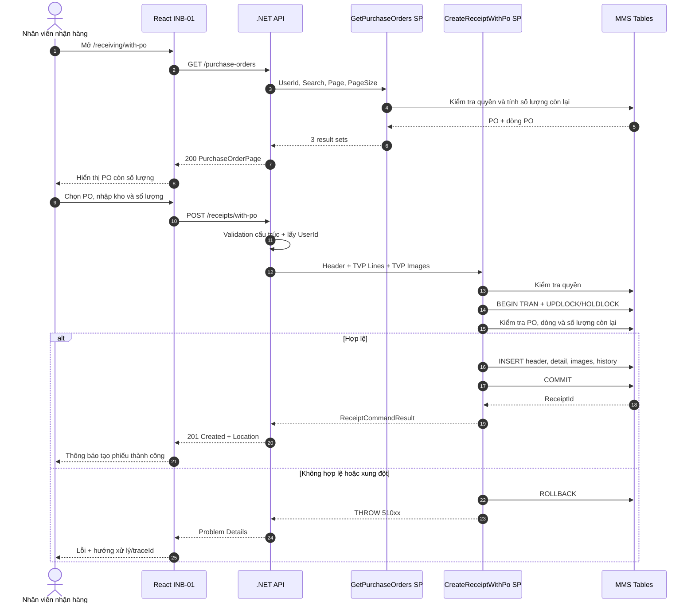
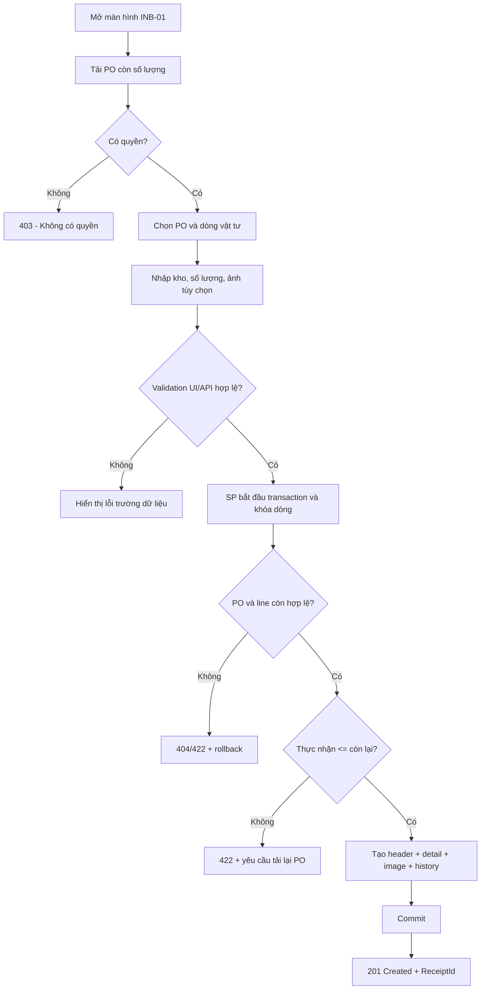
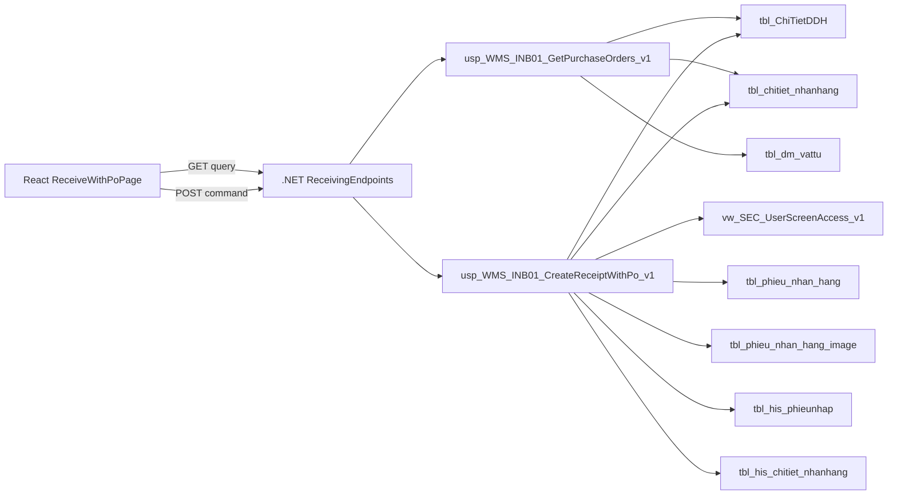
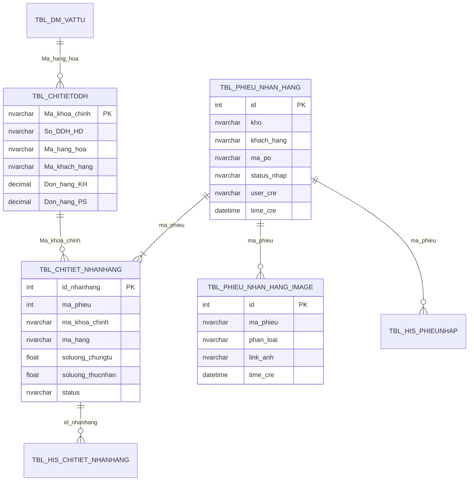

# Phân tích Thiết kế Logic UC01 / INB-01 - Nhận hàng theo PO

> **Mục tiêu tài liệu:** Mô tả đầy đủ nghiệp vụ, giao diện, lập trình, dữ liệu và luồng xử lý của chức năng nhận hàng theo đơn đặt hàng (PO) trong MMS React. Tài liệu sử dụng cấu trúc của `UC04_1_Partial_Receipt.md` nhưng ánh xạ trực tiếp vào contract React, .NET API và SQL hiện có của MMS.

## Thông tin kiểm soát tài liệu

| Thuộc tính | Giá trị |
| --- | --- |
| Use case nghiệp vụ | UC01 |
| Mã quản lý triển khai | INB-01 |
| Tên chức năng | Nhận hàng theo PO |
| Tác nhân chính | Nhân viên nhận hàng (`ACT-01`) |
| Route React | `/receiving/with-po` |
| Nhóm triển khai | W3 - Inbound |
| API | `GET /api/v1/receiving/purchase-orders`; `POST /api/v1/receiving/receipts/with-po` |
| Query SP | `api.usp_WMS_INB01_GetPurchaseOrders_v1` |
| Command SP | `api.usp_WMS_INB01_CreateReceiptWithPo_v1` |
| Trạng thái triển khai | Đã có code, chờ deploy SQL/UAT W3 |

---

## 1. Business Logic (Logic Nghiệp vụ)

### 1.1. Mục đích

UC01 cho phép nhân viên nhận hàng tìm một PO còn hiệu lực, chọn các dòng vật tư còn số lượng được phép nhận, khai báo số lượng thực nhận và tạo phiếu nhận hàng trong một giao dịch SQL duy nhất.

Kết quả của UC01 là một **phiếu nhận hàng chờ bước xử lý tiếp theo**, chưa phải tồn kho khả dụng. UC01 không tạo batch và không ghi `tbl_transaction` hoặc `tbl_phieu_transaction`; việc tạo batch và hạch toán nhập kho thuộc phạm vi INB-07.

### 1.2. Phạm vi

**Trong phạm vi:**

- Tìm kiếm PO theo mã PO, khách hàng/nhà cung cấp, mã vật tư hoặc tên vật tư.
- Chỉ hiển thị PO và dòng PO còn số lượng có thể nhận.
- Nhập số lượng thực nhận cho một hoặc nhiều dòng của cùng một PO.
- Chọn kho nhận.
- Gắn liên kết ảnh chứng từ nếu có.
- Tạo header, detail, ảnh và lịch sử phiếu trong cùng transaction.
- Kiểm tra quyền, tính hợp lệ của PO và số lượng ngay trong stored procedure.

**Ngoài phạm vi:**

- Nhận hàng không PO: INB-02.
- Chỉnh sửa/xác nhận/hủy phiếu đã tạo: INB-03.
- Gắn PO cho phiếu nhận không PO: INB-05/INB-06.
- QC đầu vào: QC-03 đến QC-06.
- Tạo batch, hạch toán nhập kho và transaction: INB-07.
- In tem batch: INB-08.

### 1.3. Tác nhân, quyền và điều kiện

| Thành phần | Mô tả |
| --- | --- |
| Tác nhân chính | Nhân viên nhận hàng (`ACT-01`) |
| Tác nhân hỗ trợ | SQL Server MMS; dịch vụ .NET API |
| Xác thực | API yêu cầu phiên đã xác thực |
| Quyền dữ liệu | User phải có quyền ít nhất một trong các màn hình `scr_nhanhang_po`, `scr_nhanhang_po_chitiet`, `scr_nhanhang_po_nhapmoi` |
| Điều kiện trước | PO tồn tại; còn ít nhất một dòng có số lượng còn lại lớn hơn 0; user có quyền |
| Điều kiện sau thành công | Tạo phiếu, dòng nhận, ảnh hợp lệ và hai nhóm lịch sử; trả về mã phiếu |
| Điều kiện sau thất bại | Không có dữ liệu nghiệp vụ nào được ghi; transaction được rollback |

### 1.4. Luồng nghiệp vụ chính

1. User mở màn hình **Nhận hàng theo PO**.
2. React gọi API lấy danh sách PO còn số lượng.
3. User tìm kiếm và chọn một PO.
4. Hệ thống hiển thị các dòng PO, số lượng đặt, đã nhận và còn lại.
5. User nhập số lượng thực nhận cho một hoặc nhiều dòng, chọn kho và có thể nhập liên kết ảnh.
6. React tạo request chỉ chứa các dòng có số lượng thực nhận lớn hơn 0.
7. API thực hiện validation cấu trúc và lấy `UserId` từ phiên xác thực.
8. Command SP kiểm tra lại quyền, PO, khóa các dòng liên quan và tính số lượng còn lại tại thời điểm ghi.
9. SP tạo phiếu nhận, chi tiết, ảnh và lịch sử trong một transaction.
10. API trả `201 Created`; UI hiển thị mã phiếu và trạng thái.

### 1.5. Luồng thay thế và ngoại lệ

| Mã luồng | Tình huống | Kết quả bắt buộc |
| --- | --- | --- |
| ALT-01 | Không nhập từ khóa tìm kiếm | Trả trang PO còn số lượng gần nhất theo ngày giao |
| ALT-02 | PO có nhiều dòng | Cho phép nhận một hoặc nhiều dòng trong một request |
| ALT-03 | Nhận thiếu một dòng PO | Cho phép nếu `0 < thực nhận <= còn lại`; PO tiếp tục xuất hiện với phần còn lại |
| ALT-04 | Không có ảnh | Vẫn tạo phiếu; không tạo dòng ảnh |
| EX-01 | User không có quyền | Từ chối, HTTP `403`, không ghi dữ liệu |
| EX-02 | Thiếu PO, kho hoặc không có dòng | Từ chối, HTTP `400`, không ghi dữ liệu |
| EX-03 | PO không tồn tại | Từ chối, HTTP `404`, rollback |
| EX-04 | Dòng không thuộc PO hoặc sai vật tư | Từ chối, HTTP `422`, rollback |
| EX-05 | Số lượng nhận vượt phần còn lại | Từ chối, HTTP `422`, rollback |
| EX-06 | Hai request cùng nhận một dòng PO | Request lấy khóa trước được xử lý; request sau phải tính lại phần còn và bị từ chối nếu vượt |
| EX-07 | Lỗi khi ghi bất kỳ bảng nào | Rollback toàn bộ transaction và trả mã truy vết |

### 1.6. Business Rules

| Mã rule | Quy tắc |
| --- | --- |
| BR-UC01-01 | User phải được xác thực và có quyền vào ít nhất một màn hình nhận hàng theo PO. |
| BR-UC01-02 | `PurchaseOrder` và `WarehouseCode` là bắt buộc sau khi loại bỏ khoảng trắng đầu/cuối. |
| BR-UC01-03 | Request phải có ít nhất một dòng nhận hàng. |
| BR-UC01-04 | `DocumentQuantity` và `ReceivedQuantity` của mọi dòng phải lớn hơn 0. |
| BR-UC01-05 | Mỗi `PurchaseOrderKey` chỉ được xuất hiện một lần trong cùng request. |
| BR-UC01-06 | `PurchaseOrderKey` phải thuộc đúng PO đã chọn và khớp `MaterialId`. |
| BR-UC01-07 | Số lượng thực nhận không được vượt số lượng còn lại tại thời điểm SP giữ khóa giao dịch. |
| BR-UC01-08 | Khách hàng/nhà cung cấp của phiếu được lấy từ PO trong SQL, không tin giá trị do client gửi. |
| BR-UC01-09 | Ảnh là tùy chọn; chỉ lưu liên kết không rỗng. |
| BR-UC01-10 | Header, detail, ảnh và lịch sử phải được ghi nguyên tử trong một transaction. |
| BR-UC01-11 | Phiếu mới sử dụng mã trạng thái vật lý hiện tại `status_nhap = '2'`; không đổi cấu trúc bảng hoặc bộ mã trạng thái. |
| BR-UC01-12 | UC01 chỉ ghi nhận hàng; không tạo batch và không tăng tồn kho. |

### 1.7. Công thức số lượng

Với từng dòng PO:

```text
OrderedQuantity   = Don_hang_KH + Don_hang_PS
ReceivedQuantity  = SUM(tbl_chitiet_nhanhang.soluong_thucnhan của các dòng chưa hủy)
RemainingQuantity = MAX(OrderedQuantity - ReceivedQuantity, 0)
```

Điều kiện cho phép ghi:

```text
0 < Request.ReceivedQuantity <= RemainingQuantity tại thời điểm giữ khóa
```

### 1.8. Ranh giới trách nhiệm

| Lớp | Trách nhiệm |
| --- | --- |
| React | Thu thập dữ liệu, validation trải nghiệm, hiển thị loading/error/success |
| .NET API | Xác thực request, lấy user từ `ClaimsPrincipal`, gọi đúng SP, ánh xạ kết quả và lỗi HTTP |
| Stored procedure | Toàn bộ rule nghiệp vụ, phân quyền dữ liệu, concurrency, transaction và ghi dữ liệu |
| Bảng/view | Lưu trạng thái vật lý hiện hành; không chứa logic điều phối từ React |

---

## 2. Tiêu chuẩn Thiết kế Giao diện (UI/UX Guidelines)

### 2.1. Bố cục màn hình

Màn hình hỗ trợ desktop và tablet, gồm ba vùng chính:

1. **Tiêu đề:** mã `INB-01`, tên “Nhận hàng theo PO” và mô tả ngắn.
2. **Danh sách PO:** ô tìm kiếm và bảng PO còn số lượng.
3. **Phiếu nhận:** xuất hiện sau khi chọn PO, gồm kho nhận, ảnh, các dòng vật tư và nút tạo phiếu.

### 2.2. Thành phần giao diện

| Thành phần | Yêu cầu |
| --- | --- |
| Tìm PO | Tìm theo mã PO, khách hàng/nhà cung cấp, mã hoặc tên vật tư |
| Bảng PO | Hiển thị PO, khách hàng/nhà cung cấp, ngày giao và tổng số lượng còn lại |
| Chọn PO | Mã PO là nút/link có thể thao tác bàn phím |
| Kho nhận | Bắt buộc; hiện tại UI mặc định `20020100` nhưng SP vẫn phải kiểm tra |
| Liên kết ảnh | Không bắt buộc; không gửi chuỗi chỉ có khoảng trắng |
| Bảng dòng PO | Hiển thị mã/tên vật tư, số lượng còn lại, đơn vị và ô thực nhận |
| Thực nhận | Kiểu số, lớn hơn 0, không vượt số lượng còn lại |
| Tạo phiếu | Vô hiệu khi đang gửi hoặc kho rỗng; chỉ gửi một lần cho mỗi thao tác |
| Thành công | Hiển thị `ReceiptId` và trạng thái trả về |

### 2.3. Trạng thái giao diện

| Trạng thái | Hiển thị |
| --- | --- |
| Loading | Skeleton/spinner hoặc thông báo đang tải danh sách PO |
| Empty | Không có PO phù hợp hoặc không còn số lượng |
| Error | Thông báo thân thiện, nút **Thử lại**, mã truy vết nếu có |
| Editing | Hiển thị form của PO đang chọn và giữ dữ liệu nhập cục bộ |
| Submitting | Khóa nút tạo phiếu, tránh submit lặp |
| Success | Banner thành công, mã phiếu và hành động mở chi tiết phiếu |
| Conflict | Yêu cầu tải lại PO vì số lượng còn lại đã thay đổi |

### 2.4. Validation phía giao diện

Validation React chỉ giúp user sửa nhanh, không thay thế validation trong SP:

- PO và kho không được rỗng.
- Phải chọn ít nhất một dòng có số lượng lớn hơn 0.
- Giá trị phải là số hữu hạn.
- Số lượng không âm và không vượt `remainingQuantity` đang hiển thị.
- Decimal được phép vì table type sử dụng `decimal(19,4)`; UI phải giới hạn tối đa 4 chữ số thập phân.
- Không sử dụng `parseInt` cho trường số lượng.

### 2.5. Accessibility

- Mỗi input số lượng phải có `aria-label` chứa mã vật tư.
- Không dùng màu sắc làm tín hiệu lỗi duy nhất.
- Focus chuyển tới trường lỗi đầu tiên sau validation.
- Thông báo thành công/lỗi dùng vùng `aria-live`.
- Nút và link phải thao tác được bằng bàn phím.

---

## 3. Programming Logic (Logic Lập trình)

### 3.1. Frontend React

**Mã nguồn:** `apps/web/src/features/w3/ReceiveWithPoPage.tsx`

**Quản lý trạng thái:**

```ts
search: string
purchaseOrder: string | null
warehouseCode: string
imageLink: string
quantities: Record<PurchaseOrderKey, number>
```

**Query key:**

```ts
['INB-01', search]
```

**Thuật toán tạo command:**

```ts
const selectedLines = lines
  .filter(line => quantity[line.purchaseOrderKey] > 0)
  .map(line => ({
    receivingLineId: null,
    purchaseOrderKey: line.purchaseOrderKey,
    materialId: line.materialId,
    documentQuantity: quantity[line.purchaseOrderKey],
    receivedQuantity: quantity[line.purchaseOrderKey],
    unit: line.unit,
    deliveryDate: line.deliveryDate,
  }));
```

Sau khi tạo thành công, phiên bản hoàn thiện cần:

1. Invalidate query `['INB-01']` để cập nhật số lượng còn lại.
2. Xóa số lượng đã nhập và ảnh cục bộ.
3. Hiển thị link mở phiếu `/receiving/receipts/{receiptId}` khi route chi tiết sẵn sàng.
4. Không tự động retry command POST.

### 3.2. API .NET

**Mã nguồn:**

- `apps/api/Modules/Receiving/ReceivingEndpoints.cs`
- `apps/api/Modules/Receiving/ReceivingContracts.cs`
- `apps/api/Modules/Receiving/ReceivingGateway.Queries.cs`
- `apps/api/Modules/Receiving/ReceivingGateway.Commands.cs`

API group bắt buộc xác thực:

```csharp
var group = endpoints.MapGroup("/api/v1/receiving")
    .RequireAuthorization();
```

`UserId` phải lấy từ `ClaimsPrincipal`; client không được truyền `UserId` trong JSON body.

### 3.3. API Contract - Tra cứu PO

#### Request

```http
GET /api/v1/receiving/purchase-orders?search=PO-001&page=1&pageSize=50
Authorization: Bearer <token/session>
```

| Tham số | Kiểu | Bắt buộc | Quy tắc |
| --- | --- | --- | --- |
| `search` | string | Không | Tối đa 200 ký tự ở SQL contract |
| `page` | int | Không | Nhỏ hơn 1 được chuẩn hóa về 1 |
| `pageSize` | int | Không | Phạm vi 1–200; mặc định 50 |

#### Response `200 OK`

```json
{
  "items": [
    {
      "purchaseOrder": "PO-001",
      "customerCode": "SUP-01",
      "orderDate": "2026-08-01T00:00:00",
      "deliveryDate": "2026-08-12T00:00:00",
      "remainingQuantity": 120.5
    }
  ],
  "lines": [
    {
      "purchaseOrder": "PO-001",
      "purchaseOrderKey": "PO-LINE-001",
      "materialId": "MAT-001",
      "bravoId": "BR-001",
      "materialName": "Vật tư A",
      "orderedQuantity": 200,
      "receivedQuantity": 79.5,
      "remainingQuantity": 120.5,
      "unit": "KG",
      "deliveryDate": "2026-08-12T00:00:00"
    }
  ],
  "totalCount": 1,
  "page": 1,
  "pageSize": 50
}
```

### 3.4. API Contract - Tạo phiếu nhận theo PO

#### Request

```http
POST /api/v1/receiving/receipts/with-po
Content-Type: application/json
Authorization: Bearer <token/session>
```

```json
{
  "purchaseOrder": "PO-001",
  "warehouseCode": "20020100",
  "lines": [
    {
      "receivingLineId": null,
      "purchaseOrderKey": "PO-LINE-001",
      "materialId": "MAT-001",
      "documentQuantity": 20.5,
      "receivedQuantity": 20.5,
      "unit": "KG",
      "deliveryDate": "2026-08-12"
    }
  ],
  "images": [
    {
      "category": "1",
      "imageLink": "https://storage.example/receipt-001.jpg"
    }
  ]
}
```

#### Response `201 Created`

```json
{
  "receiptId": 12345,
  "statusCode": "2",
  "lineCount": 1,
  "changedAt": "2026-08-12T10:30:00"
}
```

Header phản hồi:

```http
Location: /api/v1/receiving/receipts/12345
```

### 3.5. Stored Procedure Contract

#### Query SP

```sql
api.usp_WMS_INB01_GetPurchaseOrders_v1
    @UserId   nvarchar(50),
    @Search   nvarchar(200) = NULL,
    @Page     int = 1,
    @PageSize int = 50
```

SP trả ba result set theo thứ tự cố định:

1. Danh sách PO tổng hợp.
2. Các dòng của những PO trong trang hiện tại.
3. `TotalCount`.

#### Command SP

```sql
api.usp_WMS_INB01_CreateReceiptWithPo_v1
    @UserId        nvarchar(50),
    @PurchaseOrder nvarchar(50),
    @WarehouseCode nvarchar(50),
    @Lines         api.ReceivingLineItem_v1 READONLY,
    @Images        api.ReceiptImageItem_v1 READONLY
```

Result set thành công:

```text
ReceiptId | StatusCode | LineCount | CreatedAt
```

### 3.6. Thuật toán Command SP

```text
1. Kiểm tra quyền màn hình theo @UserId.
2. Chuẩn hóa PO và kho; kiểm tra header, lines và số lượng.
3. Bắt đầu transaction với XACT_ABORT ON.
4. Đọc PO bằng UPDLOCK, HOLDLOCK và lấy mã khách hàng.
5. Với từng line, kiểm tra key + PO + material và tính lượng đã nhận.
6. Nếu bất kỳ line nào vượt phần còn lại: THROW 51022.
7. INSERT tbl_phieu_nhan_hang, lấy ReceiptId bằng SCOPE_IDENTITY().
8. INSERT tbl_chitiet_nhanhang từ TVP @Lines.
9. INSERT các ảnh có link hợp lệ.
10. INSERT lịch sử header và detail.
11. COMMIT.
12. Trả ReceiptId, StatusCode, LineCount, CreatedAt.
13. Nếu lỗi: ROLLBACK và THROW lại lỗi gốc.
```

### 3.7. Concurrency và Idempotency

**Concurrency hiện có:**

- Command SP sử dụng `UPDLOCK, HOLDLOCK` khi đọc PO và các dòng nhận đã tồn tại.
- Số lượng còn lại được tính lại trong transaction, không tin số lượng còn lại từ UI.
- Toàn bộ ghi dữ liệu nằm trong một transaction với `XACT_ABORT ON`.

**Khoảng trống cần xử lý trước production:**

- Contract v1 chưa có `IdempotencyKey`; retry do mất mạng có thể tạo phiếu thứ hai nếu request đầu đã commit nhưng response không về client.
- Cần bổ sung cơ chế idempotency bằng bảng kỹ thuật sidecar hoặc business key được phê duyệt, không thay đổi trạng thái nghiệp vụ hiện hữu.
- Trước khi có idempotency, client không tự retry POST và phải khóa nút trong lúc gửi.

### 3.8. Error Contract

| SQL number | Result code | HTTP | Ý nghĩa |
| --- | --- | --- | --- |
| `51001` | `MMS_FORBIDDEN` | 403 | Không có quyền nhận hàng theo PO |
| `51002` | `MMS_INVALID_INPUT` | 400 | Header, dòng hoặc số lượng không hợp lệ |
| `51004` | `MMS_NOT_FOUND` | 404 | Không tìm thấy PO |
| `51009` | `MMS_CONFLICT` | 409 | Xung đột trạng thái/dữ liệu |
| `51022` | `MMS_BUSINESS_RULE_VIOLATION` | 422 | Dòng sai PO hoặc nhận vượt phần còn lại |
| Khác | Không cố định | 500 | Lỗi hệ thống; response phải có `traceId` |

Problem Details mẫu:

```json
{
  "title": "Vi phạm quy tắc nghiệp vụ",
  "status": 422,
  "detail": "Dòng PO không hợp lệ hoặc số lượng nhận vượt số lượng còn lại.",
  "traceId": "00-...",
  "resultCode": "MMS_BUSINESS_RULE_VIOLATION"
}
```

---

## 4. Data Logic (Thiết kế Dữ liệu)

### 4.1. Ma trận CRUD

| Đối tượng | Loại | C | R | U | D | Mục đích |
| --- | --- | :---: | :---: | :---: | :---: | --- |
| `api.vw_SEC_UserScreenAccess_v1` | View |  | ✓ |  |  | Kiểm tra quyền user |
| `dbo.tbl_ChiTietDDH` | Table |  | ✓ |  |  | PO và dòng đặt hàng |
| `dbo.tbl_dm_vattu` | Table |  | ✓ |  | Tên vật tư, đơn vị |
| `dbo.tbl_phieu_nhan_hang` | Table | ✓ |  |  | Header phiếu nhận |
| `dbo.tbl_chitiet_nhanhang` | Table | ✓ | ✓ |  | Dòng nhận và tổng đã nhận |
| `dbo.tbl_phieu_nhan_hang_image` | Table | ✓ |  |  | Liên kết ảnh chứng từ |
| `dbo.tbl_his_phieunhap` | Table | ✓ |  |  | Audit header |
| `dbo.tbl_his_chitiet_nhanhang` | Table | ✓ |  | Audit detail |
| `api.ReceivingLineItem_v1` | Table type |  | ✓ |  | Truyền danh sách dòng vào SP |
| `api.ReceiptImageItem_v1` | Table type |  | ✓ |  | Truyền danh sách ảnh vào SP |

### 4.2. Mapping trường dữ liệu

| Contract | Cột vật lý/nguồn | Ghi chú |
| --- | --- | --- |
| `purchaseOrder` | `tbl_ChiTietDDH.So_DDH_HD` → `tbl_phieu_nhan_hang.ma_po` | PO được xác minh trong SQL |
| `purchaseOrderKey` | `tbl_ChiTietDDH.Ma_khoa_chinh` → `tbl_chitiet_nhanhang.ma_khoa_chinh` | Khóa trace tới dòng PO |
| `materialId` | `tbl_ChiTietDDH.Ma_hang_hoa` → `tbl_chitiet_nhanhang.ma_hang` | Phải khớp dòng PO |
| `customerCode` | `tbl_ChiTietDDH.Ma_khach_hang` → `tbl_phieu_nhan_hang.khach_hang` | Không nhận từ client |
| `warehouseCode` | Request → `tbl_phieu_nhan_hang.kho` | Bắt buộc |
| `documentQuantity` | Request → `tbl_chitiet_nhanhang.soluong_chungtu` | Vật lý hiện tại là `float` |
| `receivedQuantity` | Request → `tbl_chitiet_nhanhang.soluong_thucnhan` | Contract dùng `decimal(19,4)` |
| `unit` | `tbl_dm_vattu.unit`/request → `tbl_chitiet_nhanhang.unit` | Theo dòng PO |
| `deliveryDate` | `tbl_ChiTietDDH.Ngay_giao_DDH`/request → `ngay_giao_hang` | Nếu null dùng ngày tạo |
| `imageLink` | Request → `tbl_phieu_nhan_hang_image.link_anh` | Chỉ ghi link không rỗng |
| `userId` | Authenticated claim → `user_cre` | Không tin dữ liệu client |
| `statusCode` | Hằng nghiệp vụ hiện tại → `status_nhap = '2'` | Không thay đổi mã vật lý |

### 4.3. State Model

#### Trạng thái dòng PO được suy diễn

| Trạng thái khái niệm | Điều kiện | Có lưu cột trạng thái mới? |
| --- | --- | --- |
| `AVAILABLE` | Đã nhận = 0, còn lại > 0 | Không |
| `PARTIALLY_RECEIVED` | Đã nhận > 0, còn lại > 0 | Không |
| `FULLY_RECEIVED` | Còn lại <= 0 | Không |

Các trạng thái trên được suy diễn từ số lượng; UC01 không thêm cột hoặc thay đổi cấu trúc `tbl_ChiTietDDH`.

#### Trạng thái phiếu nhận

```text
UC01 tạo phiếu status_nhap = '2'
        |
        +--> INB-03: sửa / xác nhận / hủy theo trạng thái cho phép
        |
        +--> QC nếu vật tư yêu cầu kiểm tra
        |
        +--> INB-07: tạo batch và hạch toán nhập kho khi đủ điều kiện
```

### 4.4. Transaction Boundary

Các thao tác sau phải cùng commit hoặc cùng rollback:

```text
tbl_phieu_nhan_hang
    + tbl_chitiet_nhanhang
    + tbl_phieu_nhan_hang_image (nếu có)
    + tbl_his_phieunhap
    + tbl_his_chitiet_nhanhang
```

UC01 không ghi:

```text
tbl_batch_inv
tbl_transaction
tbl_phieu_transaction
```

### 4.5. Kiểm soát dữ liệu cần gia cố

| Mức | Nội dung | Hướng xử lý |
| --- | --- | --- |
| P0 | Chưa có idempotency cho command tạo phiếu | Thêm contract và bảng kỹ thuật sidecar sau phê duyệt |
| P1 | `TOP (1)` lấy khách hàng của PO chưa có kiểm tra nhiều mã khách hàng | SP phải từ chối PO không nhất quán hoặc xác lập quy tắc chọn xác định |
| P1 | Contract dùng decimal nhưng cột vật lý nhận dùng float | Kiểm thử sai số và thống nhất precision khi đọc/ghi, không đổi bảng ở giai đoạn này |
| P1 | Chưa xác minh `WarehouseCode` thuộc danh mục kho trong command SP | Bổ sung validation bằng nguồn danh mục hiện có |
| P2 | Link ảnh chưa có whitelist giao thức/miền | Kiểm soát ở API hoặc dịch vụ lưu trữ |

---

## 5. Biểu đồ Thiết kế (Diagrams)

### 5.1. Sequence Diagram



### 5.2. Flowchart



### 5.3. Data Flow Architecture



### 5.4. Entity Relationship Map

> Sơ đồ thể hiện quan hệ logic phục vụ UC01; không khẳng định mọi quan hệ đều đã có foreign key vật lý trong database hiện tại.



---

## 6. Acceptance Criteria và UAT

| Mã | Kịch bản | Kết quả mong đợi |
| --- | --- | --- |
| AC-01 | User có quyền mở màn hình | Danh sách chỉ gồm PO còn số lượng |
| AC-02 | Tìm theo mã PO | Trả đúng PO và các dòng còn lại |
| AC-03 | Nhận một phần dòng PO | Tạo phiếu; lần tải sau số còn lại giảm đúng |
| AC-04 | Nhận đủ dòng PO | Tạo phiếu; dòng không còn xuất hiện trong danh sách khả dụng |
| AC-05 | Nhận nhiều dòng cùng PO | Tạo một header và đúng số detail |
| AC-06 | Không nhập ảnh | Tạo phiếu thành công, không có dòng ảnh rỗng |
| AC-07 | Nhận vượt số còn lại | HTTP 422; không có header/detail/history mới |
| AC-08 | Dòng không thuộc PO | HTTP 422; rollback toàn bộ |
| AC-09 | User không có quyền | HTTP 403; không lộ dữ liệu PO |
| AC-10 | Hai request cạnh tranh cùng dòng | Không được nhận vượt tổng số PO |
| AC-11 | Lỗi ở bước ghi history | Header/detail cũng rollback |
| AC-12 | API lỗi ngoài dự kiến | UI hiển thị thông báo chung và `traceId` |

### 6.1. Dữ liệu đối soát sau UAT

Với mỗi `ReceiptId` thành công, phải đối chiếu:

```text
1 header trong tbl_phieu_nhan_hang
N dòng trong tbl_chitiet_nhanhang = lineCount trả về
0..N ảnh hợp lệ trong tbl_phieu_nhan_hang_image
1 history header trong tbl_his_phieunhap
N history detail trong tbl_his_chitiet_nhanhang
0 batch và 0 transaction được tạo bởi UC01
```

### 6.2. Tiêu chí phi chức năng

- Query phân trang tối đa 200 PO mỗi request.
- Command không dùng SQL động.
- Không ghi dữ liệu ngoài stored procedure command.
- Không log token, chuỗi kết nối hoặc nội dung nhạy cảm.
- Mọi lỗi 500 phải có `traceId` để hỗ trợ vận hành.
- Kiểm thử tải phải bao gồm nhiều request cạnh tranh trên cùng dòng PO.

---

## 7. Cutover và Dự phòng Power Apps

- React là giao diện ghi chính sau cutover UC01.
- Power Apps không chạy ghi song song; chỉ giữ làm phương án dự phòng.
- Bảng và mã trạng thái vật lý không thay đổi để Power Apps vẫn có thể đọc dữ liệu hiện hành.
- Khi rollback giao diện, tắt route/feature flag React và bật lại Power Apps; không đảo ngược các phiếu React đã commit.
- Trước khi bật lại Power Apps, xác nhận không còn command React đang chạy và đối soát phiếu cuối cùng theo `ReceiptId`/thời gian.

---

## 8. Traceability Matrix

| Hạng mục | Tham chiếu |
| --- | --- |
| Hồ sơ tổng thể | `HO_SO_TONG_THE_UNG_DUNG_MMS.md` - INB-01 |
| Kế hoạch chuyển đổi | `KE_HOACH_CHUYEN_DOI_POWER_APPS_SANG_REACT_MMS.md` - W3/INB-01 |
| React page | `apps/web/src/features/w3/ReceiveWithPoPage.tsx` |
| React API client | `apps/web/src/features/w3/w3Api.ts` |
| Zod contract | `apps/web/src/features/w3/contracts.ts` |
| .NET endpoints | `apps/api/Modules/Receiving/ReceivingEndpoints.cs` |
| .NET contracts | `apps/api/Modules/Receiving/ReceivingContracts.cs` |
| Query gateway | `apps/api/Modules/Receiving/ReceivingGateway.Queries.cs` |
| Command gateway | `apps/api/Modules/Receiving/ReceivingGateway.Commands.cs` |
| Query SP | `database/stored-procedures/w3/api.usp_WMS_INB01_GetPurchaseOrders_v1.sql` |
| Command SP | `database/stored-procedures/w3/api.usp_WMS_INB01_CreateReceiptWithPo_v1.sql` |
| Table types | `database/migrations/0003_w3_table_types.sql` |
| Contract smoke test | `database/tests/w3_contract_smoke.sql` |
| UAT tổng thể | `UAT_CUTOVER_CHECKLIST_MMS.md` - INB-01 |

---

## 9. Definition of Done

UC01 được coi là hoàn tất khi:

- [ ] Query SP và Command SP đã deploy đúng phiên bản.
- [ ] Runtime role chỉ có quyền `EXECUTE`/`SELECT` cần thiết qua contract `api`.
- [ ] React, .NET và SQL contract khớp tên trường, kiểu dữ liệu và thứ tự result set.
- [ ] Toàn bộ AC-01 đến AC-12 đạt trên môi trường UAT với dữ liệu đại diện.
- [ ] Đã kiểm thử concurrency trên cùng dòng PO.
- [ ] Đã có quyết định và kiểm thử idempotency trước production.
- [ ] Có log/traceId và runbook xử lý lỗi.
- [ ] Đối soát xác nhận UC01 không tạo batch hoặc transaction tồn kho.
- [ ] Có biên bản phê duyệt nghiệp vụ của nhận hàng, kho, QC và IT vận hành.

