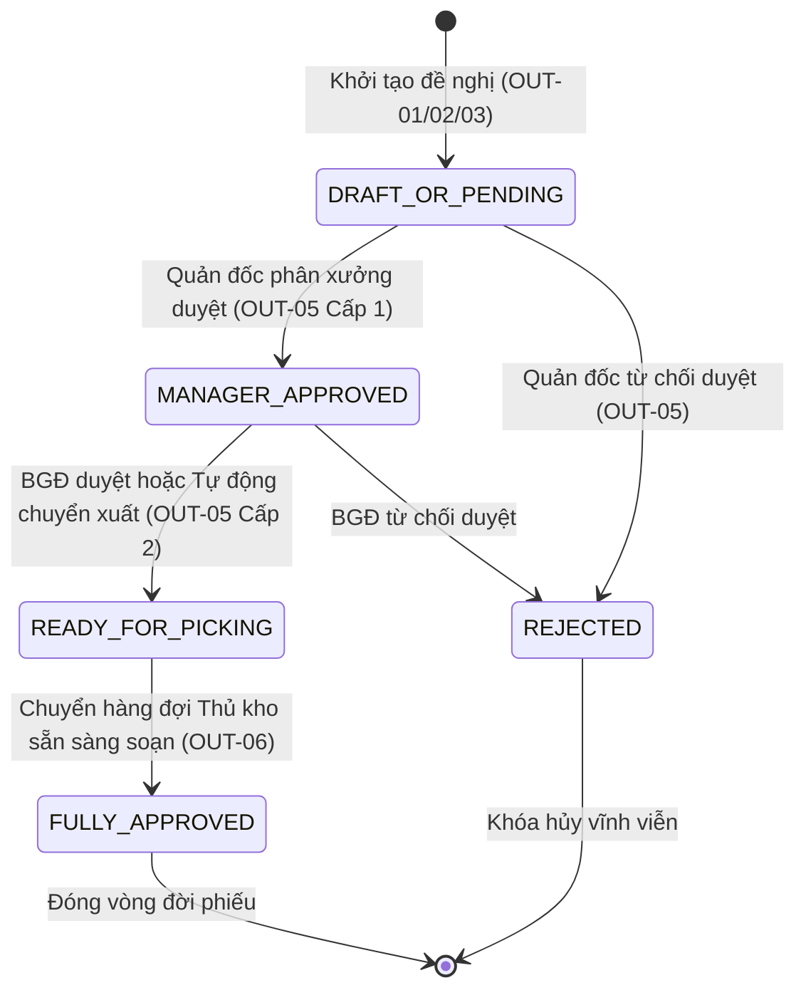
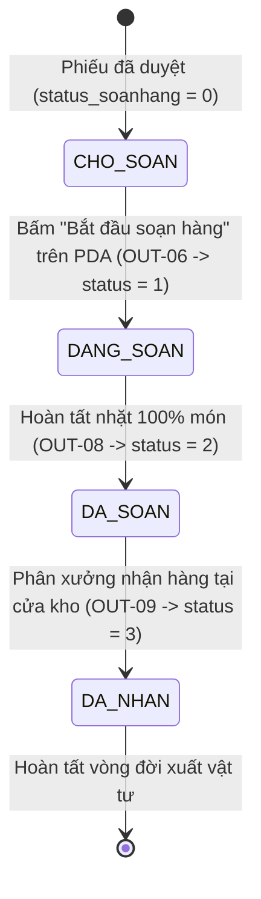
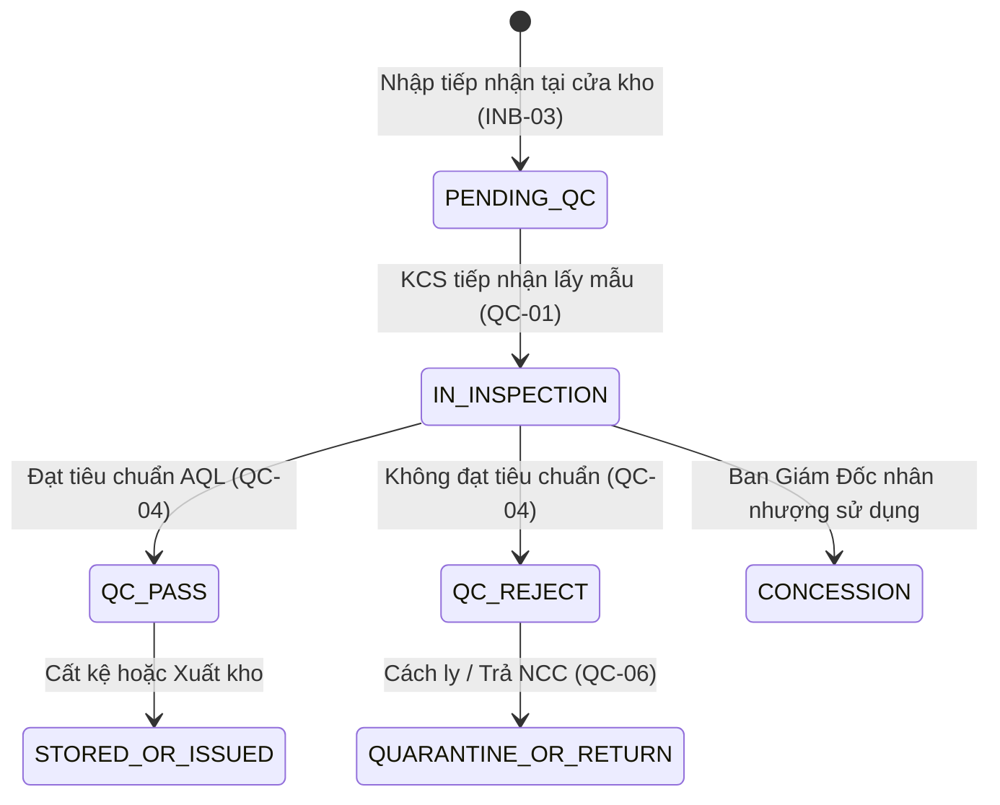

# Mô Hình Trạng Thái Khái Niệm (Conceptual State Model) & Ma Trận Chuyển Đổi Trạng Thái (State Transition Matrix)

Tài liệu này định nghĩa toàn diện mô hình trạng thái khái niệm (Conceptual State Model), bảng mã trạng thái số legacy, điều kiện kích hoạt chuyển trạng thái (Triggers & Preconditions) và ma trận chuyển đổi trạng thái (State Transition Matrix) của toàn bộ các thực thể cốt lõi trong hệ thống MMS WMS.

---

## 1. Mô Hình Trạng Thái Phiếu Đề Nghị Xuất Kho (`tbl_phieu_yeucau`)

### 1.1. Ma Trận Trạng Thái Phê Duyệt (`trang_thai_phieu`):

| Mã Trạng Thái (`trang_thai_phieu`) | Tên Trạng Thái Hiển Thị | Ý Nghĩa Nghiệp Vụ | Quyền Thao Tác Tiếp Theo | Điều Kiện Chuyển Đổi (Transition Triggers) |
| :--- | :--- | :--- | :--- | :--- |
| **`'0'`** | **ĐÃ HỦY / TỪ CHỐI (REJECTED)** | Phiếu bị người lập hủy hoặc cấp quản lý từ chối phê duyệt | Không thể thao tác thêm (Khóa đóng) | Người lập bấm Hủy hoặc Quản đốc bấm Từ chối (kèm lý do) |
| **`'1'`** | **CHỜ DUYỆT (PENDING_APPROVAL)** | Phiếu mới tạo thành công, đang chờ Quản đốc thẩm tra | Quản đốc được duyệt / từ chối; Người lập được sửa / hủy | Gửi đề nghị xuất kho thành công từ màn hình OUT-01/02/03 |
| **`'3'`** | **QUẢN ĐỐC ĐÃ DUYỆT (MANAGER_APPROVED)** | Quản đốc phân xưởng đã phê duyệt cấp 1, chờ BGĐ duyệt (đối với đơn vượt/ngoài BOM) | Ban Giám Đốc phê duyệt cấp 2; Thủ kho xem trước | Quản đốc bấm Phê Duyệt trên giao diện Approval (OUT-05) |
| **`'4'`** | **SẴN SÀNG SOẠN HÀNG (READY_FOR_PICKING)** | Đã được phê duyệt đầy đủ, chuyển sang hàng đợi của Thủ kho | Thủ kho / Nhân viên PDA bấm bắt đầu soạn hàng (OUT-06) | BGĐ phê duyệt hoặc Phiếu trong BOM được Quản đốc duyệt |
| **`'5'`** | **HOÀN TẤT DUYỆT / HOÀN TẤT XUẤT (FULLY_APPROVED)** | Phiếu đã được Ban Tổng Giám Đốc duyệt xuất hoặc hoàn tất xuất kho | Hệ thống lưu trữ hồ sơ và đối soát kế toán | Chốt xuất kho thành công tại OUT-08 |

---

### 1.2. Ma Trận Trạng Thái Soạn Hàng Thực Tế (`status_soanhang`):

| Mã Trạng Thái (`status_soanhang`) | Tên Trạng Thái Hiển Thị | Ý Nghĩa Thực Tế Tại Kho | Màu Sắc / Badge UI | Thao Tác Khả Dụng |
| :--- | :--- | :--- | :--- | :--- |
| **`'0'` hoặc `NULL`** | **CHỜ SOẠN HÀNG (APPROVED / READY)** | Phiếu nằm trong hàng đợi, chưa có nhân viên nào nhặt hàng | Badge xanh lá `⏳ CHỜ SOẠN` | Chạm thẻ phiếu $\rightarrow$ Mở Preview $\rightarrow$ Bấm "Bắt đầu soạn hàng" |
| **`'1'`** | **ĐANG SOẠN HÀNG (PICKING)** | Nhân viên đang cầm PDA đi quét nhặt vật tư tại các Ô kệ | Badge vàng cam `⚡ ĐANG SOẠN` (Pulse) | Chạm thẻ phiếu $\rightarrow$ Bấm "Tiếp tục soạn hàng" $\rightarrow$ Quét Lô |
| **`'2'`** | **ĐÃ SOẠN XONG / CHỜ NHẬN (ISSUED / PICKED)** | Đã nhặt đủ 100% món, trừ tồn kho, chờ xưởng đến lấy | Badge xanh dương `📦 ĐÃ SOẠN` | In Phiếu Xuất Kho (PXK) $\rightarrow$ Bàn giao cho phân xưởng |
| **`'3'`** | **ĐÃ NHẬN HÀNG TẠI XƯỞNG (RECEIVED)** | Đại diện phân xưởng đã ký nhận và mang vật tư về line sản xuất | Badge xanh ngọc `✓ ĐÃ NHẬN` | Xem lại chứng từ lịch sử (Read-only) |

---

## 2. Mô Hình Trạng Thái Kiểm Định Chất Lượng Lô Hàng (`tbl_map_nhapkho.status_qc`)

| Trạng Thái QC (`status_qc`) | Ý Nghĩa Chất Lượng | Quyền Hạn Lưu Kho / Xuất Kho | Hành Động Tiếp Theo |
| :--- | :--- | :--- | :--- |
| **`'PENDING'` / `'WAIT_QC'`** | Chờ kiểm tra KCS | Khóa xuất kho, chỉ lưu tạm tại khu vực Staging | Phân công nhân viên KCS lấy mẫu đo lường (QC-01) |
| **`'IN_INSPECTION'`** | Đang kiểm định đo lường | Khóa xuất kho | Nhập kết quả đo lường và lập biên bản kiểm tra (QC-03) |
| **`'PASS'` / `'PASS_CHO_NHAP'`** | Đạt tiêu chuẩn kỹ thuật | Mở khóa toàn diện: Cho phép cất kệ (\`ON_RACK\`) và xuất kho (\`OUT_CON\`) | Đề xuất vị trí Ô kệ và cất hàng vào kho (INB-04/05) |
| **`'REJECT'`** | Không đạt tiêu chuẩn kỹ thuật | Khóa xuất kho vĩnh viễn, cấm đưa vào sản xuất | Chuyển vào Khu kho cách ly Q hoặc Trả Nhà cung cấp (QC-06) |
| **`'CONCESSION'`** | Chấp nhận nhân nhượng có điều kiện | Cho phép xuất kho theo chỉ đạo bằng văn bản của Ban Giám Đốc | Ghi chú điều kiện sử dụng đặc biệt khi xuất kho |

---

## 3. Mô Hình Trạng Thái Lưu Kho Ô Kệ (`tbl_map_nhapkho.status_kho`)

| Trạng Thái Kho (`status_kho`) | Ý Nghĩa Lưu Trữ | Vị Trí Vật Lý |
| :--- | :--- | :--- |
| **`'RECEIVING'`** | Đang tiếp nhận kiểm đếm tại cửa kho | Khu vực đệm Staging |
| **`'ON_RACK'`** | Đã cất vào Ô kệ nhưng chờ duyệt hạch toán chính thức | Trên dầm kệ (K01-T2-01) |
| **`'STORED'`** | Đã hạch toán nhập kho chính thức vào Sổ Cái Kép | Trên dầm kệ (K01-T2-01) |
| **`'QUARANTINE'`** | Đang lưu giữ tại Khu cách ly chờ xử lý | Khu vực cách ly (Khu Q) |
| **`'REMOVED'`** | Đã xuất kho hoặc tiêu hủy | Đã rời khỏi kho |

---

## 4. Mô Hình Trạng Thái Kỳ Kiểm Kê (`tbl_kiemke_header.status`)

| Trạng Thái Kiểm Kê (`status`) | Ý Nghĩa Kỳ Kiểm Đếm | Quyền Hạn Thao Tác |
| :--- | :--- | :--- |
| **`'DRAFT'`** | Dự thảo kế hoạch kiểm kê | Cho phép chỉnh sửa phạm vi Ô kệ, danh mục SKU và phân công nhân sự |
| **`'IN_PROGRESS'`** | Đang diễn ra kiểm đếm thực địa | Nhân viên PDA quét đếm mù từng thùng; Có thể khóa Ô kệ liên quan |
| **`'COMPLETED'`** | Đã đếm xong toàn bộ phạm vi | Khóa nhập liệu PDA; Mở báo cáo đối soát chênh lệch cho Trưởng phòng |
| **`'RECONCILED'`** | Đã chốt số liệu và hạch toán điều chỉnh Sổ Cái | Đóng kỳ kiểm kê, sinh bút toán \`ADJUST_COUNT\` vào \`tbl_transaction\` |