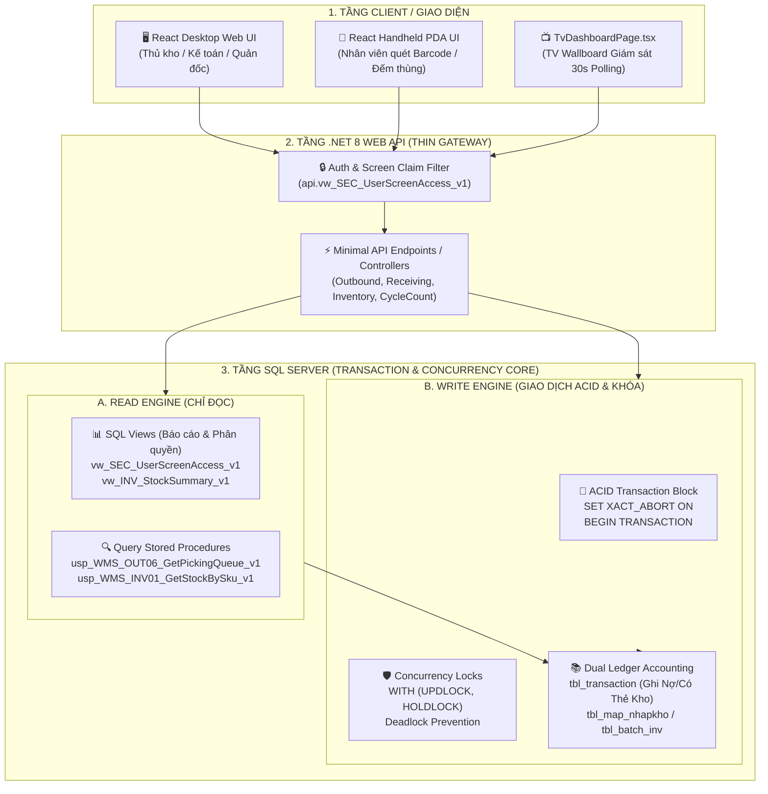

# Kiến Trúc Tầng Dữ Liệu (Data Layer Architecture), Luồng Dữ Liệu & Khóa Giao Dịch (Transaction Locking)

Tài liệu này đặc tả chi tiết kiến trúc tầng dữ liệu, nguyên lý giao dịch ACID, cơ chế khóa đồng thời (Concurrency Control & Transaction Locking), luồng luân chuyển dữ liệu (Data Flow Pipeline) và hạch toán Sổ Cái Kép (Dual Ledger) cho toàn bộ hệ thống MMS WMS.

---

## 1. Kiến Trúc Tổng Thể Tầng Dữ Liệu (Data Layer Pipeline)

Hệ thống MMS WMS áp dụng kiến trúc **3-Tier Phân Tách Tuyệt Đối (Strict Separation of Concerns)**:
- **Tầng Client (React Web & PDA Handheld):** Chỉ tương tác qua HTTP REST JSON APIs, không bao giờ truy vấn trực tiếp SQL.
- **Tầng Ứng Dụng (.NET 8 Web API):** Đóng vai trò Gateway mỏng (Thin Gateway), chịu trách nhiệm xác thực JWT Cookie/Bearer, kiểm tra Claim, map Request DTO, thực thi Stored Procedure và map lỗi trả về.
- **Tầng CSDL (SQL Server Stored Procedures & Views):** Là **Single Source of Truth** duy nhất thực thi toàn bộ Business Rules, kiểm tra phân quyền dữ liệu, quản lý giao dịch ACID và khóa đồng thời.



---

## 2. Chiến Lược Khóa Giao Dịch & Chống Deadlock (Transaction Locking Matrix)

Nhằm đảm bảo an toàn tuyệt đối cho dữ liệu tồn kho trong môi trường đa người dùng (nhiều nhân viên PDA quét nhặt hàng và kiểm kê đồng thời), toàn bộ Stored Procedure Command bắt buộc áp dụng tiêu chuẩn khóa:

### 2.1. Cú pháp bắt buộc cho Command Stored Procedure:
```sql
ALTER PROCEDURE api.usp_WMS_xxx_Command_v1
    @UserId nvarchar(50),
    ...
AS
BEGIN
    SET NOCOUNT ON;
    SET XACT_ABORT ON; -- Bắt buộc: Tự động Rollback ngay lập tức khi phát sinh lỗi runtime

    -- 1. Kiểm tra quyền màn hình (Security Check)
    IF NOT EXISTS (
        SELECT 1 FROM api.vw_SEC_UserScreenAccess_v1 
        WHERE UserId = @UserId AND ScreenCode = N'scr_xxx'
    ) THROW 51001, N'Khong co quyen thuc thi chuc nang.', 1;

    BEGIN TRY
        BEGIN TRANSACTION;

        -- 2. Đọc và Khóa dòng dữ liệu mục tiêu bằng UPDLOCK, HOLDLOCK
        -- (Ngăn chặn Dirty Read, Non-repeatable Read và Lost Update)
        SELECT @CurrentQty = so_luong, @CurrentStatus = status_soanhang
        FROM dbo.tbl_phieu_yeucau WITH (UPDLOCK, HOLDLOCK)
        WHERE id_phieu_yeucau = @RequestId;

        -- 3. Kiểm tra điều kiện nghiệp vụ (Business Validation)
        IF @CurrentStatus NOT IN (N'0', N'1') 
            THROW 51004, N'Phieu khong o trang thai hop le.', 1;

        -- 4. Thực thi biến động dữ liệu & Ghi nhật ký Sổ Cái
        UPDATE dbo.tbl_phieu_yeucau 
        SET status_soanhang = N'1'
        WHERE id_phieu_yeucau = @RequestId;

        COMMIT TRANSACTION;

        -- 5. Trả kết quả thành công
        SELECT RequestId = @RequestId, StatusCode = N'1';
    END TRY
    BEGIN CATCH
        -- 6. Rollback an toàn nếu transaction còn mở
        IF XACT_STATE() <> 0 ROLLBACK TRANSACTION;
        THROW; -- Ném lỗi kèm mã định danh cho API
    END CATCH;
END;
```

### 2.2. Bảng Ma Trận Khóa Concurrency (Locking Matrix):

| Thao Tác Nghiệp Vụ | Bảng Bị Tác Động | Gợi Ý Khóa (Lock Hint) | Mức Độ Cô Lập (Isolation Level) | Mục Đích Kiểm Soát |
| :--- | :--- | :--- | :--- | :--- |
| **Bắt đầu soạn hàng (OUT-06)** | `tbl_phieu_yeucau`, `tbl_phieu_transaction` | `WITH (UPDLOCK, HOLDLOCK)` | `READ COMMITTED` | Ngăn chặn 2 thủ kho cùng mở soạn 1 phiếu xuất |
| **Quét nhặt Lô Batch (OUT-07)** | `tbl_batch_inv`, `tbl_phieu_yeucau_chitiet` | `WITH (UPDLOCK, HOLDLOCK)` | `READ COMMITTED` | Chống xuất âm kho khi 2 PDA cùng nhặt 1 Lô |
| **Hoàn tất xuất kho (OUT-08)** | `tbl_phieu_transaction`, `tbl_phieu_yeucau` | `WITH (UPDLOCK, HOLDLOCK)` | `READ COMMITTED` | Đóng băng chứng từ, chống chèn thêm dòng sau khi xuất |
| **Xác nhận nhập kho (INB-06)** | `tbl_map_nhapkho`, `tbl_po_bravo` | `WITH (UPDLOCK, HOLDLOCK)` | `READ COMMITTED` | Chống nhập trùng Lô và chốt sản lượng PO |
| **Tách Lô Batch (INV-06)** | `tbl_map_nhapkho` (Lô Mẹ & Lô Con) | `WITH (UPDLOCK, HOLDLOCK)` | `REPEATABLE READ` | Đảm bảo bảo toàn tổng sản lượng Lô Mẹ = Lô Con + Dư |
| **Kiểm kê chốt sổ cái (INV-09)** | `tbl_kiemke_detail`, `tbl_map_nhapkho` | `WITH (TABLOCKX)` | `SERIALIZABLE` | Khóa độc quyền toàn bảng kiểm kê khi chốt chênh lệch |

---

## 3. Nguyên Lý Hạch Toán Sổ Cái Kép (Dual Ledger Architecture)

Mọi biến động tăng/giảm/điều chuyển/tách lô trong kho MMS đều được hạch toán đồng thời vào **2 cấp sổ sách**:
1. **Sổ Chi Tiết Kho Cấp Thùng/Lô (`inventory_ledger` / `tbl_transaction`):**
   - Theo dõi chi tiết từng biến động vật lý gắn liền với `id_batch`, `id_nhapkho`, `id_vitri_khe` (Kệ A01-T2-01).
   - Nghiệp vụ: `INB_PO` (Nhập NCC), `INB_PROD` (Nhập xưởng), `OUT_CON` (Xuất sản xuất), `TRANSFER` (Chuyển kệ), `SPLIT_BATCH` (Tách thùng), `ADJUST_COUNT` (Điều chỉnh kiểm kê).
2. **Sổ Kế Toán Tổng Hợp Cấp SKU (`item_ledger` / Thẻ kho SKU):**
   - Theo dõi tổng số lượng nhập - xuất - tồn theo từng mã `id_vattu` và `id_bravo` trên toàn bộ kho để so khớp với sổ cái kế toán ERP Bravo.