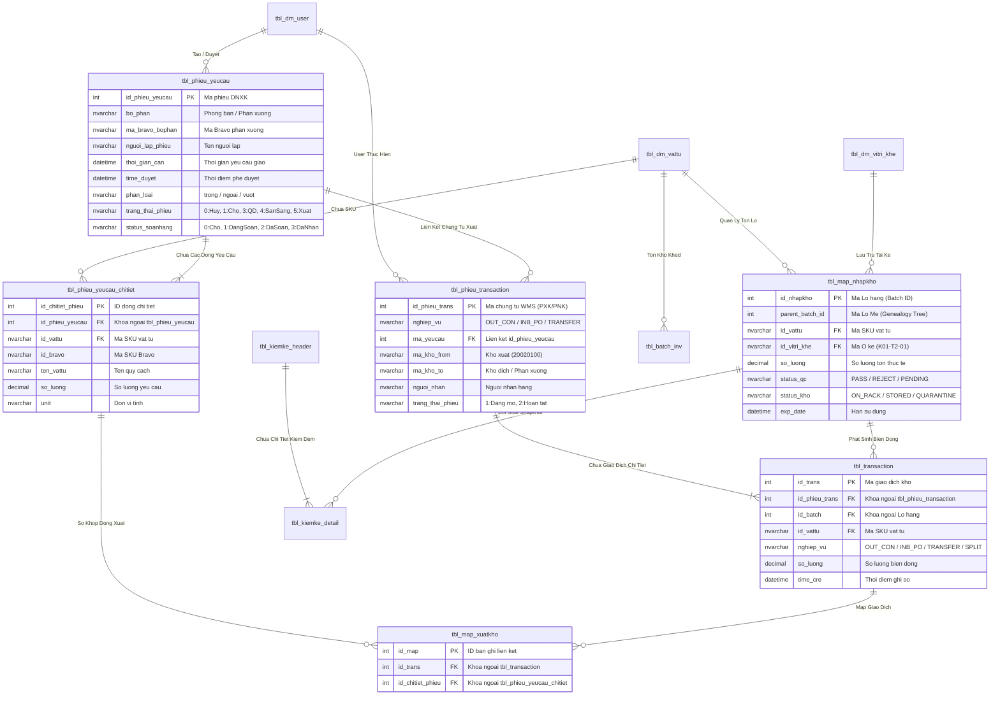

# Sơ Đồ Thực Thể Liên Kết (Entity Relationship & State Logic Map - ERD Map)

Tài liệu này đặc tả toàn diện sơ đồ quan hệ thực thể (ERD), định nghĩa các bảng dữ liệu cốt lõi, khóa chính (PK), khóa ngoại (FK), chỉ mục (Indexes) và ma trận liên kết trạng thái (State Logic Map) của CSDL hệ thống MMS WMS.

---

## 1. Sơ Đồ Quan Hệ Thực Thể Tổng Thể (System-wide ERD)

---

## 2. Chi Tiết Thực Thể & Ma Trận Khóa Chỉ Mục (Table Schemas & Indexes)

### 2.1. Bảng `dbo.tbl_phieu_yeucau` (Header Đề Nghị Xuất Kho):
- **Khóa chính (PK):** `id_phieu_yeucau` (Clustered Index, INT IDENTITY).
- **Chỉ mục tìm kiếm (Non-Clustered Indexes):**
  - `IX_tbl_phieu_yeucau_status`: `(trang_thai_phieu, status_soanhang) INCLUDE (time_duyet, time_cre, bo_phan)` $\rightarrow$ Tối ưu truy vấn hàng đợi Tivi Dashboard và PDA Picking.

### 2.2. Bảng `dbo.tbl_map_nhapkho` (Quản Lý Tồn Chi Tiết Cấp Lô / Thùng):
- **Khóa chính (PK):** `id_nhapkho` (Clustered Index, INT IDENTITY).
- **Chỉ mục tìm kiếm (Non-Clustered Indexes):**
  - `IX_tbl_map_nhapkho_vattu_qc`: `(id_vattu, status_qc, status_kho) INCLUDE (so_luong, id_vitri_khe)` $\rightarrow$ Tối ưu truy vấn tồn khả dụng FIFO/FEFO.
  - `IX_tbl_map_nhapkho_parent`: `(parent_batch_id)` $\rightarrow$ Tối ưu dựng Cây Gia Phả Lô (Genealogy Tree).

### 2.3. Bảng `dbo.tbl_transaction` (Sổ Nhật Ký Biến Động Kho):
- **Khóa chính (PK):** `id_trans` (Clustered Index, INT IDENTITY).
- **Khóa ngoại (FK):**
  - `id_phieu_trans` $\rightarrow$ `tbl_phieu_transaction(id_phieu_trans)`.
  - `id_batch` $\rightarrow$ `tbl_map_nhapkho(id_nhapkho)`.
- **Chỉ mục tìm kiếm:** `IX_tbl_transaction_phieu`: `(id_phieu_trans, nghiep_vu) INCLUDE (id_vattu, so_luong)`.