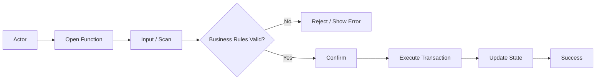
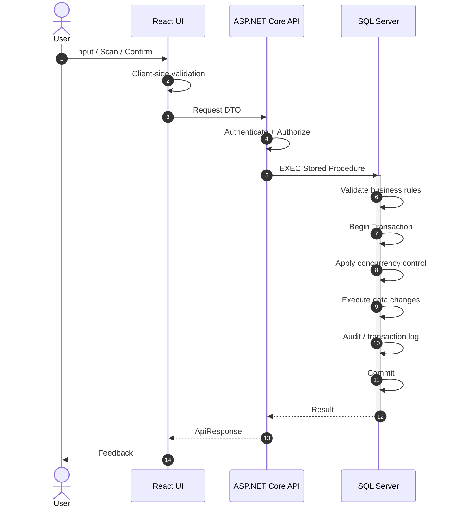
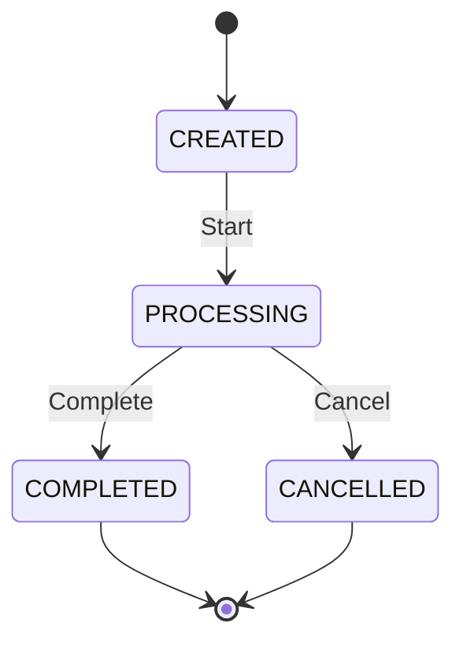
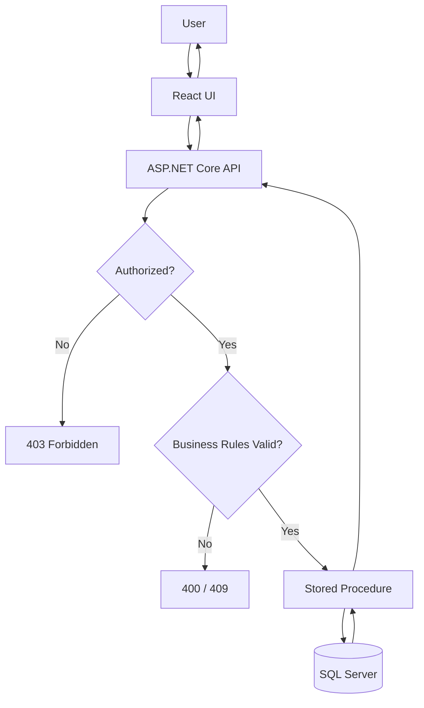

# Cấu Trúc Khung Mẫu Đặc Tả Use Case Chuẩn
## MMS / WMS Use Case Specification Standard

> **Mục đích:** Đây là khung chuẩn dùng để đặc tả Use Case cho hệ thống MMS/WMS, bảo đảm khả năng truy vết xuyên suốt từ **Business Requirement → Business Rule → Functional Flow → UI/API/Data Design → Implementation → Acceptance Test**.
>
> Tài liệu được chia thành 2 tầng lớn:
>
> - **A. BUSINESS SPECIFICATION — WHAT:** Hệ thống phải làm gì và vì sao.
> - **B. SOLUTION DESIGN — HOW:** Hệ thống sẽ được thiết kế và triển khai như thế nào.
>
> Mỗi Use Case phải ưu tiên tính rõ ràng nghiệp vụ, khả năng kiểm thử, khả năng kiểm soát AI-generated code và khả năng truy vết đến dữ liệu thực tế.

---

# [MÃ_UC] — [TÊN USE CASE]

## 0. Document Control

| Thuộc tính | Nội dung |
|---|---|
| Use Case ID | `[MÃ_UC]` |
| Use Case Name | `[TÊN USE CASE]` |
| Module | `[WMS / MMS / QC / ME / ...]` |
| Business Owner | `[Phòng ban / Vai trò]` |
| Product Owner / BA | `[Tên / Vai trò]` |
| Technical Owner | `[Tên / Vai trò]` |
| Version | `v1.0` |
| Status | `Draft / Review / Approved / Implemented` |
| Last Updated | `[YYYY-MM-DD]` |

---

# A. BUSINESS SPECIFICATION — WHAT

## 1. Use Case Overview

### 1.1. Business Objective
[Mô tả vấn đề nghiệp vụ mà Use Case giải quyết, giá trị vận hành mong muốn và KPI liên quan.]

### 1.2. Primary Actor
- `[Vai trò chính]`

### 1.3. Secondary Actors / Systems
- `[Vai trò phụ]`
- `[Hệ thống liên quan]`

### 1.4. Trigger
[Mô tả sự kiện làm Use Case bắt đầu.]

### 1.5. Preconditions
- `[Điều kiện 1]`
- `[Điều kiện 2]`
- `[Điều kiện 3]`

### 1.6. Postconditions
#### Success
- `[Trạng thái hệ thống sau khi thành công]`

#### Failure
- `[Dữ liệu phải được giữ nguyên / rollback / trạng thái lỗi]`

### 1.7. Business Value / KPI Impact
| KPI / Chỉ số | Baseline | Expected Impact | Measurement |
|---|---:|---:|---|
| `[KPI]` | `[x]` | `[y]` | `[Cách đo]` |

---

## 2. Business Logic

### 2.1. Business Rules

| Rule ID | Tên quy tắc | Mô tả | Error / Response |
|---|---|---|---|
| `BR-[UC]-01` | Mandatory Input | [Điều kiện dữ liệu bắt buộc] | `[ErrorCode]` |
| `BR-[UC]-02` | Authorization | [Điều kiện phân quyền] | `403` |
| `BR-[UC]-03` | Status Gate | [Trạng thái nào được phép thao tác] | `409` |
| `BR-[UC]-04` | Quantity Constraint | [Không vượt định mức / không âm tồn] | `400/409` |
| `BR-[UC]-05` | Data Integrity | [Ràng buộc toàn vẹn] | `409` |
| `BR-[UC]-06` | Audit Trail | [Thông tin bắt buộc ghi log] | - |

> Chỉ đưa các Business Rule thực sự liên quan đến Use Case. Không copy máy móc toàn bộ rule dùng chung.

### 2.2. Decision Rules / Decision Table

| Điều kiện | Case 1 | Case 2 | Case 3 |
|---|:---:|:---:|:---:|
| Có quyền thao tác | Y | Y | N |
| Trạng thái hợp lệ | Y | N | - |
| Đủ tồn khả dụng | Y | - | - |
| Kết quả | Allow | Reject | Forbidden |

### 2.3. Exception Rules
- `EX-[UC]-01`: [Trường hợp ngoại lệ]
- `EX-[UC]-02`: [Trường hợp ngoại lệ]

---

## 3. Functional Flow

### 3.1. Main Flow

1. Người dùng `[thao tác]`.
2. Hệ thống `[phản hồi]`.
3. Người dùng `[scan/chọn/nhập dữ liệu]`.
4. Hệ thống kiểm tra các Business Rule liên quan.
5. Hệ thống hiển thị kết quả kiểm tra.
6. Người dùng xác nhận.
7. Hệ thống thực hiện giao dịch.
8. Hệ thống cập nhật trạng thái và phản hồi thành công.

### 3.2. Alternative Flows

#### AF-01 — [Tên tình huống]
1. Tại bước `[x]`, nếu `[điều kiện]`.
2. Hệ thống `[xử lý]`.
3. Use Case `[tiếp tục tại bước ... / kết thúc]`.

#### AF-02 — [Tên tình huống]
[Mô tả]

### 3.3. Exception Flows

#### EF-01 — Invalid Data
- Điều kiện: `[Dữ liệu không hợp lệ]`
- Hành vi: Không ghi dữ liệu.
- Response: `[HTTP/ErrorCode/Message]`

#### EF-02 — Concurrent Update
- Điều kiện: Dữ liệu đã bị thay đổi bởi giao dịch khác.
- Hành vi: Rollback / yêu cầu reload dữ liệu.
- Response: `409 Conflict`

---

## 4. Acceptance Criteria

### AC-[UC]-01 — Happy Path
**Given**
- `[Điều kiện ban đầu]`

**When**
- `[Hành động]`

**Then**
- `[Kết quả nghiệp vụ]`
- `[Dữ liệu thay đổi]`
- `[Trạng thái mới]`

### AC-[UC]-02 — Validation Failure
**Given**
- `[Điều kiện]`

**When**
- `[Hành động không hợp lệ]`

**Then**
- Hệ thống từ chối giao dịch.
- Không có dữ liệu nghiệp vụ nào bị thay đổi.
- Trả thông báo `[message/error code]`.

### AC-[UC]-03 — Permission Failure
**Given**
- User không có quyền `[screen/action]`

**When**
- User gửi yêu cầu

**Then**
- Trả `403 Forbidden`.
- Không thực thi Stored Procedure ghi dữ liệu.

---

# B. SOLUTION DESIGN — HOW

## 5. UI / UX Behavior

> Các tiêu chuẩn màu sắc, typography, component và ergonomics dùng chung phải tham chiếu tới tài liệu Design System. Use Case chỉ mô tả hành vi UI đặc thù.

### 5.1. Target Devices
- `Desktop Web / PDA Handheld / Tablet / TV Wallboard`

### 5.2. Screen / Component
- Screen: `[Tên màn hình]`
- React Component: `[TênComponent.tsx]`

### 5.3. UI Behavior Rules

| UX ID | User Action | System Response |
|---|---|---|
| `UX-[UC]-01` | Scan barcode | Validate ngay và hiển thị kết quả |
| `UX-[UC]-02` | Scan thành công | Auto-focus trường tiếp theo |
| `UX-[UC]-03` | Dữ liệu lỗi | Không chuyển bước, hiển thị lỗi rõ ràng |
| `UX-[UC]-04` | Submit | Disable submit trong thời gian request đang xử lý |

### 5.4. Feedback
- Success: `[Visual + Audio]`
- Warning: `[Visual + Audio]`
- Error: `[Visual + Audio]`

---

## 6. Programming Logic

### 6.1. Frontend — React

**Responsibilities**
- Render UI.
- Client-side validation cơ bản.
- Quản lý local state.
- Prevent duplicate submission.
- Gọi API.
- Hiển thị server response.

**Không được thực hiện**
- Business transaction logic cốt lõi.
- Tính toán tồn kho mang tính quyết định.
- Tự suy diễn trạng thái nghiệp vụ thay cho server.

### 6.2. Backend — ASP.NET Core

Áp dụng **Thin API Pattern**.

**Responsibilities**
- Authentication.
- Authorization.
- DTO validation.
- Request/response mapping.
- Correlation ID / logging.
- Gọi Stored Procedure.
- Map lỗi DB thành HTTP response phù hợp.

**Không được thực hiện**
- Duplicate business logic đã tồn tại trong Stored Procedure.
- Tự cập nhật nhiều bảng nghiệp vụ bên ngoài transaction của SP.

### 6.3. API Contract

#### Endpoint
`POST /api/[module]/[resource]/[action]`

#### Request
```json
{
  "field1": "value",
  "field2": 0
}
```

#### Success Response
```json
{
  "success": true,
  "data": {},
  "message": "SUCCESS"
}
```

#### Error Response
```json
{
  "success": false,
  "errorCode": "WMS_xxx",
  "message": "Business-readable error message"
}
```

### 6.4. Stored Procedure

- SP Name: `api.usp_[MODULE]_[UC]_[Action]_v1`
- Input parameters: `[Danh sách]`
- Output / Result Sets: `[Danh sách]`

#### Processing Pipeline

```text
Validate Input
→ Check Authorization if required
→ Check Current State
→ Check Business Rules
→ Begin Transaction
→ Apply required concurrency control
→ Execute Data Changes
→ Write Transaction / Audit
→ Commit
→ Return Result
```

---

## 7. Data Logic

## 7.1. Data Impact Matrix

| Table / View / SP | C | R | U | D | Purpose |
|---|:---:|:---:|:---:|:---:|---|
| `[HeaderTable]` |  | X | X |  | [Ý nghĩa] |
| `[DetailTable]` |  | X |  |  | [Ý nghĩa] |
| `dbo.tbl_batch_inv` |  | X | X |  | Batch inventory |
| `dbo.tbl_transaction` | X | X |  |  | Inventory transaction log |
| `dbo.audit_log` | X |  |  |  | Audit trail |

> Mặc định không cho phép `DELETE` nếu không có Business Rule và phê duyệt thiết kế rõ ràng.

### 7.2. Data Sources

| Data | Source | Read Method |
|---|---|---|
| `[Thông tin phiếu]` | `[view/table]` | `SELECT / SP` |
| `[Tồn khả dụng]` | `[view/table]` | `SP` |

### 7.3. State Model

| Entity | Field | Value | Business Meaning |
|---|---|---|---|
| `[Entity]` | `[status]` | `CREATED` | Mới tạo |
| `[Entity]` | `[status]` | `PROCESSING` | Đang xử lý |
| `[Entity]` | `[status]` | `COMPLETED` | Hoàn tất |

### 7.4. State Transition Matrix

| Current State | Event | Condition | Next State |
|---|---|---|---|
| `CREATED` | Start | Valid | `PROCESSING` |
| `PROCESSING` | Complete | Fulfilled | `COMPLETED` |
| `PROCESSING` | Cancel | Authorized | `CANCELLED` |

### 7.5. Transaction Boundary

**Transaction bắt đầu khi:**
- `[Điểm bắt đầu]`

**Transaction bao gồm:**
1. `[Update A]`
2. `[Insert B]`
3. `[Update C]`
4. `[Audit / transaction log]`

**Commit khi:**
- Tất cả Business Rule và data mutation thành công.

**Rollback khi:**
- Bất kỳ bước ghi dữ liệu nào thất bại.

### 7.6. Concurrency Strategy

Không áp dụng locking theo template một cách máy móc.

| Scenario | Strategy |
|---|---|
| Read-only | Không explicit lock |
| Critical stock allocation | `UPDLOCK` khi cần |
| Critical stock mutation | Transaction + row-level concurrency control |
| Prevent lost update | RowVersion / status recheck / lock |
| Long-running report | Không dùng `HOLDLOCK` |

SP phải lựa chọn locking dựa trên concurrency risk thực tế của Use Case.

---

## 8. Error & Response Model

| Error Code | HTTP | Business Meaning | UI Behavior |
|---|---:|---|---|
| `AUTH_403` | 403 | Không có quyền | Hiển thị access denied |
| `UC_INVALID_STATUS` | 409 | Sai trạng thái | Reload dữ liệu |
| `UC_INVALID_QTY` | 400 | Số lượng không hợp lệ | Focus Quantity |
| `UC_INSUFFICIENT_STOCK` | 409 | Không đủ tồn | Hiển thị tồn khả dụng |
| `SYS_DB_ERROR` | 500 | Lỗi hệ thống | Generic error + log correlation |

---

## 9. Audit & Traceability

### 9.1. Audit Fields
- `UserId`
- `Action`
- `Timestamp`
- `ClientIP`
- `UserAgent`
- `CorrelationId`
- `EntityId`
- `BeforeState` nếu cần
- `AfterState` nếu cần

### 9.2. Traceability Matrix

| Requirement | Business Rule | Flow | API/SP | Acceptance Criteria |
|---|---|---|---|---|
| `[REQ-01]` | `BR-[UC]-01` | Main 3-7 | `[SP]` | `AC-[UC]-01` |
| `[REQ-02]` | `BR-[UC]-04` | EF-01 | `[SP]` | `AC-[UC]-02` |

---

## 10. Diagrams

### 10.1. Business Flow



### 10.2. Sequence Diagram



### 10.3. State Diagram



### 10.4. System Processing Flow



---

## 11. Test Scenarios

| Test ID | Scenario | Expected Result | Related AC |
|---|---|---|---|
| `TC-[UC]-01` | Happy path | Success | `AC-[UC]-01` |
| `TC-[UC]-02` | Invalid quantity | Reject, no DB change | `AC-[UC]-02` |
| `TC-[UC]-03` | Unauthorized user | 403 | `AC-[UC]-03` |
| `TC-[UC]-04` | Concurrent transaction | No lost update | `[AC]` |
| `TC-[UC]-05` | SP failure mid-transaction | Full rollback | `[AC]` |

---

## 12. Definition of Done

Use Case chỉ được đánh dấu **Implemented / Done** khi:

- [ ] Business Owner / BA xác nhận Business Flow.
- [ ] Business Rules có ID rõ ràng.
- [ ] Main Flow và Alternative/Exception Flow hoàn chỉnh.
- [ ] Acceptance Criteria được định nghĩa.
- [ ] API contract được xác định.
- [ ] Stored Procedure và Data Impact được review.
- [ ] State transitions được xác định nếu có trạng thái nghiệp vụ.
- [ ] Concurrency strategy được review cho giao dịch tồn kho.
- [ ] Audit trail được xác định.
- [ ] Unit / Integration tests đạt.
- [ ] Acceptance Criteria được QA xác nhận.
- [ ] Không có business logic cốt lõi bị duplicate giữa React, .NET và SQL.

---

# Nguyên Tắc Kiến Trúc Bắt Buộc

```text
BUSINESS
Business Problem
    ↓
Use Case
    ↓
Business Rules
    ↓
Acceptance Criteria

SOLUTION
UI Behavior
    ↓
API Contract
    ↓
Stored Procedure
    ↓
Data / State / Transaction

VERIFICATION
Business Rule
    ↓
Acceptance Criteria
    ↓
Test Case
    ↓
Business Acceptance
```

## Ownership

| Layer | Primary Owner |
|---|---|
| Business Objective / Business Rule | Business Owner + BA |
| Functional Flow | BA / Product Owner |
| UI Behavior | BA + UX + Frontend |
| API / Architecture | Architect / Tech Lead |
| Stored Procedure / Data Logic | Data Engineer / Tech Lead |
| Implementation | Developer / AI Coding Agent |
| Acceptance Criteria / Test | BA + QA |
| Final Acceptance | Business Owner |

---

# Quy Tắc Sử Dụng Template

1. Không copy các rule không liên quan chỉ để điền đủ template.
2. Business Rule phải mô tả **WHAT**, không chứa chi tiết code nếu không cần thiết.
3. UI Design System dùng chung không lặp lại trong từng UC.
4. Backend giữ vai trò thin API theo kiến trúc MMS/WMS hiện hành.
5. Business transaction logic trọng yếu đặt tại SQL Stored Procedure nếu đây là standard kiến trúc của module.
6. Không mặc định sử dụng `UPDLOCK/HOLDLOCK`; phải đánh giá concurrency risk.
7. Không sử dụng `DELETE` dữ liệu nghiệp vụ nếu không có yêu cầu rõ ràng.
8. Mọi thay đổi trạng thái phải có State Transition hợp lệ.
9. Mọi Business Rule quan trọng phải truy vết được đến Acceptance Criteria/Test Case.
10. AI coding agent phải triển khai theo tài liệu này, không tự ý thay đổi Business Rule hoặc architecture boundary.
