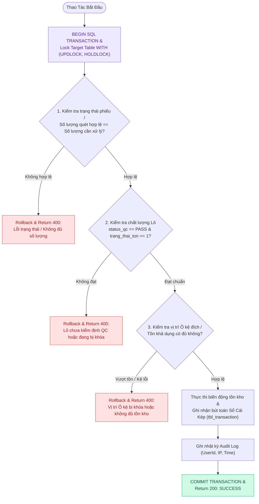
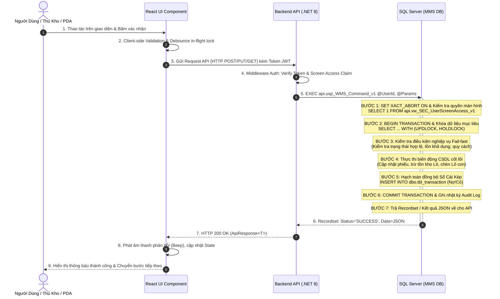
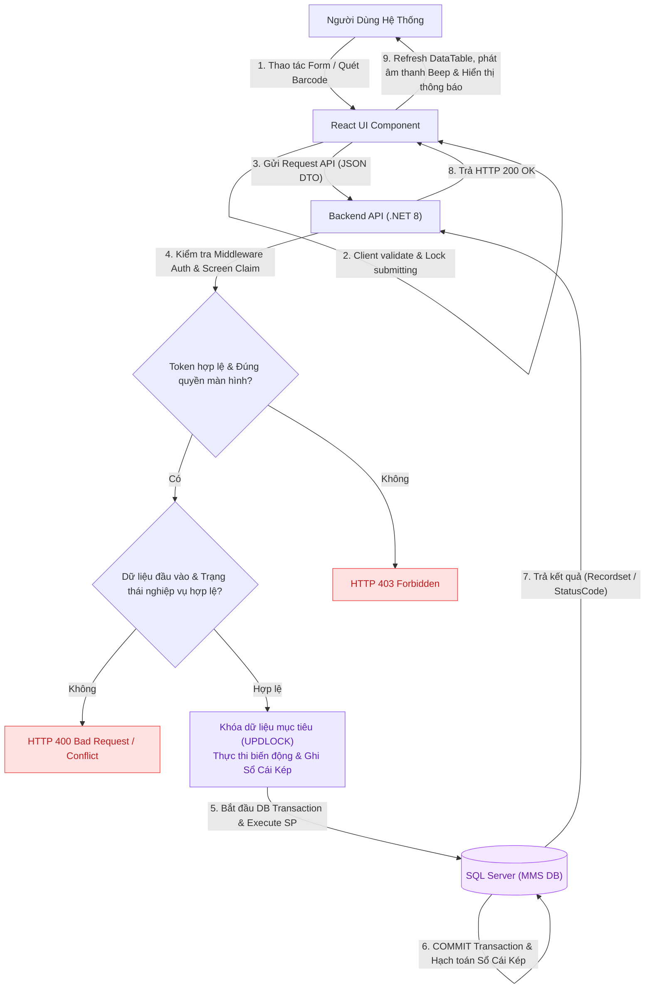

# Cấu Trúc Khung Mẫu Đặc Tả Use Case Chuẩn (MMS WMS Specification Standard)

> **Mô tả:** Đây là bộ khung cấu trúc chuẩn hóa bắt buộc (Gold Standard Template) gồm **5 khía cạnh cốt lõi** áp dụng cho toàn bộ 42 tài liệu Use Case của hệ thống Quản lý Kho Vật tư & Sản xuất MMS (Kềm Nghĩa Sài Gòn).

---

# Phân tích Thiết kế Logic [MÃ_UC] - [TÊN CHỨC NĂNG]

Tài liệu này đi sâu vào phân tích và thiết kế hệ thống ở 5 khía cạnh bắt buộc: **Business Logic**, **UI/UX Guidelines**, **Programming Logic**, **Data Logic**, và **Diagrams (Mermaid)** dành cho chức năng **[Tên Chức Năng] ([MÃ_UC])** của [Vai trò tác nhân chính].

---

## 1. Business Logic (Logic Nghiệp Vụ)

- **Mục tiêu cốt lõi:** [Mô tả chi tiết mục tiêu nghiệp vụ, điều kiện kích hoạt, và giá trị kiểm soát vận hành/chất lượng/tồn kho mà chức năng mang lại cho nhà máy].

- **Các quy tắc nghiệp vụ (Business Rules):**
  - `BR-[MÃ]-01` **Ràng buộc đầu vào (Mandatory Input & Preconditions):** [Quy định các trường thông tin bắt buộc, không được để trống, kiểm tra định dạng và tính hợp lệ].
  - `BR-[MÃ]-02` **Xác thực quyền hạn & Trạng thái chứng từ (Authorization & Status Gate):** [Kiểm tra mã màn hình trong `api.vw_SEC_UserScreenAccess_v1` và trạng thái hợp lệ của chứng từ/phiếu/Lô].
  - `BR-[MÃ]-03` **Kiểm soát dung sai & Định mức (Quantity Constraints & Non-negative Stock):** [Quy định về số lượng thực hiện không vượt quá định mức duyệt, không cho phép xuất âm kho].
  - `BR-[MÃ]-04` **Bảo toàn giao dịch nguyên tử (Atomic ACID Transaction):** [Mọi thao tác ghi biến động nhiều bảng đều thực thi trong khối Transaction khép kín với gợi ý khóa `WITH (UPDLOCK, HOLDLOCK)`].
  - `BR-[MÃ]-05` **Hạch toán Sổ Cái Kép (Dual Ledger Posting):** [Tự động ghi giảm/tăng sổ chi tiết kho (`tbl_transaction`) và cập nhật sổ kế toán tổng hợp SKU].
  - `BR-[MÃ]-06` **Đồng bộ thời gian thực (Realtime Synchronization):** [Đảm bảo số liệu cập nhật tức thời trên Web, PDA Handheld và TV Wallboard Dashboard].
  - `BR-[MÃ]-07` **Lưu nhật ký bảo mật & Vết thao tác (Audit Trail):** [Tự động ghi vết `UserId`, `ClientIP`, `UserAgent` và thời điểm chính xác cho mọi giao dịch trọng yếu].

- **Quy trình tương tác 5 bước (Interaction Flow):**
  - **Bước 1:** Người dùng truy cập phân hệ chức năng tương ứng trên giao diện (Web / PDA / TV Wallboard).
  - **Bước 2:** Nhập liệu các trường thông tin bắt buộc hoặc dùng đầu đọc quét mã Barcode Lô/Kệ và bấm nút xác nhận.
  - **Bước 3:** Frontend validate client-side tại chỗ, sau đó gửi API request kèm Token xác thực Bearer/Cookie.
  - **Bước 4:** Backend kiểm tra theo chuỗi **Fail-fast Pipeline**:
    `Verify JWT -> Verify Screen Claim -> Validate Business Rules -> Lock Rows (UPDLOCK) -> Execute Stored Procedure -> Commit/Rollback`.
  - **Bước 5:** Backend cập nhật CSDL và trả về `SUCCESS`; Frontend hiển thị thông báo, phát âm thanh phản hồi (`Success Beep`/`Error Buzzer`) và điều hướng người dùng.

---

## 2. Tiêu chuẩn Thiết kế Giao diện (UI/UX Guidelines)

- **Thiết bị đích:** [Máy tính Desktop Web / Thiết bị cầm tay Handheld PDA / Màn hình lớn TV Wallboard].
- **Yêu cầu trải nghiệm (UX Principles):**
  - **Công thái học (Ergonomics):** Kích thước vùng chạm cảm ứng lớn (Touch targets >= 44px), độ tương phản cao cho môi trường nhà kho thiếu sáng.
  - **Màu sắc nhận diện (Design System Tokens):**
    - Màu chủ đạo: Xanh ngọc bích phát sáng (`btn-emerald-glow` `#10B981`).
    - Nền giao diện: Slate Dark Theme sang trọng (`bg-slate-900 text-slate-100`).
    - Badge trạng thái: Xanh lá (`PASS`), Vàng cam (`PENDING / PICKING`), Đỏ (`REJECT / OVERDUE`).
  - **Phản hồi tức thì (Audio & Visual Feedback):** Tích hợp âm thanh quét thành công (`Success Beep`), cảnh báo sai sót (`Error Buzzer`), chuông hoàn tất (`Complete Chime`) và hộp thoại xác nhận an toàn.

---

## 3. Programming Logic (Logic Lập Trình)

Quy trình xử lý mã lệnh được chia thành 2 lớp rõ rệt: **Frontend (React)** và **Backend (ASP.NET Core kết hợp SQL Stored Procedure)**.

### 3.1. Frontend (React - [TênComponent.tsx/jsx])
- **State Management & Caching / Grouping Cục Bộ:**
  - Gọi API 1 lần duy nhất để kéo toàn bộ dữ liệu chi tiết, lưu vào React State.
  - Sử dụng các hàm JavaScript `useMemo()`, `Array.prototype.reduce()`, `filter()` cục bộ để gom nhóm dữ liệu (Group By), lọc tìm kiếm in-memory thay vì gọi lại API nhiều lần để tiết kiệm băng thông và tạo trải nghiệm mượt mà không độ trễ.
- **Giao diện Accordion & Ergonomics:**
  - Sử dụng cấu trúc Collapse / Accordion / Preview Modal để ẩn/hiện danh sách chi tiết của từng Nhóm, tối ưu hóa không gian hiển thị hẹp trên màn hình máy quét cầm tay (HHT PDA) và Desktop Web.
  - Tự động Focus vào ô nhập liệu tiếp theo, tích hợp Debounce in-flight lock chống click lặp.

### 3.2. Backend (ASP.NET Core - [TênEndpoint.cs] & SQL Stored Procedure)
- **Thin API Gateway Pattern:**
  - C# Minimal API / Controller không xử lý logic tính toán phức tạp mà đóng vai trò Gateway mỏng (Xác thực JWT Cookie, kiểm tra quyền màn hình `api.vw_SEC_UserScreenAccess_v1`, map DTO) và đẩy toàn bộ gánh nặng xuống SQL Server thông qua việc gọi Stored Procedure.
- **Tận Dụng Tính Năng Multi-Result Set & ACID Transaction Của SQL Server:**
  - SP tận dụng tính năng Multi-Result Set trả về cùng lúc 3 bộ dữ liệu (Recordsets) trong 1 lần Query duy nhất:
    - **Result Set 1 (Header / Config Info):** Cấu hình tổng quan (Status, Phân xưởng, Người lập, Thời gian, Quyền thao tác `CanStart`, `CanPick`).
    - **Result Set 2 (Summary & Available Stock):** Báo cáo số lượng tổng hợp, số lượng yêu cầu vs Tồn kho khả dụng `AvailableQuantity`.
    - **Result Set 3 (Detailed Lines / Picked Transactions):** Danh sách rã chi tiết từng dòng vật tư, mã Lô con, vị trí Ô kệ.
  - Các lệnh ghi dữ liệu áp dụng `SET XACT_ABORT ON`, `BEGIN TRANSACTION` và khóa dòng dữ liệu `WITH (UPDLOCK, HOLDLOCK)` đảm bảo an toàn tuyệt đối.

---

## 4. Data Logic (Thiết kế Dữ Liệu)

### 4.1. Ma trận phân quyền CRUD

| Bảng / Thực thể Dữ Liệu | Create (Tạo) | Read (Đọc) | Update (Cập nhật) | Delete (Xóa) | Ý nghĩa nghiệp vụ trong Use Case |
| :--- | :---: | :---: | :---: | :---: | :--- |
| `dbo.[TênBảngHeader]` | - | **X** | **X** | - | [Ý nghĩa thao tác trên bảng Header] |
| `dbo.[TênBảngChiTiết]` | - | **X** | - | - | [Ý nghĩa thao tác trên bảng Chi tiết] |
| `dbo.[TênBảngChứngTừ]` | **X** | **X** | **X** | - | [Ý nghĩa thao tác trên chứng từ kho] |
| `dbo.[TênBảngTồnKho]` | - | **X** | **X** | - | [Ý nghĩa thao tác tăng/giảm tồn kho Lô] |
| `dbo.tbl_transaction` | **X** | **X** | - | - | [Ghi Detail hạch toán vào Sổ Cái Kép] |
| `dbo.audit_log` | **X** | **X** | - | - | [Ghi vết nhật ký truy cập kiểm toán hệ thống] |

### 4.2. Định nghĩa Trạng thái (Conceptual State Model)

| Cột / Biến | Kiểu Dữ Liệu | Giá Trị Sau Confirm | Ý nghĩa Nghiệp vụ |
| :--- | :--- | :--- | :--- |
| `[CộtTrạngThái1]` (trong `[TênBảng]`) | `NVARCHAR(10)` | `'...'` | [Ý nghĩa trạng thái sau khi thao tác thành công] |
| `[CộtTrạngThái2]` (trong `[TênBảng]`) | `VARCHAR(20)` | `'...'` | [Ý nghĩa trạng thái nghiệp vụ] |
| `stock_type` | `VARCHAR(20)` | `'UNRESTRICTED'` | Loại kho tự do sử dụng (không bị giữ trong khu cách ly/quarantine) |

### 4.3. Data Layer Architecture (Data Flow & Transaction Locking)

---

## 5. Diagrams (Mermaid Sơ Đồ Luồng Nghiệp Vụ)

### 5.1. Sơ Đồ Tuần Tự (Sequence Diagram & SP Execution Flow)

---

### 5.2. Data Flow Diagram: Luồng Xử Lý Dữ Liệu Khép Kín (Data Flow Diagram - DFD)

