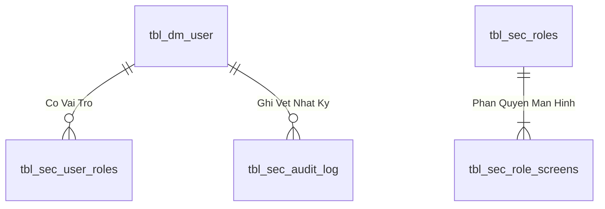
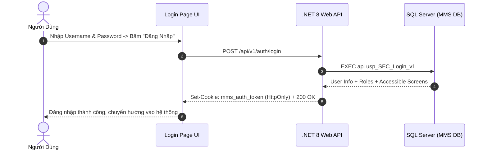

# Phân tích Thiết kế Logic UC-01 (AUTH-01) - Đăng Nhập, Xác Thực Phiên Người Dùng & Quản Lý JWT Cookie

Tài liệu này đi sâu vào phân tích và thiết kế hệ thống ở 5 khía cạnh bắt buộc: **Business Logic**, **UI/UX Guidelines**, **Programming Logic**, **Data Logic**, và **Diagrams (Mermaid)** dành cho chức năng **Đăng Nhập & Xác Thực Phiên Làm Việc (AUTH-01)** của Toàn bộ Người dùng hệ thống MMS.

---

## 1. Business Logic (Logic Nghiệp Vụ)

- **Mục tiêu cốt lõi:** Xác thực danh tính người dùng (Username / Password hoặc Mã nhân viên / Thẻ từ RFID PDA) qua bảng `tbl_dm_user`. Khi thông tin hợp lệ, hệ thống sinh mã Access Token (JWT) được lưu an toàn trong `HttpOnly Cookie` (hoặc Bearer Header cho PDA/API), thiết lập thời gian sống của phiên (Session Timeout 8 giờ), truy vấn ma trận phân quyền màn hình `api.vw_SEC_UserScreenAccess_v1` và trả về Profile người dùng.

- **Các quy tắc nghiệp vụ (Business Rules):**
  - `BR-AUTH-01-01` **Bảo mật mật khẩu (Password Hashing):** Mật khẩu người dùng được băm an toàn chuẩn SHA-256 / BCrypt.
  - `BR-AUTH-01-02` **Khóa tài khoản khi đăng nhập sai (Brute-force Protection):** Khóa tạm thời 15 phút nếu người dùng nhập sai mật khẩu quá 5 lần liên tiếp.
  - `BR-AUTH-01-03` **Xác thực đa thiết bị:** Hỗ trợ đăng nhập đồng thời trên Web Desktop và Thiết bị cầm tay Handheld PDA với cơ chế ghi nhận `DeviceId` và `ClientIp`.

- **Quy trình tương tác 5 bước (Interaction Flow):**
  - **Bước 1:** Người dùng mở ứng dụng MMS, nhập Tên đăng nhập và Mật khẩu.
  - **Bước 2:** Bấm **"Đăng Nhập"**. Frontend gửi `POST /api/v1/auth/login`.
  - **Bước 3:** Backend gọi SP `api.usp_SEC_Login_v1`, kiểm tra trạng thái `status_active = 1`.
  - **Bước 4:** Backend sinh JWT Cookie và danh sách mã màn hình được phép truy cập.
  - **Bước 5:** Frontend nhận phản hồi, điều hướng người dùng vào Trang chủ Dashboard hoặc Màn hình Menu PDA.

---

## 2. Tiêu chuẩn Thiết kế Giao diện (UI/UX Guidelines)
- Form đăng nhập sang trọng với Logo Kềm Nghĩa phát sáng, nút đăng nhập gradient ngọc bích (`btn-emerald-glow`), hỗ trợ ghi nhớ đăng nhập và chuyển đổi nhanh tài khoản thử nghiệm (Role Switcher).

---

## 3. Programming Logic (Logic Lập Trình)
- **Endpoint:** `POST /api/v1/auth/login`
- **SP:** `api.usp_SEC_Login_v1`

---

## 4. Data Logic & Schema Model (Thiết kế Dữ Liệu Chuyên Sâu)

### 4.1. Entity Relationship Diagram (ERD) & Schema Details

- **Bảng Người Dùng (`dbo.tbl_dm_user`):** `user_n` (PK), `msnv`, `hoten`, `matkhau`, `status_active`.
- **View Phân Quyền (`api.vw_SEC_UserScreenAccess_v1`):** Ánh xạ `UserId` $
ightarrow$ `ScreenCode`.

### 4.2. Data Flow & Transaction Locking Matrix
- **Xác thực phiên:** Truy vấn nhanh không khóa (`NOLOCK`) trên `vw_SEC_UserScreenAccess_v1` và ghi log an toàn vào `tbl_sec_audit_log`.

### 4.3. Conceptual State Model & Transition Rules
| Trạng Thái User | Thao Tác | Trạng Thái Sau | Quyền Hạn |
| :--- | :--- | :--- | :--- |
| **`ACTIVE (1)`** | Đăng nhập thành công (AUTH-01) | Sinh JWT Cookie (8h) | Truy cập các màn hình được cấp quyền |
| **`ACTIVE (1)`** | Khóa tài khoản (ADM-01) | `INACTIVE (0)` | Chặn đăng nhập và thu hồi token tức thì |

---

## 5. Diagrams (Mermaid Sơ Đồ Luồng Nghiệp Vụ)

