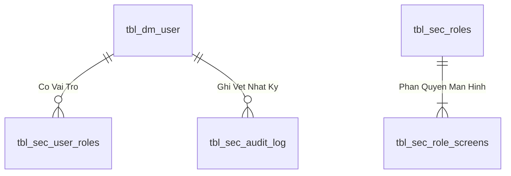

# Phân tích Thiết kế Logic UC-02 (AUTH-02) - Đăng Xuất & Thu Hồi Phiên Làm Việc An Toàn (Logout & Token Revocation)

Tài liệu này đi sâu vào phân tích và thiết kế hệ thống ở 5 khía cạnh bắt buộc: **Business Logic**, **UI/UX Guidelines**, **Programming Logic**, **Data Logic**, và **Diagrams (Mermaid)** dành cho chức năng **Đăng Xuất Hệ Thống (AUTH-02)** của Người dùng.

---

## 1. Business Logic (Logic Nghiệp Vụ)
- **Mục tiêu cốt lõi:** Hủy bỏ phiên làm việc của người dùng, xóa bỏ `HttpOnly Cookie` phía client, đưa token vào danh sách thu hồi (`Revoked Tokens Cache`), ghi nhận thời điểm đăng xuất vào nhật ký `tbl_sec_audit_log` và điều hướng người dùng về màn hình đăng nhập.
- **Endpoint:** `POST /api/v1/auth/logout`
- **SP:** `api.usp_SEC_Logout_v1`

---

## 3. Programming Logic (Logic Lập Trình)

Quy trình xử lý mã lệnh được chia thành 2 lớp rõ rệt: **Frontend (React)** và **Backend (ASP.NET Core kết hợp SQL Stored Procedure)**.

### 3.1. Frontend (React - Component View)
- **State Management & Local Processing:**
  - Gọi API kéo dữ liệu cần thiết vào React State.
  - Sử dụng các hàm mảng JavaScript (`filter`, `map`, `reduce`) để xử lý gom nhóm, lọc tìm kiếm in-memory, tối ưu hóa băng thông và tạo trải nghiệm mượt mà không độ trễ.
- **UI Interaction & Ergonomics:**
  - Sử dụng cấu trúc Collapse / Accordion / Modal xem trước để tối ưu không gian hiển thị trên màn hình Handheld PDA và Desktop Web.

### 3.2. Backend (ASP.NET Core & SQL Server Stored Procedure)
- **Thin API Gateway Pattern:**
  - ASP.NET Core Minimal API / Controller không xử lý logic tính toán nghiệp vụ mà chỉ làm cổng Gateway mỏng (Xác thực JWT Cookie, kiểm tra quyền màn hình `vw_SEC_UserScreenAccess_v1`) và ủy thác toàn bộ cho SQL Server Stored Procedure.
- **Tận Dụng Multi-Result Set & ACID Transaction:**
  - SQL Stored Procedure trả về đồng thời nhiều Result Sets (Header info, Summary KPIs, Detailed Lines) trong một lần truy vấn duy nhất.
  - Các lệnh ghi dữ liệu áp dụng `SET XACT_ABORT ON`, `BEGIN TRANSACTION` và khóa dòng dữ liệu `WITH (UPDLOCK, HOLDLOCK)` đảm bảo an toàn tuyệt đối.

---

## 4. Data Logic & Schema Model (Thiết kế Dữ Liệu Chuyên Sâu)

### 4.1. Entity Relationship Diagram (ERD) & Schema Details

- **Bảng Người Dùng (`dbo.tbl_dm_user`):** `user_n` (PK), `msnv`, `hoten`, `matkhau`, `status_active`.
- **View Phân Quyền (`api.vw_SEC_UserScreenAccess_v1`):** Ánh xạ `UserId` $
ightarrow$ `ScreenCode`.

### 4.2. Data Flow & Transaction Locking Matrix
- **Xác thực phiên:** Truy vấn nhanh không khóa (`NOLOCK`) trên `vw_SEC_UserScreenAccess_v1` và ghi log an toàn vào `tbl_sec_audit_log`.

### 4.3. Conceptual State Model & Transition Rules
| Trạng Thái User | Thao Tác | Trạng Thái Sau | Quyền Hạn |
| :--- | :--- | :--- | :--- |
| **`ACTIVE (1)`** | Đăng nhập thành công (AUTH-01) | Sinh JWT Cookie (8h) | Truy cập các màn hình được cấp quyền |
| **`ACTIVE (1)`** | Khóa tài khoản (ADM-01) | `INACTIVE (0)` | Chặn đăng nhập và thu hồi token tức thì |
