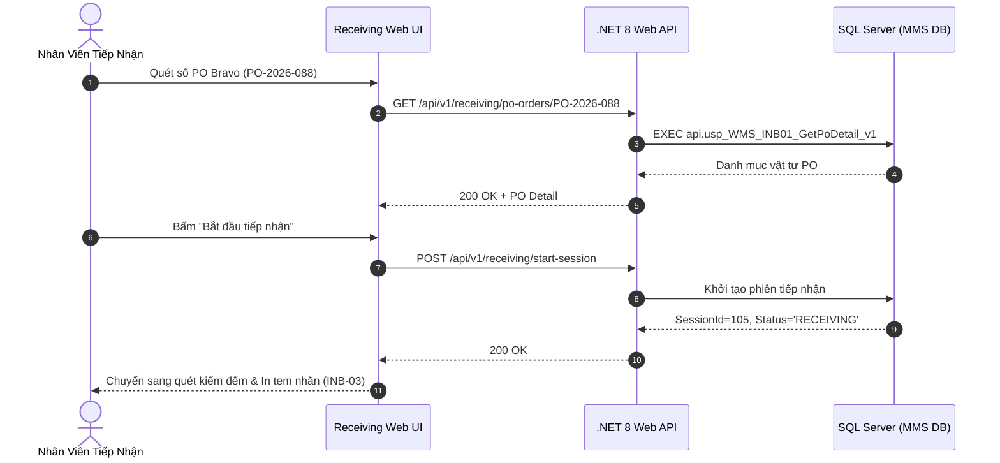

# Phân tích Thiết kế Logic UC-03 (INB-01) - Tiếp Nhận Đơn Hàng Nhập Kho Theo PO Bravo

Tài liệu này đi sâu vào phân tích và thiết kế hệ thống ở 5 khía cạnh bắt buộc: **Business Logic**, **UI/UX Guidelines**, **Programming Logic**, **Data Logic**, và **Diagrams (Mermaid)** dành cho chức năng **Tiếp Nhận Đơn Hàng Theo PO Bravo (INB-01)** của Nhân viên tiếp nhận kho và Kế toán kho.

---

## 1. Business Logic (Logic Nghiệp Vụ)

- **Mục tiêu cốt lõi:** Đồng bộ và tiếp nhận danh sách các Đơn mua hàng (Purchase Order - PO) từ hệ thống ERP Bravo. Cho phép nhân viên kho tra cứu theo số PO, đối chiếu danh mục vật tư đặt mua, quy cách, số lượng, nhà cung cấp và mở phiên tiếp nhận hàng thực tế tại khu vực tiếp nhận (Staging Area).

- **Các quy tắc nghiệp vụ (Business Rules):**
  - `BR-INB-01-01` **Đồng bộ dữ liệu PO Bravo (ERP Sync):** Chỉ tiếp nhận các đơn PO có trạng thái đã duyệt trên Bravo và còn số lượng mở cần nhập (`Open Quantity > 0`).
  - `BR-INB-01-02` **Kiểm soát dung sai giao hàng (Delivery Tolerance):** Số lượng giao thực tế cho phép sai số $pm 0%$ (hoặc trong hạn mức thỏa thuận). Nếu vượt quá số lượng PO cho phép, hệ thống từ chối hoặc yêu cầu phê duyệt vượt định mức.
  - `BR-INB-01-03` **Khởi tạo chứng từ tiếp nhận (Staging Intake Record):** Tạo bản ghi phiên tiếp nhận trong `tbl_phieu_nhapkho_tam` với trạng thái `RECEIVING`.

- **Quy trình tương tác 5 bước (Interaction Flow):**
  - **Bước 1:** Nhân viên kho mở phân hệ "Nhập Kho / Receiving" (`/receiving`).
  - **Bước 2:** Nhập số PO Bravo (hoặc quét mã Barcode trên Phiếu giao hàng của NCC).
  - **Bước 3:** Hệ thống hiển thị chi tiết các dòng vật tư cần nhập.
  - **Bước 4:** Bấm **"Bắt đầu tiếp nhận"** để mở phiên kiểm đếm.
  - **Bước 5:** Chuyển tiếp sang quy trình in tem Barcode Lô và kiểm tra KCS (`INB-03` & `QC-01`).

---

## 2. Tiêu chuẩn Thiết kế Giao diện (UI/UX Guidelines)
- Bảng danh sách PO Bravo trực quan, hiển thị tỷ lệ đã nhập (% Received), nút mở phiên tiếp nhận màu xanh Emerald.

---

## 3. Programming Logic (Logic Lập Trình)
- **Endpoint:** `GET /api/v1/receiving/po-orders` & `POST /api/v1/receiving/start-session`
- **SP:** `api.usp_WMS_INB01_GetPoOrders_v1`

---

## 4. Data Logic & Schema Model (Cấu Trúc Dữ Liệu)
- `dbo.tbl_po_bravo`: Dữ liệu PO đồng bộ từ Bravo.
- `dbo.tbl_phieu_transaction`: Header phiên tiếp nhận (`nghiep_vu = 'INB_PO'`).

---

## 5. Diagrams (Mermaid Sơ Đồ Luồng Nghiệp Vụ)

