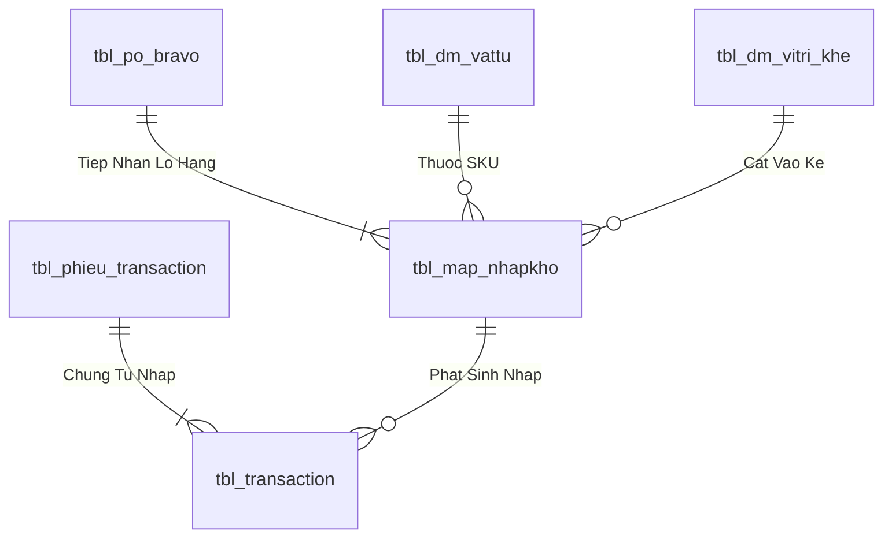
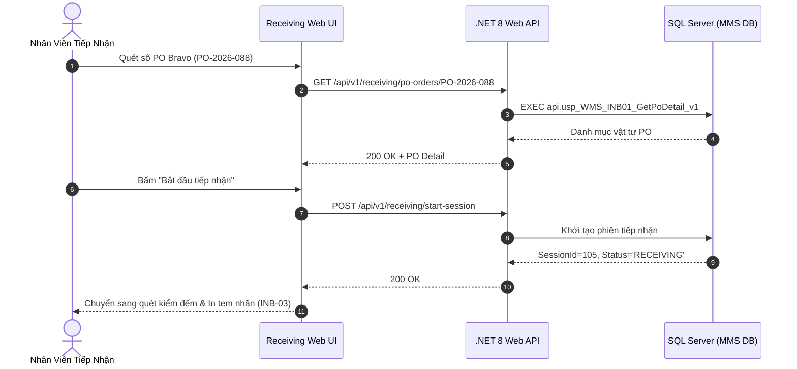

# Phân tích Thiết kế Logic UC-03 (INB-01) - Tiếp Nhận Đơn Hàng Nhập Kho Theo PO Bravo

Tài liệu này đi sâu vào phân tích và thiết kế hệ thống ở 5 khía cạnh bắt buộc: **Business Logic**, **UI/UX Guidelines**, **Programming Logic**, **Data Logic**, và **Diagrams (Mermaid)** dành cho chức năng **Tiếp Nhận Đơn Hàng Theo PO Bravo (INB-01)** của Nhân viên tiếp nhận kho và Kế toán kho.

---

## 1. Business Logic (Logic Nghiệp Vụ)

- **Mục tiêu cốt lõi:** Đồng bộ và tiếp nhận danh sách các Đơn mua hàng (Purchase Order - PO) từ hệ thống ERP Bravo. Cho phép nhân viên kho tra cứu theo số PO, đối chiếu danh mục vật tư đặt mua, quy cách, số lượng, nhà cung cấp và mở phiên tiếp nhận hàng thực tế tại khu vực tiếp nhận (Staging Area).

- **Các quy tắc nghiệp vụ (Business Rules):**
  - `BR-INB-01-01` **Đồng bộ dữ liệu PO Bravo (ERP Sync):** Chỉ tiếp nhận các đơn PO có trạng thái đã duyệt trên Bravo và còn số lượng mở cần nhập (`Open Quantity > 0`).
  - `BR-INB-01-02` **Kiểm soát dung sai giao hàng (Delivery Tolerance):** Số lượng giao thực tế cho phép sai số $pm 0%$ (hoặc trong hạn mức thỏa thuận). Nếu vượt quá số lượng PO cho phép, hệ thống từ chối hoặc yêu cầu phê duyệt vượt định mức.
  - `BR-INB-01-03` **Khởi tạo chứng từ tiếp nhận (Staging Intake Record):** Tạo bản ghi phiên tiếp nhận trong `tbl_phieu_nhapkho_tam` với trạng thái `RECEIVING`.

- **Quy trình tương tác 5 bước (Interaction Flow):**
  - **Bước 1:** Nhân viên kho mở phân hệ "Nhập Kho / Receiving" (`/receiving`).
  - **Bước 2:** Nhập số PO Bravo (hoặc quét mã Barcode trên Phiếu giao hàng của NCC).
  - **Bước 3:** Hệ thống hiển thị chi tiết các dòng vật tư cần nhập.
  - **Bước 4:** Bấm **"Bắt đầu tiếp nhận"** để mở phiên kiểm đếm.
  - **Bước 5:** Chuyển tiếp sang quy trình in tem Barcode Lô và kiểm tra KCS (`INB-03` & `QC-01`).

---

## 2. Tiêu chuẩn Thiết kế Giao diện (UI/UX Guidelines)
- Bảng danh sách PO Bravo trực quan, hiển thị tỷ lệ đã nhập (% Received), nút mở phiên tiếp nhận màu xanh Emerald.

---

## 3. Programming Logic (Logic Lập Trình)

Quy trình xử lý mã lệnh được chia thành 2 lớp rõ rệt: **Frontend (React)** và **Backend (ASP.NET Core kết hợp SQL Stored Procedure)**.

### 3.1. Frontend (React - Component View)
- **State Management & Local Processing:**
  - Gọi API kéo dữ liệu cần thiết vào React State.
  - Sử dụng các hàm mảng JavaScript (`filter`, `map`, `reduce`) để xử lý gom nhóm, lọc tìm kiếm in-memory, tối ưu hóa băng thông và tạo trải nghiệm mượt mà không độ trễ.
- **UI Interaction & Ergonomics:**
  - Sử dụng cấu trúc Collapse / Accordion / Modal xem trước để tối ưu không gian hiển thị trên màn hình Handheld PDA và Desktop Web.

### 3.2. Backend (ASP.NET Core & SQL Server Stored Procedure)
- **Thin API Gateway Pattern:**
  - ASP.NET Core Minimal API / Controller không xử lý logic tính toán nghiệp vụ mà chỉ làm cổng Gateway mỏng (Xác thực JWT Cookie, kiểm tra quyền màn hình `vw_SEC_UserScreenAccess_v1`) và ủy thác toàn bộ cho SQL Server Stored Procedure.
- **Tận Dụng Multi-Result Set & ACID Transaction:**
  - SQL Stored Procedure trả về đồng thời nhiều Result Sets (Header info, Summary KPIs, Detailed Lines) trong một lần truy vấn duy nhất.
  - Các lệnh ghi dữ liệu áp dụng `SET XACT_ABORT ON`, `BEGIN TRANSACTION` và khóa dòng dữ liệu `WITH (UPDLOCK, HOLDLOCK)` đảm bảo an toàn tuyệt đối.

---

## 4. Data Logic & Schema Model (Thiết kế Dữ Liệu Chuyên Sâu)

### 4.1. Entity Relationship Diagram (ERD) & Schema Details

- **Bảng Tiếp Nhận & Lô (`dbo.tbl_map_nhapkho`):**
  - Khóa chính: `id_nhapkho` (INT IDENTITY).
  - Trạng thái tiếp nhận: `status_kho` (`'RECEIVING'` $
ightarrow$ `'ON_RACK'` $
ightarrow$ `'STORED'`).
  - Trạng thái kiểm tra: `status_qc` (`'PENDING'` $
ightarrow$ `'PASS'` / `'REJECT'`).

### 4.2. Data Flow & Transaction Locking Matrix
- **Khóa tiếp nhận PO Bravo:** Sử dụng `WITH (UPDLOCK, HOLDLOCK)` trên dòng PO Bravo để đảm bảo số lượng thực nhận không vượt quá dung sai PO cho phép và chống tạo trùng Lô khi quét liên tục.

### 4.3. Conceptual State Model & Transition Rules
| Bước Tiếp Nhận | Sự Kiện | Trạng Thái Kho / QC | Hành Động Kế Tiếp |
| :--- | :--- | :--- | :--- |
| **1. Cửa kho Staging** | Quét in tem Lô (INB-03) | `status_kho = 'RECEIVING'`, `status_qc = 'PENDING'` | Đưa vào hàng đợi QC (QC-01) |
| **2. KCS Kiểm tra** | QC Duyệt Đạt (QC-04) | `status_qc = 'PASS'` | Đề xuất vị trí Ô kệ (INB-04) |
| **3. Cất vào dầm kệ** | Quét cất Ô kệ PDA (INB-05) | `status_kho = 'ON_RACK'` | Chờ Thủ kho duyệt nhập chính thức |
| **4. Hạch toán chính thức** | Xác nhận nhập kho (INB-06) | `status_kho = 'STORED'` | Ghi Nợ/Có Sổ Cái Kép & In PNK (INB-07) |

---

## 5. Diagrams (Mermaid Sơ Đồ Luồng Nghiệp Vụ)

