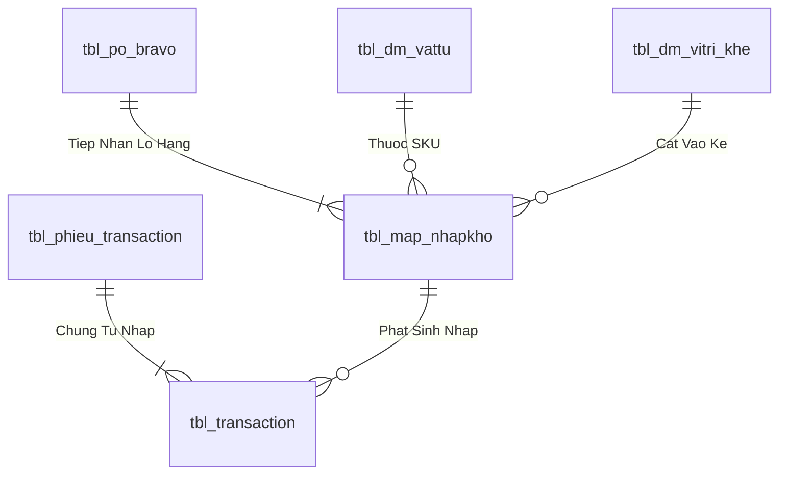

# Phân tích Thiết kế Logic UC-05 (INB-03) - Quét Mã Vạch Kiểm Đếm & In Tem Nhãn Thùng / Lô (Batch Barcode)

Tài liệu này đi sâu vào phân tích và thiết kế hệ thống ở 5 khía cạnh bắt buộc: **Business Logic**, **UI/UX Guidelines**, **Programming Logic**, **Data Logic**, và **Diagrams (Mermaid)** dành cho chức năng **Quét Kiểm Đếm & In Tem Nhãn Lô (INB-03)** của Nhân viên tiếp nhận kho.

---

## 1. Business Logic (Logic Nghiệp Vụ)

- **Mục tiêu cốt lõi:** Kiểm đếm thực tế số lượng thùng/kiện/bao vật tư giao đến, quy chuẩn đóng gói theo quy cách tiêu chuẩn (Standard Pack Size). Hệ thống tự động sinh Mã Lô định danh duy nhất (`id_nhapkho`), sinh chuỗi Barcode Code 128 và gửi trực tiếp tới máy in nhiệt để dán tem nhãn lên từng thùng hàng trước khi đưa vào kiểm định QC và cất kệ.
- **Endpoint:** `POST /api/v1/receiving/generate-batch-labels`
- **SP:** `api.usp_WMS_INB03_GenerateBatchLabels_v1`

---

## 3. Programming Logic (Logic Lập Trình)

Quy trình xử lý mã lệnh được chia thành 2 lớp rõ rệt: **Frontend (React)** và **Backend (ASP.NET Core kết hợp SQL Stored Procedure)**.

### 3.1. Frontend (React - Component View)
- **State Management & Local Processing:**
  - Gọi API kéo dữ liệu cần thiết vào React State.
  - Sử dụng các hàm mảng JavaScript (`filter`, `map`, `reduce`) để xử lý gom nhóm, lọc tìm kiếm in-memory, tối ưu hóa băng thông và tạo trải nghiệm mượt mà không độ trễ.
- **UI Interaction & Ergonomics:**
  - Sử dụng cấu trúc Collapse / Accordion / Modal xem trước để tối ưu không gian hiển thị trên màn hình Handheld PDA và Desktop Web.

### 3.2. Backend (ASP.NET Core & SQL Server Stored Procedure)
- **Thin API Gateway Pattern:**
  - ASP.NET Core Minimal API / Controller không xử lý logic tính toán nghiệp vụ mà chỉ làm cổng Gateway mỏng (Xác thực JWT Cookie, kiểm tra quyền màn hình `vw_SEC_UserScreenAccess_v1`) và ủy thác toàn bộ cho SQL Server Stored Procedure.
- **Tận Dụng Multi-Result Set & ACID Transaction:**
  - SQL Stored Procedure trả về đồng thời nhiều Result Sets (Header info, Summary KPIs, Detailed Lines) trong một lần truy vấn duy nhất.
  - Các lệnh ghi dữ liệu áp dụng `SET XACT_ABORT ON`, `BEGIN TRANSACTION` và khóa dòng dữ liệu `WITH (UPDLOCK, HOLDLOCK)` đảm bảo an toàn tuyệt đối.

---

## 4. Data Logic & Schema Model (Thiết kế Dữ Liệu Chuyên Sâu)

### 4.1. Entity Relationship Diagram (ERD) & Schema Details

- **Bảng Tiếp Nhận & Lô (`dbo.tbl_map_nhapkho`):**
  - Khóa chính: `id_nhapkho` (INT IDENTITY).
  - Trạng thái tiếp nhận: `status_kho` (`'RECEIVING'` $
ightarrow$ `'ON_RACK'` $
ightarrow$ `'STORED'`).
  - Trạng thái kiểm tra: `status_qc` (`'PENDING'` $
ightarrow$ `'PASS'` / `'REJECT'`).

### 4.2. Data Flow & Transaction Locking Matrix
- **Khóa tiếp nhận PO Bravo:** Sử dụng `WITH (UPDLOCK, HOLDLOCK)` trên dòng PO Bravo để đảm bảo số lượng thực nhận không vượt quá dung sai PO cho phép và chống tạo trùng Lô khi quét liên tục.

### 4.3. Conceptual State Model & Transition Rules
| Bước Tiếp Nhận | Sự Kiện | Trạng Thái Kho / QC | Hành Động Kế Tiếp |
| :--- | :--- | :--- | :--- |
| **1. Cửa kho Staging** | Quét in tem Lô (INB-03) | `status_kho = 'RECEIVING'`, `status_qc = 'PENDING'` | Đưa vào hàng đợi QC (QC-01) |
| **2. KCS Kiểm tra** | QC Duyệt Đạt (QC-04) | `status_qc = 'PASS'` | Đề xuất vị trí Ô kệ (INB-04) |
| **3. Cất vào dầm kệ** | Quét cất Ô kệ PDA (INB-05) | `status_kho = 'ON_RACK'` | Chờ Thủ kho duyệt nhập chính thức |
| **4. Hạch toán chính thức** | Xác nhận nhập kho (INB-06) | `status_kho = 'STORED'` | Ghi Nợ/Có Sổ Cái Kép & In PNK (INB-07) |
