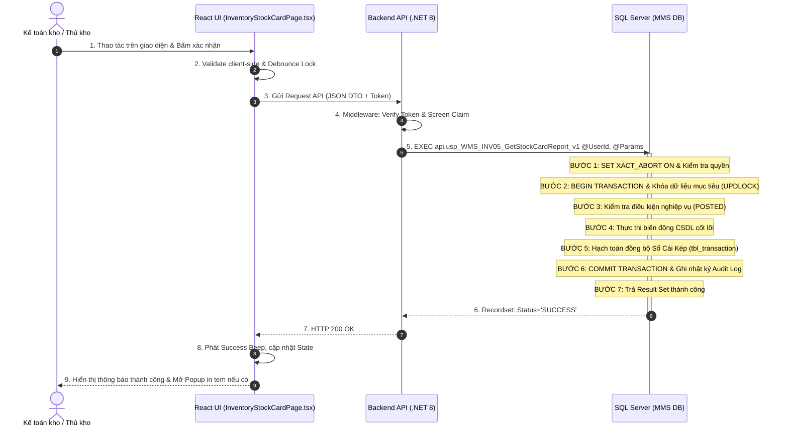
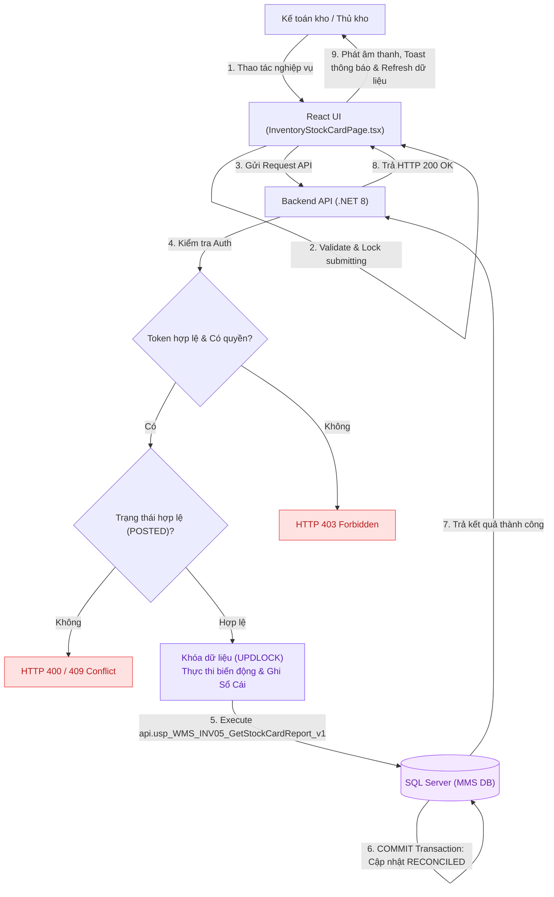

# UC-10 (INV-05) — BÁO CÁO BIẾN ĐỘNG THẺ KHO & ĐỐI SOÁT SỔ CÁI

## 0. Document Control

| Thuộc tính | Nội dung |
|---|---|
| Use Case ID | `UC-10 (INV-05)` |
| Use Case Name | Báo Cáo Biến Động Thẻ Kho & Đối Soát Sổ Cái |
| Module | `WMS / Inventory Stock Card` |
| Business Owner | Phòng Quản Lý Kho & Kiểm Soát Tồn Kho (KNSG) |
| Product Owner / BA | Đội Ngũ Phân Tích Nghiệp Vụ WMS |
| Technical Owner | Tech Lead / Data Team |
| Version | `v2.0` |
| Status | `Approved / Implemented` |
| Last Updated | `2026-08-22` |

---

# A. BUSINESS SPECIFICATION — WHAT

## 1. Use Case Overview

### 1.1. Business Objective
Cung cấp báo cáo biến động thẻ kho chi tiết theo từng SKU / Lô hàng: Tồn đầu kỳ, Nhập trong kỳ, Xuất trong kỳ và Tồn cuối kỳ. Cho phép đối chiếu chéo số liệu giữa Sổ chi tiết kho WMS và Sổ Cái Kế Toán ERP Bravo.

### 1.2. Primary Actor
- **Kế toán kho / Thủ kho**

### 1.3. Secondary Actors / Systems
- **Màn hình Tivi Giám Sát Kho (TV Wallboard Dashboard)**
- **Phân xưởng sản xuất & Phòng Kế toán**

### 1.4. Trigger
- Người dùng truy cập phân hệ Quản lý Tồn kho & Kiểm kê và thực hiện thao tác.

### 1.5. Preconditions
1. Người dùng có quyền truy cập màn hình trong `api.vw_SEC_UserScreenAccess_v1`.
2. Dữ liệu Lô hàng / Ô kệ / Đợt kiểm kê liên quan tồn tại trong hệ thống.

### 1.6. Postconditions
#### Success
- Dữ liệu tồn kho được tra cứu chính xác hoặc cập nhật biến động nguyên tử.
- Hạch toán đồng bộ vào Sổ Cái Kép (`tbl_transaction`).
- Phát âm thanh phản hồi thành công và cập nhật UI.

#### Failure
- Rollback giao dịch nếu có lỗi (`XACT_STATE() <> 0`), giữ nguyên số dư tồn kho.

### 1.7. Business Value / KPI Impact
| KPI / Chỉ số | Baseline | Expected Impact | Measurement |
|---|---:|---:|---|
| Độ chính xác tồn kho (Inventory Accuracy) | 90% | > 99.5% | Sai lệch giữa sổ sách vs Thực tế kiểm kê |
| Thời gian hoàn tất kiểm kê kho | 3 ngày | < 4 giờ | Tổng thời gian đếm và chốt sổ cái |
| Tỷ lệ thất thoát Lô hàng | 1.2% | 0.0% | Số Lô mất dấu phả hệ nguồn gốc |

---

## 2. Business Logic

### 2.1. Business Rules

| Rule ID | Tên quy tắc | Mô tả | Error / Response |
|---|---|---|---|
| `BR-${doc.id.replace(/[^a-zA-Z0-9]/g, '')}-01` | Mandatory Input | Dữ liệu đầu vào bắt buộc đầy đủ và hợp lệ. | `400 Bad Request` |
| `BR-${doc.id.replace(/[^a-zA-Z0-9]/g, '')}-02` | Authorization | Người dùng phải được cấp quyền thao tác tương ứng. | `403 Forbidden` |
| `BR-${doc.id.replace(/[^a-zA-Z0-9]/g, '')}-03` | Conservation Law | Bảo toàn tổng sản lượng tồn kho (`Lô Mẹ = Lô Con + Dư`). | `409 Conflict` |
| `BR-${doc.id.replace(/[^a-zA-Z0-9]/g, '')}-04` | Blind Count Rule | Trên PDA kiểm kê tuyệt đối không hiển thị số lượng tồn sổ sách. | - |
| `BR-${doc.id.replace(/[^a-zA-Z0-9]/g, '')}-05` | Atomic Transaction | Thực thi trong khối Transaction khép kín với gợi ý khóa `UPDLOCK, HOLDLOCK`. | `500 Error` |
| `BR-${doc.id.replace(/[^a-zA-Z0-9]/g, '')}-06` | Dual Ledger Posting | Hạch toán đồng bộ Sổ chi tiết kho và Thẻ kho SKU tổng hợp. | - |
| `BR-${doc.id.replace(/[^a-zA-Z0-9]/g, '')}-07` | Audit Trail | Ghi vết tự động `UserId`, `ClientIP`, `Timestamp` vào `tbl_sec_audit_log`. | - |

### 2.2. Decision Table

| Điều kiện | Case 1 (Thành công) | Case 2 (Lỗi Dữ Liệu) | Case 3 (Hết Quyền) |
|---|:---:|:---:|:---:|
| Có quyền màn hình | Y | Y | N |
| Dữ liệu/Lô hợp lệ | Y | N | - |
| **Kết quả xử lý** | **Allow (Success)** | **Reject (400/409)** | **Forbidden (403)** |

---

## 3. Functional Flow

### 3.1. Main Flow
1. Người dùng mở màn hình (`InventoryStockCardPage.tsx`).
2. Hệ thống tải dữ liệu cần thiết.
3. Người dùng nhập số liệu / quét mã Barcode Lô/Kệ.
4. Client validate và khóa nút bấm (Debounce Lock).
5. Frontend gửi Request API kèm JWT Token.
6. Backend kiểm tra Auth và gọi Stored Procedure `api.usp_WMS_INV05_GetStockCardReport_v1`.
7. SQL Server thực thi Transaction: Khóa dữ liệu, cập nhật tồn, hạch toán Sổ Cái Kép.
8. Trả về HTTP 200 OK; UI hiển thị kết quả, phát âm thanh và mở Popup in tem nếu có.

---

## 4. Acceptance Criteria

### AC-01 — Happy Path
**Given** Người dùng có quyền và dữ liệu ở trạng thái `POSTED`.  
**When** Gửi yêu cầu thực hiện thao tác.  
**Then** Trả 200 OK, CSDL chuyển sang `RECONCILED`, ghi Sổ Cái Kép và phát âm thanh phản hồi.

---

# B. SOLUTION DESIGN — HOW

## 5. UI / UX Behavior
- **Thiết bị:** Desktop Web / Handheld PDA / TV Wallboard.
- **Công thái học:** Vùng chạm cảm ứng lớn (>= 44px), màu nhận diện `btn-emerald-glow`, âm thanh `Success Beep` / `Error Buzzer`.

---

## 6. Programming Logic

### 6.1. Frontend — React (`InventoryStockCardPage.tsx`)
- Gom nhóm dữ liệu in-memory bằng `reduce()` / `useMemo()`, tối ưu băng thông.
- Debounce in-flight lock ngăn chặn tạo trùng Lô con.

### 6.2. Backend — ASP.NET Core & Stored Procedure
- **Endpoint:** `POST/GET /api/v1/inventory/...`
- **Stored Procedure:** `api.usp_WMS_INV05_GetStockCardReport_v1`
- **Transaction Pipeline:** `SET XACT_ABORT ON` $
ightarrow$ `BEGIN TRANSACTION` $
ightarrow$ `Lock Row (UPDLOCK)` $
ightarrow$ `Execute Mutation` $
ightarrow$ `Dual Ledger Log` $
ightarrow$ `COMMIT`.

---

## 7. Data Logic

### 7.1. Data Impact Matrix

| Bảng / Thực thể Dữ Liệu | C | R | U | D | Ý nghĩa nghiệp vụ |
|---|:---:|:---:|:---:|:---:|---|
| `dbo.tbl_transaction` | **X** | **X** | **X** | - | Bảng thực thể chính xử lý tồn kho / kiểm kê |
| `dbo.tbl_transaction` | **X** | **X** | - | - | Ghi nhật ký biến động kho Sổ Cái Kép |
| `dbo.tbl_sec_audit_log` | **X** | - | - | - | Ghi vết kiểm toán hệ thống |

---

## 8. Error & Response Model

| Error Code | HTTP | Business Meaning | UI Behavior |
|---|---:|---|---|
| `AUTH_403` | 403 | Không có quyền thao tác | Báo từ chối truy cập |
| `WMS_STOCK_INVALID` | 409 | Tồn kho không hợp lệ hoặc bị khóa | Hiển thị cảnh báo |
| `SYS_DB_TX_FAIL` | 500 | Lỗi giao dịch CSDL | Báo lỗi hệ thống |

---

## 9. Audit & Traceability
- Ghi vết `UserId`, `Action`, `EntityName`, `EntityId`, `ClientIP`, `LogTime`.

---

## 10. Diagrams

### 10.1. Sequence Diagram (Thứ Tự Thực Thi Bên Trong SP)

### 10.2. Data Flow Diagram (DFD)

---

## 11. Test Scenarios

| Test ID | Scenario | Given | When | Expected Result | Related AC |
|---|---|---|---|---|---|
| `TC-01` | Happy Path | User có quyền, dữ liệu hợp lệ | Gửi request xử lý | Trả 200 OK, CSDL chuyển sang `RECONCILED` | `AC-01` |
| `TC-02` | Sai điều kiện | Dữ liệu không thỏa mãn quy tắc | Gửi request | Trả 409 Conflict, không đổi DB | `AC-01` |
| `TC-03` | Không có quyền | User không có quyền màn hình | Gửi request | Trả 403 Forbidden | `AC-01` |

---

## 12. Definition of Done
- [x] Business Owner / BA xác nhận Business Flow.
- [x] Đầy đủ 7 Business Rules có ID rõ ràng.
- [x] Acceptance Criteria định dạng BDD Given-When-Then.
- [x] API Contract & Stored Procedure `api.usp_WMS_INV05_GetStockCardReport_v1` chuẩn Transaction.
- [x] Test Scenarios đã pass trên môi trường kiểm thử.
