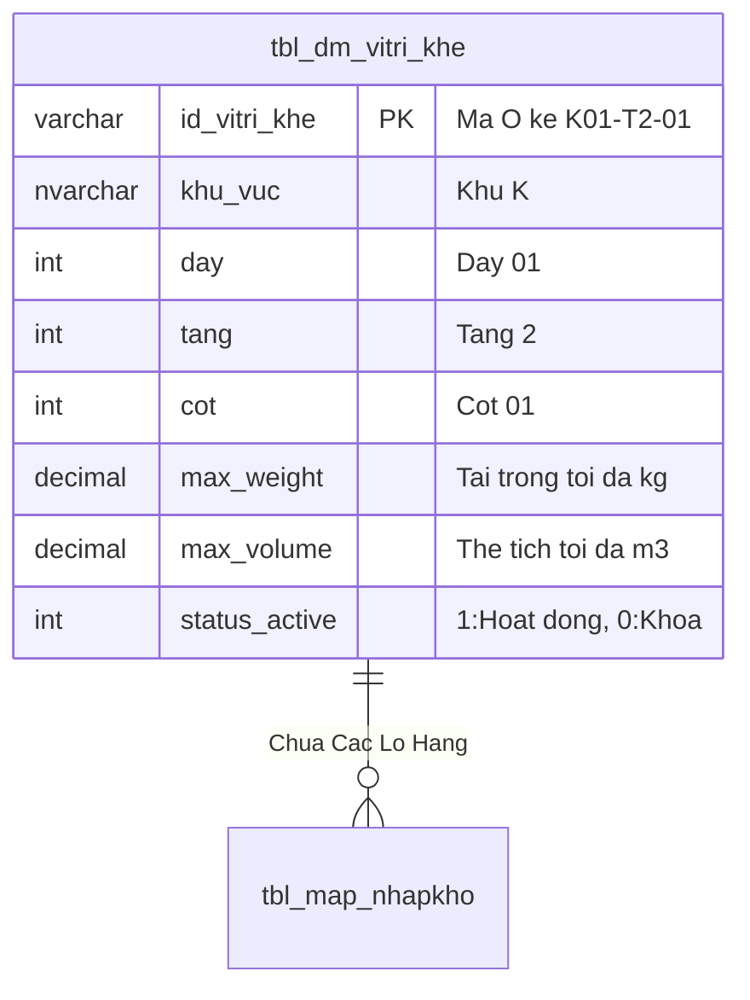
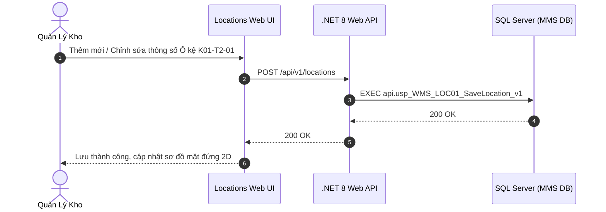

# Phân tích Thiết kế Logic UC-11 (LOC-01) - Quản Lý Danh Mục 540 Vị Trí Ô Kệ, Dãy, Tầng & Cột Kho

Tài liệu này đi sâu vào phân tích và thiết kế hệ thống ở 5 khía cạnh bắt buộc: **Business Logic**, **UI/UX Guidelines**, **Programming Logic**, **Data Logic**, và **Diagrams (Mermaid)** dành cho chức năng **Quản Lý Danh Mục Vị Trí Ô Kệ (LOC-01)** của Quản trị hệ thống và Quản lý kho.

---

## 1. Business Logic (Logic Nghiệp Vụ)

- **Mục tiêu cốt lõi:** Quản lý toàn bộ 540 vị trí Ô kệ vật lý trong nhà kho theo quy chuẩn cấu trúc mã hóa: `[Khu Vực][Dãy]-[Tầng]-[Cột]` (ví dụ: `K01-T2-01` = Khu K, Dãy 01, Tầng 2, Cột 01). Cho phép định nghĩa thông số kỹ thuật cho từng Ô kệ: Loại kệ (Kệ Selective, Kệ Drive-in, Kệ Pallet, Kệ Thùng Lẻ), Kích thước (Dài x Rộng x Cao), Tải trọng tối đa (Max Weight kg), Thể tích tối đa (Max Volume $m^3$) và Nhóm vật tư ưu tiên lưu trữ.

- **Các quy tắc nghiệp vụ (Business Rules):**
  - `BR-LOC-01-01` **Quy tắc đặt mã vị trí duy nhất:** Mỗi vị trí Ô kệ phải có mã duy nhất (`id_vitri_khe`), không trùng lặp và tương ứng với một Barcode định danh dán trên thanh dầm kệ.
  - `BR-LOC-01-02` **Trạng thái hoạt động của Ô kệ:**
    - `ACTIVE (Hoạt động)`: Sẵn sàng cho phép cất hàng và lấy hàng.
    - `LOCKED_MAINTENANCE (Khóa bảo trì)`: Tạm ngừng cất hàng mới do hỏng dầm kệ hoặc đang sửa chữa.
    - `LOCKED_AUDIT (Khóa kiểm kê)`: Đang trong đợt kiểm kê định kỳ.

- **Quy trình tương tác 5 bước (Interaction Flow):**
  - **Bước 1:** Quản lý kho mở phân hệ "Quản Lý Ô Kệ" (`/locations`).
  - **Bước 2:** Xem danh sách phân cấp theo Khu vực / Dãy kệ.
  - **Bước 3:** Thêm mới, chỉnh sửa thông số kỹ thuật (Tải trọng, thể tích) hoặc in lại mã Barcode cho Ô kệ.
  - **Bước 4:** Bấm lưu thay đổi. Backend cập nhật bảng `tbl_dm_vitri_khe`.
  - **Bước 5:** Dữ liệu ô kệ mới được đồng bộ tức thời vào thuật toán đề xuất cất hàng (`INB-04`).

---

## 2. Tiêu chuẩn Thiết kế Giao diện (UI/UX Guidelines)
- Bảng danh mục ô kệ đa tầng, hiển thị tỷ lệ lấp đầy dung tích (% Occupancy), nút in tem Barcode ô kệ.

---

## 3. Programming Logic (Logic Lập Trình)

Quy trình xử lý mã lệnh được chia thành 2 lớp rõ rệt: **Frontend (React)** và **Backend (ASP.NET Core kết hợp SQL Stored Procedure)**.

### 3.1. Frontend (React - Component View)
- **State Management & Local Processing:**
  - Gọi API kéo dữ liệu cần thiết vào React State.
  - Sử dụng các hàm mảng JavaScript (`filter`, `map`, `reduce`) để xử lý gom nhóm, lọc tìm kiếm in-memory, tối ưu hóa băng thông và tạo trải nghiệm mượt mà không độ trễ.
- **UI Interaction & Ergonomics:**
  - Sử dụng cấu trúc Collapse / Accordion / Modal xem trước để tối ưu không gian hiển thị trên màn hình Handheld PDA và Desktop Web.

### 3.2. Backend (ASP.NET Core & SQL Server Stored Procedure)
- **Thin API Gateway Pattern:**
  - ASP.NET Core Minimal API / Controller không xử lý logic tính toán nghiệp vụ mà chỉ làm cổng Gateway mỏng (Xác thực JWT Cookie, kiểm tra quyền màn hình `vw_SEC_UserScreenAccess_v1`) và ủy thác toàn bộ cho SQL Server Stored Procedure.
- **Tận Dụng Multi-Result Set & ACID Transaction:**
  - SQL Stored Procedure trả về đồng thời nhiều Result Sets (Header info, Summary KPIs, Detailed Lines) trong một lần truy vấn duy nhất.
  - Các lệnh ghi dữ liệu áp dụng `SET XACT_ABORT ON`, `BEGIN TRANSACTION` và khóa dòng dữ liệu `WITH (UPDLOCK, HOLDLOCK)` đảm bảo an toàn tuyệt đối.

---

## 4. Data Logic & Schema Model (Thiết kế Dữ Liệu Chuyên Sâu)

### 4.1. Entity Relationship Diagram (ERD) & Schema Details

### 4.2. Data Flow & Transaction Locking Matrix
- **Khóa Ô kệ bảo trì:** Khi khóa Ô kệ (`status_active = 0`), hệ thống khóa `UPDLOCK` để đảm bảo không có lệnh cất hàng hoặc lấy hàng nào đang ở trạng thái in-flight.

### 4.3. Conceptual State Model & Transition Rules
| Trạng Thái Ô Kệ | Thao Tác Kích Hoạt | Trạng Thái Sau | Ảnh Hưởng Thuật Toán Cất Kệ |
| :--- | :--- | :--- | :--- |
| **`ACTIVE (1)`** | Bấm Khóa bảo trì / Kiểm kê (LOC-04) | `LOCKED (0)` | Bị loại khỏi gợi ý cất kệ INB-04 |
| **`LOCKED (0)`** | Bấm Mở khóa hoạt động (LOC-04) | `ACTIVE (1)` | Sẵn sàng tiếp nhận hàng lưu trữ |

---

## 5. Diagrams (Mermaid Sơ Đồ Luồng Nghiệp Vụ)

