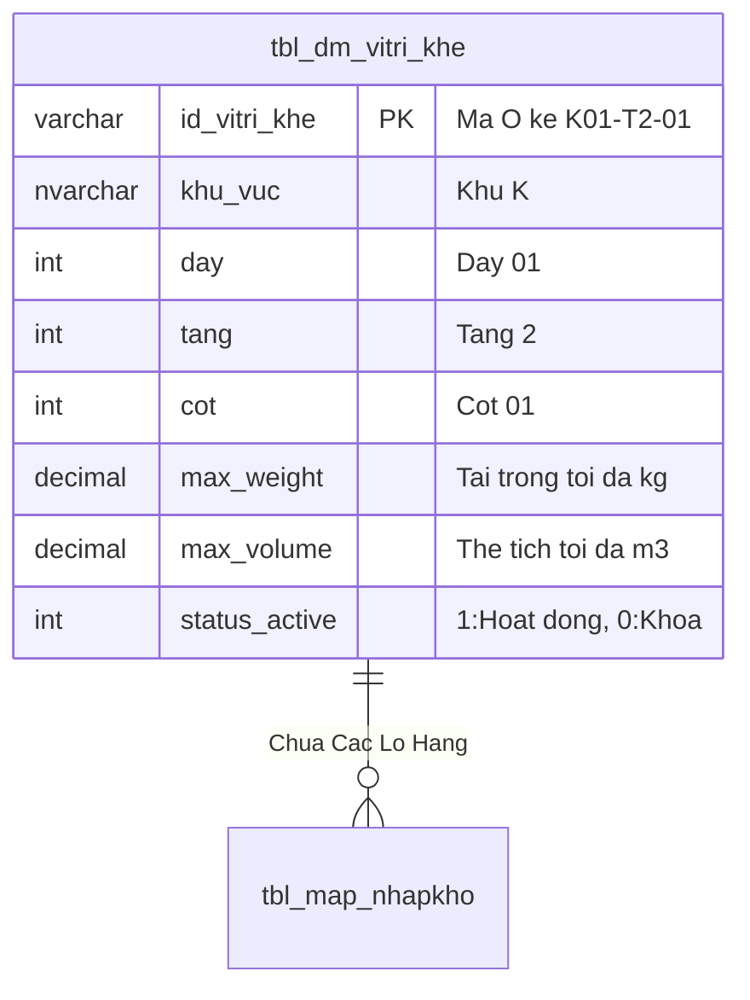

# Phân tích Thiết kế Logic UC-11 (LOC-02) - Sơ Đồ Trực Quan 2D Mặt Đứng Kho Theo Ô Kệ (2D Warehouse Elevation Map)

Tài liệu này đi sâu vào phân tích và thiết kế hệ thống ở 5 khía cạnh bắt buộc: **Business Logic**, **UI/UX Guidelines**, **Programming Logic**, **Data Logic**, và **Diagrams (Mermaid)** dành cho chức năng **Sơ Đồ 2D Trực Quan Mặt Đứng Kho (LOC-02)** của Thủ kho và Ban Giám Đốc.

---

## 1. Business Logic (Logic Nghiệp Vụ)
- **Mục tiêu cốt lõi:** Trực quan hóa toàn bộ 540 ô kệ thành bản đồ 2D mặt đứng tương tác (Interactive Elevation Grid) theo từng Dãy kệ (Dãy A, Dãy B, Dãy C...). Thể hiện trực quan theo mã màu heatmap: Ô còn trống (Xanh lá), Ô chứa 50-80% (Vàng), Ô đầy tải 100% (Đỏ), Ô bị khóa (Xám). Cho phép click vào từng ô trên sơ đồ để xem danh sách các Lô hàng và SKU đang nằm bên trong.
- **Endpoint:** `GET /api/v1/locations/elevation-map`
- **SP:** `api.usp_WMS_LOC02_GetElevationMap_v1`

---

## 3. Programming Logic (Logic Lập Trình)

Quy trình xử lý mã lệnh được chia thành 2 lớp rõ rệt: **Frontend (React)** và **Backend (ASP.NET Core kết hợp SQL Stored Procedure)**.

### 3.1. Frontend (React - Component View)
- **State Management & Local Processing:**
  - Gọi API kéo dữ liệu cần thiết vào React State.
  - Sử dụng các hàm mảng JavaScript (`filter`, `map`, `reduce`) để xử lý gom nhóm, lọc tìm kiếm in-memory, tối ưu hóa băng thông và tạo trải nghiệm mượt mà không độ trễ.
- **UI Interaction & Ergonomics:**
  - Sử dụng cấu trúc Collapse / Accordion / Modal xem trước để tối ưu không gian hiển thị trên màn hình Handheld PDA và Desktop Web.

### 3.2. Backend (ASP.NET Core & SQL Server Stored Procedure)
- **Thin API Gateway Pattern:**
  - ASP.NET Core Minimal API / Controller không xử lý logic tính toán nghiệp vụ mà chỉ làm cổng Gateway mỏng (Xác thực JWT Cookie, kiểm tra quyền màn hình `vw_SEC_UserScreenAccess_v1`) và ủy thác toàn bộ cho SQL Server Stored Procedure.
- **Tận Dụng Multi-Result Set & ACID Transaction:**
  - SQL Stored Procedure trả về đồng thời nhiều Result Sets (Header info, Summary KPIs, Detailed Lines) trong một lần truy vấn duy nhất.
  - Các lệnh ghi dữ liệu áp dụng `SET XACT_ABORT ON`, `BEGIN TRANSACTION` và khóa dòng dữ liệu `WITH (UPDLOCK, HOLDLOCK)` đảm bảo an toàn tuyệt đối.

---

## 4. Data Logic & Schema Model (Thiết kế Dữ Liệu Chuyên Sâu)

### 4.1. Entity Relationship Diagram (ERD) & Schema Details

### 4.2. Data Flow & Transaction Locking Matrix
- **Khóa Ô kệ bảo trì:** Khi khóa Ô kệ (`status_active = 0`), hệ thống khóa `UPDLOCK` để đảm bảo không có lệnh cất hàng hoặc lấy hàng nào đang ở trạng thái in-flight.

### 4.3. Conceptual State Model & Transition Rules
| Trạng Thái Ô Kệ | Thao Tác Kích Hoạt | Trạng Thái Sau | Ảnh Hưởng Thuật Toán Cất Kệ |
| :--- | :--- | :--- | :--- |
| **`ACTIVE (1)`** | Bấm Khóa bảo trì / Kiểm kê (LOC-04) | `LOCKED (0)` | Bị loại khỏi gợi ý cất kệ INB-04 |
| **`LOCKED (0)`** | Bấm Mở khóa hoạt động (LOC-04) | `ACTIVE (1)` | Sẵn sàng tiếp nhận hàng lưu trữ |
