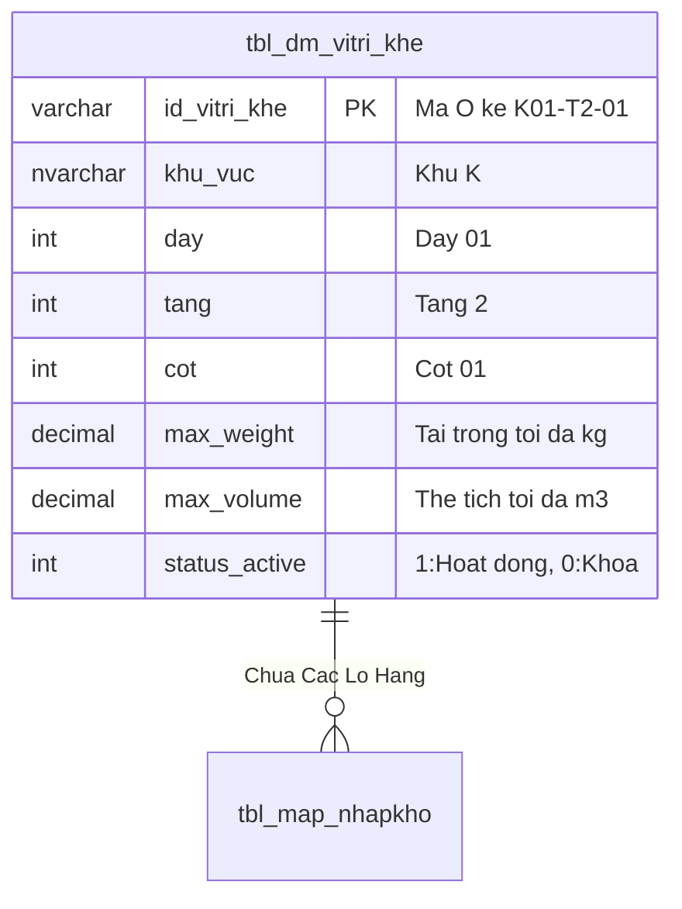

# Phân tích Thiết kế Logic UC-11 (LOC-03) - Cảnh Báo Dung Tích, Sức Chứa & Trọng Tải Quá Mức Ô Kệ (Overcapacity Alert)

Tài liệu này đi sâu vào phân tích và thiết kế hệ thống ở 5 khía cạnh bắt buộc: **Business Logic**, **UI/UX Guidelines**, **Programming Logic**, **Data Logic**, và **Diagrams (Mermaid)** dành cho chức năng **Cảnh Báo Quá Tải Ô Kệ (LOC-03)** của Thủ kho.

---

## 1. Business Logic (Logic Nghiệp Vụ)
- **Mục tiêu cốt lõi:** Tự động giám sát tổng trọng lượng và thể tích của tất cả các Lô hàng đang lưu trữ tại từng Ô kệ. Nếu phát hiện Ô kệ vượt quá 95% tải trọng thiết kế hoặc quá thể tích an toàn, hệ thống tự động phát cảnh báo đỏ, từ chối đề xuất cất thêm hàng vào ô kệ đó và gửi thông báo yêu cầu điều chuyển giãn tải.
- **Endpoint:** `GET /api/v1/locations/capacity-warnings`
- **SP:** `api.usp_WMS_LOC03_GetCapacityWarnings_v1`

---

## 4. Data Logic & Schema Model (Thiết kế Dữ Liệu Chuyên Sâu)

### 4.1. Entity Relationship Diagram (ERD) & Schema Details

### 4.2. Data Flow & Transaction Locking Matrix
- **Khóa Ô kệ bảo trì:** Khi khóa Ô kệ (`status_active = 0`), hệ thống khóa `UPDLOCK` để đảm bảo không có lệnh cất hàng hoặc lấy hàng nào đang ở trạng thái in-flight.

### 4.3. Conceptual State Model & Transition Rules
| Trạng Thái Ô Kệ | Thao Tác Kích Hoạt | Trạng Thái Sau | Ảnh Hưởng Thuật Toán Cất Kệ |
| :--- | :--- | :--- | :--- |
| **`ACTIVE (1)`** | Bấm Khóa bảo trì / Kiểm kê (LOC-04) | `LOCKED (0)` | Bị loại khỏi gợi ý cất kệ INB-04 |
| **`LOCKED (0)`** | Bấm Mở khóa hoạt động (LOC-04) | `ACTIVE (1)` | Sẵn sàng tiếp nhận hàng lưu trữ |
