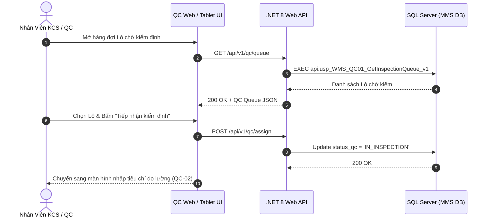

# Phân tích Thiết kế Logic UC-12 (QC-01) - Tiếp Nhận Danh Sách Lô Hàng Chờ Kiểm Định Chất Lượng (QC Queue)

Tài liệu này đi sâu vào phân tích và thiết kế hệ thống ở 5 khía cạnh bắt buộc: **Business Logic**, **UI/UX Guidelines**, **Programming Logic**, **Data Logic**, và **Diagrams (Mermaid)** dành cho chức năng **Tiếp Nhận Danh Sách Lô Chờ Kiểm (QC-01)** của Nhân viên KCS/QC.

---

## 1. Business Logic (Logic Nghiệp Vụ)

- **Mục tiêu cốt lõi:** Sau khi hàng được tiếp nhận và in tem nhãn tại cửa kho (`INB-03`), các Lô hàng tự động được đưa vào hàng đợi kiểm tra chất lượng (`status_qc = 'PENDING'`). Phân hệ QC hiển thị danh sách các Lô chờ kiểm, phân loại theo độ ưu tiên, nguồn gốc (PO NCC hay BTP Sản xuất), thời gian chờ và chỉ định Nhân viên KCS phụ trách lấy mẫu.

- **Các quy tắc nghiệp vụ (Business Rules):**
  - `BR-QC-01-01` **Hàng đợi kiểm định tự động (Auto Queue Dispatch):** Mọi Lô hàng nhập mới bắt buộc phải vào hàng đợi QC trước khi được phép chuyển trạng thái `PASS` để cất kệ hoặc xuất kho.
  - `BR-QC-01-02` **Phân loại độ ưu tiên lấy mẫu (QC Priority Matrix):** Các Lô vật tư thuộc danh mục "Vật tư trọng yếu (Critical Items)" hoặc có đề nghị xuất khẩn cấp cho sản xuất được đánh dấu cờ đỏ ưu tiên kiểm trước.

- **Quy trình tương tác 5 bước (Interaction Flow):**
  - **Bước 1:** Nhân viên QC mở phân hệ "Kiểm Định Chất Lượng (QC)" (`/qc`).
  - **Bước 2:** Xem danh sách hàng đợi các Lô chờ kiểm.
  - **Bước 3:** Nhấn vào 1 Lô để xem thông tin: Mã Lô, Mã SKU, Quy cách, Số lượng lô, NCC, Tiêu chuẩn kỹ thuật áp dụng.
  - **Bước 4:** Bấm **"Tiếp nhận kiểm định"** $
ightarrow$ Hệ thống chuyển trạng thái Lô sang `IN_INSPECTION`.
  - **Bước 5:** Di chuyển đến khu vực kiểm mẫu để tiến hành đo lường thử nghiệm (`QC-02` & `QC-03`).

---

## 2. Tiêu chuẩn Thiết kế Giao diện (UI/UX Guidelines)
- Bảng danh sách hàng đợi QC trực quan, thẻ Lô có màu sắc phân loại độ ưu tiên, nút nhận kiểm màu xanh Emerald.

---

## 3. Programming Logic (Logic Lập Trình)
- **Endpoint:** `GET /api/v1/qc/queue` & `POST /api/v1/qc/assign`
- **SP:** `api.usp_WMS_QC01_GetInspectionQueue_v1`

---

## 4. Data Logic & Schema Model (Cấu Trúc Dữ Liệu)
- `dbo.tbl_map_nhapkho`: Lọc `status_qc = 'PENDING'` hoặc `'WAIT_QC'`.
- `dbo.tbl_qc_inspection`: Bảng quản lý hồ sơ kiểm định chất lượng.

---

## 5. Diagrams (Mermaid Sơ Đồ Luồng Nghiệp Vụ)

