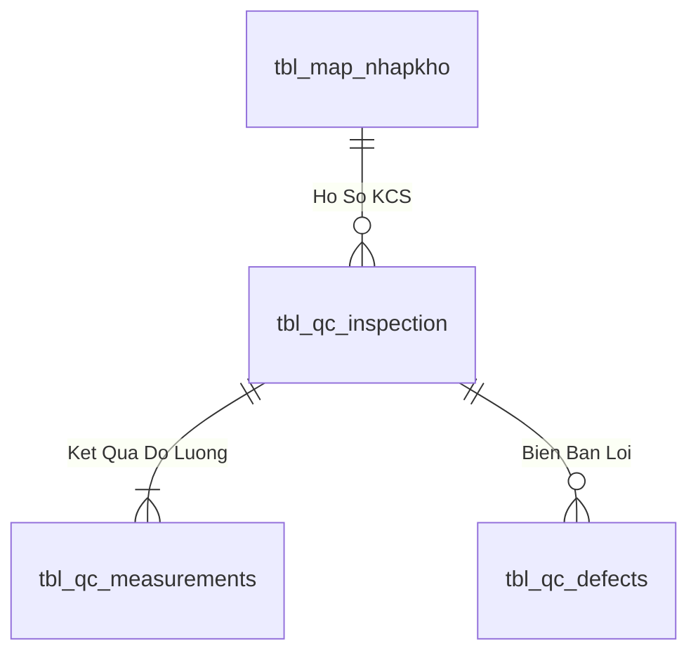
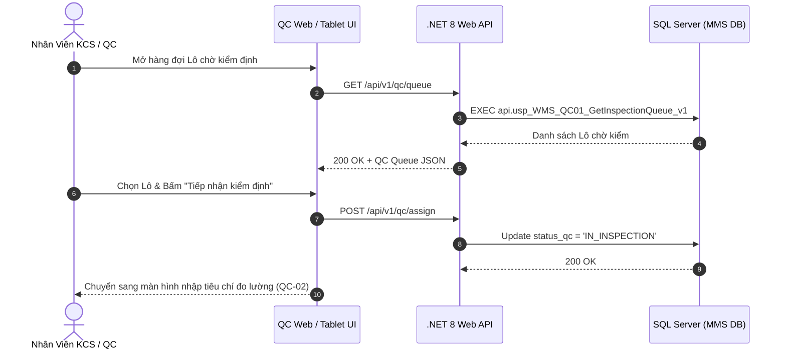

# Phân tích Thiết kế Logic UC-12 (QC-01) - Tiếp Nhận Danh Sách Lô Hàng Chờ Kiểm Định Chất Lượng (QC Queue)

Tài liệu này đi sâu vào phân tích và thiết kế hệ thống ở 5 khía cạnh bắt buộc: **Business Logic**, **UI/UX Guidelines**, **Programming Logic**, **Data Logic**, và **Diagrams (Mermaid)** dành cho chức năng **Tiếp Nhận Danh Sách Lô Chờ Kiểm (QC-01)** của Nhân viên KCS/QC.

---

## 1. Business Logic (Logic Nghiệp Vụ)

- **Mục tiêu cốt lõi:** Sau khi hàng được tiếp nhận và in tem nhãn tại cửa kho (`INB-03`), các Lô hàng tự động được đưa vào hàng đợi kiểm tra chất lượng (`status_qc = 'PENDING'`). Phân hệ QC hiển thị danh sách các Lô chờ kiểm, phân loại theo độ ưu tiên, nguồn gốc (PO NCC hay BTP Sản xuất), thời gian chờ và chỉ định Nhân viên KCS phụ trách lấy mẫu.

- **Các quy tắc nghiệp vụ (Business Rules):**
  - `BR-QC-01-01` **Hàng đợi kiểm định tự động (Auto Queue Dispatch):** Mọi Lô hàng nhập mới bắt buộc phải vào hàng đợi QC trước khi được phép chuyển trạng thái `PASS` để cất kệ hoặc xuất kho.
  - `BR-QC-01-02` **Phân loại độ ưu tiên lấy mẫu (QC Priority Matrix):** Các Lô vật tư thuộc danh mục "Vật tư trọng yếu (Critical Items)" hoặc có đề nghị xuất khẩn cấp cho sản xuất được đánh dấu cờ đỏ ưu tiên kiểm trước.

- **Quy trình tương tác 5 bước (Interaction Flow):**
  - **Bước 1:** Nhân viên QC mở phân hệ "Kiểm Định Chất Lượng (QC)" (`/qc`).
  - **Bước 2:** Xem danh sách hàng đợi các Lô chờ kiểm.
  - **Bước 3:** Nhấn vào 1 Lô để xem thông tin: Mã Lô, Mã SKU, Quy cách, Số lượng lô, NCC, Tiêu chuẩn kỹ thuật áp dụng.
  - **Bước 4:** Bấm **"Tiếp nhận kiểm định"** $
ightarrow$ Hệ thống chuyển trạng thái Lô sang `IN_INSPECTION`.
  - **Bước 5:** Di chuyển đến khu vực kiểm mẫu để tiến hành đo lường thử nghiệm (`QC-02` & `QC-03`).

---

## 2. Tiêu chuẩn Thiết kế Giao diện (UI/UX Guidelines)
- Bảng danh sách hàng đợi QC trực quan, thẻ Lô có màu sắc phân loại độ ưu tiên, nút nhận kiểm màu xanh Emerald.

---

## 3. Programming Logic (Logic Lập Trình)

Quy trình xử lý mã lệnh được chia thành 2 lớp rõ rệt: **Frontend (React)** và **Backend (ASP.NET Core kết hợp SQL Stored Procedure)**.

### 3.1. Frontend (React - Component View)
- **State Management & Local Processing:**
  - Gọi API kéo dữ liệu cần thiết vào React State.
  - Sử dụng các hàm mảng JavaScript (`filter`, `map`, `reduce`) để xử lý gom nhóm, lọc tìm kiếm in-memory, tối ưu hóa băng thông và tạo trải nghiệm mượt mà không độ trễ.
- **UI Interaction & Ergonomics:**
  - Sử dụng cấu trúc Collapse / Accordion / Modal xem trước để tối ưu không gian hiển thị trên màn hình Handheld PDA và Desktop Web.

### 3.2. Backend (ASP.NET Core & SQL Server Stored Procedure)
- **Thin API Gateway Pattern:**
  - ASP.NET Core Minimal API / Controller không xử lý logic tính toán nghiệp vụ mà chỉ làm cổng Gateway mỏng (Xác thực JWT Cookie, kiểm tra quyền màn hình `vw_SEC_UserScreenAccess_v1`) và ủy thác toàn bộ cho SQL Server Stored Procedure.
- **Tận Dụng Multi-Result Set & ACID Transaction:**
  - SQL Stored Procedure trả về đồng thời nhiều Result Sets (Header info, Summary KPIs, Detailed Lines) trong một lần truy vấn duy nhất.
  - Các lệnh ghi dữ liệu áp dụng `SET XACT_ABORT ON`, `BEGIN TRANSACTION` và khóa dòng dữ liệu `WITH (UPDLOCK, HOLDLOCK)` đảm bảo an toàn tuyệt đối.

---

## 4. Data Logic & Schema Model (Thiết kế Dữ Liệu Chuyên Sâu)

### 4.1. Entity Relationship Diagram (ERD) & Schema Details

- **Bảng Hồ Sơ Kiểm Định (`dbo.tbl_qc_inspection`):**
  - Khóa chính: `id_inspection` (INT IDENTITY).
  - Khóa ngoại: `id_nhapkho` $
ightarrow$ `tbl_map_nhapkho(id_nhapkho)`.
  - Kết luận kiểm tra: `decision` (`'PASS'`, `'REJECT'`, `'CONCESSION'`).

### 4.2. Data Flow & Transaction Locking Matrix
- **Khóa Lô kiểm định:** Khi QC tiếp nhận lấy mẫu, cập nhật `status_qc = 'IN_INSPECTION'` với `UPDLOCK` để khóa quyền xuất kho cho đến khi có quyết định phê duyệt chính thức.

### 4.3. Conceptual State Model & Transition Rules
| Trạng Thái QC | Điều Kiện Chuyển Đổi | Trạng Thái Sau | Tác Động Hệ Thống |
| :--- | :--- | :--- | :--- |
| **`PENDING`** | KCS tiếp nhận lấy mẫu (QC-01) | `IN_INSPECTION` | Khóa xuất kho |
| **`IN_INSPECTION`** | Đạt tiêu chuẩn AQL (QC-04) | `PASS` / `PASS_CHO_NHAP` | Mở khóa cất kệ & xuất kho |
| **`IN_INSPECTION`** | Không đạt tiêu chuẩn (QC-04) | `REJECT` | Tự động chuyển kho cách ly (QC-06) |

---

## 5. Diagrams (Mermaid Sơ Đồ Luồng Nghiệp Vụ)

