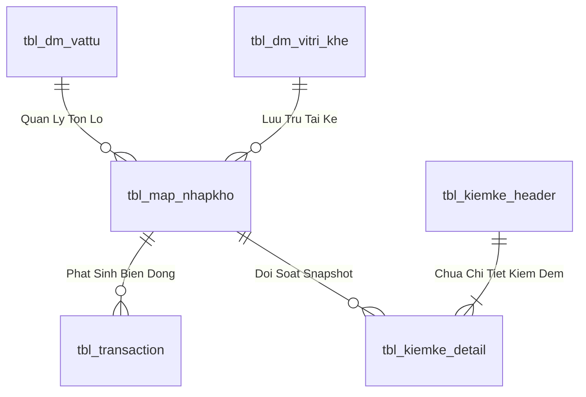

# INV-04 – Khai báo tồn kho

> Tài liệu thuộc bộ đặc tả 42 use case MMS. Nguồn sự thật gồm hồ sơ tổng thể, React route, .NET endpoint và SQL contract versioned trong workspace.

## Thông tin kiểm soát

| Thuộc tính | Giá trị |
| --- | --- |
| Module | Tồn kho & truy vết |
| Wave | W4 |
| Tác nhân | Quản lý kho |
| Loại xử lý | Query + Command |
| Route React | `/inventory/declare` |
| Màn hình quyền | `scr_tonkho_khaibao` |
| Trạng thái | Contract đã có trong workspace; triển khai/UAT theo checklist chung |

---

## 1. Business Logic (Logic nghiệp vụ)

### 1.1. Mục tiêu

Ghi nhận tồn ban đầu hoặc điều chỉnh được phê duyệt.

### 1.2. Điều kiện trước và sau

| Loại | Nội dung |
| --- | --- |
| Điều kiện trước | Có căn cứ và quyền khai báo. |
| Thành công | Hoàn tất đúng luồng 'INV-04', trả dữ liệu/kết quả contract và ghi audit khi có command. |
| Thất bại | Không để dữ liệu dở dang; trả lỗi nghiệp vụ hoặc 'traceId'. |

### 1.3. Luồng chính

1. Chọn vật tư.
2. nhập số lượng/đơn vị/vị trí.
3. xác nhận.
4. tạo batch/transaction..

### 1.4. Ngoại lệ và kiểm soát

Thiếu căn cứ hoặc số lượng không hợp lệ: từ chối.

### 1.5. Business Rules

| Mã | Quy tắc |
| --- | --- |
| BR-INV-04-01 | User phải có phiên xác thực và quyền màn hình tương ứng. |
| BR-INV-04-02 | Dữ liệu bắt buộc phải được trim và kiểm tra tại API lẫn stored procedure. |
| BR-INV-04-03 | Không tin 'UserId', trạng thái hoặc giá trị suy diễn do client tự gửi. |
| BR-INV-04-04 | Stored procedure là nơi thực thi logic nghiệp vụ và phân quyền dữ liệu. |
| BR-INV-04-05 | Command phải nguyên tử, rollback khi bất kỳ bước nào lỗi. |
| BR-INV-04-06 | Giữ nguyên cấu trúc bảng và mã trạng thái legacy. |
| BR-INV-04-07 | Lỗi nghiệp vụ phải dùng mã ổn định; lỗi ngoài dự kiến phải có 'traceId'. |
| BR-INV-04-08 | React không truy cập bảng SQL trực tiếp. |

### 1.6. Ranh giới trách nhiệm

| Lớp | Trách nhiệm |
| --- | --- |
| React | Hiển thị, nhập liệu, validation trải nghiệm và trạng thái request |
| .NET API | Xác thực, contract HTTP, user claim, gọi SP và ánh xạ lỗi |
| SQL SP | Quyền, business rule, concurrency, transaction và dữ liệu |
| Legacy tables | Lưu dữ liệu/trạng thái vật lý hiện hành |

---

## 2. UI/UX Guidelines

### 2.1. Bố cục

- Header hiển thị mã 'INV-04' và tên “Khai báo tồn kho”.
- Khu vực lọc/tìm kiếm hoặc form dữ liệu theo luồng nghiệp vụ.
- Vùng kết quả dạng bảng/chi tiết, có loading, empty, error và success state.
- Command quan trọng phải có xác nhận và khóa nút trong lúc gửi.

### 2.2. Trạng thái giao diện

| Trạng thái | Yêu cầu |
| --- | --- |
| Loading | Không hiển thị dữ liệu cũ như kết quả mới |
| Empty | Giải thích không có dữ liệu phù hợp |
| Validation | Gắn lỗi với đúng trường/dòng |
| Submitting | Chặn submit lặp; không tự retry command |
| Success | Hiển thị mã đối tượng, trạng thái và bước tiếp theo |
| Error | Thông báo thân thiện, nút thử lại và 'traceId' nếu có |

### 2.3. Accessibility

- Label rõ ràng cho input/select và nút chỉ có biểu tượng.
- Thao tác được bằng bàn phím; focus tới lỗi đầu tiên.
- Không dùng màu làm tín hiệu duy nhất.
- Thông báo dùng vùng 'aria-live'.

---

## 3. Programming Logic (Logic Lập Trình)

Quy trình xử lý mã lệnh được chia thành 2 lớp rõ rệt: **Frontend (React)** và **Backend (ASP.NET Core kết hợp SQL Stored Procedure)**.

### 3.1. Frontend (React - Component View)
- **State Management & Local Processing:**
  - Gọi API kéo dữ liệu cần thiết vào React State.
  - Sử dụng các hàm mảng JavaScript (`filter`, `map`, `reduce`) để xử lý gom nhóm, lọc tìm kiếm in-memory, tối ưu hóa băng thông và tạo trải nghiệm mượt mà không độ trễ.
- **UI Interaction & Ergonomics:**
  - Sử dụng cấu trúc Collapse / Accordion / Modal xem trước để tối ưu không gian hiển thị trên màn hình Handheld PDA và Desktop Web.

### 3.2. Backend (ASP.NET Core & SQL Server Stored Procedure)
- **Thin API Gateway Pattern:**
  - ASP.NET Core Minimal API / Controller không xử lý logic tính toán nghiệp vụ mà chỉ làm cổng Gateway mỏng (Xác thực JWT Cookie, kiểm tra quyền màn hình `vw_SEC_UserScreenAccess_v1`) và ủy thác toàn bộ cho SQL Server Stored Procedure.
- **Tận Dụng Multi-Result Set & ACID Transaction:**
  - SQL Stored Procedure trả về đồng thời nhiều Result Sets (Header info, Summary KPIs, Detailed Lines) trong một lần truy vấn duy nhất.
  - Các lệnh ghi dữ liệu áp dụng `SET XACT_ABORT ON`, `BEGIN TRANSACTION` và khóa dòng dữ liệu `WITH (UPDLOCK, HOLDLOCK)` đảm bảo an toàn tuyệt đối.

---

## 4. Data Logic

### 4.1. Ma trận dữ liệu

| Object | Vai trò | Truy cập qua |
| --- | --- | --- |
| `tbl_batch_inv, tbl_transaction` | Dữ liệu nghiệp vụ legacy | SP |
| `sp_insert_tonkho` | Dữ liệu nghiệp vụ legacy | SP |
| `api.InventoryDeclarationItem_v1` | Contract API/view/type | SP |
| `api.vw_SEC_UserScreenAccess_v1` | Contract API/view/type | SP |
| `dbo.tbl_dm_vattu` | Dữ liệu nghiệp vụ legacy | SP |
| `dbo.tbl_dm_location` | Dữ liệu nghiệp vụ legacy | SP |
| `dbo.tbl_dm_nghiepvu_kho` | Dữ liệu nghiệp vụ legacy | SP |
| `dbo.tbl_phieu_transaction` | Dữ liệu nghiệp vụ legacy | SP |
| `dbo.tbl_batch_inv` | Dữ liệu nghiệp vụ legacy | SP |
| `dbo.tbl_transaction` | Dữ liệu nghiệp vụ legacy | SP |
| `dbo.tbl_location_event` | Dữ liệu nghiệp vụ legacy | SP |

### 4.2. Nguyên tắc dữ liệu

- Không thay đổi 59 bảng legacy hoặc mã trạng thái hiện hữu trong use case này.
- Mọi truy cập từ ứng dụng đi qua schema 'api' và stored procedure versioned.
- User/audit lấy từ phiên xác thực.
- Tất cả ghi nghiệp vụ liên quan phải cùng commit hoặc cùng rollback.

### 4.3. State model

~~~text
[Chưa đủ điều kiện]
        |
        | kiểm tra quyền + business rules
        v
[Sẵn sàng xử lý INV-04]
        |
        | command SP
        v
[Kết quả hợp lệ / trạng thái legacy được giữ nguyên]
~~~

---

## 5. Biểu đồ thiết kế

### 5.1. Sequence Diagram

~~~mermaid
sequenceDiagram
    autonumber
    actor User
    participant UI as React INV-04
    participant API as .NET API
    participant SP as SQL Contract
    participant DB as MMS Legacy Tables
    User->>UI: Thực hiện Khai báo tồn kho
    UI->>API: Request đã validate sơ bộ
    API->>SP: UserId + contract input
    SP->>DB: Kiểm tra quyền và business rules
    alt Hợp lệ
        SP->>DB: Transaction/query nghiệp vụ
        DB-->>SP: Kết quả
        SP-->>API: Result set ổn định
        API-->>UI: 2xx
        UI-->>User: Hiển thị kết quả
    else Không hợp lệ
        SP-->>API: THROW 510xx
        API-->>UI: Problem Details
        UI-->>User: Thông báo + traceId
    end
~~~

### 5.2. Business Flow

~~~mermaid
flowchart TD
    S0["Chọn vật tư"]
    S1["nhập số lượng/đơn vị/vị trí"]
    S2["xác nhận"]
    S3["tạo batch/transaction."]
    S0 --> S1
    S1 --> S2
    S2 --> S3
    S3 --> V{"Hợp lệ?"}
    V -- Có --> OK["Hoàn tất INV-04"]
    V -- Không --> ERR["Từ chối và trả lỗi có kiểm soát"]
~~~

### 5.3. Architecture Flow

~~~mermaid
flowchart LR
    UI["React route"] --> API[".NET endpoint"]
    API --> SP["api.usp_* versioned"]
    SP --> ACCESS["User screen access"]
    SP --> DATA["Legacy tables/views"]
    DATA --> SP --> API --> UI
~~~

---

## 6. Acceptance Criteria và UAT

| Mã | Kịch bản | Kết quả mong đợi |
| --- | --- | --- |
| AC-INV-04-01 | User có quyền mở use case | Màn hình và dữ liệu đúng phạm vi được hiển thị |
| AC-INV-04-02 | User không có quyền | HTTP 403, không lộ dữ liệu |
| AC-INV-04-03 | Dữ liệu hợp lệ | Hoàn tất đúng luồng chính |
| AC-INV-04-04 | Thiếu dữ liệu bắt buộc | HTTP 400/422, chỉ rõ lỗi |
| AC-INV-04-05 | Đối tượng không tồn tại | HTTP 404, không ghi dở dang |
| AC-INV-04-06 | Dữ liệu đã thay đổi đồng thời | HTTP 409 hoặc kết quả nhất quán |
| AC-INV-04-07 | Lỗi hệ thống | HTTP 500 với 'traceId' |
| AC-INV-04-08 | Kiểm tra audit | User, thời gian và hành động đúng contract |
| AC-INV-04-09 | Kiểm tra phân quyền dữ liệu | Không thấy dữ liệu ngoài phạm vi |
| AC-INV-04-10 | Kiểm tra Power Apps dự phòng | Bảng và trạng thái legacy vẫn tương thích |

---

## 7. Cutover và dự phòng Power Apps

- React là giao diện chính sau cutover use case.
- Power Apps chỉ dùng dự phòng, không ghi đồng thời cùng use case React.
- Rollback bằng feature flag/route; không đảo ngược giao dịch đã commit.
- Trước khi bật Power Apps, dừng command React đang chạy và đối soát giao dịch cuối.

---

## 8. Traceability

| Nguồn | Tham chiếu |
| --- | --- |
| Hồ sơ nghiệp vụ | 'HO_SO_TONG_THE_UNG_DUNG_MMS.md' – INV-04 |
| Route registry | 'apps/web/src/app/routeRegistry.ts' |
| API source | apps/api/Modules/InventoryOperations/InventoryOperationEndpoints.cs |
| SQL source | database/stored-procedures/w4/api.usp_WMS_INV04_DeclareInventory_v1.sql, database/stored-procedures/w4/api.usp_WMS_INV04_GetDeclarationCatalog_v1.sql |
| UAT chung | 'UAT_CUTOVER_CHECKLIST_MMS.md' |
| Kế hoạch | 'KE_HOACH_CHUYEN_DOI_POWER_APPS_SANG_REACT_MMS.md' |

---

## 9. Definition of Done

- [ ] React/API/SQL contract khớp kiểu dữ liệu và trường kết quả.
- [ ] Quyền màn hình và quyền dữ liệu được kiểm thử.
- [ ] AC-01 đến AC-10 đạt trên UAT.
- [ ] Không có lỗi 500 do thiếu hoặc sai object SQL.
- [ ] Audit và 'traceId' hoạt động.
- [ ] Đối soát xác nhận không thay đổi ngoài phạm vi use case.
- [ ] Nghiệp vụ và IT vận hành phê duyệt.

---

## 4. Data Logic & Schema Model (Thiết kế Dữ Liệu Chuyên Sâu)

### 4.1. Entity Relationship Diagram (ERD) & Schema Details

- **Bảng Quản Lý Tồn Lô (`dbo.tbl_map_nhapkho` / `dbo.tbl_batch_inv`):**
  - Khóa chính: `id_nhapkho` (INT IDENTITY, Clustered Index).
  - Tự tham chiếu Lô Mẹ: `parent_batch_id` (INT NULL) phục vụ dựng Cây Gia Phả.
  - Vị trí Ô kệ: `id_vitri_khe` (VARCHAR(20), FK).
  - Trạng thái kiểm định: `status_qc` (`'PASS'`, `'REJECT'`, `'PENDING'`).
  - Trạng thái lưu kho: `status_kho` (`'STORED'`, `'ON_RACK'`, `'QUARANTINE'`).
  - Chỉ mục: `IX_tbl_map_nhapkho_vattu` on `(id_vattu, status_qc, status_kho) INCLUDE (so_luong, id_vitri_khe)`.

### 4.2. Data Flow & Transaction Locking Matrix
- **Khóa giao dịch Tách Lô / Chuyển vị trí:** Sử dụng `WITH (UPDLOCK, HOLDLOCK)` trên Lô nguồn để bảo toàn nguyên lý bảo toàn tổng sản lượng `TonLoMe = TonLoCon + TonDu`.
- **Khóa kiểm kê chốt sổ:** Áp dụng mức cô lập `SERIALIZABLE` với `WITH (TABLOCKX)` khi thực thi lệnh chốt chênh lệch `ADJUST_COUNT` để đảm bảo không bị xung đột với các giao dịch xuất nhập hàng ngày.

### 4.3. Conceptual State Model & Transition Rules
| Trạng Thái Lô | Sự Kiện Kích Hoạt | Trạng Thái Sau | Tác Động Sổ Cái |
| :--- | :--- | :--- | :--- |
| **Lô Mẹ F0 (1,000 cái)** | Tách Lô con 400 cái (INV-06) | Lô Mẹ: 600 cái, Lô Con: 400 cái | Ghi `tbl_transaction` (`SPLIT_BATCH`) |
| **Kệ K01 (Lô A)** | Điều chuyển sang Kệ K02 (INV-03) | Vị trí mới = K02 | Ghi `tbl_transaction` (`TRANSFER`) |
| **Snapshot Sổ Sách** | Chốt lệch kiểm kê (INV-09) | Điều chỉnh tồn = Thực đếm | Ghi `tbl_transaction` (`ADJUST_COUNT`) |
