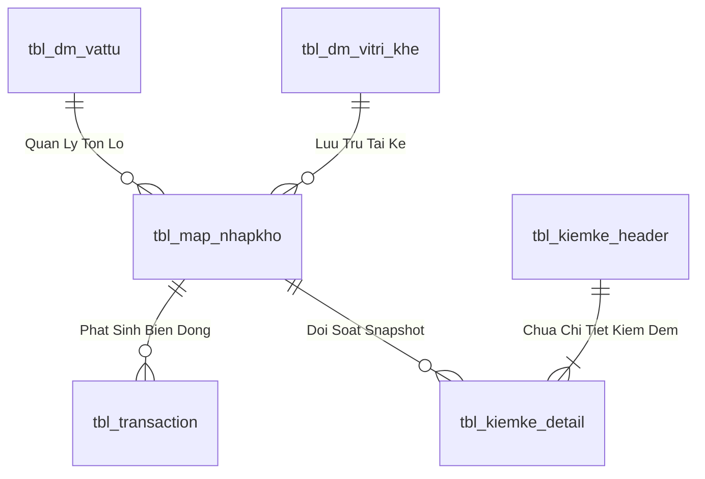
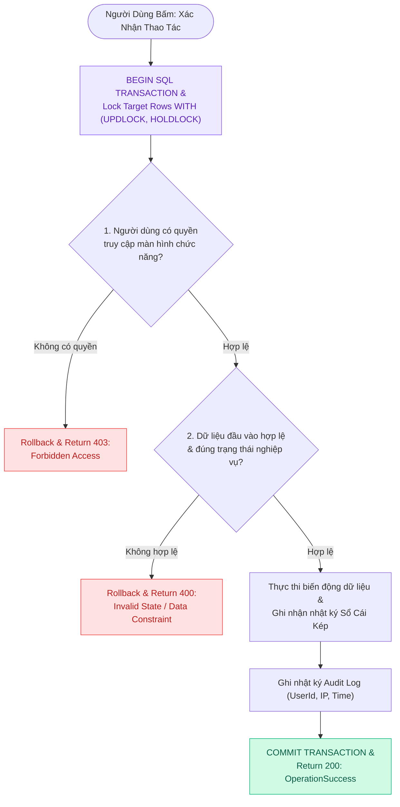
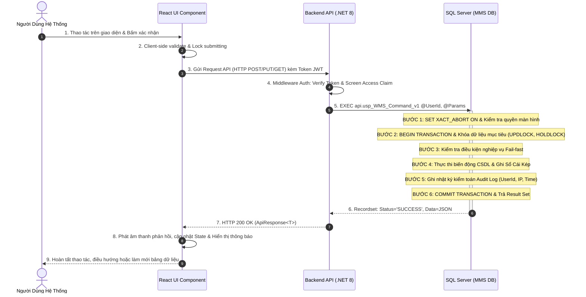
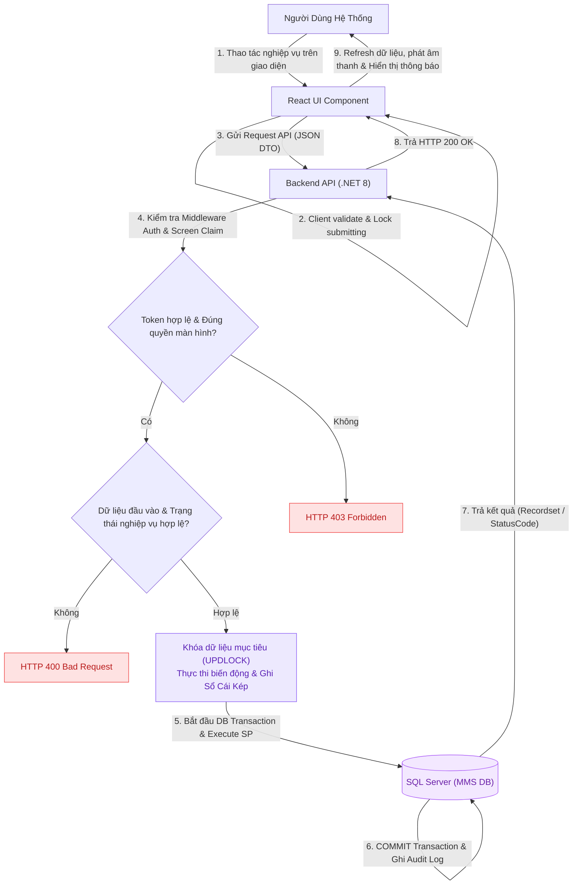

# Phân tích Thiết kế Logic UC-17 (INV-01) - Tra Cứu Tồn Kho Tổng Hợp Theo Mã Vật Tư (SKU)

Tài liệu này đi sâu vào phân tích và thiết kế hệ thống ở 5 khía cạnh bắt buộc: **Business Logic**, **UI/UX Guidelines**, **Programming Logic**, **Data Logic**, và **Diagrams (Mermaid)** dành cho chức năng **Tra Cứu Tồn Kho Theo SKU (INV-01)** của Thủ kho, Kế toán kho và Bộ phận Kế hoạch.

---

## 1. Business Logic (Logic Nghiệp Vụ)

- **Mục tiêu cốt lõi:** Cho phép tra cứu nhanh số lượng tồn kho tổng hợp của toàn bộ 17,476 danh mục SKU vật tư trong nhà máy (`tbl_dm_vattu`). Hệ thống tổng hợp realtime từ bảng chi tiết các Lô tồn kho khả dụng (`tbl_map_nhapkho` / `tbl_batch_inv`), phân tách rõ ràng: *Tổng tồn vật lý, Tồn khả dụng (QC Pass & On Rack), Tồn chờ kiểm định (QC Pending/Quarantine), Tồn đã được giữ chỗ cho các đơn xuất (Reserved)* và đối chiếu với hạn mức an toàn Min/Max.

- **Các quy tắc nghiệp vụ (Business Rules):**
  - `BR-INV-01-01` **Công thức tính tồn khả dụng (Available Stock Formula):** `Tồn Khả Dụng = Tổng Tồn Vật Lý - Tồn QC Chưa Đạt - Tồn Giữ Chỗ (Reserved)`. Chỉ các Lô `status_qc IN ('PASS', 'PASS_CHO_NHAP')` và `status_kho IN ('STORED', 'ON_RACK')` mới được tính vào tồn khả dụng xuất kho.
  - `BR-INV-01-02` **Cảnh báo ngưỡng tồn kho an toàn (Stock Safety Thresholds):** Gắn nhãn cảnh báo đỏ `🔴 DƯỚI ĐỊNH MỨC` khi `TonKhaDung < Mức Min`, gắn nhãn vàng `🟡 VƯỢT TRẦN LƯU KHO` khi `TongTon > Mức Max`.
  - `BR-INV-01-03` **Tra cứu đa tiêu chí (Multi-criteria Search Index):** Hỗ trợ tìm kiếm tức thời theo Mã MMS (`id_vattu`), Mã Bravo (`id_bravo`), Tên quy cách, Nhóm vật tư.
  - `BR-INV-01-04` **Bảo toàn dữ liệu thời gian thực (Realtime Snapshot Accuracy):** Số liệu tổng hợp phản ánh chính xác các giao dịch xuất/nhập/tách lô vừa phát sinh trong vòng 1 giây.
  - `BR-INV-01-05` **Phân quyền truy xuất số liệu tồn:** Người dùng phải có quyền `scr_tonkho_sku` hoặc `scr_main` mới được phép xem giá trị và số lượng tồn.
  - `BR-INV-01-06` **Hỗ trợ xuất báo cáo kiểm toán:** Cho phép kết xuất dữ liệu tồn kho ra file Excel có chữ ký số phục vụ đối soát định kỳ.
  - `BR-INV-01-07` **Ghi vết truy vấn báo cáo:** Ghi log các lượt tra cứu tồn kho quy mô lớn để giám sát hiệu năng hệ thống.

- **Quy trình tương tác 5 bước (Interaction Flow):**
  - **Bước 1:** Người dùng mở tab "Tồn Theo SKU" tại phân hệ Quản Lý Tồn Kho (`InventorySkuTab.tsx`).
  - **Bước 2:** Nhập từ khóa tìm kiếm (Mã VT / Tên VT) hoặc chọn bộ lọc Nhóm vật tư / Trạng thái tồn.
  - **Bước 3:** Frontend gửi request `GET /api/v1/inventory/stock-by-sku?search=...&page=1&pageSize=50`.
  - **Bước 4:** Backend kiểm tra Fail-fast: (Verify JWT $
ightarrow$ Check Screen Permission $
ightarrow$ Execute SP `usp_WMS_INV01_GetStockBySku_v1` với Multi-Result Set $
ightarrow$ Format Paged Response).
  - **Bước 5:** Backend trả về danh sách SKU kèm tổng số trang. Frontend render bảng dữ liệu phân trang, hiển thị thanh đo mức tồn Min/Max và cho phép click xem danh sách Lô con chi tiết.

---

## 2. Tiêu chuẩn Thiết kế Giao diện (UI/UX Guidelines)

- **Thiết bị đích:** Máy tính Desktop Web & Tablet.
- **Yêu cầu trải nghiệm (UX Principles):**
  - **Bảng dữ liệu hiệu năng cao:** Hỗ trợ hiển thị mượt mà danh mục lớn (17,476 SKU) với công nghệ Paging 50 dòng/trang.
  - **Cột trạng thái trực quan:**
    - Cột mức tồn có thanh chỉ báo đồ họa (Mini Progress Gauge) thể hiện mức tồn hiện tại so với Min - Max.
    - Màu sắc: Xanh lá (An toàn), Vàng (Cận Min/Vượt Max), Đỏ (Hết hàng/Dưới Min).

---

## 3. Programming Logic (Logic Lập Trình)

Quy trình xử lý mã lệnh được chia thành 2 lớp: **Frontend (React)** và **Backend (ASP.NET Core kết hợp SQL Stored Procedure)**.

### 3.1. Frontend (React - InventorySkuTab.tsx)
- **State Management & In-memory Processing:**
  - Gọi API kéo danh sách SKU theo từng trang (`pageSize = 50`).
  - Sử dụng `Array.prototype.reduce()` để tính toán tổng giá trị tồn kho, tổng số lượng SKU khả dụng và số lượng SKU cảnh báo dưới Min trực tiếp trên client để hiển thị thanh tóm tắt KPI.
- **Accordion / Collapse View:**
  - Khi click vào 1 dòng SKU, mở rộng Accordion hiển thị bảng Lô con chi tiết mà không cần load lại toàn bộ trang.

### 3.2. Backend (ASP.NET Core - InventoryEndpoints.cs & SQL Server)
- **API GET /api/v1/inventory/stock-by-sku:**
  - C# gọi Stored Procedure `api.usp_WMS_INV01_GetStockBySku_v1`.
  - SP tận dụng tính năng Multi-Result Set:
    - Result Set 1 (Total Count & Pagination Meta): Tổng số lượng SKU thỏa điều kiện lọc.
    - Result Set 2 (SKU Stock Details): Danh sách 50 SKU gồm tồn vật lý, tồn khả dụng, tồn QC chờ duyệt và số lượng Lô.

---

## 4. Data Logic (Thiết kế Dữ Liệu)

### 4.1. Ma trận phân quyền CRUD

| Bảng / Thực thể Dữ Liệu | Create (Tạo) | Read (Đọc) | Update (Cập nhật) | Delete (Xóa) | Ý nghĩa nghiệp vụ trong Use Case |
| :--- | :---: | :---: | :---: | :---: | :--- |
| `dbo.tbl_map_nhapkho` (Lô Mẹ) | - | **X** | **X** | - | Đọc thông tin Lô gốc, Cập nhật trừ số lượng tách (`so_luong = so_luong - @SplitQty`) |
| `dbo.tbl_map_nhapkho` (Lô Con) | **X** | **X** | - | - | Sinh bản ghi Lô con mới (`parent_batch_id = Id_Lo_Me`, `status_qc = 'PASS'`) |
| `dbo.tbl_dm_vitri_khe` | - | **X** | **X** | - | Đọc vị trí Ô kệ, Cập nhật trạng thái khóa/mở khóa bảo trì |
| `dbo.tbl_kiemke_header` | **X** | **X** | **X** | - | Tạo đợt kiểm kê, Cập nhật trạng thái `status = 'IN_PROGRESS' / 'RECONCILED'` |
| `dbo.tbl_kiemke_detail` | **X** | **X** | **X** | - | Ghi nhận số thực đếm `actual_qty`, tính toán độ lệch `variance` |
| `dbo.tbl_transaction` | **X** | **X** | - | - | Ghi nhận bút toán biến động (`SPLIT_BATCH`, `TRANSFER`, `ADJUST_COUNT`) |
| `dbo.audit_log` | **X** | **X** | - | - | Ghi vết kiểm toán lịch sử tách Lô và chốt sổ cái kiểm kê |

### 4.2. Định nghĩa Trạng thái (Conceptual State Model)

| Cột / Biến | Kiểu Dữ Liệu | Giá Trị Sau Confirm | Ý nghĩa Nghiệp vụ |
| :--- | :--- | :--- | :--- |
| `parent_batch_id` (trong `tbl_map_nhapkho`) | `INT` | `ID_Lo_Me` | Liên kết phả hệ Lô Mẹ - Lô Con trong Cây Gia Phả (Genealogy Tree) |
| `status` (trong `tbl_kiemke_header`) | `NVARCHAR(20)` | `'IN_PROGRESS'` / `'RECONCILED'` | Trạng thái kỳ kiểm kê (Đang đếm mù thực địa / Đã chốt điều chỉnh Sổ Cái) |
| `trang_thai_ton` (trong `tbl_batch_inv`) | `NVARCHAR(10)` | `'1'` (`'AVAILABLE'`) | Tồn kho vật lý sẵn sàng cho xuất hàng / phân bổ |
| `status_qc` (trong `tbl_map_nhapkho`) | `VARCHAR(20)` | `'PASS'` | Trạng thái chất lượng đạt chuẩn |
| `status_kho` (trong `tbl_map_nhapkho`) | `VARCHAR(20)` | `'STORED'` | Đã lưu kho chính thức trên dầm kệ |

### 4.3. Data Layer Architecture (Data Flow & Transaction Locking)

- **Bảng Quản Lý Tồn Lô (`dbo.tbl_map_nhapkho` / `dbo.tbl_batch_inv`):**
  - Khóa chính: `id_nhapkho` (INT IDENTITY, Clustered Index).
  - Tự tham chiếu Lô Mẹ: `parent_batch_id` (INT NULL) phục vụ dựng Cây Gia Phả.
  - Vị trí Ô kệ: `id_vitri_khe` (VARCHAR(20), FK).
  - Trạng thái kiểm định: `status_qc` (`'PASS'`, `'REJECT'`, `'PENDING'`).
  - Trạng thái lưu kho: `status_kho` (`'STORED'`, `'ON_RACK'`, `'QUARANTINE'`).
  - Chỉ mục: `IX_tbl_map_nhapkho_vattu` on `(id_vattu, status_qc, status_kho) INCLUDE (so_luong, id_vitri_khe)`.

### 4.2. Data Layer Architecture (Data Flow & Transaction Locking)

---

## 5. Diagrams (Mermaid Sơ Đồ Luồng Nghiệp Vụ)

### 5.1. Sơ Đồ Tuần Tự (Sequence Diagram & SP Execution Flow)

---

### 5.2. Data Flow Diagram: Luồng Xử Lý Dữ Liệu Khép Kín (Data Flow Diagram - DFD)

