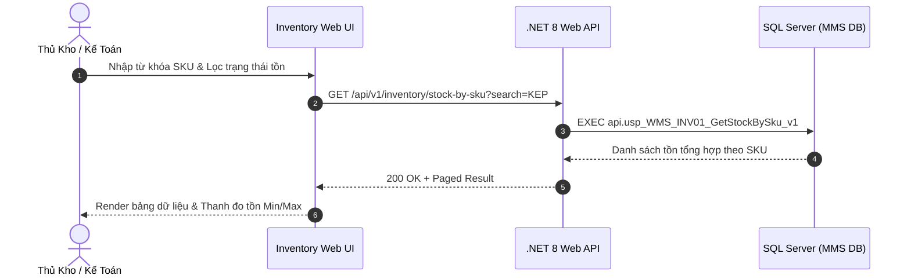

# Phân tích Thiết kế Logic UC-17 (INV-01) - Tra Cứu Tồn Kho Tổng Hợp Theo Mã Vật Tư (SKU)

Tài liệu này đi sâu vào phân tích và thiết kế hệ thống ở 5 khía cạnh bắt buộc: **Business Logic**, **UI/UX Guidelines**, **Programming Logic**, **Data Logic**, và **Diagrams (Mermaid)** dành cho chức năng **Tra Cứu Tồn Kho Theo SKU (INV-01)** của Thủ kho, Kế toán kho và Bộ phận Kế hoạch.

---

## 1. Business Logic (Logic Nghiệp Vụ)

- **Mục tiêu cốt lõi:** Cho phép tra cứu nhanh số lượng tồn kho tổng hợp của toàn bộ 17,476 danh mục SKU vật tư trong nhà máy (`tbl_dm_vattu`). Hệ thống tổng hợp realtime từ bảng chi tiết các Lô tồn kho khả dụng (`tbl_map_nhapkho` / `tbl_batch_inv`), phân tách rõ ràng: *Tổng tồn vật lý, Tồn khả dụng (QC Pass & On Rack), Tồn chờ kiểm định (QC Pending/Quarantine), Tồn đã được giữ chỗ cho các đơn xuất (Reserved)* và đối chiếu với hạn mức an toàn Min/Max.

- **Các quy tắc nghiệp vụ (Business Rules):**
  - `BR-INV-01-01` **Công thức tính tồn khả dụng (Available Stock Formula):**
    - `Tồn Khả Dụng (Available) = Tổng Tồn Vật Lý - Tồn QC Chưa Đạt - Tồn Giữ Chỗ (Reserved)`.
    - Chỉ các Lô có `status_qc IN ('PASS', 'PASS_CHO_NHAP')`, `status_kho IN ('STORED', 'ON_RACK')`, `so_luong > 0` mới được tính vào Tồn khả dụng cho phép xuất kho.
  - `BR-INV-01-02` **Cảnh báo tồn kho an toàn (Stock Safety Thresholds):**
    - `Cảnh báo Hết hàng / Dưới Min`: Nếu `TonKhaDung < Mức Min`, hệ thống gắn nhãn cảnh báo đỏ `🔴 DƯỚI ĐỊNH MỨC`.
    - `Cảnh báo Vượt Max`: Nếu `TongTon > Mức Max`, hệ thống gắn nhãn cảnh báo vàng `🟡 VƯỢT TRẦN LƯU KHO`.
  - `BR-INV-01-03` **Tra cứu đa tiêu chí (Smart Search Indexing):**
    - Tìm kiếm tức thời theo: Mã MMS (`id_vattu`), Mã Bravo (`id_bravo`), Tên quy cách vật tư, Nhóm vật tư, Phân xưởng sử dụng chính.

- **Quy trình tương tác 5 bước (Interaction Flow):**
  - **Bước 1:** Người dùng mở tab "Tồn Theo SKU" tại phân hệ Quản Lý Tồn Kho (`/inventory`).
  - **Bước 2:** Nhập từ khóa tìm kiếm (Mã VT / Tên VT) hoặc chọn bộ lọc Nhóm vật tư / Trạng thái tồn.
  - **Bước 3:** Hệ thống truy vấn nhanh `api.usp_WMS_INV01_GetStockBySku_v1` và hiển thị bảng dữ liệu phân trang.
  - **Bước 4:** Người dùng nhấn vào một dòng SKU để xem danh sách chi tiết các Lô con (Batches) và các vị trí Ô kệ đang lưu trữ SKU đó.
  - **Bước 5:** Người dùng có thể bấm "Xuất Excel" hoặc bấm "Xem Thẻ Kho" để đối soát biến động.

---

## 2. Tiêu chuẩn Thiết kế Giao diện (UI/UX Guidelines)

- **Thiết bị đích:** Máy tính Desktop Web & Tablet.
- **Yêu cầu trải nghiệm (UX Principles):**
  - **Bảng dữ liệu hiệu năng cao:** Hỗ trợ hiển thị mượt mà danh mục lớn (17,476 SKU) với công nghệ Paging 50 dòng/trang.
  - **Cột trạng thái trực quan:**
    - Cột mức tồn có thanh chỉ báo đồ họa (Mini Progress Gauge) thể hiện mức tồn hiện tại so với Min - Max.
    - Màu sắc: Xanh lá (An toàn), Vàng (Cận Min/Vượt Max), Đỏ (Hết hàng/Dưới Min).

---

## 3. Programming Logic (Logic Lập Trình)

### 3.1. Frontend Component (`InventorySkuTab.tsx`)
- **State Management & Query:**
```typescript
const [skuList, setSkuList] = useState<SkuStockSummary[]>([]);
const [searchKeyword, setSearchKeyword] = useState<string>('');
const [stockFilter, setStockFilter] = useState<'ALL' | 'LOW' | 'OUT' | 'NORMAL'>('ALL');
```

### 3.2. Backend API & Stored Procedure Execution
#### A. C# .NET 8 Web API
- **Endpoint:** `GET /api/v1/inventory/stock-by-sku`
#### B. SQL Stored Procedure (`api.usp_WMS_INV01_GetStockBySku_v1`)

---

## 4. Data Logic & Schema Model (Cấu Trúc Dữ Liệu)
- `dbo.tbl_dm_vattu`: Danh mục SKU vật tư.
- `dbo.tbl_map_nhapkho` / `dbo.tbl_batch_inv`: Dữ liệu tồn thực tế theo từng Lô.

---

## 5. Diagrams (Mermaid Sơ Đồ Luồng Nghiệp Vụ)

