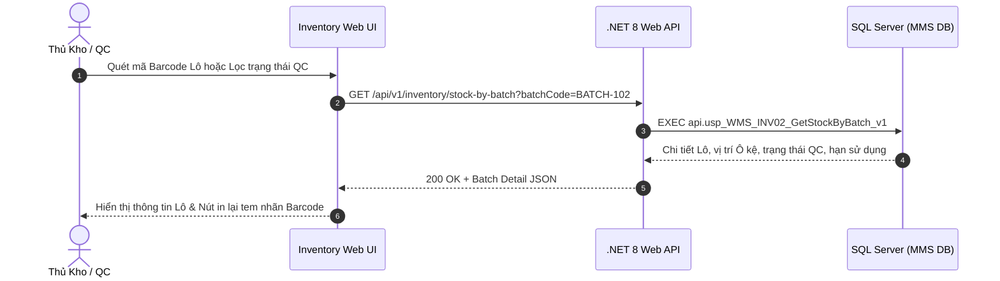

# Phân tích Thiết kế Logic UC-17 (INV-02) - Tra Cứu Tồn Kho Chi Tiết Theo Lô (Batch) & Hạn Sử Dụng

Tài liệu này đi sâu vào phân tích và thiết kế hệ thống ở 5 khía cạnh bắt buộc: **Business Logic**, **UI/UX Guidelines**, **Programming Logic**, **Data Logic**, và **Diagrams (Mermaid)** dành cho chức năng **Tra Cứu Tồn Kho Chi Tiết Theo Lô (INV-02)** của Thủ kho và KCS/QC.

---

## 1. Business Logic (Logic Nghiệp Vụ)

- **Mục tiêu cốt lõi:** Quản lý và truy vết toàn diện 11,665 Lô hàng tồn kho (`tbl_map_nhapkho` / `tbl_batch_inv`). Cung cấp thông tin định danh duy nhất của từng Lô: Mã Lô cha/Lô con (`id_nhapkho`), Mã SKU, Tên vật tư, Số lượng tồn, Vị trí Ô kệ chính xác (`id_vitri_khe`), Trạng thái chất lượng QC (`PASS`, `REJECT`, `PENDING`), Ngày nhập kho, Ngày sản xuất, Hạn sử dụng (Exp Date) và thông tin Nhà Cung Cấp.

- **Các quy tắc nghiệp vụ (Business Rules):**
  - `BR-INV-02-01` **Định danh duy nhất cấp Lô (Batch Unique ID):** Mỗi Lô tồn tại trong kho mang một mã định danh duy nhất (`id_nhapkho` hoặc `id_batch`) và gắn chặt với 1 mã vị trí Ô kệ duy nhất tại một thời điểm.
  - `BR-INV-02-02` **Truy vết trạng thái QC thời gian thực:**
    - Lô mang trạng thái `PASS` / `PASS_CHO_NHAP`: Sẵn sàng cho xuất kho hoặc điều chuyển.
    - Lô mang trạng thái `REJECT`: Tự động khóa xuất, yêu cầu chuyển vào Khu cách ly hoặc Trả NCC (`RET-01`).
    - Lô mang trạng thái `PENDING` / `WAIT_QC`: Đang chờ kiểm định, không được phép soạn hàng.
  - `BR-INV-02-03` **Cảnh báo tuổi thọ tồn kho (Shelf-life & Aging Alert):**
    - Cảnh báo Lô hàng sắp hết hạn (còn dưới 30 ngày).
    - Cảnh báo Lô hàng tồn đọng lâu ngày (Dead stock > 180 ngày không phát sinh giao dịch xuất).

- **Quy trình tương tác 5 bước (Interaction Flow):**
  - **Bước 1:** Người dùng mở tab "Tồn Theo Lô (Batch)" tại phân hệ Quản Lý Tồn Kho.
  - **Bước 2:** Nhập mã Lô (hoặc quét mã Barcode Lô) hoặc lọc theo Trạng thái QC / Vị trí Kệ / Tuổi Lô.
  - **Bước 3:** Hệ thống truy vấn `api.usp_WMS_INV02_GetStockByBatch_v1` và hiển thị danh sách chi tiết các Lô.
  - **Bước 4:** Người dùng chọn 1 Lô để xem Lịch sử biến động thẻ kho của Lô đó.
  - **Bước 5:** Hỗ trợ chức năng in lại tem nhãn Barcode Lô.

---

## 2. Tiêu chuẩn Thiết kế Giao diện (UI/UX Guidelines)

- **Thiết bị đích:** Máy tính Desktop Web & Thiết bị cầm tay Handheld PDA.
- **Yêu cầu trải nghiệm (UX Principles):**
  - **Badge trạng thái chất lượng sắc nét:**
    - `PASS`: Badge xanh lá đậm (`bg-emerald-100 text-emerald-800`).
    - `REJECT`: Badge đỏ (`bg-rose-100 text-rose-800`).
    - `PENDING`: Badge vàng cam (`bg-amber-100 text-amber-800`).

---

## 3. Programming Logic (Logic Lập Trình)

### 3.1. Frontend Component (`InventoryBatchTab.tsx`)
### 3.2. Backend API & Stored Procedure Execution
- **Endpoint:** `GET /api/v1/inventory/stock-by-batch`
- **SP:** `api.usp_WMS_INV02_GetStockByBatch_v1`

---

## 4. Data Logic & Schema Model (Cấu Trúc Dữ Liệu)
- `dbo.tbl_map_nhapkho`: Quản lý tồn chi tiết từng Lô.
- `dbo.tbl_dm_vattu`: Thông tin SKU.
- `dbo.tbl_dm_vitri_khe`: Thông tin Ô kệ.

---

## 5. Diagrams (Mermaid Sơ Đồ Luồng Nghiệp Vụ)

