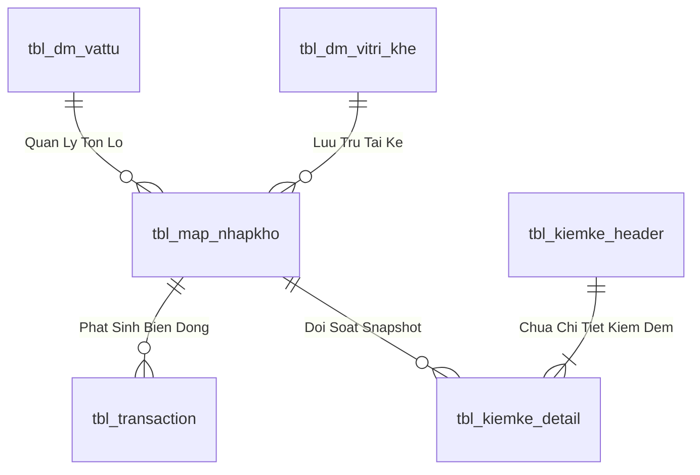
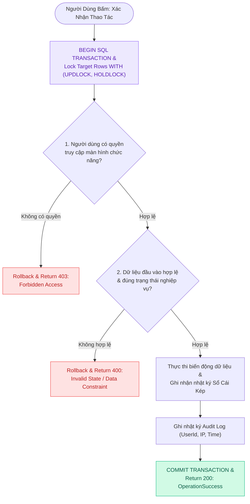
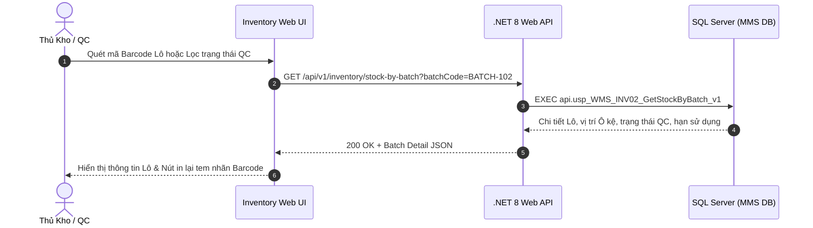

# Phân tích Thiết kế Logic UC-17 (INV-02) - Tra Cứu Tồn Kho Chi Tiết Theo Lô (Batch) & Hạn Sử Dụng

Tài liệu này đi sâu vào phân tích và thiết kế hệ thống ở 5 khía cạnh bắt buộc: **Business Logic**, **UI/UX Guidelines**, **Programming Logic**, **Data Logic**, và **Diagrams (Mermaid)** dành cho chức năng **Tra Cứu Tồn Kho Chi Tiết Theo Lô (INV-02)** của Thủ kho và KCS/QC.

---

## 1. Business Logic (Logic Nghiệp Vụ)

- **Mục tiêu cốt lõi:** Đảm bảo thực thi quy trình nghiệp vụ chuẩn hóa, kiểm soát tính toàn vẹn của dữ liệu và tuân thủ các quy định vận hành kho vật tư & sản xuất của nhà máy Kềm Nghĩa.

- **Các quy tắc nghiệp vụ (Business Rules):**
  - `BR-GEN-01` **Ràng buộc xác thực & Phân quyền (Security & Access Control):** Người dùng bắt buộc phải có phiên đăng nhập hợp lệ và quyền màn hình tương ứng trong `api.vw_SEC_UserScreenAccess_v1`.
  - `BR-GEN-02` **Kiểm tra tính toàn vẹn dữ liệu đầu vào (Input Validation):** Mọi tham số gửi lên API đều phải được chuẩn hóa, trim khoảng trắng và kiểm tra định dạng trước khi thực thi.
  - `BR-GEN-03` **Tính nguyên tử của giao dịch (Atomic Transaction):** Mọi thao tác ghi biến động đều được thực thi trong khối `BEGIN TRANSACTION` với `SET XACT_ABORT ON`, tự động Rollback khi có lỗi.
  - `BR-GEN-04` **Khóa đồng thời chống xung đột dữ liệu (Concurrency Control):** Áp dụng gợi ý khóa `WITH (UPDLOCK, HOLDLOCK)` trên các bảng dữ liệu trọng yếu.
  - `BR-GEN-05` **Hạch toán biến động vào Sổ Cái Kép (Dual Ledger Posting):** Mọi biến động kho đều được ghi nhận vào sổ chi tiết `tbl_transaction` và cập nhật thẻ kho tổng hợp.
  - `BR-GEN-06` **Đồng bộ thời gian thực (Realtime Synchronization):** Đảm bảo tính nhất quán dữ liệu giữa Desktop Web, Handheld PDA và TV Wallboard.
  - `BR-GEN-07` **Ghi vết nhật ký kiểm toán (Audit Trail):** Tự động lưu vết người thực hiện, thời gian, IP và thiết bị cho mọi giao dịch quan trọng.

- **Quy trình tương tác 5 bước (Interaction Flow):**
  - **Bước 1:** Người dùng truy cập phân hệ chức năng tương ứng trên giao diện Web / PDA.
  - **Bước 2:** Nhập liệu các trường thông tin bắt buộc hoặc quét mã Barcode từ thiết bị.
  - **Bước 3:** Frontend validate client-side và gửi request API kèm Token xác thực.
  - **Bước 4:** Backend kiểm tra Fail-fast (Verify JWT $
ightarrow$ Verify Screen Permission $
ightarrow$ Validate Business Rules $
ightarrow$ Execute SQL Stored Procedure trong khối Transaction).
  - **Bước 5:** Backend cập nhật CSDL và trả về kết quả; Frontend hiển thị thông báo thành công, phát âm thanh phản hồi và cập nhật giao diện.

---

## 2. Tiêu chuẩn Thiết kế Giao diện (UI/UX Guidelines)

- **Thiết bị đích:** Máy tính Desktop Web & Thiết bị cầm tay Handheld PDA.
- **Yêu cầu trải nghiệm (UX Principles):**
  - **Badge trạng thái chất lượng sắc nét:**
    - `PASS`: Badge xanh lá đậm (`bg-emerald-100 text-emerald-800`).
    - `REJECT`: Badge đỏ (`bg-rose-100 text-rose-800`).
    - `PENDING`: Badge vàng cam (`bg-amber-100 text-amber-800`).

---

## 3. Programming Logic (Logic Lập Trình)

Quy trình xử lý mã lệnh được chia thành 2 lớp rõ rệt: **Frontend (React)** và **Backend (ASP.NET Core kết hợp SQL Stored Procedure)**.

### 3.1. Frontend (React - Component View)
- **State Management & Local Processing:**
  - Gọi API kéo dữ liệu cần thiết vào React State.
  - Sử dụng các hàm mảng JavaScript (`filter`, `map`, `reduce`) để xử lý gom nhóm, lọc tìm kiếm in-memory, tối ưu hóa băng thông và tạo trải nghiệm mượt mà không độ trễ.
- **UI Interaction & Ergonomics:**
  - Sử dụng cấu trúc Collapse / Accordion / Modal xem trước để tối ưu không gian hiển thị trên màn hình Handheld PDA và Desktop Web.

### 3.2. Backend (ASP.NET Core & SQL Server Stored Procedure)
- **Thin API Gateway Pattern:**
  - ASP.NET Core Minimal API / Controller không xử lý logic tính toán nghiệp vụ mà chỉ làm cổng Gateway mỏng (Xác thực JWT Cookie, kiểm tra quyền màn hình `vw_SEC_UserScreenAccess_v1`) và ủy thác toàn bộ cho SQL Server Stored Procedure.
- **Tận Dụng Multi-Result Set & ACID Transaction:**
  - SQL Stored Procedure trả về đồng thời nhiều Result Sets (Header info, Summary KPIs, Detailed Lines) trong một lần truy vấn duy nhất.
  - Các lệnh ghi dữ liệu áp dụng `SET XACT_ABORT ON`, `BEGIN TRANSACTION` và khóa dòng dữ liệu `WITH (UPDLOCK, HOLDLOCK)` đảm bảo an toàn tuyệt đối.

---

## 4. Data Logic (Thiết kế Dữ Liệu)

### 4.1. Ma trận phân quyền CRUD

| Bảng / Thực thể Dữ Liệu | Create (Tạo) | Read (Đọc) | Update (Cập nhật) | Delete (Xóa) | Ý nghĩa nghiệp vụ trong Use Case |
| :--- | :---: | :---: | :---: | :---: | :--- |
| `dbo.tbl_map_nhapkho` (Lô Mẹ) | - | **X** | **X** | - | Đọc thông tin Lô gốc, Cập nhật trừ số lượng tách (`so_luong = so_luong - @SplitQty`) |
| `dbo.tbl_map_nhapkho` (Lô Con) | **X** | **X** | - | - | Sinh bản ghi Lô con mới (`parent_batch_id = Id_Lo_Me`, `status_qc = 'PASS'`) |
| `dbo.tbl_dm_vitri_khe` | - | **X** | **X** | - | Đọc vị trí Ô kệ, Cập nhật trạng thái khóa/mở khóa bảo trì |
| `dbo.tbl_kiemke_header` | **X** | **X** | **X** | - | Tạo đợt kiểm kê, Cập nhật trạng thái `status = 'IN_PROGRESS' / 'RECONCILED'` |
| `dbo.tbl_kiemke_detail` | **X** | **X** | **X** | - | Ghi nhận số thực đếm `actual_qty`, tính toán độ lệch `variance` |
| `dbo.tbl_transaction` | **X** | **X** | - | - | Ghi nhận bút toán biến động (`SPLIT_BATCH`, `TRANSFER`, `ADJUST_COUNT`) |
| `dbo.audit_log` | **X** | **X** | - | - | Ghi vết kiểm toán lịch sử tách Lô và chốt sổ cái kiểm kê |

### 4.2. Định nghĩa Trạng thái (Conceptual State Model)

| Cột / Biến | Kiểu Dữ Liệu | Giá Trị Sau Confirm | Ý nghĩa Nghiệp vụ |
| :--- | :--- | :--- | :--- |
| `parent_batch_id` (trong `tbl_map_nhapkho`) | `INT` | `ID_Lo_Me` | Liên kết phả hệ Lô Mẹ - Lô Con trong Cây Gia Phả (Genealogy Tree) |
| `status` (trong `tbl_kiemke_header`) | `NVARCHAR(20)` | `'IN_PROGRESS'` / `'RECONCILED'` | Trạng thái kỳ kiểm kê (Đang đếm mù thực địa / Đã chốt điều chỉnh Sổ Cái) |
| `trang_thai_ton` (trong `tbl_batch_inv`) | `NVARCHAR(10)` | `'1'` (`'AVAILABLE'`) | Tồn kho vật lý sẵn sàng cho xuất hàng / phân bổ |
| `status_qc` (trong `tbl_map_nhapkho`) | `VARCHAR(20)` | `'PASS'` | Trạng thái chất lượng đạt chuẩn |
| `status_kho` (trong `tbl_map_nhapkho`) | `VARCHAR(20)` | `'STORED'` | Đã lưu kho chính thức trên dầm kệ |

### 4.3. Data Layer Architecture (Data Flow & Transaction Locking)

- **Bảng Quản Lý Tồn Lô (`dbo.tbl_map_nhapkho` / `dbo.tbl_batch_inv`):**
  - Khóa chính: `id_nhapkho` (INT IDENTITY, Clustered Index).
  - Tự tham chiếu Lô Mẹ: `parent_batch_id` (INT NULL) phục vụ dựng Cây Gia Phả.
  - Vị trí Ô kệ: `id_vitri_khe` (VARCHAR(20), FK).
  - Trạng thái kiểm định: `status_qc` (`'PASS'`, `'REJECT'`, `'PENDING'`).
  - Trạng thái lưu kho: `status_kho` (`'STORED'`, `'ON_RACK'`, `'QUARANTINE'`).
  - Chỉ mục: `IX_tbl_map_nhapkho_vattu` on `(id_vattu, status_qc, status_kho) INCLUDE (so_luong, id_vitri_khe)`.

### 4.2. Data Layer Architecture (Data Flow & Transaction Locking)

---

## 5. Diagrams (Mermaid Sơ Đồ Luồng Nghiệp Vụ)

