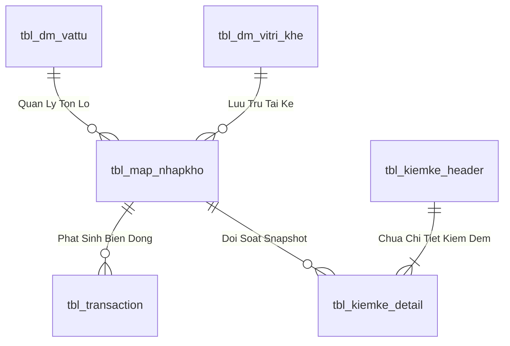
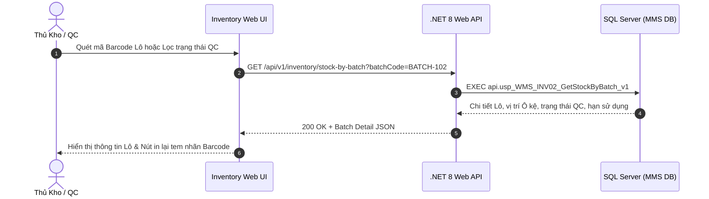

# Phân tích Thiết kế Logic UC-17 (INV-02) - Tra Cứu Tồn Kho Chi Tiết Theo Lô (Batch) & Hạn Sử Dụng

Tài liệu này đi sâu vào phân tích và thiết kế hệ thống ở 5 khía cạnh bắt buộc: **Business Logic**, **UI/UX Guidelines**, **Programming Logic**, **Data Logic**, và **Diagrams (Mermaid)** dành cho chức năng **Tra Cứu Tồn Kho Chi Tiết Theo Lô (INV-02)** của Thủ kho và KCS/QC.

---

## 1. Business Logic (Logic Nghiệp Vụ)

- **Mục tiêu cốt lõi:** Quản lý và truy vết toàn diện 11,665 Lô hàng tồn kho (`tbl_map_nhapkho` / `tbl_batch_inv`). Cung cấp thông tin định danh duy nhất của từng Lô: Mã Lô cha/Lô con (`id_nhapkho`), Mã SKU, Tên vật tư, Số lượng tồn, Vị trí Ô kệ chính xác (`id_vitri_khe`), Trạng thái chất lượng QC (`PASS`, `REJECT`, `PENDING`), Ngày nhập kho, Ngày sản xuất, Hạn sử dụng (Exp Date) và thông tin Nhà Cung Cấp.

- **Các quy tắc nghiệp vụ (Business Rules):**
  - `BR-INV-02-01` **Định danh duy nhất cấp Lô (Batch Unique ID):** Mỗi Lô tồn tại trong kho mang một mã định danh duy nhất (`id_nhapkho` hoặc `id_batch`) và gắn chặt với 1 mã vị trí Ô kệ duy nhất tại một thời điểm.
  - `BR-INV-02-02` **Truy vết trạng thái QC thời gian thực:**
    - Lô mang trạng thái `PASS` / `PASS_CHO_NHAP`: Sẵn sàng cho xuất kho hoặc điều chuyển.
    - Lô mang trạng thái `REJECT`: Tự động khóa xuất, yêu cầu chuyển vào Khu cách ly hoặc Trả NCC (`RET-01`).
    - Lô mang trạng thái `PENDING` / `WAIT_QC`: Đang chờ kiểm định, không được phép soạn hàng.
  - `BR-INV-02-03` **Cảnh báo tuổi thọ tồn kho (Shelf-life & Aging Alert):**
    - Cảnh báo Lô hàng sắp hết hạn (còn dưới 30 ngày).
    - Cảnh báo Lô hàng tồn đọng lâu ngày (Dead stock > 180 ngày không phát sinh giao dịch xuất).

- **Quy trình tương tác 5 bước (Interaction Flow):**
  - **Bước 1:** Người dùng mở tab "Tồn Theo Lô (Batch)" tại phân hệ Quản Lý Tồn Kho.
  - **Bước 2:** Nhập mã Lô (hoặc quét mã Barcode Lô) hoặc lọc theo Trạng thái QC / Vị trí Kệ / Tuổi Lô.
  - **Bước 3:** Hệ thống truy vấn `api.usp_WMS_INV02_GetStockByBatch_v1` và hiển thị danh sách chi tiết các Lô.
  - **Bước 4:** Người dùng chọn 1 Lô để xem Lịch sử biến động thẻ kho của Lô đó.
  - **Bước 5:** Hỗ trợ chức năng in lại tem nhãn Barcode Lô.

---

## 2. Tiêu chuẩn Thiết kế Giao diện (UI/UX Guidelines)

- **Thiết bị đích:** Máy tính Desktop Web & Thiết bị cầm tay Handheld PDA.
- **Yêu cầu trải nghiệm (UX Principles):**
  - **Badge trạng thái chất lượng sắc nét:**
    - `PASS`: Badge xanh lá đậm (`bg-emerald-100 text-emerald-800`).
    - `REJECT`: Badge đỏ (`bg-rose-100 text-rose-800`).
    - `PENDING`: Badge vàng cam (`bg-amber-100 text-amber-800`).

---

## 3. Programming Logic (Logic Lập Trình)

Quy trình xử lý mã lệnh được chia thành 2 lớp rõ rệt: **Frontend (React)** và **Backend (ASP.NET Core kết hợp SQL Stored Procedure)**.

### 3.1. Frontend (React - Component View)
- **State Management & Local Processing:**
  - Gọi API kéo dữ liệu cần thiết vào React State.
  - Sử dụng các hàm mảng JavaScript (`filter`, `map`, `reduce`) để xử lý gom nhóm, lọc tìm kiếm in-memory, tối ưu hóa băng thông và tạo trải nghiệm mượt mà không độ trễ.
- **UI Interaction & Ergonomics:**
  - Sử dụng cấu trúc Collapse / Accordion / Modal xem trước để tối ưu không gian hiển thị trên màn hình Handheld PDA và Desktop Web.

### 3.2. Backend (ASP.NET Core & SQL Server Stored Procedure)
- **Thin API Gateway Pattern:**
  - ASP.NET Core Minimal API / Controller không xử lý logic tính toán nghiệp vụ mà chỉ làm cổng Gateway mỏng (Xác thực JWT Cookie, kiểm tra quyền màn hình `vw_SEC_UserScreenAccess_v1`) và ủy thác toàn bộ cho SQL Server Stored Procedure.
- **Tận Dụng Multi-Result Set & ACID Transaction:**
  - SQL Stored Procedure trả về đồng thời nhiều Result Sets (Header info, Summary KPIs, Detailed Lines) trong một lần truy vấn duy nhất.
  - Các lệnh ghi dữ liệu áp dụng `SET XACT_ABORT ON`, `BEGIN TRANSACTION` và khóa dòng dữ liệu `WITH (UPDLOCK, HOLDLOCK)` đảm bảo an toàn tuyệt đối.

---

## 4. Data Logic & Schema Model (Thiết kế Dữ Liệu Chuyên Sâu)

### 4.1. Entity Relationship Diagram (ERD) & Schema Details

- **Bảng Quản Lý Tồn Lô (`dbo.tbl_map_nhapkho` / `dbo.tbl_batch_inv`):**
  - Khóa chính: `id_nhapkho` (INT IDENTITY, Clustered Index).
  - Tự tham chiếu Lô Mẹ: `parent_batch_id` (INT NULL) phục vụ dựng Cây Gia Phả.
  - Vị trí Ô kệ: `id_vitri_khe` (VARCHAR(20), FK).
  - Trạng thái kiểm định: `status_qc` (`'PASS'`, `'REJECT'`, `'PENDING'`).
  - Trạng thái lưu kho: `status_kho` (`'STORED'`, `'ON_RACK'`, `'QUARANTINE'`).
  - Chỉ mục: `IX_tbl_map_nhapkho_vattu` on `(id_vattu, status_qc, status_kho) INCLUDE (so_luong, id_vitri_khe)`.

### 4.2. Data Flow & Transaction Locking Matrix
- **Khóa giao dịch Tách Lô / Chuyển vị trí:** Sử dụng `WITH (UPDLOCK, HOLDLOCK)` trên Lô nguồn để bảo toàn nguyên lý bảo toàn tổng sản lượng `TonLoMe = TonLoCon + TonDu`.
- **Khóa kiểm kê chốt sổ:** Áp dụng mức cô lập `SERIALIZABLE` với `WITH (TABLOCKX)` khi thực thi lệnh chốt chênh lệch `ADJUST_COUNT` để đảm bảo không bị xung đột với các giao dịch xuất nhập hàng ngày.

### 4.3. Conceptual State Model & Transition Rules
| Trạng Thái Lô | Sự Kiện Kích Hoạt | Trạng Thái Sau | Tác Động Sổ Cái |
| :--- | :--- | :--- | :--- |
| **Lô Mẹ F0 (1,000 cái)** | Tách Lô con 400 cái (INV-06) | Lô Mẹ: 600 cái, Lô Con: 400 cái | Ghi `tbl_transaction` (`SPLIT_BATCH`) |
| **Kệ K01 (Lô A)** | Điều chuyển sang Kệ K02 (INV-03) | Vị trí mới = K02 | Ghi `tbl_transaction` (`TRANSFER`) |
| **Snapshot Sổ Sách** | Chốt lệch kiểm kê (INV-09) | Điều chỉnh tồn = Thực đếm | Ghi `tbl_transaction` (`ADJUST_COUNT`) |

---

## 5. Diagrams (Mermaid Sơ Đồ Luồng Nghiệp Vụ)

