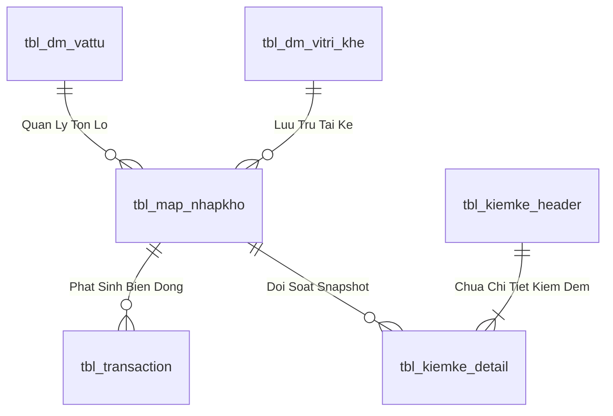
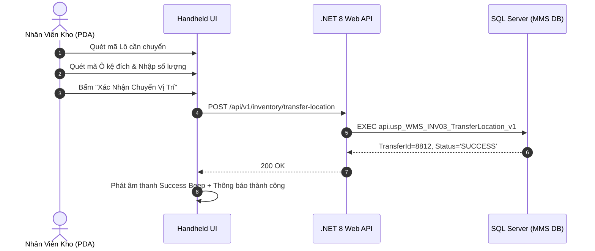

# Phân tích Thiết kế Logic UC-17 (INV-03) - Điều Chuyển Vị Trí Tồn Kho Nội Bộ Giữa Các Ô Kệ (Location Transfer)

Tài liệu này đi sâu vào phân tích và thiết kế hệ thống ở 5 khía cạnh bắt buộc: **Business Logic**, **UI/UX Guidelines**, **Programming Logic**, **Data Logic**, và **Diagrams (Mermaid)** dành cho chức năng **Điều Chuyển Vị Trí Nội Bộ (INV-03)** của Thủ kho / Nhân viên PDA.

---

## 1. Business Logic (Logic Nghiệp Vụ)

- **Mục tiêu cốt lõi:** Cho phép nhân viên kho di chuyển một phần hoặc toàn bộ số lượng của Lô hàng từ Ô kệ nguồn (`Source Location`) sang Ô kệ đích (`Target Location`) nhằm tối ưu hóa không gian lưu trữ, gom hàng lẻ hoặc phục vụ bảo trì sửa chữa kệ. Hệ thống ghi nhận lịch sử điều chuyển tức thời vào bảng `tbl_transaction` (`nghiep_vu = 'TRANSFER'`) và cập nhật vị trí mới trong `tbl_map_nhapkho`.

- **Các quy tắc nghiệp vụ (Business Rules):**
  - `BR-INV-03-01` **Kiểm tra tính khả dụng của Ô kệ đích:** Ô kệ đích phải hợp lệ, không bị khóa, còn sức chứa.
  - `BR-INV-03-02` **Tính nguyên tử của giao dịch chuyển kệ:** Cập nhật vị trí Lô hoặc Tách Lô con chuyển vị trí, ghi nhận nhật ký `tbl_transaction` (`nghiep_vu = 'TRANSFER'`).

- **Quy trình tương tác 5 bước (Interaction Flow):**
  - **Bước 1:** Nhân viên mở phân hệ "Chuyển Vị Trí / Transfer" trên PDA hoặc Web.
  - **Bước 2:** Quét mã vạch Ô kệ nguồn hoặc quét mã Lô cần chuyển.
  - **Bước 3:** Nhập số lượng cần chuyển và quét mã Barcode Ô kệ đích.
  - **Bước 4:** Bấm **"Xác Nhận Chuyển Vị Trí"**. Backend gọi `api.usp_WMS_INV03_TransferLocation_v1`.
  - **Bước 5:** Hệ thống cập nhật vị trí mới trong CSDL, phát âm thanh thành công.

---

## 2. Tiêu chuẩn Thiết kế Giao diện (UI/UX Guidelines)
- Luồng quét 3 bước mượt mà: Quét Lô $
ightarrow$ Nhập số lượng $
ightarrow$ Quét Kệ đích.

---

## 3. Programming Logic (Logic Lập Trình)
- **Endpoint:** `POST /api/v1/inventory/transfer-location`
- **SP:** `api.usp_WMS_INV03_TransferLocation_v1`

---

## 4. Data Logic & Schema Model (Thiết kế Dữ Liệu Chuyên Sâu)

### 4.1. Entity Relationship Diagram (ERD) & Schema Details

- **Bảng Quản Lý Tồn Lô (`dbo.tbl_map_nhapkho` / `dbo.tbl_batch_inv`):**
  - Khóa chính: `id_nhapkho` (INT IDENTITY, Clustered Index).
  - Tự tham chiếu Lô Mẹ: `parent_batch_id` (INT NULL) phục vụ dựng Cây Gia Phả.
  - Vị trí Ô kệ: `id_vitri_khe` (VARCHAR(20), FK).
  - Trạng thái kiểm định: `status_qc` (`'PASS'`, `'REJECT'`, `'PENDING'`).
  - Trạng thái lưu kho: `status_kho` (`'STORED'`, `'ON_RACK'`, `'QUARANTINE'`).
  - Chỉ mục: `IX_tbl_map_nhapkho_vattu` on `(id_vattu, status_qc, status_kho) INCLUDE (so_luong, id_vitri_khe)`.

### 4.2. Data Flow & Transaction Locking Matrix
- **Khóa giao dịch Tách Lô / Chuyển vị trí:** Sử dụng `WITH (UPDLOCK, HOLDLOCK)` trên Lô nguồn để bảo toàn nguyên lý bảo toàn tổng sản lượng `TonLoMe = TonLoCon + TonDu`.
- **Khóa kiểm kê chốt sổ:** Áp dụng mức cô lập `SERIALIZABLE` với `WITH (TABLOCKX)` khi thực thi lệnh chốt chênh lệch `ADJUST_COUNT` để đảm bảo không bị xung đột với các giao dịch xuất nhập hàng ngày.

### 4.3. Conceptual State Model & Transition Rules
| Trạng Thái Lô | Sự Kiện Kích Hoạt | Trạng Thái Sau | Tác Động Sổ Cái |
| :--- | :--- | :--- | :--- |
| **Lô Mẹ F0 (1,000 cái)** | Tách Lô con 400 cái (INV-06) | Lô Mẹ: 600 cái, Lô Con: 400 cái | Ghi `tbl_transaction` (`SPLIT_BATCH`) |
| **Kệ K01 (Lô A)** | Điều chuyển sang Kệ K02 (INV-03) | Vị trí mới = K02 | Ghi `tbl_transaction` (`TRANSFER`) |
| **Snapshot Sổ Sách** | Chốt lệch kiểm kê (INV-09) | Điều chỉnh tồn = Thực đếm | Ghi `tbl_transaction` (`ADJUST_COUNT`) |

---

## 5. Diagrams (Mermaid Sơ Đồ Luồng Nghiệp Vụ)

