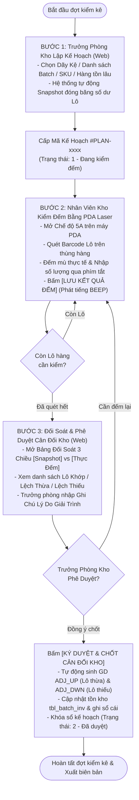
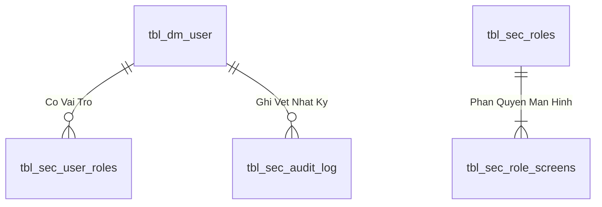

# TÀI LIỆU QUY TRÌNH NGHIỆP VỤ: KIỂM KÊ TỒN KHO THEO LÔ (BATCH AUDIT)
## MÃ QUY TRÌNH: MMS-WMS-SOP-INV-06 | USE CASE: UC-18 (PHIÊN BẢN 2.0)

---

| Thông Tin Tài Liệu | Chi Tiết |
| :--- | :--- |
| **Hệ thống áp dụng** | Hệ Thống Quản Lý Kho & Sản Xuất (MMS WMS) |
| **Phân hệ** | Quản Lý Tồn Kho - Kiểm Kê Theo Lô (Batch Inventory Audit / INV-06) |
| **Đối tượng xem & phê duyệt** | Trưởng Phòng Kho, Quản Lý Kho, Thủ Kho, Kế Toán Kho, Ban Giám Đốc |
| **Mục đích tài liệu** | Thuyết minh quy trình vận hành kiểm kê theo từng Lô (Batch ID) 3 cấp: Trưởng phòng kho lập kế hoạch & snapshot số dư ➔ Nhân viên dùng PDA quét laser đếm mù hiện trường ➔ Trưởng phòng kho trực tiếp đối soát 3 chiều, ghi chú lý do giải trình và ký duyệt chốt cân đối kho tự động (ADJ_UP / ADJ_DWN). |

---

## 1. MỤC ĐÍCH & PHẠM VI ÁP DỤNG

### 1.1. Mục đích
- **Kiểm soát chính xác đến từng Lô (`id_batch`)**: Đảm bảo số lượng, vị trí ô kệ và hạn lưu kho của từng Lô hàng vật lý khớp 100% với dữ liệu hệ thống.
- **Minh bạch và khách quan qua Kiểm Đếm Mù (Blind Count)**: Nhân viên quét PDA tại hiện trường không nhìn thấy trước số tồn sổ sách, triệt tiêu hoàn toàn tình trạng đếm ẩu hoặc xác nhận khống.
- **Phân định rõ ràng trách nhiệm 3 cấp**:
  1. *Trưởng phòng kho*: Khảo sát, chọn lọc phạm vi Lô và phát lệnh kiểm kê (Snapshot đóng băng số dư).
  2. *Nhân viên kho*: Quét mã vạch Barcode dán trên thùng, đếm thực tế hiện trường và lưu log.
  3. *Trưởng phòng kho*: Phê duyệt chốt số lệch, nhập lý do giải trình chi tiết và ký duyệt cân đối kho.
- **Tự động hóa cân đối kho & Truy vết giao dịch**: Hệ thống tự động sinh giao dịch điều chỉnh tăng (`ADJ_UP`) cho Lô thừa hoặc giảm (`ADJ_DWN`) cho Lô thiếu, ghi nhận mã phiếu giao dịch và người thực hiện đích danh.

### 1.2. Phạm vi áp dụng
- Áp dụng cho toàn bộ hoạt động kiểm kê định kỳ, kiểm kê đột xuất hoặc kiểm kê theo chuyên đề (Lô lưu kho lâu ngày, Lô giá trị cao, Lô theo dãy kệ).
- Thực hiện trên **Giao diện Web Quản Trị** (dành cho Trưởng phòng kho & Thủ kho) và **Giao diện Thiết bị Cầm tay PDA** (dành cho Nhân viên kiểm đếm).

---

## 2. MA TRẬN PHÂN QUYỀN TRÁCH NHIỆM (RACI MATRIX)

| Hoạt Động Nghiệp Vụ | Trưởng Phòng Kho | Nhân Viên Kho (PDA) | Thủ Kho | Kế Toán Kho | Hệ Thống MMS WMS |
| :--- | :---: | :---: | :---: | :---: | :---: |
| **1. Khảo sát & Tạo Kế Hoạch Kiểm Kê** | **A / R** (Chịu TN & Lập) | **I** (Theo dõi) | **C** (Phối hợp) | **I** | **A** (Snapshot tự động) |
| **2. Quét Barcode & Đếm Mù Hiện Trường** | **A** (Giám sát) | **R** (Thực hiện PDA) | **I** | **I** | **S** (Ghi log đích danh) |
| **3. Đối Soát Số Liệu 3 Chiều** | **A / R** (Đánh giá) | **I** | **R** (Đối soát kho) | **C** (Tham vấn) | **A** (Tự động tính độ lệch $\Delta Q$) |
| **4. Nhập Biên Bản Lý Do Giải Trình Lệch** | **A / R** (Ghi chú duyệt) | **I** | **R** (Giải trình thực địa) | **C** | **S** (Lưu trữ lịch sử) |
| **5. Ký Duyệt & Chốt Cân Đối Tồn Kho** | **A / R** (Ký duyệt chính thức) | **I** | **I** | **I** (Nhận báo cáo) | **A** (Sinh GD `ADJ_UP`/`ADJ_DWN`) |

*Ghi chú:* **A** (Accountable - Chịu trách nhiệm chính/Duyệt) | **R** (Responsible - Người thực hiện) | **C** (Consulted - Tham vấn) | **I** (Informed - Nhận thông tin) | **S** (System - Hệ thống tự động).

---

## 3. CÁC ĐỊNH NGHĨA & CÔNG THỨC NGHIỆP VỤ

### 3.1. Các chỉ số đối soát số lượng
1. **Số lượng Snapshot ($Q_{\text{snap}}$):** Số lượng tồn sổ sách của từng Lô tại đúng thời điểm Trưởng phòng kho bấm phát lệnh tạo kế hoạch kiểm kê. Số liệu này được đóng băng bất biến làm mốc chuẩn.
2. **Số lượng Thực đếm ($Q_{\text{act}}$):** Tổng số lượng đếm được do nhân viên kho quét tem mã vạch và nhập từ thiết bị PDA tại hiện trường.
3. **Số lượng Tồn hiện hành ($Q_{\text{curr}}$):** Số lượng tồn thực tế đang ghi nhận tại bảng `tbl_batch_inv` tại thời điểm đối soát (để phát hiện nếu có giao dịch xuất/nhập phát sinh ngoài ý muốn trong ca kiểm).
4. **Độ lệch kiểm kê ($\Delta Q$):**
   $$\Delta Q = Q_{\text{act}} - Q_{\text{snap}}$$

### 3.2. Quy tắc phân loại & Xử lý chênh lệch
* **Lô Khớp Chuẩn ($\Delta Q = 0$):** Số lượng đếm thực tế trùng khớp 100% với số dư snapshot. Trạng thái: ✅ `KHOP`.
* **Lô Lệch Thừa ($\Delta Q > 0$):** Số lượng đếm thực tế nhiều hơn snapshot. 
  - *Xử lý:* Trưởng phòng kho ghi chú lý do giải trình (VD: Dán nhầm tem, nhập dư, xuất hủy chưa thực hiện...) ➔ Hệ thống tự động sinh giao dịch **`ADJ_UP`** tăng tồn Lô.
* **Lô Lệch Thiếu ($\Delta Q < 0$):** Số lượng đếm thực tế ít hơn snapshot.
  - *Xử lý:* Trưởng phòng kho ghi chú lý do giải trình (VD: Hao hụt bao bì rách, thất thoát, xuất kho chưa trừ phiếu...) ➔ Hệ thống tự động sinh giao dịch **`ADJ_DWN`** giảm tồn Lô.

---

## 4. QUY TRÌNH THỰC HIỆN CHI TIẾT (3 BƯỚC NGHIỆP VỤ)

---

### 🔹 Giai đoạn 1: Trưởng Phòng Kho Lập Kế Hoạch & Snapshot Số Dư
1. Trưởng phòng kho truy cập hệ thống MMS WMS tại mục **Tồn Kho ➔ Tab [🔍 Kiểm Kê Theo Lô (UC-18)]**.
2. Nhấn nút **`[+ Tạo Kế Hoạch Kiểm Kê Lô]`**, lựa chọn 1 trong 4 phương thức gom Lô:
   * **Theo Dãy Kệ (Location Prefix)**: Nhập tiền tố ô kệ (VD: `01-` cho toàn bộ Dãy A).
   * **Theo Danh Sách Batch Cụ Thể**: Nhập hoặc dán danh sách mã Lô `#12791, #12792, #12854...`
   * **Theo Mã Vật Tư**: Nhập mã SKU cần kiểm toàn bộ các lô tồn kho.
   * **Theo Tuổi Hàng Lô (Aging)**: Lọc các lô hàng lưu kho trên 90 hoặc 180 ngày chưa có biến động.
3. Nhập tên đợt kiểm, ghi chú mục đích và nhấn **`[Tạo & Snapshot Số Dư]`**.
4. Hệ thống đóng băng số lượng tồn của toàn bộ các Lô thỏa điều kiện và cấp mã `#PLAN-xxxx`.

---

### 🔹 Giai đoạn 2: Nhân Viên Kho Quét Barcode & Đếm Mù Hiện Trường (PDA)
1. Nhân viên cầm máy quét PDA Laser, truy cập **Chế độ 5A: Quét Kiểm Kê Lô (Batch)**.
2. Chọn kế hoạch đang mở từ danh sách.
3. Tiến hành kiểm đếm tại hiện trường:
   - **Quét Barcode Lô**: Bắn tia laser vào mã vạch tem dán trên thùng hàng. Máy quét phát âm thanh `BEEP` nhận diện đúng Lô thuộc kế hoạch.
   - **Đếm Mù Khách Quan**: Giao diện chỉ hiển thị Mã Lô, Mã Vật Tư, Tên Vật Tư và Đơn vị tính; hoàn toàn ẩn trường số lượng tồn sổ sách.
   - **Nhập Số Lượng Đếm**: Nhân viên nhập số lượng thực tế đếm được, sử dụng bàn phím số nhanh `+1`, `+5`, `+10`, `+50`, `+100`.
   - **Ghi Nhận**: Bấm nút **`[LƯU KẾT QUẢ ĐẾM]`**. Hệ thống tự động ghi nhật ký vào `tbl_kiemke_batch_log` gắn liền với `User ID` nhân viên thao tác.

---

### 🔹 Giai đoạn 3: Trưởng Phòng Kho Đối Soát, Giải Trình & Ký Duyệt Chốt Cân Đối Kho
1. Trưởng phòng kho và Thủ kho mở chi tiết kế hoạch kiểm kê trên giao diện Web.
2. Kiểm tra **Bảng Đối Soát 3 Chiều**:
   * Xem tiến độ đếm (% Lô đã hoàn thành).
   * Lọc xem danh sách các Lô bị **Lệch Thiếu (❌)**, **Lệch Thừa (🔺)** hoặc **Khớp Chuẩn (✅)**.
   * Xem lịch sử quét đếm thời gian thực tại Tab **Nhật Ký Quét Đếm PDA** (ai đếm, mấy giờ, số lượng bao nhiêu, vị trí nào).
3. **Nhập Ghi Chú Lý Do Giải Trình**:
   * Nhập giải trình nguyên nhân cho từng dòng Lô bị lệch.
   * Nhập ý kiến kết luận phê duyệt của Trưởng phòng kho vào ô **Ghi chú giải trình phê duyệt**.
4. **Ký Duyệt & Chốt Cân Đối Tồn Kho**:
   * Trưởng phòng kho bấm nút **`[Trưởng Phòng Duyệt Chốt Lệch]`** ➔ Xác nhận tại Modal phê duyệt.
   * Hệ thống tự động:
     - Sinh giao dịch điều chỉnh tăng **`ADJ_UP`** cho các Lô thừa.
     - Sinh giao dịch điều chỉnh giảm **`ADJ_DWN`** cho các Lô thiếu.
     - Ghi nhận biến động vào sổ cái giao dịch (`tbl_transaction`, `tbl_batch_event`).
     - Khóa sổ kế hoạch sang trạng thái **Đã Phê Duyệt Hoàn Tất**.

---

## 5. CÁC TÍNH NĂNG AN TOÀN & KIỂM SOÁT RỦI RO (SAFETY & AUDIT TRAIL)

| Tính Năng An Toàn | Cơ Chế Kiểm Soát Trên Phần Mềm |
| :--- | :--- |
| **Chống Gian Lận Đếm** | Cơ chế **Kiểm Đếm Mù (Blind Count)** trên PDA không hiển thị số dư sổ sách, buộc nhân viên phải đếm thực tế ngoài kho. |
| **Bảo Vệ Tính Toàn Vẹn Số Dư** | Cơ chế **Snapshot Bất Biến** lưu giữ nguyên vẹn mốc số dư tại thời điểm phát lệnh, không bị xáo trộn bởi các giao dịch xuất nhập sau đó. |
| **Truy Vết Đích Danh (SmartAuth)** | Mỗi thao tác đếm của nhân viên và ký duyệt của Trưởng phòng đều lưu đích danh mã nhân viên (`User ID`), thời gian chính xác đến từng giây. |
| **Tính Nguyên Tử Giao Dịch (ACID)** | Quá trình cân đối kho thực thi trong 1 Database Transaction duy nhất. Nếu có bất kỳ lỗi nào xảy ra, toàn bộ giao dịch sẽ tự động Rollback an toàn 100%. |
| **Khóa Chống Sửa Sau Khi Chốt** | Kế hoạch sau khi Trưởng phòng kho ký duyệt sẽ chuyển sang chế độ Read-Only, không thể chỉnh sửa số liệu kiểm đếm. |

---

## 6. KẾT LUẬN & KIẾN NGHỊ

Quy trình **Kiểm Kê Tồn Kho Theo Lô (Batch Audit) 3 Cấp** mang lại sự chặt chẽ, minh bạch và nâng cao năng suất vận hành kho:
1. Giúp doanh nghiệp phát hiện sớm các sai lệch hàng hóa ở cấp độ từng thùng/kiện.
2. Tiết kiệm 70% thời gian tổng hợp đối soát nhờ bảng so sánh 3 chiều tự động.
3. Đảm bảo tính tuân thủ kiểm toán khi mọi chênh lệch đều có biên bản giải trình và phê duyệt trực tiếp từ Trưởng phòng kho.

*Kính trình Ban Giám Đốc và Quản Lý Kho xem xét và phê duyệt áp dụng chính thức vào vận hành hàng ngày!*

---

## 4. Data Logic & Schema Model (Thiết kế Dữ Liệu Chuyên Sâu)

### 4.1. Entity Relationship Diagram (ERD) & Schema Details

- **Bảng Người Dùng (`dbo.tbl_dm_user`):** `user_n` (PK), `msnv`, `hoten`, `matkhau`, `status_active`.
- **View Phân Quyền (`api.vw_SEC_UserScreenAccess_v1`):** Ánh xạ `UserId` $
ightarrow$ `ScreenCode`.

### 4.2. Data Flow & Transaction Locking Matrix
- **Xác thực phiên:** Truy vấn nhanh không khóa (`NOLOCK`) trên `vw_SEC_UserScreenAccess_v1` và ghi log an toàn vào `tbl_sec_audit_log`.

### 4.3. Conceptual State Model & Transition Rules
| Trạng Thái User | Thao Tác | Trạng Thái Sau | Quyền Hạn |
| :--- | :--- | :--- | :--- |
| **`ACTIVE (1)`** | Đăng nhập thành công (AUTH-01) | Sinh JWT Cookie (8h) | Truy cập các màn hình được cấp quyền |
| **`ACTIVE (1)`** | Khóa tài khoản (ADM-01) | `INACTIVE (0)` | Chặn đăng nhập và thu hồi token tức thì |
