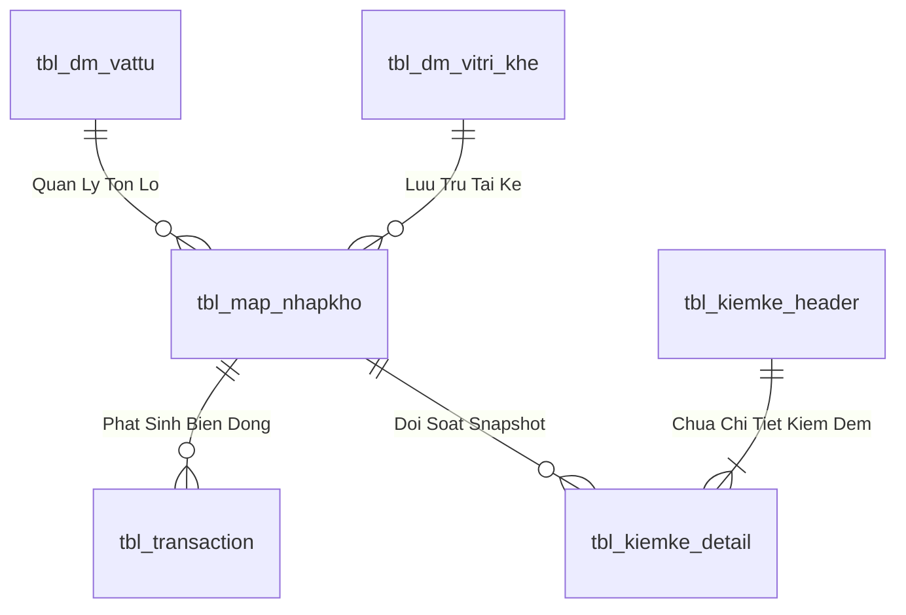
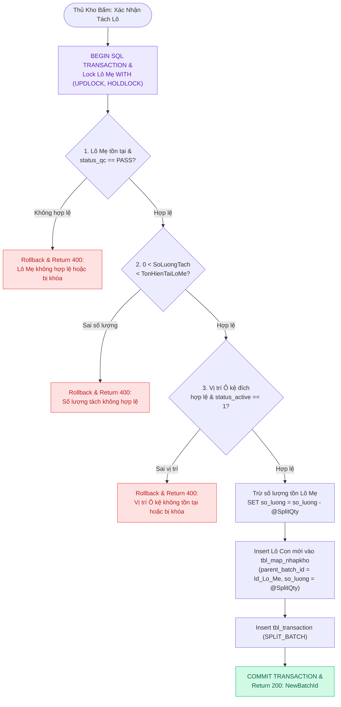
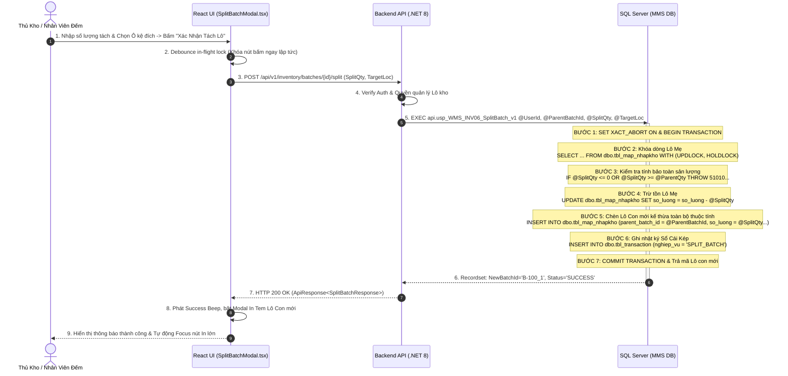
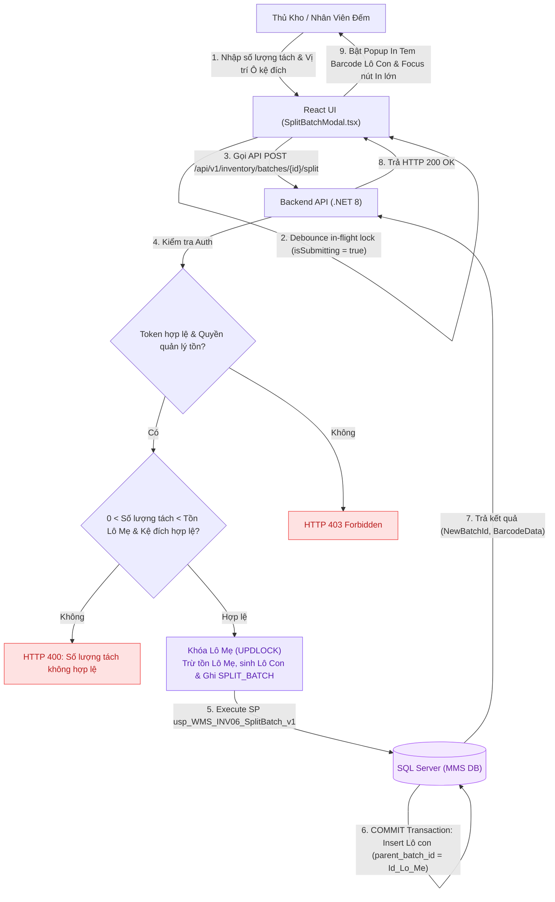

# Phân tích Thiết kế Logic UC-18 (INV-06) - Tách Lô (Split Batch) & Quản Lý Thùng Lẻ Trong Kho

Tài liệu này đi sâu vào phân tích và thiết kế hệ thống ở 5 khía cạnh bắt buộc: **Business Logic**, **UI/UX Guidelines**, **Programming Logic**, **Data Logic**, và **Diagrams (Mermaid)** dành cho chức năng **Tách Lô & Quản Lý Thùng Lẻ (INV-06)** của Thủ kho và Nhân viên đếm hàng.

---

## 1. Business Logic (Logic Nghiệp Vụ)

- **Mục tiêu cốt lõi:** Cho phép tách một Lô hàng nguyên kiện/nguyên thùng lớn (`Lô Mẹ - Parent Batch`) thành một hoặc nhiều Lô con nhỏ hơn (`Lô Con - Child Batch`) để phục vụ việc xuất lẻ cho phân xưởng, phân bổ sang các Ô kệ khác nhau hoặc ghi nhận số lượng kiểm kê thực tế từng thùng. Hệ thống tự động tạo mã Lô con mới kế thừa toàn bộ thuộc tính của Lô mẹ, trừ số lượng của Lô mẹ và kích hoạt in tem nhãn Lô con ngay lập tức.

- **Các quy tắc nghiệp vụ (Business Rules):**
  - `BR-INV-06-01` **Bảo toàn tổng sản lượng (Quantity Conservation Law):** `Tổng Lô Con Tách Ra + Số Tồn Còn Lại Lô Mẹ = Số Lượng Ban Đầu Lô Mẹ`. Số lượng tách phải thỏa `0 < SoLuongTach < TonLoMe`.
  - `BR-INV-06-02` **Kế thừa thuộc tính Lô (Inheritance Principle):** Lô con mới tự động kế thừa Mã SKU, Mã Bravo, Trạng thái QC (`PASS`), NCC, Ngày SX, Hạn sử dụng và gán `parent_batch_id = Id_Lo_Me`.
  - `BR-INV-06-03` **Khóa chống gửi trùng lệnh (Debounce In-flight Lock):** Khi bấm "Xác nhận tách Lô", cờ `isSubmitting` khóa nút bấm ngay lập tức, ngăn chặn việc tạo trùng Lô con khi bấm nhanh hoặc bàn phím lặp tín hiệu.
  - `BR-INV-06-04` **Ghi nhận giao dịch Sổ Cái Kép:** Tự động chèn bản ghi giao dịch `SPLIT_BATCH` vào `tbl_transaction`.
  - `BR-INV-06-05` **Tự động kích hoạt in tem Lô con:** Sau khi tách thành công, hệ thống tự động bật Popup in tem Barcode Lô con mới.
  - `BR-INV-06-06` **Kiểm soát vị trí đặt Lô con:** Vị trí Ô kệ đặt Lô con phải là mã Ô kệ hợp lệ và đang hoạt động.
  - `BR-INV-06-07` **Ghi log audit:** Ghi nhận `UserId`, thời điểm tách và lý do tách thùng.

- **Quy trình tương tác 5 bước (Interaction Flow):**
  - **Bước 1:** Người dùng chọn Lô mẹ cần tách trên Web (`SplitBatchModal.tsx`) hoặc quét Barcode Lô mẹ trên PDA.
  - **Bước 2:** Nhập số lượng cần tách cho Lô con mới và vị trí Ô kệ đặt Lô con.
  - **Bước 3:** Bấm **"Xác Nhận Tách Lô"**. Frontend validate số lượng `0 < qty < max` và gửi request `POST /api/v1/inventory/batches/{id}/split`.
  - **Bước 4:** Backend kiểm tra Fail-fast: (Verify JWT $
ightarrow$ Lock Parent Batch Row `UPDLOCK, HOLDLOCK` $
ightarrow$ Validate Available Qty $
ightarrow$ Deduct Parent Batch Qty $
ightarrow$ Insert Child Batch `tbl_map_nhapkho` $
ightarrow$ Insert `tbl_transaction` `SPLIT_BATCH` $
ightarrow$ Execute SP `usp_WMS_INV06_SplitBatch_v1`).
  - **Bước 5:** Backend trả về `NewBatchId`. Frontend phát âm thanh `Success Beep`, hiển thị Toast thông báo và tự động bật Modal in tem nhãn Lô con mới.

---

## 2. Tiêu chuẩn Thiết kế Giao diện (UI/UX Guidelines)
- Modal Tách Lô xem trước số dư tính toán; Nút in tem lớn nổi bật (`btn-emerald-glow`).

---

## 3. Programming Logic (Logic Lập Trình)

Quy trình xử lý mã lệnh được chia thành 2 lớp: **Frontend (React)** và **Backend (ASP.NET Core kết hợp SQL Stored Procedure)**.

### 3.1. Frontend (React - SplitBatchModal.tsx)
- **Debounce In-flight Lock:**
  - Khi bấm "Xác nhận tách Lô", cờ `isSubmitting` khóa nút bấm ngay lập tức, ngăn chặn việc sinh nhiều Lô con khi người dùng click liên tục hoặc phím Enter bị lặp tín hiệu.
- **Tự động mở Popup In Tem:**
  - Sau khi nhận phản hồi `newBatchId`, tự động bật modal in tem nhãn Lô con mới và chuyển tiêu điểm vào nút In.

### 3.2. Backend (ASP.NET Core - InventoryEndpoints.cs & SQL Server)
- **API POST /api/v1/inventory/batches/{id}/split:**
  - C# đẩy giao dịch xuống `api.usp_WMS_INV06_SplitBatch_v1`.
  - SP thực thi Transaction ACID: Khóa Lô Mẹ, trừ tồn Lô Mẹ, chèn Lô Con mới kế thừa thuộc tính và ghi nhật ký `SPLIT_BATCH` vào `tbl_transaction`.

---

## 4. Data Logic (Thiết kế Dữ Liệu)

### 4.1. Ma trận phân quyền CRUD

| Bảng / Thực thể Dữ Liệu | Create (Tạo) | Read (Đọc) | Update (Cập nhật) | Delete (Xóa) | Ý nghĩa nghiệp vụ trong Use Case |
| :--- | :---: | :---: | :---: | :---: | :--- |
| `dbo.tbl_map_nhapkho` (Lô Mẹ) | - | **X** | **X** | - | Đọc thông tin Lô gốc, Cập nhật trừ số lượng tách (`so_luong = so_luong - @SplitQty`) |
| `dbo.tbl_map_nhapkho` (Lô Con) | **X** | **X** | - | - | Sinh bản ghi Lô con mới (`parent_batch_id = Id_Lo_Me`, `status_qc = 'PASS'`) |
| `dbo.tbl_dm_vitri_khe` | - | **X** | **X** | - | Đọc vị trí Ô kệ, Cập nhật trạng thái khóa/mở khóa bảo trì |
| `dbo.tbl_kiemke_header` | **X** | **X** | **X** | - | Tạo đợt kiểm kê, Cập nhật trạng thái `status = 'IN_PROGRESS' / 'RECONCILED'` |
| `dbo.tbl_kiemke_detail` | **X** | **X** | **X** | - | Ghi nhận số thực đếm `actual_qty`, tính toán độ lệch `variance` |
| `dbo.tbl_transaction` | **X** | **X** | - | - | Ghi nhận bút toán biến động (`SPLIT_BATCH`, `TRANSFER`, `ADJUST_COUNT`) |
| `dbo.audit_log` | **X** | **X** | - | - | Ghi vết kiểm toán lịch sử tách Lô và chốt sổ cái kiểm kê |

### 4.2. Định nghĩa Trạng thái (Conceptual State Model)

| Cột / Biến | Kiểu Dữ Liệu | Giá Trị Sau Confirm | Ý nghĩa Nghiệp vụ |
| :--- | :--- | :--- | :--- |
| `parent_batch_id` (trong `tbl_map_nhapkho`) | `INT` | `ID_Lo_Me` | Liên kết phả hệ Lô Mẹ - Lô Con trong Cây Gia Phả (Genealogy Tree) |
| `status` (trong `tbl_kiemke_header`) | `NVARCHAR(20)` | `'IN_PROGRESS'` / `'RECONCILED'` | Trạng thái kỳ kiểm kê (Đang đếm mù thực địa / Đã chốt điều chỉnh Sổ Cái) |
| `trang_thai_ton` (trong `tbl_batch_inv`) | `NVARCHAR(10)` | `'1'` (`'AVAILABLE'`) | Tồn kho vật lý sẵn sàng cho xuất hàng / phân bổ |
| `status_qc` (trong `tbl_map_nhapkho`) | `VARCHAR(20)` | `'PASS'` | Trạng thái chất lượng đạt chuẩn |
| `status_kho` (trong `tbl_map_nhapkho`) | `VARCHAR(20)` | `'STORED'` | Đã lưu kho chính thức trên dầm kệ |

### 4.3. Data Layer Architecture (Data Flow & Transaction Locking)

- **Bảng Quản Lý Tồn Lô (`dbo.tbl_map_nhapkho` / `dbo.tbl_batch_inv`):**
  - Khóa chính: `id_nhapkho` (INT IDENTITY, Clustered Index).
  - Tự tham chiếu Lô Mẹ: `parent_batch_id` (INT NULL) phục vụ dựng Cây Gia Phả.
  - Vị trí Ô kệ: `id_vitri_khe` (VARCHAR(20), FK).
  - Trạng thái kiểm định: `status_qc` (`'PASS'`, `'REJECT'`, `'PENDING'`).
  - Trạng thái lưu kho: `status_kho` (`'STORED'`, `'ON_RACK'`, `'QUARANTINE'`).
  - Chỉ mục: `IX_tbl_map_nhapkho_vattu` on `(id_vattu, status_qc, status_kho) INCLUDE (so_luong, id_vitri_khe)`.

### 4.2. Data Layer Architecture (Data Flow & Transaction Locking)

---

## 5. Diagrams (Mermaid Sơ Đồ Luồng Nghiệp Vụ)

### 5.1. Sơ Đồ Tuần Tự (Sequence Diagram & SP Execution Flow)

---

### 5.2. Data Flow Diagram: Luồng Tách Lô & In Tem Thùng Lẻ (INV-06)

