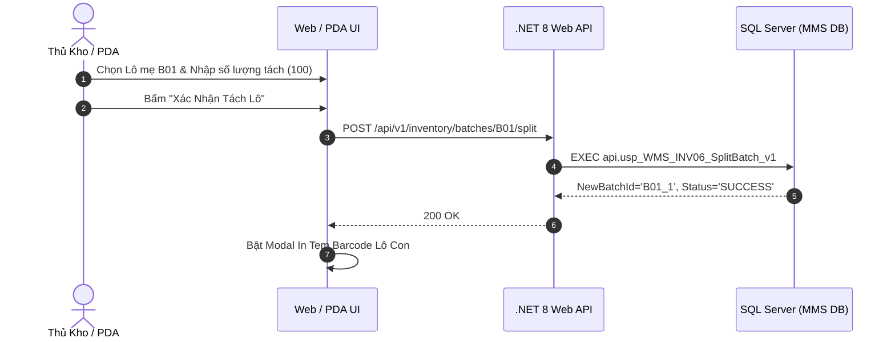

# Phân tích Thiết kế Logic UC-18 (INV-06) - Tách Lô (Split Batch) & Quản Lý Thùng Lẻ Trong Kho

Tài liệu này đi sâu vào phân tích và thiết kế hệ thống ở 5 khía cạnh bắt buộc: **Business Logic**, **UI/UX Guidelines**, **Programming Logic**, **Data Logic**, và **Diagrams (Mermaid)** dành cho chức năng **Tách Lô & Quản Lý Thùng Lẻ (INV-06)** của Thủ kho và Nhân viên đếm hàng.

---

## 1. Business Logic (Logic Nghiệp Vụ)

- **Mục tiêu cốt lõi:** Cho phép tách một Lô hàng nguyên kiện/nguyên thùng lớn (`Lô Mẹ - Parent Batch`) thành một hoặc nhiều Lô con nhỏ hơn (`Lô Con - Child Batch`) để phục vụ việc xuất lẻ cho phân xưởng, phân bổ sang các Ô kệ khác nhau hoặc ghi nhận số lượng kiểm kê thực tế từng thùng. Hệ thống tự động tạo mã Lô con mới kế thừa toàn bộ thuộc tính của Lô mẹ, trừ số lượng của Lô mẹ và kích hoạt in tem nhãn Lô con ngay lập tức.

- **Các quy tắc nghiệp vụ (Business Rules):**
  - `BR-INV-06-01` **Bảo toàn tổng sản lượng:** Tổng Lô con + Tồn còn lại Lô mẹ = Số lượng ban đầu Lô mẹ.
  - `BR-INV-06-02` **Kế thừa thuộc tính Lô:** Lô con kế thừa SKU, Trạng thái QC, Ngày SX, Hạn sử dụng, gán `parent_batch_id = Id_Lo_Me`.
  - `BR-INV-06-03` **Khóa chống gửi trùng lệnh:** Debounce in-flight lock ngăn chặn tạo trùng Lô con.

- **Quy trình tương tác 5 bước (Interaction Flow):**
  - **Bước 1:** Chọn Lô mẹ cần tách.
  - **Bước 2:** Nhập số lượng tách và vị trí đặt Lô con.
  - **Bước 3:** Bấm **"Xác Nhận Tách Lô"**.
  - **Bước 4:** Backend thực thi `api.usp_WMS_INV06_SplitBatch_v1`.
  - **Bước 5:** Bật Modal In Tem Barcode Lô con mới.

---

## 2. Tiêu chuẩn Thiết kế Giao diện (UI/UX Guidelines)
- Modal Tách Lô xem trước số dư tính toán; Nút in tem lớn nổi bật (`btn-emerald-glow`).

---

## 3. Programming Logic (Logic Lập Trình)
- **Endpoint:** `POST /api/v1/inventory/batches/{batchId}/split`
- **SP:** `api.usp_WMS_INV06_SplitBatch_v1`

---

## 4. Data Logic & Schema Model (Cấu Trúc Dữ Liệu)
- `dbo.tbl_map_nhapkho`: Chèn Lô con mới và cập nhật tồn Lô mẹ.
- `dbo.tbl_transaction`: Ghi nhận nhật ký `SPLIT_BATCH`.

---

## 5. Diagrams (Mermaid Sơ Đồ Luồng Nghiệp Vụ)

