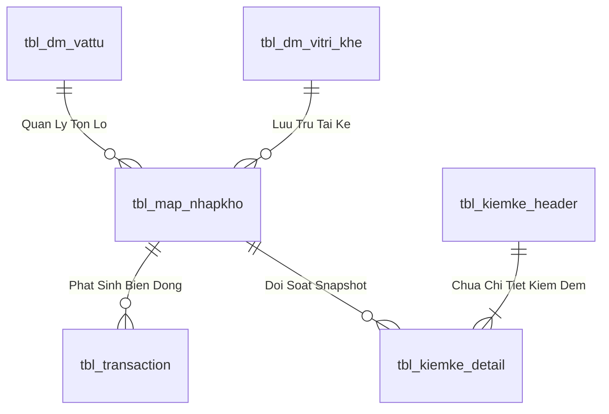
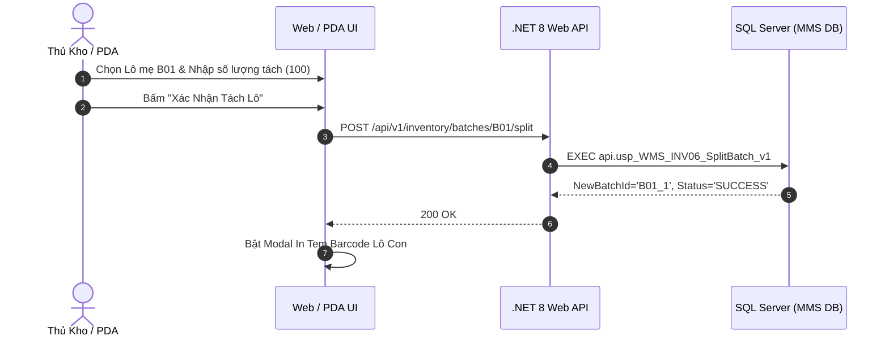

# Phân tích Thiết kế Logic UC-18 (INV-06) - Tách Lô (Split Batch) & Quản Lý Thùng Lẻ Trong Kho

Tài liệu này đi sâu vào phân tích và thiết kế hệ thống ở 5 khía cạnh bắt buộc: **Business Logic**, **UI/UX Guidelines**, **Programming Logic**, **Data Logic**, và **Diagrams (Mermaid)** dành cho chức năng **Tách Lô & Quản Lý Thùng Lẻ (INV-06)** của Thủ kho và Nhân viên đếm hàng.

---

## 1. Business Logic (Logic Nghiệp Vụ)

- **Mục tiêu cốt lõi:** Cho phép tách một Lô hàng nguyên kiện/nguyên thùng lớn (`Lô Mẹ - Parent Batch`) thành một hoặc nhiều Lô con nhỏ hơn (`Lô Con - Child Batch`) để phục vụ việc xuất lẻ cho phân xưởng, phân bổ sang các Ô kệ khác nhau hoặc ghi nhận số lượng kiểm kê thực tế từng thùng. Hệ thống tự động tạo mã Lô con mới kế thừa toàn bộ thuộc tính của Lô mẹ, trừ số lượng của Lô mẹ và kích hoạt in tem nhãn Lô con ngay lập tức.

- **Các quy tắc nghiệp vụ (Business Rules):**
  - `BR-INV-06-01` **Bảo toàn tổng sản lượng:** Tổng Lô con + Tồn còn lại Lô mẹ = Số lượng ban đầu Lô mẹ.
  - `BR-INV-06-02` **Kế thừa thuộc tính Lô:** Lô con kế thừa SKU, Trạng thái QC, Ngày SX, Hạn sử dụng, gán `parent_batch_id = Id_Lo_Me`.
  - `BR-INV-06-03` **Khóa chống gửi trùng lệnh:** Debounce in-flight lock ngăn chặn tạo trùng Lô con.

- **Quy trình tương tác 5 bước (Interaction Flow):**
  - **Bước 1:** Chọn Lô mẹ cần tách.
  - **Bước 2:** Nhập số lượng tách và vị trí đặt Lô con.
  - **Bước 3:** Bấm **"Xác Nhận Tách Lô"**.
  - **Bước 4:** Backend thực thi `api.usp_WMS_INV06_SplitBatch_v1`.
  - **Bước 5:** Bật Modal In Tem Barcode Lô con mới.

---

## 2. Tiêu chuẩn Thiết kế Giao diện (UI/UX Guidelines)
- Modal Tách Lô xem trước số dư tính toán; Nút in tem lớn nổi bật (`btn-emerald-glow`).

---

## 3. Programming Logic (Logic Lập Trình)

Quy trình xử lý mã lệnh được chia thành 2 lớp: **Frontend (React)** và **Backend (ASP.NET Core kết hợp SQL Stored Procedure)**.

### 3.1. Frontend (React - SplitBatchModal.tsx)
- **Debounce In-flight Lock:**
  - Khi bấm "Xác nhận tách Lô", cờ `isSubmitting` khóa nút bấm ngay lập tức, ngăn chặn việc sinh nhiều Lô con khi người dùng click liên tục hoặc phím Enter bị lặp tín hiệu.
- **Tự động mở Popup In Tem:**
  - Sau khi nhận phản hồi `newBatchId`, tự động bật modal in tem nhãn Lô con mới và chuyển tiêu điểm vào nút In.

### 3.2. Backend (ASP.NET Core - InventoryEndpoints.cs & SQL Server)
- **API POST /api/v1/inventory/batches/{id}/split:**
  - C# đẩy giao dịch xuống `api.usp_WMS_INV06_SplitBatch_v1`.
  - SP thực thi Transaction ACID: Khóa Lô Mẹ, trừ tồn Lô Mẹ, chèn Lô Con mới kế thừa thuộc tính và ghi nhật ký `SPLIT_BATCH` vào `tbl_transaction`.

---

## 4. Data Logic & Schema Model (Thiết kế Dữ Liệu Chuyên Sâu)

### 4.1. Entity Relationship Diagram (ERD) & Schema Details

- **Bảng Quản Lý Tồn Lô (`dbo.tbl_map_nhapkho` / `dbo.tbl_batch_inv`):**
  - Khóa chính: `id_nhapkho` (INT IDENTITY, Clustered Index).
  - Tự tham chiếu Lô Mẹ: `parent_batch_id` (INT NULL) phục vụ dựng Cây Gia Phả.
  - Vị trí Ô kệ: `id_vitri_khe` (VARCHAR(20), FK).
  - Trạng thái kiểm định: `status_qc` (`'PASS'`, `'REJECT'`, `'PENDING'`).
  - Trạng thái lưu kho: `status_kho` (`'STORED'`, `'ON_RACK'`, `'QUARANTINE'`).
  - Chỉ mục: `IX_tbl_map_nhapkho_vattu` on `(id_vattu, status_qc, status_kho) INCLUDE (so_luong, id_vitri_khe)`.

### 4.2. Data Flow & Transaction Locking Matrix
- **Khóa giao dịch Tách Lô / Chuyển vị trí:** Sử dụng `WITH (UPDLOCK, HOLDLOCK)` trên Lô nguồn để bảo toàn nguyên lý bảo toàn tổng sản lượng `TonLoMe = TonLoCon + TonDu`.
- **Khóa kiểm kê chốt sổ:** Áp dụng mức cô lập `SERIALIZABLE` với `WITH (TABLOCKX)` khi thực thi lệnh chốt chênh lệch `ADJUST_COUNT` để đảm bảo không bị xung đột với các giao dịch xuất nhập hàng ngày.

### 4.3. Conceptual State Model & Transition Rules
| Trạng Thái Lô | Sự Kiện Kích Hoạt | Trạng Thái Sau | Tác Động Sổ Cái |
| :--- | :--- | :--- | :--- |
| **Lô Mẹ F0 (1,000 cái)** | Tách Lô con 400 cái (INV-06) | Lô Mẹ: 600 cái, Lô Con: 400 cái | Ghi `tbl_transaction` (`SPLIT_BATCH`) |
| **Kệ K01 (Lô A)** | Điều chuyển sang Kệ K02 (INV-03) | Vị trí mới = K02 | Ghi `tbl_transaction` (`TRANSFER`) |
| **Snapshot Sổ Sách** | Chốt lệch kiểm kê (INV-09) | Điều chỉnh tồn = Thực đếm | Ghi `tbl_transaction` (`ADJUST_COUNT`) |

---

## 5. Diagrams (Mermaid Sơ Đồ Luồng Nghiệp Vụ)

