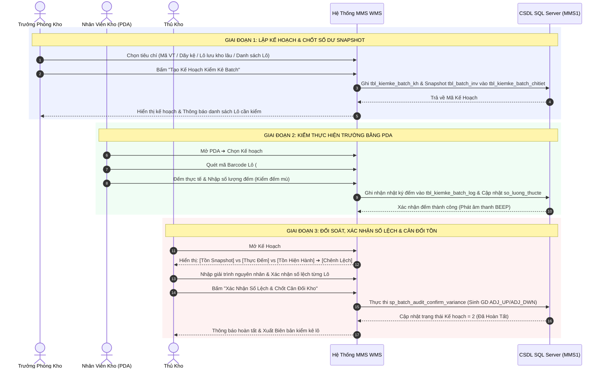
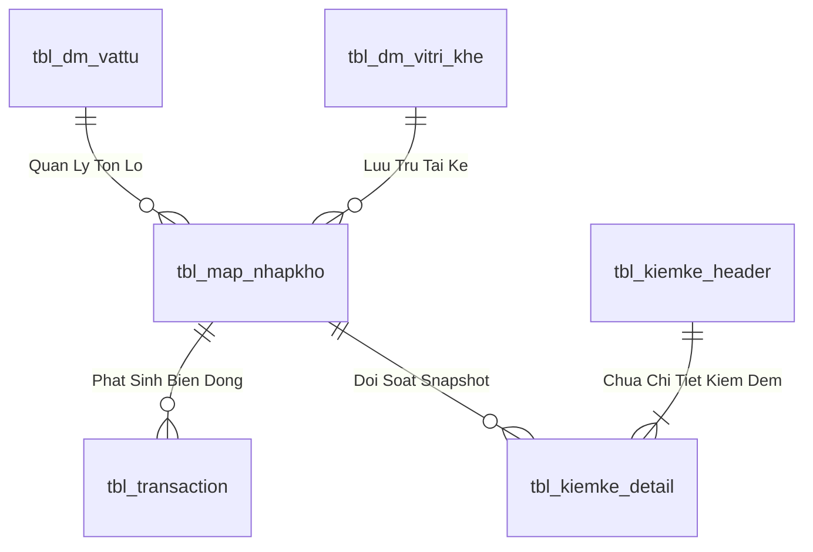

# Đặc Tả Kỹ Thuật Toàn Diện UC-18 / INV-06: Kiểm Kê Theo Lô (Batch Inventory Audit)

> **Mục tiêu Use Case:** Xây dựng quy trình kiểm soát chặt chẽ tính chính xác của tồn kho theo từng **Lô hàng (`id_batch`)**, phân định rõ ràng trách nhiệm:
> 1. **Trưởng phòng kho (`truongphong_kho`)**: Khảo sát, chọn lọc danh sách Lô cần kiểm, Lập kế hoạch kiểm kê (Snapshot số dư), và **Ký duyệt chốt số lệch & Cân đối tồn kho có ghi chú lý do giải trình**.
> 2. **Nhân viên kho (`nhanvien`)**: Dùng thiết bị cầm tay PDA quét Barcode Lô tại vị trí kệ, thực hiện kiểm đếm mù thực tế hiện trường.
> 3. **Thủ kho (`thukho`)**: Đối soát số liệu thực đếm so với số dư sổ sách, ghi chú nguyên nhân thực tế hiện trường trình Trưởng phòng kho duyệt.

---

## Bảng Thông Tin Kiểm Soát Use Case

| Thuộc tính | Giá trị chi tiết |
| :--- | :--- |
| **Mã Use Case Nghiệp Vụ** | `UC-18` |
| **Mã Phân Hệ Kỹ Thuật** | `INV-06` (Kiểm Kê Theo Batch) / `INV-06B` (Phê Duyệt Chênh Lệch Lô) |
| **Tên Nghiệp Vụ** | Kiểm Kê Tồn Kho Theo Batch - Trưởng Phòng Kho Lập Kế Hoạch & Ký Duyệt Chốt Lệch |
| **Các Tác Nhân Chính (Actors)** | • **Trưởng phòng kho** (`truongphong_kho`): Tạo kế hoạch & Ký duyệt chốt số lệch có giải trình<br>• **Nhân viên kho quét PDA** (`nhanvien`): Quét barcode & đếm thực tế hiện trường<br>• **Thủ kho** (`thukho`): Phối hợp đối soát & ghi chú thực địa |
| **Giao Diện Desktop (Web)** | `/inventory` ➔ Tab `🔍 Kiểm Kê Theo Batch (UC-18)` |
| **Giao Diện Thiết Bị Cầm Tay (PDA)** | `/handheld` ➔ Chế độ `5A. Quét Kiểm Kê Batch` |
| **Mã Quyền Màn Hình** | `scr_kiemke_batch`, `scr_kiemke_batch_pheduyet`, `scr_kiemke_batch_pda` |

---

# PHẦN 1: BUSINESS LOGIC (LOGIC NGHIỆP VỤ & QUY TRÌNH 3 BƯỚC)



---

### 1.1. Luồng Thao Tác Chi Tiết Theo Từng Vai Trò

#### 🔹 CẤP 1: TRƯỞNG PHÒNG KHO (`truongphong_kho`) – Lập Kế Hoạch Kiểm Kê
1. **Lựa chọn phạm vi kiểm kê**:
   * **Theo Danh Sách Batch Cụ Thể**: Nhập/paste danh sách mã Lô `#12801, #12805...`
   * **Theo Nhóm Vị Trí Ô Kệ**: Chọn Dãy kệ (VD: Khu A, Kệ Tầng 1-3).
   * **Theo Nhóm Vật Tư Trọng Yếu**: Chọn nhóm vật tư giá trị cao (ABC Class A) hoặc vật tư biến động nhiều.
   * **Theo Tuổi Hàng Lô (Aging)**: Lọc các lô hàng lưu kho trên 90 ngày chưa xuất.
2. **Snapshot số dư hệ thống**:
   * Hệ thống tự động đóng băng số dư tồn kho sổ sách tại thời điểm lập kế hoạch (`soluong_snapshot`) lưu vào bảng `tbl_kiemke_batch_chitiet`.
3. **Phát lệnh kiểm kê**: Kế hoạch được cấp mã `#B-PLAN-xxxx` với trạng thái `1 - Đang Kiểm Đếm`.

---

#### 🔹 CẤP 2: NHÂN VIÊN KHO (`nhanvien`) – Kiểm Đếm Thực Tế Bằng PDA
1. **Nhận kế hoạch trên thiết bị PDA**:
   * Nhân viên mở màn hình **Chế độ 5A: Quét Kiểm Kê Batch** trên PDA Laser.
   * Chọn kế hoạch đang mở từ danh mục.
2. **Quy trình quét đếm hiện trường**:
   * **Bước 1: Quét Ô Kệ**: Xác nhận vị trí đang đứng kiểm.
   * **Bước 2: Quét Tem Mã Vạch Batch (`#id_batch`)**: Máy quét đọc mã vạch Code128 / QR trên thùng/kiện. Nếu mã Batch thuộc kế hoạch, hệ thống phát tiếng `BEEP` nhận diện.
   * **Bước 3: Nhập số lượng thực đếm**:
     * Áp dụng nguyên tắc **Kiểm đếm mù (Blind Count)**: Màn hình không hiển thị trước số lượng tồn sổ sách để tránh nhân viên đếm ẩu hoặc xác nhận khống.
     * Nhân viên đếm thực tế và gõ số lượng hoặc dùng phím tắt `+1`, `+10`, `+50`.
   * **Bước 4: Xác nhận ghi nhận**: Bấm `[LƯU KẾT QUẢ ĐẾM]`. Hệ thống ghi nhận ngay lượt đếm vào `tbl_kiemke_batch_log` gắn liền với `User ID` (VD: `57`).

---

#### 🔹 CẤP 3: THỦ KHO (`thukho`) – Đối Soát & Xác Nhận Số Lệch
1. **Xem Bảng Đối Soát 3 Chiều**:
   Thủ kho mở Web Quản trị để theo dõi bảng so khớp chi tiết:
   * **Số lượng Snapshot** ($Q_{\text{snap}}$): Số dư chốt tại thời điểm Trưởng phòng tạo kế hoạch.
   * **Số lượng Thực đếm** ($Q_{\text{act}}$): Tổng số lượng nhân viên PDA đã quét đếm được.
   * **Số lượng Tồn hiện hành** ($Q_{\text{curr}}$): Số dư thực tế trong kho tại thời điểm hiện tại.
   * **Độ lệch kiểm kê**:
     $$\Delta Q = Q_{\text{act}} - Q_{\text{snap}}$$
2. **Xác nhận số lệch & Nhập biên bản giải trình**:
   * **Lô khớp số lượng ($\Delta Q = 0$)**: Hệ thống đánh dấu ✅ `Khớp Chuẩn`.
   * **Lô đếm thừa ($\Delta Q > 0$)**: Thủ kho chọn lý do (Nhập sót phiếu, dán nhầm tem, đóng dư...).
   * **Lô đếm thiếu ($\Delta Q < 0$)**: Thủ kho chọn lý do (Hao hụt tự nhiên, thất thoát, xuất chưa trừ kho...).
   * Trường hợp nghi ngờ: Thủ kho có quyền bấm **`[Yêu Cầu Đếm Lại]`** gửi thông báo về PDA cho nhân viên.
3. **Ký duyệt & Cân đối tồn kho**:
   * Thủ kho nhấn **`[XÁC NHẬN SỐ LỆCH & CHỐT ĐỢT KIỂM KÊ]`**.
   * Hệ thống tự động sinh giao dịch kho tương ứng:
     * Tăng tồn Lô thừa: Mã `ADJ_UP` (logic = +1).
     * Giảm tồn Lô thiếu: Mã `ADJ_DWN` (logic = -1).
   * Khóa sổ kế hoạch (Chuyển trạng thái `2 - Đã Chốt`).

---

### 1.2. Hệ Thống 10 Quy Tắc Nghiệp Vụ (Business Rules)

| Mã Quy Tắc | Tên Quy Tắc | Nội Dung Chi Tiết |
| :--- | :--- | :--- |
| **BR-BATCH-01** | Phân Quyền 3 Cấp Tách Biệt | Trưởng phòng tạo kế hoạch (`truongphong_kho`), Nhân viên đếm (`nhanvien`), Thủ kho chốt lệch (`thukho`). Một người không được tự vừa tạo vừa đếm vừa tự chốt lệch mà không qua đối soát. |
| **BR-BATCH-02** | Snapshot Bất Biến | Số lượng tồn kho tại thời điểm tạo kế hoạch được lưu cố định làm mốc đối chiếu, không bị thay đổi bởi các giao dịch phát sinh sau đó. |
| **BR-BATCH-03** | Kiểm Đếm Mù Hiện Trường | Trên màn hình PDA của nhân viên, trường số lượng tồn sổ sách bị ẩn hoàn toàn để đảm bảo tính khách quan 100%. |
| **BR-BATCH-04** | Ghi Vết Người Thao Tác Đích Danh | Mỗi lần bấm lưu số đếm hoặc xác nhận lệch phải lưu chính xác `User ID` (qua `SmartAuth`), không lưu chung chung là "Hệ thống". |
| **BR-BATCH-05** | Bắt Buộc Quét Đúng Batch Trong Kế Hoạch | Nếu nhân viên quét một Lô không nằm trong danh sách Lô của kế hoạch, PDA sẽ báo còi cảnh báo `ERROR` và yêu cầu xác minh. |
| **BR-BATCH-06** | Cho Phép Đếm Nhiều Lần (Multi-Pass) | Một Lô có thể được đếm nhiều lần hoặc bởi nhiều nhân viên. Lần đếm cuối cùng có xác nhận sẽ là căn cứ đối soát (hoặc cộng dồn theo kiện). |
| **BR-BATCH-07** | Bắt Buộc Giải Trình Khi Có Lệch | Tất cả các dòng Lô có $\Delta Q \neq 0$ bắt buộc thủ kho phải chọn lý do chênh lệch trước khi cho phép bấm nút chốt sổ. |
| **BR-BATCH-08** | Tính Nguyên Tử Khi Cân Đối Kho (ACID) | Toàn bộ giao dịch điều chỉnh tăng/giảm kho cho các lô lệch phải nằm trong 1 Database Transaction duy nhất. Lỗi 1 dòng sẽ Rollback toàn bộ. |
| **BR-BATCH-09** | Tự Động Ghi Log Biến Động Sổ Cái | Mỗi điều chỉnh chênh lệch phải ghi nhận vào `tbl_transaction` kèm mã `ADJ_UP`/`ADJ_DWN` và `tbl_batch_event` (mã event = 5). |
| **BR-BATCH-10** | Khóa Chỉnh Sửa Sau Khi Chốt | Kế hoạch sau khi đã bấm Hoàn Tất sẽ chuyển trạng thái Read-Only, không ai được phép sửa đổi số liệu kiểm đếm. |

---

# PHẦN 2: PROGRAMMING LOGIC & API CONTRACTS (.NET 8 & REACT)

### 2.1. Danh Sách RESTful API Endpoints

```
[QUẢN LÝ KẾ HOẠCH - TRƯỞNG PHÒNG KHO]
POST   /api/v1/inventory-operations/batch-audits             -> Tạo kế hoạch kiểm kê batch mới
GET    /api/v1/inventory-operations/batch-audits             -> Lấy danh sách các đợt kiểm kê batch
GET    /api/v1/inventory-operations/batch-audits/{id}        -> Lấy chi tiết kế hoạch & danh sách lô

[HIỆN TRƯỜNG ĐẾM - NHÂN VIÊN PDA]
POST   /api/v1/inventory-operations/batch-audits/{id}/count  -> Ghi nhận số lượng đếm thực tế của 1 Lô

[ĐỐI SOÁT & CHỐT SỔ - THỦ KHO]
POST   /api/v1/inventory-operations/batch-audits/{id}/confirm-variance -> Xác nhận số lệch & Cân đối kho
```

#### DTO Request Tạo Kế Hoạch (`CreateBatchAuditPlanRequest`):
```csharp
public sealed record CreateBatchAuditPlanRequest(
    string PlanName,             // Tên đợt kiểm kê (VD: "Kiểm kê Lô Quý 3 Dãy Kệ A")
    string WarehouseCode,         // Mã kho (VD: "20020100")
    string AuditType,             // "SPECIFIC_BATCHES" | "LOCATION_RANGE" | "MATERIAL_GROUP" | "AGING"
    List<int>? BatchIds,          // Danh sách Batch ID cụ thể (nếu chọn thủ công)
    string? LocationPrefix,       // Tiền tố ô kệ (VD: "01-01")
    string? MaterialId,           // Mã vật tư
    string? Note                  // Ghi chú đợt kiểm
);
```

#### DTO Request Ghi Nhận Số Đếm PDA (`LogBatchCountRequest`):
```csharp
public sealed record LogBatchCountRequest(
    int BatchId,                 // ID Lô quét được
    decimal ActualQuantity,      // Số lượng đếm thực tế
    string? LocationCode,        // Vị trí kệ thực tế quét được
    string? Note                 // Ghi chú tình trạng hàng (Rách tem, móp méo...)
);
```

#### DTO Request Chốt Số Lệch (`ConfirmBatchVarianceRequest`):
```csharp
public sealed record ConfirmBatchVarianceRequest(
    List<BatchVarianceItem> Variances, // Danh sách xác nhận số lệch từng Lô
    string GeneralNote                 // Ý kiến đánh giá của Thủ kho
);

public sealed record BatchVarianceItem(
    int DetailId,
    int BatchId,
    decimal ConfirmedDiffQuantity,     // Số lượng lệch xác nhận (+ thừa, - thiếu)
    string VarianceReasonCode,         // "DAMAGE", "WRONG_COUNT", "MISLABEL", "OTHER"
    string? Explanation                // Giải trình chi tiết
);
```

---

# PHẦN 3: DATA LOGIC & DATABASE DESIGN (SQL SERVER)

### 3.1. Thiết Kế Bảng CSDL (ERD Tables)

#### 1. Bảng Kế Hoạch Kiểm Kê Batch (`dbo.tbl_kiemke_batch_kh`)
| Tên Cột | Kiểu Dữ Liệu | Khóa | Diễn Giải |
| :--- | :--- | :---: | :--- |
| `id_kh_batch` | `INT IDENTITY(1,1)` | **PK** | Mã kế hoạch kiểm kê lô |
| `ten_kehoach` | `NVARCHAR(255)` | | Tên đợt kiểm kê |
| `ma_kho` | `NVARCHAR(50)` | | Mã kho kiểm |
| `loai_kiemke` | `NVARCHAR(50)` | | `BATCH_LIST` / `LOCATION` / `MATERIAL` |
| `trang_thai` | `INT` | | `1`: Đang kiểm, `2`: Đã chốt hoàn tất, `0`: Đã hủy |
| `tong_so_batch` | `INT` | | Tổng số Lô cần kiểm |
| `so_batch_da_kiem`| `INT` | | Số Lô đã hoàn thành đếm |
| `so_batch_lech` | `INT` | | Số Lô phát hiện chênh lệch |
| `user_cre` | `NVARCHAR(50)` | | Người tạo kế hoạch (Trưởng phòng kho) |
| `time_cre` | `DATETIME` | | Thời điểm tạo |
| `user_confirm` | `NVARCHAR(50)` | | Thủ kho xác nhận chốt sổ |
| `time_confirm` | `DATETIME` | | Thời điểm chốt sổ |
| `ghi_chu` | `NVARCHAR(500)` | | Ghi chú chung |

#### 2. Bảng Chi Tiết Snapshot & Đối Soát Lô (`dbo.tbl_kiemke_batch_chitiet`)
| Tên Cột | Kiểu Dữ Liệu | Khóa | Diễn Giải |
| :--- | :--- | :---: | :--- |
| `id_chitiet` | `INT IDENTITY(1,1)` | **PK** | ID dòng chi tiết |
| `id_kh_batch` | `INT` | **FK** | Trỏ tới `tbl_kiemke_batch_kh` |
| `id_batch` | `INT` | **FK** | Trỏ tới `tbl_batch_inv` |
| `id_vattu` | `NVARCHAR(50)` | | Mã vật tư |
| `ten_vattu` | `NVARCHAR(255)` | | Tên vật tư |
| `unit` | `NVARCHAR(50)` | | Đơn vị tính |
| `location_snapshot` | `NVARCHAR(50)` | | Vị trí kệ lúc tạo kế hoạch |
| `soluong_snapshot` | `FLOAT` | | Số lượng tồn sổ sách mốc snapshot |
| `soluong_thucte` | `FLOAT` | | Số lượng thực tế nhân viên PDA đếm được |
| `chenh_lech` | `FLOAT` | | `soluong_thucte - soluong_snapshot` |
| `trang_thai_kiem` | `NVARCHAR(50)` | | `CHUA_KIEM`, `KHOP`, `LECH_THUA`, `LECH_THIEU` |
| `ly_do_lech` | `NVARCHAR(255)` | | Lý do giải trình của thủ kho |
| `user_dem_cuoi` | `NVARCHAR(50)` | | Nhân viên PDA đếm cuối |
| `time_dem_cuoi` | `DATETIME` | | Thời điểm đếm cuối |

#### 3. Bảng Nhật Ký Quét Đếm Hiện Trường (`dbo.tbl_kiemke_batch_log`)
| Tên Cột | Kiểu Dữ Liệu | Khóa | Diễn Giải |
| :--- | :--- | :---: | :--- |
| `id_log` | `INT IDENTITY(1,1)` | **PK** | ID lượt quét đếm |
| `id_chitiet` | `INT` | **FK** | Dòng chi tiết kiểm kê |
| `id_batch` | `INT` | | Mã Lô quét |
| `so_luong_dem` | `FLOAT` | | Số lượng đếm của lượt này |
| `vi_tri_quet` | `NVARCHAR(50)` | | Vị trí kệ thực tế quét được |
| `user_cre` | `NVARCHAR(50)` | | Nhân viên PDA thực hiện |
| `time_cre` | `DATETIME` | | Thời điểm quét đếm |

---

### 3.2. Stored Procedure Cốt Lõi (Mẫu SQL)

```sql
-- 1. SP: LẬP KẾ HOẠCH KIỂM KÊ THEO BATCH (TRƯỞNG PHÒNG KHO)
CREATE OR ALTER PROCEDURE api.usp_WMS_INV06_CreateBatchAuditPlan_v1
    @UserId          NVARCHAR(50),
    @PlanName        NVARCHAR(255),
    @WarehouseCode   NVARCHAR(50),
    @AuditType       NVARCHAR(50),
    @BatchIdsJson    NVARCHAR(MAX) = NULL,
    @Note            NVARCHAR(500) = NULL
AS
BEGIN
    SET NOCOUNT ON;
    SET XACT_ABORT ON;

    -- Kiểm tra quyền Trưởng phòng / Admin
    IF NOT EXISTS (SELECT 1 FROM api.vw_SEC_UserScreenAccess_v1 WHERE UserId = @UserId AND ScreenCode = N'scr_kiemke_batch')
        THROW 51001, N'Bạn không có quyền lập kế hoạch kiểm kê batch!', 1;

    BEGIN TRANSACTION;
    TRY
        DECLARE @PlanId INT;
        INSERT INTO dbo.tbl_kiemke_batch_kh (ten_kehoach, ma_kho, loai_kiemke, trang_thai, user_cre, time_cre, ghi_chu)
        VALUES (@PlanName, @WarehouseCode, @AuditType, 1, @UserId, GETDATE(), @Note);
        SET @PlanId = SCOPE_IDENTITY();

        -- Snapshot các batch được chọn vào bảng chi tiết
        INSERT INTO dbo.tbl_kiemke_batch_chitiet (
            id_kh_batch, id_batch, id_vattu, ten_vattu, unit, 
            location_snapshot, soluong_snapshot, trang_thai_kiem
        )
        SELECT 
            @PlanId, b.id_batch, b.id_vattu, b.ten_vattu, b.unit,
            b.location, b.so_luong, N'CHUA_KIEM'
        FROM dbo.tbl_batch_inv b
        INNER JOIN OPENJSON(@BatchIdsJson) j ON b.id_batch = CAST(j.value AS INT)
        WHERE b.trang_thai_ton <> '0';

        -- Cập nhật tổng số batch
        UPDATE dbo.tbl_kiemke_batch_kh
        SET tong_so_batch = (SELECT COUNT(*) FROM dbo.tbl_kiemke_batch_chitiet WHERE id_kh_batch = @PlanId)
        WHERE id_kh_batch = @PlanId;

        COMMIT TRANSACTION;
        SELECT PlanId = @PlanId, Message = N'Tạo kế hoạch kiểm kê thành công.';
    TRY
    CATCH
        IF @@TRANCOUNT > 0 ROLLBACK TRANSACTION;
        THROW;
    END CATCH
END;
GO
```

---

# PHẦN 4: MA TRẬN KIỂM THỬ & NGHIỆM THU (TEST MATRIX)

| Mã Test | Kịch Bản Kiểm Thử | Tác Nhân | Kết Quả Kỳ Vọng | Trạng Thái |
| :--- | :--- | :---: | :--- | :---: |
| **TC-BA-01** | Trưởng phòng chọn 10 Lô và tạo Kế hoạch kiểm kê | `truongphong_kho` | Tạo Plan ID thành công, snapshot đúng số dư của 10 Lô, trạng thái `1 - Đang Kiểm`. | 📋 Ready |
| **TC-BA-02** | Nhân viên mở PDA, kiểm đếm mù Lô `#12801` | `nhanvien` | Màn hình không hiện số tồn sổ sách, nhập 50 Kg ➔ Ghi log thành công với `User: 57`. | 📋 Ready |
| **TC-BA-03** | Nhân viên quét Lô không thuộc kế hoạch | `nhanvien` | PDA phát âm thanh cảnh báo lỗi và chặn không cho nhập số đếm. | 📋 Ready |
| **TC-BA-04** | Thủ kho mở Bảng Đối Soát 3 Chiều | `thukho` | Hiển thị rõ cột [Snapshot], [Thực tế đếm], [Tồn hiện hành] và tự tính Độ Lệch. | 📋 Ready |
| **TC-BA-05** | Thủ kho yêu cầu đếm lại Lô bị lệch | `thukho` | Trạng thái chuyển `YEU_CAU_DEM_LAI`, PDA nhận thông báo cần quét lại Lô đó. | 📋 Ready |
| **TC-BA-06** | Thủ kho xác nhận số lệch & Chốt cân đối kho | `thukho` | Sinh giao dịch `ADJ_UP`/`ADJ_DWN` tương ứng, cập nhật tồn kho chính xác, khóa sổ kế hoạch. | 📋 Ready |

---

### 📌 Tài Liệu Tham Khảo Liên Quan
* [Đặc Tả Kỹ Thuật Toàn Diện UC-27 / INV-08 (Kiểm Kê Cycle Count Theo Vật Tư)](file:///c:/MMS/docs/03-use-cases/UC-27_INV-08.md)
* [Danh Mục Giao Dịch Kho MMS WMS Transaction Catalog](file:///c:/MMS/docs/04-architecture/MMS_WMS_TRANSACTION_CATALOG.md)

---

## 4. Data Logic & Schema Model (Thiết kế Dữ Liệu Chuyên Sâu)

### 4.1. Entity Relationship Diagram (ERD) & Schema Details


- **Bảng Quản Lý Tồn Lô (`dbo.tbl_map_nhapkho` / `dbo.tbl_batch_inv`):**
  - Khóa chính: `id_nhapkho` (INT IDENTITY, Clustered Index).
  - Tự tham chiếu Lô Mẹ: `parent_batch_id` (INT NULL) phục vụ dựng Cây Gia Phả.
  - Vị trí Ô kệ: `id_vitri_khe` (VARCHAR(20), FK).
  - Trạng thái kiểm định: `status_qc` (`'PASS'`, `'REJECT'`, `'PENDING'`).
  - Trạng thái lưu kho: `status_kho` (`'STORED'`, `'ON_RACK'`, `'QUARANTINE'`).
  - Chỉ mục: `IX_tbl_map_nhapkho_vattu` on `(id_vattu, status_qc, status_kho) INCLUDE (so_luong, id_vitri_khe)`.

### 4.2. Data Flow & Transaction Locking Matrix
- **Khóa giao dịch Tách Lô / Chuyển vị trí:** Sử dụng `WITH (UPDLOCK, HOLDLOCK)` trên Lô nguồn để bảo toàn nguyên lý bảo toàn tổng sản lượng `TonLoMe = TonLoCon + TonDu`.
- **Khóa kiểm kê chốt sổ:** Áp dụng mức cô lập `SERIALIZABLE` với `WITH (TABLOCKX)` khi thực thi lệnh chốt chênh lệch `ADJUST_COUNT` để đảm bảo không bị xung đột với các giao dịch xuất nhập hàng ngày.

### 4.3. Conceptual State Model & Transition Rules
| Trạng Thái Lô | Sự Kiện Kích Hoạt | Trạng Thái Sau | Tác Động Sổ Cái |
| :--- | :--- | :--- | :--- |
| **Lô Mẹ F0 (1,000 cái)** | Tách Lô con 400 cái (INV-06) | Lô Mẹ: 600 cái, Lô Con: 400 cái | Ghi `tbl_transaction` (`SPLIT_BATCH`) |
| **Kệ K01 (Lô A)** | Điều chuyển sang Kệ K02 (INV-03) | Vị trí mới = K02 | Ghi `tbl_transaction` (`TRANSFER`) |
| **Snapshot Sổ Sách** | Chốt lệch kiểm kê (INV-09) | Điều chỉnh tồn = Thực đếm | Ghi `tbl_transaction` (`ADJUST_COUNT`) |
