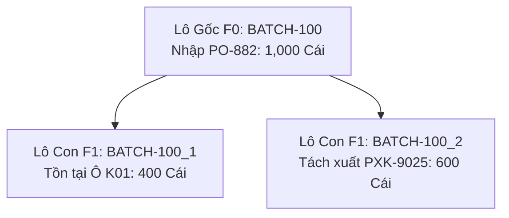

# Phân tích Thiết kế Logic UC-18 (INV-07) - Sơ Đồ Cây Gia Phả Lô (Genealogy Tree Lô Mẹ - Lô Con)

Tài liệu này đi sâu vào phân tích và thiết kế hệ thống ở 5 khía cạnh bắt buộc: **Business Logic**, **UI/UX Guidelines**, **Programming Logic**, **Data Logic**, và **Diagrams (Mermaid)** dành cho chức năng **Cây Gia Phả Lô & Truy Vết Nguồn Gốc (INV-07)** của Thủ kho, QC và Ban Giám Đốc.

---

## 1. Business Logic (Logic Nghiệp Vụ)

- **Mục tiêu cốt lõi:** Trực quan hóa toàn bộ phả hệ nguồn gốc và quá trình phân rã của Lô hàng từ Lô nhập kho ban đầu của Nhà cung cấp (Gốc F0) qua các lần tách thùng lẻ (F1, F2, F3...) và các lần xuất kho vào phân xưởng sản xuất. Cho phép truy vết ngược dòng 2 chiều.

---

## 2. Tiêu chuẩn Thiết kế Giao diện (UI/UX Guidelines)
- Đồ thị cây tương tác cao, mã màu trạng thái Lô tồn, Lô đã xuất, Lô lỗi.

---

## 3. Programming Logic (Logic Lập Trình)
- **Endpoint:** `GET /api/v1/inventory/batches/{batchId}/genealogy`
- **SP:** `api.usp_WMS_INV07_GetBatchGenealogy_v1`

---

## 4. Data Logic & Schema Model (Cấu Trúc Dữ Liệu)
- `dbo.tbl_map_nhapkho`: Cột `parent_batch_id` tự tham chiếu.

---

## 5. Diagrams (Mermaid Sơ Đồ Luồng Nghiệp Vụ)

