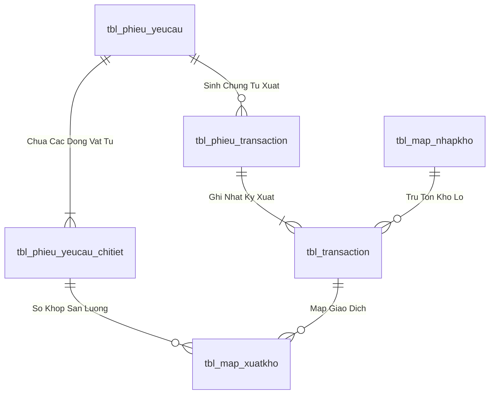
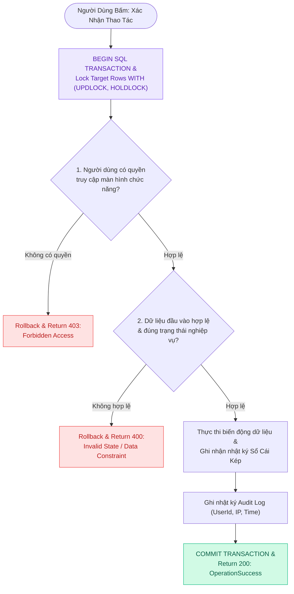
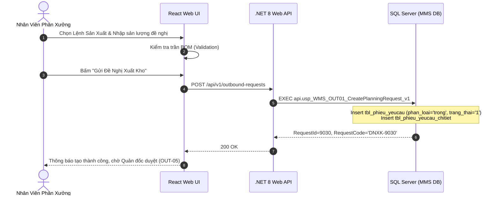

# Phân tích Thiết kế Logic UC-19 (OUT-01) - Đăng Ký Đề Nghị Xuất Kho Theo Định Mức BOM

Tài liệu này đi sâu vào phân tích và thiết kế hệ thống ở 5 khía cạnh bắt buộc: **Business Logic**, **UI/UX Guidelines**, **Programming Logic**, **Data Logic**, và **Diagrams (Mermaid)** dành cho chức năng **Đăng Ký Đề Nghị Xuất Kho Theo Định Mức Sản Xuất BOM (OUT-01)** của Nhân viên Phân xưởng / Kế hoạch sản xuất.

---

## 1. Business Logic (Logic Nghiệp Vụ)

- **Mục tiêu cốt lõi:** Đảm bảo thực thi quy trình nghiệp vụ chuẩn hóa, kiểm soát tính toàn vẹn của dữ liệu và tuân thủ các quy định vận hành kho vật tư & sản xuất của nhà máy Kềm Nghĩa.

- **Các quy tắc nghiệp vụ (Business Rules):**
  - `BR-GEN-01` **Ràng buộc xác thực & Phân quyền (Security & Access Control):** Người dùng bắt buộc phải có phiên đăng nhập hợp lệ và quyền màn hình tương ứng trong `api.vw_SEC_UserScreenAccess_v1`.
  - `BR-GEN-02` **Kiểm tra tính toàn vẹn dữ liệu đầu vào (Input Validation):** Mọi tham số gửi lên API đều phải được chuẩn hóa, trim khoảng trắng và kiểm tra định dạng trước khi thực thi.
  - `BR-GEN-03` **Tính nguyên tử của giao dịch (Atomic Transaction):** Mọi thao tác ghi biến động đều được thực thi trong khối `BEGIN TRANSACTION` với `SET XACT_ABORT ON`, tự động Rollback khi có lỗi.
  - `BR-GEN-04` **Khóa đồng thời chống xung đột dữ liệu (Concurrency Control):** Áp dụng gợi ý khóa `WITH (UPDLOCK, HOLDLOCK)` trên các bảng dữ liệu trọng yếu.
  - `BR-GEN-05` **Hạch toán biến động vào Sổ Cái Kép (Dual Ledger Posting):** Mọi biến động kho đều được ghi nhận vào sổ chi tiết `tbl_transaction` và cập nhật thẻ kho tổng hợp.
  - `BR-GEN-06` **Đồng bộ thời gian thực (Realtime Synchronization):** Đảm bảo tính nhất quán dữ liệu giữa Desktop Web, Handheld PDA và TV Wallboard.
  - `BR-GEN-07` **Ghi vết nhật ký kiểm toán (Audit Trail):** Tự động lưu vết người thực hiện, thời gian, IP và thiết bị cho mọi giao dịch quan trọng.

- **Quy trình tương tác 5 bước (Interaction Flow):**
  - **Bước 1:** Người dùng truy cập phân hệ chức năng tương ứng trên giao diện Web / PDA.
  - **Bước 2:** Nhập liệu các trường thông tin bắt buộc hoặc quét mã Barcode từ thiết bị.
  - **Bước 3:** Frontend validate client-side và gửi request API kèm Token xác thực.
  - **Bước 4:** Backend kiểm tra Fail-fast (Verify JWT $
ightarrow$ Verify Screen Permission $
ightarrow$ Validate Business Rules $
ightarrow$ Execute SQL Stored Procedure trong khối Transaction).
  - **Bước 5:** Backend cập nhật CSDL và trả về kết quả; Frontend hiển thị thông báo thành công, phát âm thanh phản hồi và cập nhật giao diện.

---

## 2. Tiêu chuẩn Thiết kế Giao diện (UI/UX Guidelines)

- **Thiết bị đích:** Máy tính Desktop Web & Tablet.
- **Yêu cầu trải nghiệm (UX Principles):**
  - **Form nhập liệu thông minh (Smart BOM Table):**
    - Bảng vật tư hiển thị rõ: Mã SKU, Tên vật tư, ĐVT, Định mức tiêu chuẩn / SP, Số lượng tồn kho hiện tại, Số lượng yêu cầu xuất.
    - Cột cảnh báo tồn kho: Nếu tồn kho khả dụng tại WMS thấp hơn số lượng yêu cầu, hiển thị badge màu vàng `⚠ Kho còn ít hơn nhu cầu`.
  - **Nút gửi đề nghị nổi bật:** Nút bấm màu xanh ngọc Emerald Gradient (`from-emerald-600 to-teal-700`) với icon gửi giấy tờ `ArrowUpFromLine`.

---

## 3. Programming Logic (Logic Lập Trình)

Quy trình xử lý mã lệnh được chia thành 2 lớp rõ rệt: **Frontend (React)** và **Backend (ASP.NET Core kết hợp SQL Stored Procedure)**.

### 3.1. Frontend (React - Component View)
- **State Management & Local Processing:**
  - Gọi API kéo dữ liệu cần thiết vào React State.
  - Sử dụng các hàm mảng JavaScript (`filter`, `map`, `reduce`) để xử lý gom nhóm, lọc tìm kiếm in-memory, tối ưu hóa băng thông và tạo trải nghiệm mượt mà không độ trễ.
- **UI Interaction & Ergonomics:**
  - Sử dụng cấu trúc Collapse / Accordion / Modal xem trước để tối ưu không gian hiển thị trên màn hình Handheld PDA và Desktop Web.

### 3.2. Backend (ASP.NET Core & SQL Server Stored Procedure)
- **Thin API Gateway Pattern:**
  - ASP.NET Core Minimal API / Controller không xử lý logic tính toán nghiệp vụ mà chỉ làm cổng Gateway mỏng (Xác thực JWT Cookie, kiểm tra quyền màn hình `vw_SEC_UserScreenAccess_v1`) và ủy thác toàn bộ cho SQL Server Stored Procedure.
- **Tận Dụng Multi-Result Set & ACID Transaction:**
  - SQL Stored Procedure trả về đồng thời nhiều Result Sets (Header info, Summary KPIs, Detailed Lines) trong một lần truy vấn duy nhất.
  - Các lệnh ghi dữ liệu áp dụng `SET XACT_ABORT ON`, `BEGIN TRANSACTION` và khóa dòng dữ liệu `WITH (UPDLOCK, HOLDLOCK)` đảm bảo an toàn tuyệt đối.

---

## 4. Data Logic & Schema Model (Thiết kế Dữ Liệu Chuyên Sâu)

### 4.1. Entity Relationship Diagram (ERD) & Schema Details

- **Bảng Header (`dbo.tbl_phieu_yeucau`):**
  - Khóa chính: `id_phieu_yeucau` (INT IDENTITY, Clustered Index).
  - Trạng thái duyệt: `trang_thai_phieu` (`'0'`: Hủy, `'1'`: Chờ duyệt, `'3'`: QĐ duyệt, `'4'`: Sẵn sàng xuất, `'5'`: Hoàn tất duyệt).
  - Trạng thái soạn hàng: `status_soanhang` (`'0'`: Chờ soạn, `'1'`: Đang soạn, `'2'`: Đã soạn xong, `'3'`: Đã nhận tại xưởng).
  - Chỉ mục: `IX_tbl_phieu_yeucau_status` on `(trang_thai_phieu, status_soanhang) INCLUDE (time_duyet, time_cre, bo_phan)`.
- **Bảng Chi tiết (`dbo.tbl_phieu_yeucau_chitiet`):**
  - Khóa chính: `id_chitiet_phieu` (INT IDENTITY), Khóa ngoại: `id_phieu_yeucau`, `id_vattu`.

### 4.2. Data Layer Architecture (Data Flow & Transaction Locking)

### 4.3. Conceptual State Model & Transition Rules
| Trạng Thái Ban Đầu | Hành Động / Trigger | Trạng Thái Sau Chuyển Đổi | Bảng CSDL Bị Cập Nhật |
| :--- | :--- | :--- | :--- |
| **DRAFT / Mới tạo** | Gửi đề nghị xuất (OUT-01/02/03) | `trang_thai_phieu = '1'`, `status_soanhang = '0'` | `tbl_phieu_yeucau` |
| **`trang_thai_phieu = '1'`** | Phê duyệt cấp 1 / 2 (OUT-05) | `trang_thai_phieu = '4'`, `status_soanhang = '0'` | `tbl_phieu_yeucau` (`time_duyet = Now`) |
| **`status_soanhang = '0'`** | Bấm Bắt đầu soạn (OUT-06) | `status_soanhang = '1'` | `tbl_phieu_yeucau`, chèn `tbl_phieu_transaction` |
| **`status_soanhang = '1'`** | Nhặt đủ 100% món (OUT-08) | `status_soanhang = '2'` | `tbl_phieu_yeucau`, `tbl_phieu_transaction` |
| **`status_soanhang = '2'`** | Xưởng ký nhận vật tư (OUT-09) | `status_soanhang = '3'` | `tbl_phieu_yeucau` |

---

## 5. Diagrams (Mermaid Sơ Đồ Luồng Nghiệp Vụ)

