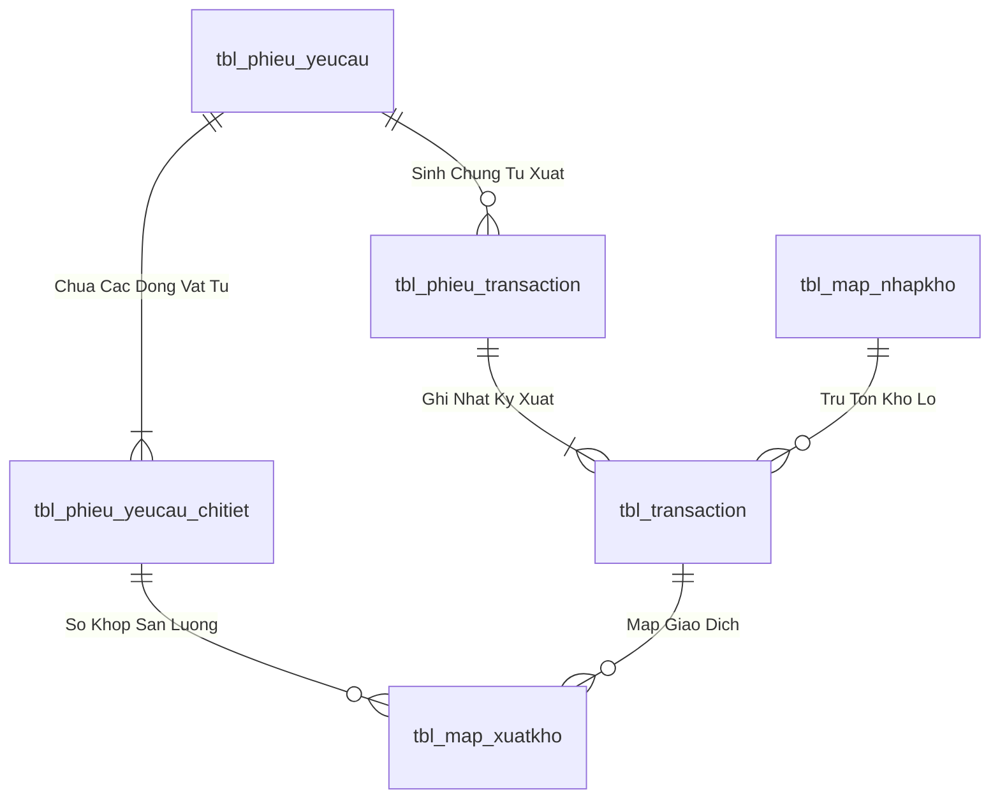
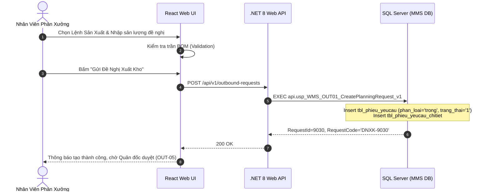

# Phân tích Thiết kế Logic UC-19 (OUT-01) - Đăng Ký Đề Nghị Xuất Kho Theo Định Mức BOM

Tài liệu này đi sâu vào phân tích và thiết kế hệ thống ở 5 khía cạnh bắt buộc: **Business Logic**, **UI/UX Guidelines**, **Programming Logic**, **Data Logic**, và **Diagrams (Mermaid)** dành cho chức năng **Đăng Ký Đề Nghị Xuất Kho Theo Định Mức Sản Xuất BOM (OUT-01)** của Nhân viên Phân xưởng / Kế hoạch sản xuất.

---

## 1. Business Logic (Logic Nghiệp Vụ)

- **Mục tiêu cốt lõi:** Cho phép nhân viên phân xưởng hoặc bộ phận kế hoạch lập phiếu đề nghị xuất kho vật tư (`tbl_phieu_yeucau`, `phan_loai = 'trong'`) căn cứ theo Lệnh Sản Xuất (LSX) và Định mức vật tư (Bill of Materials - BOM). Hệ thống tự động tính toán tổng nhu cầu vật tư, kiểm tra định mức cho phép, gán trạng thái khởi tạo `trang_thai_phieu = '1'` (Chờ duyệt) và gửi vào luồng phê duyệt của Quản đốc phân xưởng.

- **Các quy tắc nghiệp vụ (Business Rules):**
  - `BR-OUT-01-01` **Ràng buộc Lệnh sản xuất & Mã BOM (LSX & BOM Validation):**
    - Người lập phiếu bắt buộc phải chọn Mã Lệnh Sản Xuất (`ma_lenh_san_xuat` hoặc `planningUnit`) đang còn hiệu lực và đúng phân xưởng phụ trách.
    - Hệ thống tự động load cây định mức BOM tương ứng của sản phẩm để gợi ý danh mục vật tư, quy cách và hệ số tiêu hao.
  - `BR-OUT-01-02` **Khống chế trần định mức (BOM Ceiling Enforcement):**
    - Số lượng đề nghị không được vượt quá: `(Sản lượng LSX * Định mức BOM) - Số lượng đã xuất lũy kế`.
    - Nếu nhập vượt quá trần định mức, hệ thống tự động cảnh báo và chuyển hướng sang luồng Đề nghị xuất vượt định mức (`OUT-03`).
  - `BR-OUT-01-03` **Tính toàn vẹn của phiếu đề nghị (Request Data Integrity):**
    - Phiếu phải có ít nhất 1 dòng vật tư hợp lệ (`so_luong > 0`).
    - Phải xác định rõ thời gian cần giao hàng (`thoi_gian_can >= GETDATE()`) để kho bố trí nhân sự nhặt hàng kịp tiến độ sản xuất.
  - `BR-OUT-01-04` **Gán trạng thái khởi tạo (Initial State Transition):**
    - Phiếu mới tạo được gán `trang_thai_phieu = '1'` (Chờ duyệt), `status_soanhang = '0'` (Chờ soạn), `time_cre = GETDATE()`.

- **Quy trình tương tác 5 bước (Interaction Flow):**
  - **Bước 1:** Nhân viên phân xưởng truy cập màn hình "Tạo Đề Nghị Xuất Kho" (`/outbound/create`) và chọn loại phiếu "Xuất theo định mức BOM".
  - **Bước 2:** Chọn Lệnh Sản Xuất (LSX) và Phân xưởng nhận vật tư. Hệ thống tự động load bảng danh mục vật tư định mức.
  - **Bước 3:** Điều chỉnh sản lượng cần cấp phát theo ca/ngày và nhập ghi chú mục đích sử dụng.
  - **Bước 4:** Bấm **"Gửi Đề Nghị Xuất Kho"**. Backend kiểm tra trần BOM và lưu vào `tbl_phieu_yeucau` cùng `tbl_phieu_yeucau_chitiet`.
  - **Bước 5:** Hệ thống cấp mã phiếu `DNXK-xxxx`, hiển thị thông báo thành công và chuyển phiếu sang hàng đợi chờ Quản đốc phê duyệt.

---

## 2. Tiêu chuẩn Thiết kế Giao diện (UI/UX Guidelines)

- **Thiết bị đích:** Máy tính Desktop Web & Tablet.
- **Yêu cầu trải nghiệm (UX Principles):**
  - **Form nhập liệu thông minh (Smart BOM Table):**
    - Bảng vật tư hiển thị rõ: Mã SKU, Tên vật tư, ĐVT, Định mức tiêu chuẩn / SP, Số lượng tồn kho hiện tại, Số lượng yêu cầu xuất.
    - Cột cảnh báo tồn kho: Nếu tồn kho khả dụng tại WMS thấp hơn số lượng yêu cầu, hiển thị badge màu vàng `⚠ Kho còn ít hơn nhu cầu`.
  - **Nút gửi đề nghị nổi bật:** Nút bấm màu xanh ngọc Emerald Gradient (`from-emerald-600 to-teal-700`) với icon gửi giấy tờ `ArrowUpFromLine`.

---

## 3. Programming Logic (Logic Lập Trình)

### 3.1. Frontend Component (`CreateOutboundRequestModal.tsx`)

- **State Management & Submit Handler:**
```typescript
const handleSubmitPlanningRequest = async (formData: OutboundRequestFormData) => {
  try {
    setIsSubmitting(true);
    const result = await outboundService.createRequest({
      classification: 'trong', // Theo định mức BOM
      departmentCode: formData.departmentCode,
      destinationBravoCode: formData.destinationBravoCode,
      planningUnit: formData.planningUnit,
      neededAt: formData.neededAt,
      note: formData.note,
      lines: formData.lines.map(l => ({
        materialId: l.materialId,
        quantity: l.quantity,
        note: l.note
      }))
    });
    toast.success(`Đã tạo thành công đề nghị xuất kho DNXK-${result.requestId}!`);
    onClose();
    refreshRequests();
  } catch (err: any) {
    toast.error(err.message || 'Lỗi khi tạo đề nghị xuất kho.');
  } finally {
    setIsSubmitting(false);
  }
};
```

### 3.2. Backend API & Stored Procedure Execution

#### A. C# .NET 8 Web API (`OutboundRequestEndpoints.cs`)
- **Endpoint:** `POST /api/v1/outbound-requests`
```csharp
app.MapPost("/api/v1/outbound-requests", async (
    CreateOutboundRequestCommand command,
    HttpContext httpContext,
    IOutboundGateway gateway,
    CancellationToken ct) =>
{
    var userId = httpContext.User.FindFirst(ClaimTypes.NameIdentifier)?.Value 
                 ?? httpContext.Request.Headers["X-User-Id"].FirstOrDefault() 
                 ?? "SYSTEM";

    var result = await gateway.CreateRequestAsync(userId, command, ct);
    return Results.Ok(ApiResponse<CreateOutboundRequestResponse>.Success(result));
})
.WithName("CreateOutboundRequest")
.RequireAuthorization();
```

#### B. SQL Stored Procedure (`api.usp_WMS_OUT01_CreatePlanningRequest_v1`)
```sql
ALTER PROCEDURE api.usp_WMS_OUT01_CreatePlanningRequest_v1
    @UserId nvarchar(50),
    @DepartmentCode nvarchar(50),
    @DestinationBravoCode nvarchar(50),
    @PlanningUnit nvarchar(50),
    @NeededAt datetime,
    @Note nvarchar(500),
    @LinesJson nvarchar(max)
AS
BEGIN
    SET NOCOUNT ON;
    SET XACT_ABORT ON;

    IF NOT EXISTS
    (
        SELECT 1 FROM api.vw_SEC_UserScreenAccess_v1
        WHERE UserId = @UserId AND ScreenCode IN (N'scr_dengatxuat', N'scr_main')
    ) THROW 51001, N'Khong co quyen tao de nghi xuat kho.', 1;

    DECLARE @NewRequestId int, @Now datetime = GETDATE(), @RequesterName nvarchar(100);

    SELECT @RequesterName = hoten FROM dbo.tbl_dm_user WHERE user_n = @UserId;
    IF @RequesterName IS NULL SET @RequesterName = @UserId;

    BEGIN TRY
        BEGIN TRANSACTION;

        -- 1. Chèn Header phiếu đề nghị
        INSERT INTO dbo.tbl_phieu_yeucau (
            bo_phan, ma_bravo_bophan, nguoi_lap_phieu, thoi_gian_can, 
            phan_loai, don_vi_ke_hoach, ghi_chu, trang_thai_phieu, 
            status_soanhang, time_cre, user_cre
        )
        VALUES (
            @DepartmentCode, @DestinationBravoCode, @RequesterName, @NeededAt,
            N'trong', @PlanningUnit, @Note, N'1',
            N'0', @Now, @UserId
        );

        SET @NewRequestId = SCOPE_IDENTITY();

        -- 2. Chèn danh mục dòng vật tư
        INSERT INTO dbo.tbl_phieu_yeucau_chitiet (
            id_phieu_yeucau, id_vattu, id_bravo, ten_vattu, so_luong, unit, ghi_chu
        )
        SELECT 
            @NewRequestId,
            j.MaterialId,
            m.id_bravo,
            m.ten_vattu,
            j.Quantity,
            m.dvt,
            j.Note
        FROM OPENJSON(@LinesJson) WITH (
            MaterialId nvarchar(50) '$.materialId',
            Quantity decimal(18,4) '$.quantity',
            Note nvarchar(255) '$.note'
        ) AS j
        LEFT JOIN dbo.tbl_dm_vattu AS m ON m.id_vattu = j.MaterialId;

        COMMIT TRANSACTION;

        SELECT RequestId = @NewRequestId, RequestCode = CONCAT(N'DNXK-', @NewRequestId),
            StatusCode = N'1', CreatedAt = @Now;
    END TRY
    BEGIN CATCH
        IF XACT_STATE() <> 0 ROLLBACK TRANSACTION;
        THROW;
    END CATCH;
END;
```

---

## 4. Data Logic & Schema Model (Thiết kế Dữ Liệu Chuyên Sâu)

### 4.1. Entity Relationship Diagram (ERD) & Schema Details


- **Bảng Header (`dbo.tbl_phieu_yeucau`):**
  - Khóa chính: `id_phieu_yeucau` (INT IDENTITY, Clustered Index).
  - Trạng thái duyệt: `trang_thai_phieu` (`'0'`: Hủy, `'1'`: Chờ duyệt, `'3'`: QĐ duyệt, `'4'`: Sẵn sàng xuất, `'5'`: Hoàn tất duyệt).
  - Trạng thái soạn hàng: `status_soanhang` (`'0'`: Chờ soạn, `'1'`: Đang soạn, `'2'`: Đã soạn xong, `'3'`: Đã nhận tại xưởng).
  - Chỉ mục: `IX_tbl_phieu_yeucau_status` on `(trang_thai_phieu, status_soanhang) INCLUDE (time_duyet, time_cre, bo_phan)`.
- **Bảng Chi tiết (`dbo.tbl_phieu_yeucau_chitiet`):**
  - Khóa chính: `id_chitiet_phieu` (INT IDENTITY), Khóa ngoại: `id_phieu_yeucau`, `id_vattu`.

### 4.2. Data Flow & Transaction Locking Matrix
- **Cơ chế khóa đồng thời:** Stored Procedure áp dụng `SET XACT_ABORT ON` và `BEGIN TRANSACTION`.
- **Khóa dòng dữ liệu:** Sử dụng `WITH (UPDLOCK, HOLDLOCK)` trên `tbl_phieu_yeucau` và `tbl_batch_inv` để ngăn chặn hiện tượng Lost Update và xuất âm tồn kho khi nhiều nhân viên PDA thao tác đồng thời.
- **Rollback an toàn:** Bắt lỗi `CATCH` tự động kiểm tra `IF XACT_STATE() <> 0 ROLLBACK TRANSACTION` và ném lỗi nghiệp vụ kèm mã lỗi chuẩn.

### 4.3. Conceptual State Model & Transition Rules
| Trạng Thái Ban Đầu | Hành Động / Trigger | Trạng Thái Sau Chuyển Đổi | Bảng CSDL Bị Cập Nhật |
| :--- | :--- | :--- | :--- |
| **DRAFT / Mới tạo** | Gửi đề nghị xuất (OUT-01/02/03) | `trang_thai_phieu = '1'`, `status_soanhang = '0'` | `tbl_phieu_yeucau` |
| **`trang_thai_phieu = '1'`** | Phê duyệt cấp 1 / 2 (OUT-05) | `trang_thai_phieu = '4'`, `status_soanhang = '0'` | `tbl_phieu_yeucau` (`time_duyet = Now`) |
| **`status_soanhang = '0'`** | Bấm Bắt đầu soạn (OUT-06) | `status_soanhang = '1'` | `tbl_phieu_yeucau`, chèn `tbl_phieu_transaction` |
| **`status_soanhang = '1'`** | Nhặt đủ 100% món (OUT-08) | `status_soanhang = '2'` | `tbl_phieu_yeucau`, `tbl_phieu_transaction` |
| **`status_soanhang = '2'`** | Xưởng ký nhận vật tư (OUT-09) | `status_soanhang = '3'` | `tbl_phieu_yeucau` |

---

## 5. Diagrams (Mermaid Sơ Đồ Luồng Nghiệp Vụ)


