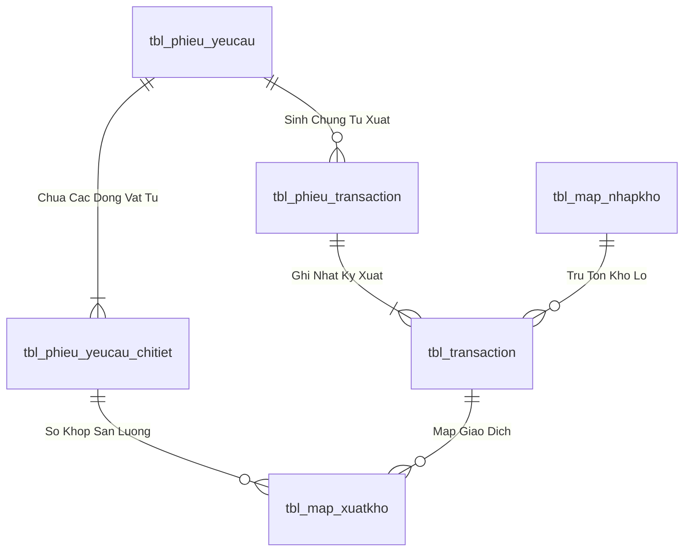
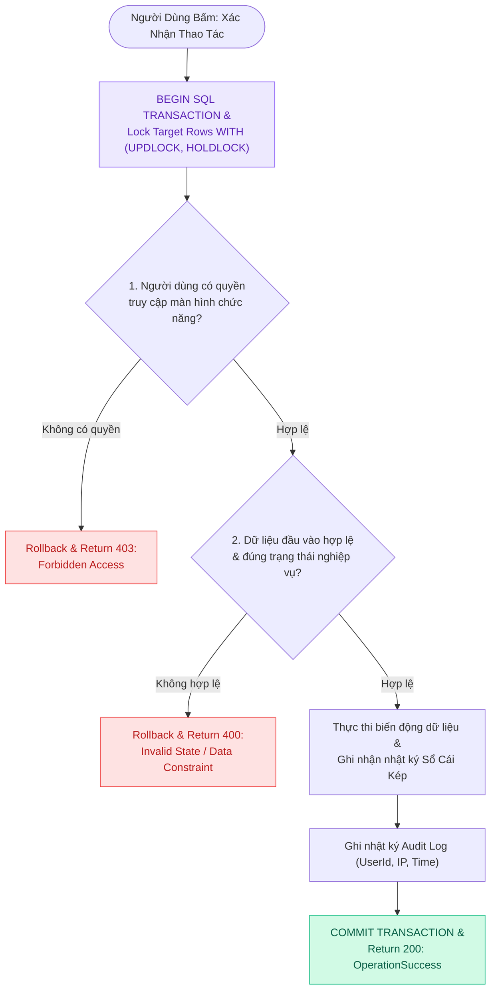
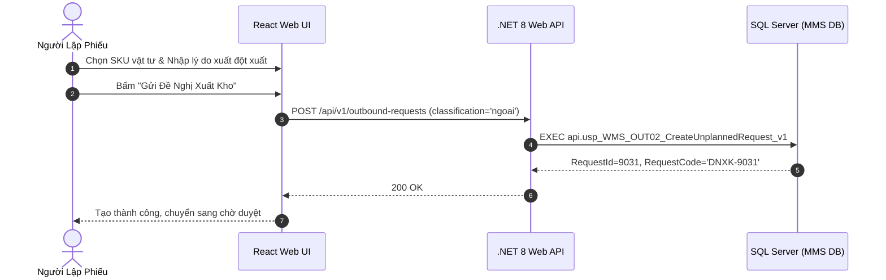

# Phân tích Thiết kế Logic UC-20 (OUT-02) - Đăng Ký Đề Nghị Xuất Kho Ngoài Định Mức (Đột Xuất)

Tài liệu này đi sâu vào phân tích và thiết kế hệ thống ở 5 khía cạnh bắt buộc: **Business Logic**, **UI/UX Guidelines**, **Programming Logic**, **Data Logic**, và **Diagrams (Mermaid)** dành cho chức năng **Đăng Ký Đề Nghị Xuất Kho Ngoài Định Mức / Đột Xuất (OUT-02)** của Nhân viên Phân xưởng / Kỹ thuật bảo trì.

---

## 1. Business Logic (Logic Nghiệp Vụ)

- **Mục tiêu cốt lõi:** Đảm bảo thực thi quy trình nghiệp vụ chuẩn hóa, kiểm soát tính toàn vẹn của dữ liệu và tuân thủ các quy định vận hành kho vật tư & sản xuất của nhà máy Kềm Nghĩa.

- **Các quy tắc nghiệp vụ (Business Rules):**
  - `BR-GEN-01` **Ràng buộc xác thực & Phân quyền (Security & Access Control):** Người dùng bắt buộc phải có phiên đăng nhập hợp lệ và quyền màn hình tương ứng trong `api.vw_SEC_UserScreenAccess_v1`.
  - `BR-GEN-02` **Kiểm tra tính toàn vẹn dữ liệu đầu vào (Input Validation):** Mọi tham số gửi lên API đều phải được chuẩn hóa, trim khoảng trắng và kiểm tra định dạng trước khi thực thi.
  - `BR-GEN-03` **Tính nguyên tử của giao dịch (Atomic Transaction):** Mọi thao tác ghi biến động đều được thực thi trong khối `BEGIN TRANSACTION` với `SET XACT_ABORT ON`, tự động Rollback khi có lỗi.
  - `BR-GEN-04` **Khóa đồng thời chống xung đột dữ liệu (Concurrency Control):** Áp dụng gợi ý khóa `WITH (UPDLOCK, HOLDLOCK)` trên các bảng dữ liệu trọng yếu.
  - `BR-GEN-05` **Hạch toán biến động vào Sổ Cái Kép (Dual Ledger Posting):** Mọi biến động kho đều được ghi nhận vào sổ chi tiết `tbl_transaction` và cập nhật thẻ kho tổng hợp.
  - `BR-GEN-06` **Đồng bộ thời gian thực (Realtime Synchronization):** Đảm bảo tính nhất quán dữ liệu giữa Desktop Web, Handheld PDA và TV Wallboard.
  - `BR-GEN-07` **Ghi vết nhật ký kiểm toán (Audit Trail):** Tự động lưu vết người thực hiện, thời gian, IP và thiết bị cho mọi giao dịch quan trọng.

- **Quy trình tương tác 5 bước (Interaction Flow):**
  - **Bước 1:** Người dùng truy cập phân hệ chức năng tương ứng trên giao diện Web / PDA.
  - **Bước 2:** Nhập liệu các trường thông tin bắt buộc hoặc quét mã Barcode từ thiết bị.
  - **Bước 3:** Frontend validate client-side và gửi request API kèm Token xác thực.
  - **Bước 4:** Backend kiểm tra Fail-fast (Verify JWT $
ightarrow$ Verify Screen Permission $
ightarrow$ Validate Business Rules $
ightarrow$ Execute SQL Stored Procedure trong khối Transaction).
  - **Bước 5:** Backend cập nhật CSDL và trả về kết quả; Frontend hiển thị thông báo thành công, phát âm thanh phản hồi và cập nhật giao diện.

---

## 2. Tiêu chuẩn Thiết kế Giao diện (UI/UX Guidelines)

- **Thiết bị đích:** Máy tính Desktop Web.
- **Yêu cầu trải nghiệm (UX Principles):**
  - **Khung nhập giải trình nổi bật:** Ô Textarea nhập lý do xuất ngoài định mức có viền cảnh báo màu cam nhẹ, gợi ý placeholder rõ ràng.
  - **Badge nhận diện loại phiếu:** Thẻ phiếu được gắn badge màu tím/cam `[ Ngoài Định Mức ]` để phân biệt ngay với phiếu theo định mức BOM.

---

## 3. Programming Logic (Logic Lập Trình)

Quy trình xử lý mã lệnh được chia thành 2 lớp rõ rệt: **Frontend (React)** và **Backend (ASP.NET Core kết hợp SQL Stored Procedure)**.

### 3.1. Frontend (React - Component View)
- **State Management & Local Processing:**
  - Gọi API kéo dữ liệu cần thiết vào React State.
  - Sử dụng các hàm mảng JavaScript (`filter`, `map`, `reduce`) để xử lý gom nhóm, lọc tìm kiếm in-memory, tối ưu hóa băng thông và tạo trải nghiệm mượt mà không độ trễ.
- **UI Interaction & Ergonomics:**
  - Sử dụng cấu trúc Collapse / Accordion / Modal xem trước để tối ưu không gian hiển thị trên màn hình Handheld PDA và Desktop Web.

### 3.2. Backend (ASP.NET Core & SQL Server Stored Procedure)
- **Thin API Gateway Pattern:**
  - ASP.NET Core Minimal API / Controller không xử lý logic tính toán nghiệp vụ mà chỉ làm cổng Gateway mỏng (Xác thực JWT Cookie, kiểm tra quyền màn hình `vw_SEC_UserScreenAccess_v1`) và ủy thác toàn bộ cho SQL Server Stored Procedure.
- **Tận Dụng Multi-Result Set & ACID Transaction:**
  - SQL Stored Procedure trả về đồng thời nhiều Result Sets (Header info, Summary KPIs, Detailed Lines) trong một lần truy vấn duy nhất.
  - Các lệnh ghi dữ liệu áp dụng `SET XACT_ABORT ON`, `BEGIN TRANSACTION` và khóa dòng dữ liệu `WITH (UPDLOCK, HOLDLOCK)` đảm bảo an toàn tuyệt đối.

---

## 4. Data Logic (Thiết kế Dữ Liệu)

### 4.1. Ma trận phân quyền CRUD

| Bảng / Thực thể Dữ Liệu | Create (Tạo) | Read (Đọc) | Update (Cập nhật) | Delete (Xóa) | Ý nghĩa nghiệp vụ trong Use Case |
| :--- | :---: | :---: | :---: | :---: | :--- |
| `dbo.tbl_phieu_yeucau` | - | **X** | **X** | - | Đọc thông tin đề nghị, Cập nhật `status_soanhang = '1'/'2'`, `time_cre`, `time_soan_xong` |
| `dbo.tbl_phieu_yeucau_chitiet` | - | **X** | - | - | Đọc danh mục vật tư SKU, quy cách và số lượng yêu cầu |
| `dbo.tbl_phieu_transaction` | **X** | **X** | **X** | - | Sinh Header chứng từ xuất kho Sổ Cái Kép (`nghiep_vu = 'OUT_CON'`), Cập nhật `trang_thai_phieu = '2'` |
| `dbo.tbl_batch_inv` / `tbl_map_nhapkho` | - | **X** | **X** | - | Trừ số lượng tồn kho vật lý khả dụng của Lô hàng (`so_luong = so_luong - @PickQty`) |
| `dbo.tbl_transaction` | **X** | **X** | - | - | Ghi Detail hạch toán xuất kho cấp Lô / Thùng vào Sổ Cái Kép |
| `dbo.tbl_map_xuatkho` | **X** | **X** | - | - | Ghi nhận quan hệ so khớp giữa dòng yêu cầu và bản ghi giao dịch xuất |
| `dbo.inventory_ledger` | **X** | **X** | - | - | Ghi Detail hạch toán kho cấp Thùng / Pallet |
| `dbo.item_ledger` | **X** | **X** | - | - | Ghi Detail hạch toán kho cấp Mã hàng SKU tổng hợp |
| `dbo.audit_log` | **X** | **X** | - | - | Ghi vết nhật ký truy cập kiểm toán hệ thống (`UserId`, `ClientIP`, `Time`) |

### 4.2. Định nghĩa Trạng thái (Conceptual State Model)

| Cột / Biến | Kiểu Dữ Liệu | Giá Trị Sau Confirm | Ý nghĩa Nghiệp vụ |
| :--- | :--- | :--- | :--- |
| `trang_thai_phieu` (trong `tbl_phieu_yeucau`) | `NVARCHAR(10)` | `'4'` / `'5'` | Đánh dấu phiếu đề nghị đã được phê duyệt hợp lệ, sẵn sàng chuyển cho Thủ kho soạn hàng |
| `status_soanhang` (trong `tbl_phieu_yeucau`) | `NVARCHAR(10)` | `'1'` (Đang soạn) / `'2'` (Đã soạn) | Hiển thị trạng thái soạn hàng realtime trên PDA và TV Dashboard |
| `trang_thai_phieu` (trong `tbl_phieu_transaction`) | `NVARCHAR(10)` | `'2'` (`'COMPLETED'`) | Khóa cứng chứng từ xuất kho WMS, đóng sổ không cho chèn thêm dòng |
| `status_qc` (trong `tbl_map_nhapkho`) | `VARCHAR(20)` | `'PASS'` / `'PASS_CHO_NHAP'` | Lô hàng đạt tiêu chuẩn chất lượng, mở khóa cho phép xuất dùng sản xuất |
| `trang_thai_ton` (trong `tbl_batch_inv`) | `NVARCHAR(10)` | `'1'` (`'AVAILABLE'`) | Tồn kho vật lý sẵn sàng cho xuất hàng / không bị khóa kiểm kê |
| `stock_type` | `VARCHAR(20)` | `'UNRESTRICTED'` | Loại kho tự do sử dụng (không bị giữ trong khu cách ly/quarantine) |

### 4.3. Data Layer Architecture (Data Flow & Transaction Locking)

- **Bảng Header (`dbo.tbl_phieu_yeucau`):**
  - Khóa chính: `id_phieu_yeucau` (INT IDENTITY, Clustered Index).
  - Trạng thái duyệt: `trang_thai_phieu` (`'0'`: Hủy, `'1'`: Chờ duyệt, `'3'`: QĐ duyệt, `'4'`: Sẵn sàng xuất, `'5'`: Hoàn tất duyệt).
  - Trạng thái soạn hàng: `status_soanhang` (`'0'`: Chờ soạn, `'1'`: Đang soạn, `'2'`: Đã soạn xong, `'3'`: Đã nhận tại xưởng).
  - Chỉ mục: `IX_tbl_phieu_yeucau_status` on `(trang_thai_phieu, status_soanhang) INCLUDE (time_duyet, time_cre, bo_phan)`.
- **Bảng Chi tiết (`dbo.tbl_phieu_yeucau_chitiet`):**
  - Khóa chính: `id_chitiet_phieu` (INT IDENTITY), Khóa ngoại: `id_phieu_yeucau`, `id_vattu`.

### 4.2. Data Layer Architecture (Data Flow & Transaction Locking)

---

## 5. Diagrams (Mermaid Sơ Đồ Luồng Nghiệp Vụ)

