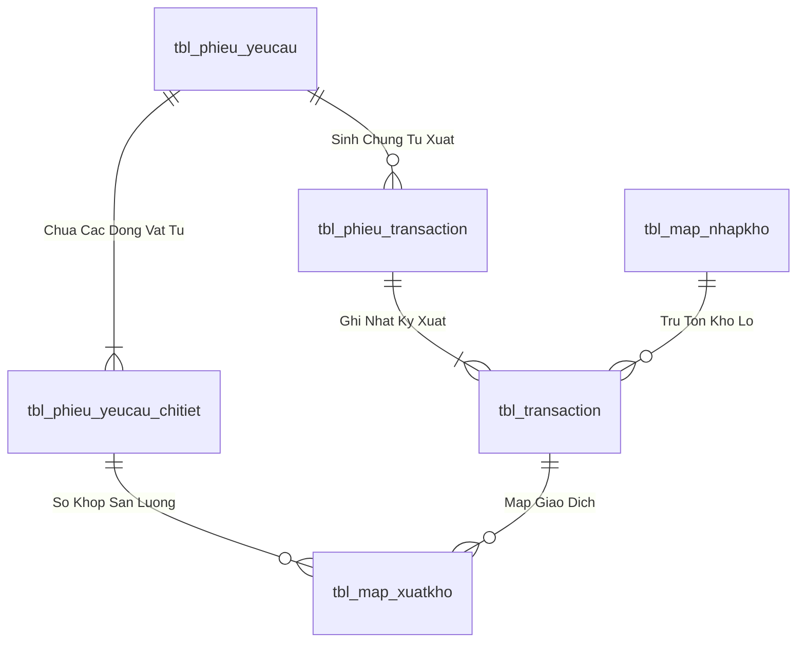
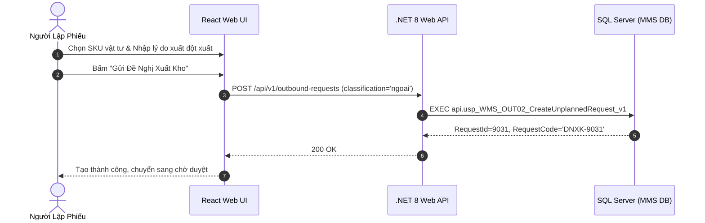

# Phân tích Thiết kế Logic UC-20 (OUT-02) - Đăng Ký Đề Nghị Xuất Kho Ngoài Định Mức (Đột Xuất)

Tài liệu này đi sâu vào phân tích và thiết kế hệ thống ở 5 khía cạnh bắt buộc: **Business Logic**, **UI/UX Guidelines**, **Programming Logic**, **Data Logic**, và **Diagrams (Mermaid)** dành cho chức năng **Đăng Ký Đề Nghị Xuất Kho Ngoài Định Mức / Đột Xuất (OUT-02)** của Nhân viên Phân xưởng / Kỹ thuật bảo trì.

---

## 1. Business Logic (Logic Nghiệp Vụ)

- **Mục tiêu cốt lõi:** Cho phép các bộ phận, xưởng sản xuất hoặc phòng ban bảo trì cơ điện lập phiếu đề nghị xuất các loại vật tư tiêu hao, phụ tùng thay thế, dụng cụ đồ gá hoặc vật tư phát sinh ngoài BOM sản xuất thông thường (`tbl_phieu_yeucau`, `phan_loai = 'ngoai'`). Yêu cầu bắt buộc phải giải trình lý do xuất kho rõ ràng trước khi gửi đến Quản đốc và Trưởng phòng liên quan xem xét.

- **Các quy tắc nghiệp vụ (Business Rules):**
  - `BR-OUT-02-01` **Bắt buộc nhập lý do và mục đích sử dụng (Mandatory Justification):**
    - Trường `ghi_chu` (lý do xuất ngoài định mức) bắt buộc phải có độ dài tối thiểu 10 ký tự, nêu rõ mục đích sử dụng (ví dụ: Thay thế linh kiện hỏng máy dập số 3, bổ sung phụ gia do biến tính hóa học, v.v.).
  - `BR-OUT-02-02` **Tra cứu và chọn trực tiếp mã SKU tự do (Free SKU Selection):**
    - Cho phép tìm kiếm toàn bộ danh mục 17,476 SKU vật tư của nhà máy (`tbl_dm_vattu`), không bị gò bó bởi cây định mức BOM của Lệnh Sản Xuất.
  - `BR-OUT-02-03` **Khởi tạo trạng thái và phân luồng duyệt (Approval Routing):**
    - Phiếu được tạo với `phan_loai = 'ngoai'`, `trang_thai_phieu = '1'` (Chờ duyệt).
    - Các phiếu xuất ngoài định mức có giá trị cao hoặc vật tư quý hiếm sẽ được hệ thống gắn cờ yêu cầu Ban Giám Đốc phê duyệt cấp 2.

- **Quy trình tương tác 5 bước (Interaction Flow):**
  - **Bước 1:** Người dùng chọn loại phiếu "Xuất ngoài định mức / Đột xuất" trên giao diện tạo đề nghị.
  - **Bước 2:** Chọn Phân xưởng/Bộ phận nhận và nhập chi tiết Lý do đề nghị xuất kho.
  - **Bước 3:** Tìm kiếm và thêm từng mã vật tư cần xuất, nhập số lượng và đơn vị tính.
  - **Bước 4:** Bấm **"Gửi Đề Nghị Xuất Kho Ngoài Định Mức"**.
  - **Bước 5:** Hệ thống sinh mã `DNXK-xxxx`, gửi thông báo đến Quản đốc phụ trách để thẩm tra và phê duyệt.

---

## 2. Tiêu chuẩn Thiết kế Giao diện (UI/UX Guidelines)

- **Thiết bị đích:** Máy tính Desktop Web.
- **Yêu cầu trải nghiệm (UX Principles):**
  - **Khung nhập giải trình nổi bật:** Ô Textarea nhập lý do xuất ngoài định mức có viền cảnh báo màu cam nhẹ, gợi ý placeholder rõ ràng.
  - **Badge nhận diện loại phiếu:** Thẻ phiếu được gắn badge màu tím/cam `[ Ngoài Định Mức ]` để phân biệt ngay với phiếu theo định mức BOM.

---

## 3. Programming Logic (Logic Lập Trình)

Quy trình xử lý mã lệnh được chia thành 2 lớp rõ rệt: **Frontend (React)** và **Backend (ASP.NET Core kết hợp SQL Stored Procedure)**.

### 3.1. Frontend (React - Component View)
- **State Management & Local Processing:**
  - Gọi API kéo dữ liệu cần thiết vào React State.
  - Sử dụng các hàm mảng JavaScript (`filter`, `map`, `reduce`) để xử lý gom nhóm, lọc tìm kiếm in-memory, tối ưu hóa băng thông và tạo trải nghiệm mượt mà không độ trễ.
- **UI Interaction & Ergonomics:**
  - Sử dụng cấu trúc Collapse / Accordion / Modal xem trước để tối ưu không gian hiển thị trên màn hình Handheld PDA và Desktop Web.

### 3.2. Backend (ASP.NET Core & SQL Server Stored Procedure)
- **Thin API Gateway Pattern:**
  - ASP.NET Core Minimal API / Controller không xử lý logic tính toán nghiệp vụ mà chỉ làm cổng Gateway mỏng (Xác thực JWT Cookie, kiểm tra quyền màn hình `vw_SEC_UserScreenAccess_v1`) và ủy thác toàn bộ cho SQL Server Stored Procedure.
- **Tận Dụng Multi-Result Set & ACID Transaction:**
  - SQL Stored Procedure trả về đồng thời nhiều Result Sets (Header info, Summary KPIs, Detailed Lines) trong một lần truy vấn duy nhất.
  - Các lệnh ghi dữ liệu áp dụng `SET XACT_ABORT ON`, `BEGIN TRANSACTION` và khóa dòng dữ liệu `WITH (UPDLOCK, HOLDLOCK)` đảm bảo an toàn tuyệt đối.

---

## 4. Data Logic & Schema Model (Thiết kế Dữ Liệu Chuyên Sâu)

### 4.1. Entity Relationship Diagram (ERD) & Schema Details

- **Bảng Header (`dbo.tbl_phieu_yeucau`):**
  - Khóa chính: `id_phieu_yeucau` (INT IDENTITY, Clustered Index).
  - Trạng thái duyệt: `trang_thai_phieu` (`'0'`: Hủy, `'1'`: Chờ duyệt, `'3'`: QĐ duyệt, `'4'`: Sẵn sàng xuất, `'5'`: Hoàn tất duyệt).
  - Trạng thái soạn hàng: `status_soanhang` (`'0'`: Chờ soạn, `'1'`: Đang soạn, `'2'`: Đã soạn xong, `'3'`: Đã nhận tại xưởng).
  - Chỉ mục: `IX_tbl_phieu_yeucau_status` on `(trang_thai_phieu, status_soanhang) INCLUDE (time_duyet, time_cre, bo_phan)`.
- **Bảng Chi tiết (`dbo.tbl_phieu_yeucau_chitiet`):**
  - Khóa chính: `id_chitiet_phieu` (INT IDENTITY), Khóa ngoại: `id_phieu_yeucau`, `id_vattu`.

### 4.2. Data Flow & Transaction Locking Matrix
- **Cơ chế khóa đồng thời:** Stored Procedure áp dụng `SET XACT_ABORT ON` và `BEGIN TRANSACTION`.
- **Khóa dòng dữ liệu:** Sử dụng `WITH (UPDLOCK, HOLDLOCK)` trên `tbl_phieu_yeucau` và `tbl_batch_inv` để ngăn chặn hiện tượng Lost Update và xuất âm tồn kho khi nhiều nhân viên PDA thao tác đồng thời.
- **Rollback an toàn:** Bắt lỗi `CATCH` tự động kiểm tra `IF XACT_STATE() <> 0 ROLLBACK TRANSACTION` và ném lỗi nghiệp vụ kèm mã lỗi chuẩn.

### 4.3. Conceptual State Model & Transition Rules
| Trạng Thái Ban Đầu | Hành Động / Trigger | Trạng Thái Sau Chuyển Đổi | Bảng CSDL Bị Cập Nhật |
| :--- | :--- | :--- | :--- |
| **DRAFT / Mới tạo** | Gửi đề nghị xuất (OUT-01/02/03) | `trang_thai_phieu = '1'`, `status_soanhang = '0'` | `tbl_phieu_yeucau` |
| **`trang_thai_phieu = '1'`** | Phê duyệt cấp 1 / 2 (OUT-05) | `trang_thai_phieu = '4'`, `status_soanhang = '0'` | `tbl_phieu_yeucau` (`time_duyet = Now`) |
| **`status_soanhang = '0'`** | Bấm Bắt đầu soạn (OUT-06) | `status_soanhang = '1'` | `tbl_phieu_yeucau`, chèn `tbl_phieu_transaction` |
| **`status_soanhang = '1'`** | Nhặt đủ 100% món (OUT-08) | `status_soanhang = '2'` | `tbl_phieu_yeucau`, `tbl_phieu_transaction` |
| **`status_soanhang = '2'`** | Xưởng ký nhận vật tư (OUT-09) | `status_soanhang = '3'` | `tbl_phieu_yeucau` |

---

## 5. Diagrams (Mermaid Sơ Đồ Luồng Nghiệp Vụ)

