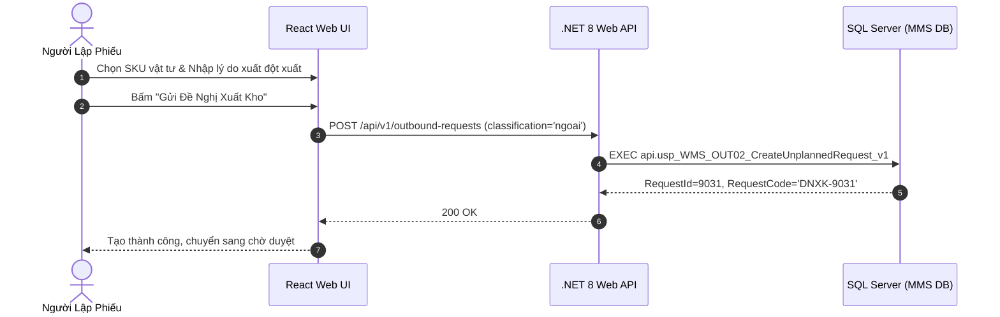

# Phân tích Thiết kế Logic UC-20 (OUT-02) - Đăng Ký Đề Nghị Xuất Kho Ngoài Định Mức (Đột Xuất)

Tài liệu này đi sâu vào phân tích và thiết kế hệ thống ở 5 khía cạnh bắt buộc: **Business Logic**, **UI/UX Guidelines**, **Programming Logic**, **Data Logic**, và **Diagrams (Mermaid)** dành cho chức năng **Đăng Ký Đề Nghị Xuất Kho Ngoài Định Mức / Đột Xuất (OUT-02)** của Nhân viên Phân xưởng / Kỹ thuật bảo trì.

---

## 1. Business Logic (Logic Nghiệp Vụ)

- **Mục tiêu cốt lõi:** Cho phép các bộ phận, xưởng sản xuất hoặc phòng ban bảo trì cơ điện lập phiếu đề nghị xuất các loại vật tư tiêu hao, phụ tùng thay thế, dụng cụ đồ gá hoặc vật tư phát sinh ngoài BOM sản xuất thông thường (`tbl_phieu_yeucau`, `phan_loai = 'ngoai'`). Yêu cầu bắt buộc phải giải trình lý do xuất kho rõ ràng trước khi gửi đến Quản đốc và Trưởng phòng liên quan xem xét.

- **Các quy tắc nghiệp vụ (Business Rules):**
  - `BR-OUT-02-01` **Bắt buộc nhập lý do và mục đích sử dụng (Mandatory Justification):**
    - Trường `ghi_chu` (lý do xuất ngoài định mức) bắt buộc phải có độ dài tối thiểu 10 ký tự, nêu rõ mục đích sử dụng (ví dụ: Thay thế linh kiện hỏng máy dập số 3, bổ sung phụ gia do biến tính hóa học, v.v.).
  - `BR-OUT-02-02` **Tra cứu và chọn trực tiếp mã SKU tự do (Free SKU Selection):**
    - Cho phép tìm kiếm toàn bộ danh mục 17,476 SKU vật tư của nhà máy (`tbl_dm_vattu`), không bị gò bó bởi cây định mức BOM của Lệnh Sản Xuất.
  - `BR-OUT-02-03` **Khởi tạo trạng thái và phân luồng duyệt (Approval Routing):**
    - Phiếu được tạo với `phan_loai = 'ngoai'`, `trang_thai_phieu = '1'` (Chờ duyệt).
    - Các phiếu xuất ngoài định mức có giá trị cao hoặc vật tư quý hiếm sẽ được hệ thống gắn cờ yêu cầu Ban Giám Đốc phê duyệt cấp 2.

- **Quy trình tương tác 5 bước (Interaction Flow):**
  - **Bước 1:** Người dùng chọn loại phiếu "Xuất ngoài định mức / Đột xuất" trên giao diện tạo đề nghị.
  - **Bước 2:** Chọn Phân xưởng/Bộ phận nhận và nhập chi tiết Lý do đề nghị xuất kho.
  - **Bước 3:** Tìm kiếm và thêm từng mã vật tư cần xuất, nhập số lượng và đơn vị tính.
  - **Bước 4:** Bấm **"Gửi Đề Nghị Xuất Kho Ngoài Định Mức"**.
  - **Bước 5:** Hệ thống sinh mã `DNXK-xxxx`, gửi thông báo đến Quản đốc phụ trách để thẩm tra và phê duyệt.

---

## 2. Tiêu chuẩn Thiết kế Giao diện (UI/UX Guidelines)

- **Thiết bị đích:** Máy tính Desktop Web.
- **Yêu cầu trải nghiệm (UX Principles):**
  - **Khung nhập giải trình nổi bật:** Ô Textarea nhập lý do xuất ngoài định mức có viền cảnh báo màu cam nhẹ, gợi ý placeholder rõ ràng.
  - **Badge nhận diện loại phiếu:** Thẻ phiếu được gắn badge màu tím/cam `[ Ngoài Định Mức ]` để phân biệt ngay với phiếu theo định mức BOM.

---

## 3. Programming Logic (Logic Lập Trình)

### 3.1. Frontend Component (`CreateUnplannedRequestModal.tsx`)

- **State Management & Submit Handler:**
```typescript
const handleSubmitUnplannedRequest = async (formData: UnplannedRequestFormData) => {
  try {
    setIsSubmitting(true);
    const result = await outboundService.createRequest({
      classification: 'ngoai', // Ngoài định mức
      departmentCode: formData.departmentCode,
      destinationBravoCode: formData.destinationBravoCode,
      neededAt: formData.neededAt,
      note: formData.reason,
      lines: formData.items.map(it => ({
        materialId: it.materialId,
        quantity: it.quantity,
        note: it.itemNote
      }))
    });
    toast.success(`Đã tạo thành công đề nghị xuất kho đột xuất DNXK-${result.requestId}!`);
    onClose();
    refreshRequests();
  } catch (err: any) {
    toast.error(err.message || 'Lỗi khi tạo phiếu xuất ngoài định mức.');
  } finally {
    setIsSubmitting(false);
  }
};
```

### 3.2. Backend API & Stored Procedure Execution

#### A. C# .NET 8 Web API
- **Endpoint:** `POST /api/v1/outbound-requests` (`classification = 'ngoai'`)

#### B. SQL Stored Procedure (`api.usp_WMS_OUT02_CreateUnplannedRequest_v1`)
```sql
ALTER PROCEDURE api.usp_WMS_OUT02_CreateUnplannedRequest_v1
    @UserId nvarchar(50),
    @DepartmentCode nvarchar(50),
    @DestinationBravoCode nvarchar(50),
    @NeededAt datetime,
    @Reason nvarchar(500),
    @LinesJson nvarchar(max)
AS
BEGIN
    SET NOCOUNT ON;
    SET XACT_ABORT ON;

    IF NOT EXISTS
    (
        SELECT 1 FROM api.vw_SEC_UserScreenAccess_v1
        WHERE UserId = @UserId AND ScreenCode IN (N'scr_dengatxuat', N'scr_main')
    ) THROW 51001, N'Khong co quyen tao de nghi xuat kho.', 1;

    IF LEN(ISNULL(@Reason, N'')) < 5
        THROW 51002, N'Ly do xuat ngoai dinh muc phai duoc ghi ro rang.', 1;

    DECLARE @NewRequestId int, @Now datetime = GETDATE(), @RequesterName nvarchar(100);
    SELECT @RequesterName = hoten FROM dbo.tbl_dm_user WHERE user_n = @UserId;
    IF @RequesterName IS NULL SET @RequesterName = @UserId;

    BEGIN TRY
        BEGIN TRANSACTION;

        INSERT INTO dbo.tbl_phieu_yeucau (
            bo_phan, ma_bravo_bophan, nguoi_lap_phieu, thoi_gian_can, 
            phan_loai, ghi_chu, trang_thai_phieu, status_soanhang, 
            time_cre, user_cre
        )
        VALUES (
            @DepartmentCode, @DestinationBravoCode, @RequesterName, @NeededAt,
            N'ngoai', @Reason, N'1', N'0',
            @Now, @UserId
        );

        SET @NewRequestId = SCOPE_IDENTITY();

        INSERT INTO dbo.tbl_phieu_yeucau_chitiet (
            id_phieu_yeucau, id_vattu, id_bravo, ten_vattu, so_luong, unit, ghi_chu
        )
        SELECT 
            @NewRequestId,
            j.MaterialId,
            m.id_bravo,
            m.ten_vattu,
            j.Quantity,
            m.dvt,
            j.Note
        FROM OPENJSON(@LinesJson) WITH (
            MaterialId nvarchar(50) '$.materialId',
            Quantity decimal(18,4) '$.quantity',
            Note nvarchar(255) '$.note'
        ) AS j
        LEFT JOIN dbo.tbl_dm_vattu AS m ON m.id_vattu = j.MaterialId;

        COMMIT TRANSACTION;

        SELECT RequestId = @NewRequestId, RequestCode = CONCAT(N'DNXK-', @NewRequestId),
            StatusCode = N'1', CreatedAt = @Now;
    END TRY
    BEGIN CATCH
        IF XACT_STATE() <> 0 ROLLBACK TRANSACTION;
        THROW;
    END CATCH;
END;
```

---

## 4. Data Logic & Schema Model (Cấu Trúc Dữ Liệu)

- **Bảng CSDL liên quan:**
  - `dbo.tbl_phieu_yeucau`: Lưu header (`phan_loai = 'ngoai'`, `trang_thai_phieu = '1'`).
  - `dbo.tbl_phieu_yeucau_chitiet`: Danh mục vật tư đột xuất.

---

## 5. Diagrams (Mermaid Sơ Đồ Luồng Nghiệp Vụ)

