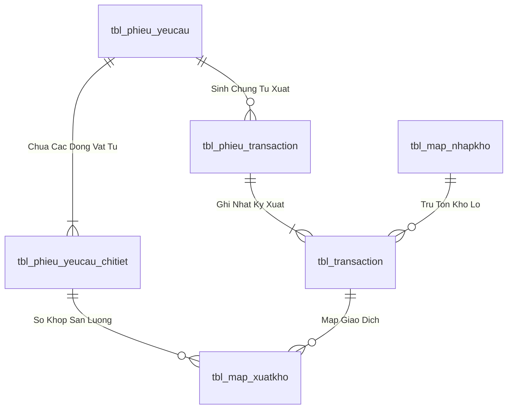
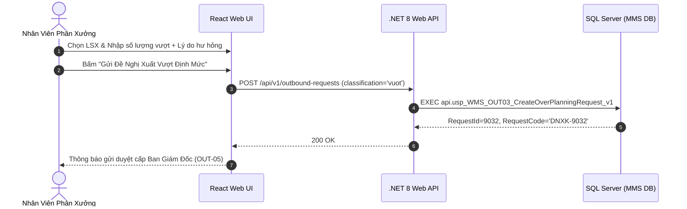

# Phân tích Thiết kế Logic UC-20 (OUT-03) - Đăng Ký Đề Nghị Xuất Kho Vượt Định Mức (Over-Planning)

Tài liệu này đi sâu vào phân tích và thiết kế hệ thống ở 5 khía cạnh bắt buộc: **Business Logic**, **UI/UX Guidelines**, **Programming Logic**, **Data Logic**, và **Diagrams (Mermaid)** dành cho chức năng **Đăng Ký Đề Nghị Xuất Kho Vượt Định Mức (OUT-03)** của Nhân viên Phân xưởng / Kế hoạch sản xuất.

---

## 1. Business Logic (Logic Nghiệp Vụ)

- **Mục tiêu cốt lõi:** Cho phép phân xưởng lập phiếu đề nghị xuất bổ sung vật tư khi lượng vật tư cấp phát theo BOM đã dùng hết nhưng do tỷ lệ hao hụt phôi lỗi, hư hỏng trong quá trình dập nguội/mài/nhiệt luyện vượt mức dự kiến (`tbl_phieu_yeucau`, `phan_loai = 'vuot'`). Phiếu này gắn chặt với Lệnh Sản Xuất gốc và bắt buộc phải qua quy trình phê duyệt nghiêm ngặt của Quản đốc và Ban Giám Đốc.

- **Các quy tắc nghiệp vụ (Business Rules):**
  - `BR-OUT-03-01` **Liên kết Lệnh Sản Xuất gốc (Mandatory Root LSX Linkage):**
    - Phiếu xuất vượt định mức bắt buộc phải tham chiếu đến một Lệnh Sản Xuất (`ma_lenh_san_xuat` hoặc `planningUnit`) đang chạy.
    - Hệ thống tính toán và hiển thị: *Tổng định mức gốc vs Lượng đã xuất thực tế vs Lượng vượt định mức xin cấp thêm*.
  - `BR-OUT-03-02` **Giải trình nguyên nhân hao hụt (Mandatory Defect Justification):**
    - Người lập phiếu bắt buộc phải chọn hoặc nhập nhóm nguyên nhân hao hụt vượt định mức (ví dụ: Lỗi phôi nứt trong lúc dập nóng, sai số kích thước mài, hỏng nhiệt luyện, v.v.).
  - `BR-OUT-03-03` **Phân quyền phê duyệt đặc biệt cấp Ban Giám Đốc:**
    - Mọi phiếu `phan_loai = 'vuot'` đều được hệ thống gắn cờ yêu cầu phê duyệt 2 cấp: Cấp 1 (Quản đốc phân xưởng xác nhận lỗi) $\rightarrow$ Cấp 2 (Ban Giám Đốc duyệt xuất chi phí vượt định mức).

- **Quy trình tương tác 5 bước (Interaction Flow):**
  - **Bước 1:** Người dùng chọn loại phiếu "Xuất vượt định mức" trên giao diện tạo đề nghị.
  - **Bước 2:** Chọn Lệnh Sản Xuất gốc. Hệ thống tự động tính toán tỷ lệ vượt định mức (`%`).
  - **Bước 3:** Nhập số lượng vật tư xin cấp thêm và giải trình chi tiết nguyên nhân hao hụt.
  - **Bước 4:** Bấm **"Gửi Đề Nghị Xuất Vượt Định Mức"**.
  - **Bước 5:** Hệ thống sinh mã `DNXK-xxxx`, chuyển phiếu vào luồng phê duyệt đặc biệt cấp Ban Giám Đốc.

---

## 2. Tiêu chuẩn Thiết kế Giao diện (UI/UX Guidelines)

- **Thiết bị đích:** Máy tính Desktop Web.
- **Yêu cầu trải nghiệm (UX Principles):**
  - **Chỉ số cảnh báo vượt định mức (Over-consumption Alert):** Hiển thị thanh đo tỷ lệ phần trăm vượt định mức (ví dụ: `+12.5% Vượt Định Mức`) bằng màu đỏ cảnh báo.
  - **Badge phân loại:** Badge màu đỏ `[ Vượt Định Mức ]` nổi bật trên toàn bộ các danh sách và phiếu in.

---

## 3. Programming Logic (Logic Lập Trình)

### 3.1. Frontend Component (`CreateOverPlanningRequestModal.tsx`)

- **State Management & Submit Handler:**
```typescript
const handleSubmitOverPlanningRequest = async (formData: OverPlanningFormData) => {
  try {
    setIsSubmitting(true);
    const result = await outboundService.createRequest({
      classification: 'vuot', // Vượt định mức
      departmentCode: formData.departmentCode,
      destinationBravoCode: formData.destinationBravoCode,
      planningUnit: formData.planningUnit,
      neededAt: formData.neededAt,
      note: `[VƯỢT ĐỊNH MỨC] Nguyên nhân: ${formData.defectReason} - Chi tiết: ${formData.note}`,
      lines: formData.items.map(it => ({
        materialId: it.materialId,
        quantity: it.overQuantity,
        note: it.itemNote
      }))
    });
    toast.success(`Đã tạo thành công đề nghị xuất vượt định mức DNXK-${result.requestId}!`);
    onClose();
    refreshRequests();
  } catch (err: any) {
    toast.error(err.message || 'Lỗi khi tạo phiếu xuất vượt định mức.');
  } finally {
    setIsSubmitting(false);
  }
};
```

### 3.2. Backend API & Stored Procedure Execution

#### A. C# .NET 8 Web API
- **Endpoint:** `POST /api/v1/outbound-requests` (`classification = 'vuot'`)

#### B. SQL Stored Procedure (`api.usp_WMS_OUT03_CreateOverPlanningRequest_v1`)
```sql
ALTER PROCEDURE api.usp_WMS_OUT03_CreateOverPlanningRequest_v1
    @UserId nvarchar(50),
    @DepartmentCode nvarchar(50),
    @DestinationBravoCode nvarchar(50),
    @PlanningUnit nvarchar(50),
    @NeededAt datetime,
    @Justification nvarchar(500),
    @LinesJson nvarchar(max)
AS
BEGIN
    SET NOCOUNT ON;
    SET XACT_ABORT ON;

    IF NOT EXISTS
    (
        SELECT 1 FROM api.vw_SEC_UserScreenAccess_v1
        WHERE UserId = @UserId AND ScreenCode IN (N'scr_dengatxuat', N'scr_main')
    ) THROW 51001, N'Khong co quyen tao de nghi xuat kho.', 1;

    DECLARE @NewRequestId int, @Now datetime = GETDATE(), @RequesterName nvarchar(100);
    SELECT @RequesterName = hoten FROM dbo.tbl_dm_user WHERE user_n = @UserId;
    IF @RequesterName IS NULL SET @RequesterName = @UserId;

    BEGIN TRY
        BEGIN TRANSACTION;

        INSERT INTO dbo.tbl_phieu_yeucau (
            bo_phan, ma_bravo_bophan, nguoi_lap_phieu, thoi_gian_can, 
            phan_loai, don_vi_ke_hoach, ghi_chu, trang_thai_phieu, 
            status_soanhang, time_cre, user_cre
        )
        VALUES (
            @DepartmentCode, @DestinationBravoCode, @RequesterName, @NeededAt,
            N'vuot', @PlanningUnit, @Justification, N'1',
            N'0', @Now, @UserId
        );

        SET @NewRequestId = SCOPE_IDENTITY();

        INSERT INTO dbo.tbl_phieu_yeucau_chitiet (
            id_phieu_yeucau, id_vattu, id_bravo, ten_vattu, so_luong, unit, ghi_chu
        )
        SELECT 
            @NewRequestId,
            j.MaterialId,
            m.id_bravo,
            m.ten_vattu,
            j.Quantity,
            m.dvt,
            j.Note
        FROM OPENJSON(@LinesJson) WITH (
            MaterialId nvarchar(50) '$.materialId',
            Quantity decimal(18,4) '$.quantity',
            Note nvarchar(255) '$.note'
        ) AS j
        LEFT JOIN dbo.tbl_dm_vattu AS m ON m.id_vattu = j.MaterialId;

        COMMIT TRANSACTION;

        SELECT RequestId = @NewRequestId, RequestCode = CONCAT(N'DNXK-', @NewRequestId),
            StatusCode = N'1', CreatedAt = @Now;
    END TRY
    BEGIN CATCH
        IF XACT_STATE() <> 0 ROLLBACK TRANSACTION;
        THROW;
    END CATCH;
END;
```

---

## 4. Data Logic & Schema Model (Thiết kế Dữ Liệu Chuyên Sâu)

### 4.1. Entity Relationship Diagram (ERD) & Schema Details


- **Bảng Header (`dbo.tbl_phieu_yeucau`):**
  - Khóa chính: `id_phieu_yeucau` (INT IDENTITY, Clustered Index).
  - Trạng thái duyệt: `trang_thai_phieu` (`'0'`: Hủy, `'1'`: Chờ duyệt, `'3'`: QĐ duyệt, `'4'`: Sẵn sàng xuất, `'5'`: Hoàn tất duyệt).
  - Trạng thái soạn hàng: `status_soanhang` (`'0'`: Chờ soạn, `'1'`: Đang soạn, `'2'`: Đã soạn xong, `'3'`: Đã nhận tại xưởng).
  - Chỉ mục: `IX_tbl_phieu_yeucau_status` on `(trang_thai_phieu, status_soanhang) INCLUDE (time_duyet, time_cre, bo_phan)`.
- **Bảng Chi tiết (`dbo.tbl_phieu_yeucau_chitiet`):**
  - Khóa chính: `id_chitiet_phieu` (INT IDENTITY), Khóa ngoại: `id_phieu_yeucau`, `id_vattu`.

### 4.2. Data Flow & Transaction Locking Matrix
- **Cơ chế khóa đồng thời:** Stored Procedure áp dụng `SET XACT_ABORT ON` và `BEGIN TRANSACTION`.
- **Khóa dòng dữ liệu:** Sử dụng `WITH (UPDLOCK, HOLDLOCK)` trên `tbl_phieu_yeucau` và `tbl_batch_inv` để ngăn chặn hiện tượng Lost Update và xuất âm tồn kho khi nhiều nhân viên PDA thao tác đồng thời.
- **Rollback an toàn:** Bắt lỗi `CATCH` tự động kiểm tra `IF XACT_STATE() <> 0 ROLLBACK TRANSACTION` và ném lỗi nghiệp vụ kèm mã lỗi chuẩn.

### 4.3. Conceptual State Model & Transition Rules
| Trạng Thái Ban Đầu | Hành Động / Trigger | Trạng Thái Sau Chuyển Đổi | Bảng CSDL Bị Cập Nhật |
| :--- | :--- | :--- | :--- |
| **DRAFT / Mới tạo** | Gửi đề nghị xuất (OUT-01/02/03) | `trang_thai_phieu = '1'`, `status_soanhang = '0'` | `tbl_phieu_yeucau` |
| **`trang_thai_phieu = '1'`** | Phê duyệt cấp 1 / 2 (OUT-05) | `trang_thai_phieu = '4'`, `status_soanhang = '0'` | `tbl_phieu_yeucau` (`time_duyet = Now`) |
| **`status_soanhang = '0'`** | Bấm Bắt đầu soạn (OUT-06) | `status_soanhang = '1'` | `tbl_phieu_yeucau`, chèn `tbl_phieu_transaction` |
| **`status_soanhang = '1'`** | Nhặt đủ 100% món (OUT-08) | `status_soanhang = '2'` | `tbl_phieu_yeucau`, `tbl_phieu_transaction` |
| **`status_soanhang = '2'`** | Xưởng ký nhận vật tư (OUT-09) | `status_soanhang = '3'` | `tbl_phieu_yeucau` |

---

## 5. Diagrams (Mermaid Sơ Đồ Luồng Nghiệp Vụ)


