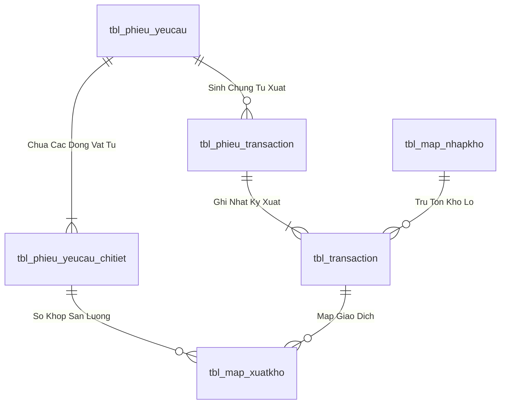
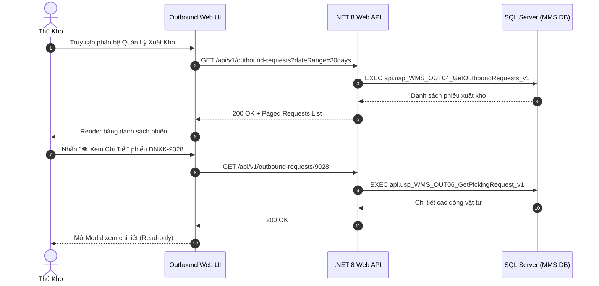

# Phân tích Thiết kế Logic UC-21 (OUT-04) - Tiếp Nhận & Thẩm Tra Danh Sách Đề Nghị Xuất Kho

Tài liệu này đi sâu vào phân tích và thiết kế hệ thống ở 5 khía cạnh bắt buộc: **Business Logic**, **UI/UX Guidelines**, **Programming Logic**, **Data Logic**, và **Diagrams (Mermaid)** dành cho chức năng **Tiếp Nhận & Thẩm Tra Danh Sách Đề Nghị Xuất Kho (OUT-04)** của Thủ kho / Quản lý kho.

---

## 1. Business Logic (Logic Nghiệp Vụ)

- **Mục tiêu cốt lõi:** Cung cấp cho Thủ kho và Quản lý kho bức tranh toàn cảnh về danh sách các đề nghị xuất kho từ tất cả các phân xưởng trong nhà máy (`tbl_phieu_yeucau`). Chức năng cho phép lọc theo trạng thái (`Chờ duyệt`, `Đã duyệt`, `Đang soạn`, `Đã xuất`, `Từ chối`), xem chi tiết số lượng yêu cầu vs Tồn kho khả dụng thực tế tại 540 ô kệ WMS, hủy phiếu không hợp lệ và theo dõi tiến độ cấp phát vật tư realtime.

- **Các quy tắc nghiệp vụ (Business Rules):**
  - `BR-OUT-04-01` **Bộ lọc đa chiều (Multi-dimension Query Filters):**
    - Lọc theo khoảng thời gian: Hôm nay, 7 ngày gần nhất, 30 ngày, Tất cả.
    - Lọc theo Phân xưởng / Bộ phận yêu cầu: NM1_Thành phẩm, NM2_Line Kéo, NM3_Tráng phủ kim loại, v.v.
    - Lọc theo Trạng thái phiếu: `ALL`, `PENDING_APPROVAL`, `APPROVED`, `PICKING`, `ISSUED`, `RECEIVED`, `REJECTED`.
  - `BR-OUT-04-02` **Tách bạch thao tác Phê duyệt (Approval Decoupling):**
    - Nhằm tuân thủ quy trình kiểm soát nội bộ và phân quyền độc lập, giao diện Tiếp nhận đề nghị xuất kho (OUT-01/02/03/04) đóng vai trò **Chỉ Xem (Read-only Detail)** đối với Thủ kho.
    - Mọi thao tác Phê duyệt / Từ chối được thực hiện trong phân hệ Phê duyệt đa cấp riêng biệt (`OUT-05`) dành cho Quản đốc và Ban Giám Đốc.
  - `BR-OUT-04-03` **Quyền hủy phiếu đề nghị (Cancellation Rules):**
    - Người lập phiếu hoặc Quản lý kho chỉ được phép hủy phiếu khi phiếu đang ở trạng thái `Chờ duyệt` (`trang_thai_phieu = '1'`) hoặc chưa bắt đầu soạn hàng (`status_soanhang = '0'`).
    - Khi hủy phiếu, hệ thống cập nhật `trang_thai_phieu = '0'`, ghi nhận lý do hủy và khóa phiếu vĩnh viễn.

- **Quy trình tương tác 5 bước (Interaction Flow):**
  - **Bước 1:** Thủ kho truy cập phân hệ "Quản Lý Xuất Kho" (`/outbound`).
  - **Bước 2:** Hệ thống tải bảng danh sách đề nghị xuất kho gần nhất (`api.usp_WMS_OUT04_GetOutboundRequests_v1`).
  - **Bước 3:** Thủ kho tìm kiếm theo mã phiếu, phân xưởng hoặc lọc theo tab trạng thái.
  - **Bước 4:** Nhấn nút **"👁️ Xem Chi Tiết"** tại dòng phiếu để mở Modal thông tin chi tiết (Hiển thị đầy đủ số lượng yêu cầu, tồn kho khả dụng, định mức).
  - **Bước 5:** Đối với phiếu cần hủy, nhấn nút "Hủy Phiếu", nhập lý do và xác nhận hủy.

---

## 2. Tiêu chuẩn Thiết kế Giao diện (UI/UX Guidelines)

- **Thiết bị đích:** Máy tính Desktop Web & Tablet.
- **Yêu cầu trải nghiệm (UX Principles):**
  - **Bảng dữ liệu công thái học (High-density Data Table):**
    - Hiển thị rõ: Mã phiếu (`DNXK-9025`), Loại đề nghị (Badge màu sắc), Phân xưởng, Người lập, Ngày cần, Số dòng hàng, Trạng thái.
    - Cột thao tác: Nút **`[ 👁️ Xem Chi Tiết ]`** màu xám nhẹ / viền slate tinh tế.
  - **Modal Chi Tiết Đề Nghị (Read-only Detail Modal):**
    - Hiển thị thông báo hướng dẫn: *"Phiếu đề nghị xuất kho này sẽ được Ban Quản Đốc / Ban Giám Đốc phê duyệt trong phân hệ và luồng phê duyệt riêng biệt."*
    - Bảng danh mục vật tư chi tiết, hỗ trợ in nháp hoặc xuất Excel.

---

## 3. Programming Logic (Logic Lập Trình)

Quy trình xử lý mã lệnh được chia thành 2 lớp rõ rệt: **Frontend (React)** và **Backend (ASP.NET Core kết hợp SQL Stored Procedure)**.

### 3.1. Frontend (React - Component View)
- **State Management & Local Processing:**
  - Gọi API kéo dữ liệu cần thiết vào React State.
  - Sử dụng các hàm mảng JavaScript (`filter`, `map`, `reduce`) để xử lý gom nhóm, lọc tìm kiếm in-memory, tối ưu hóa băng thông và tạo trải nghiệm mượt mà không độ trễ.
- **UI Interaction & Ergonomics:**
  - Sử dụng cấu trúc Collapse / Accordion / Modal xem trước để tối ưu không gian hiển thị trên màn hình Handheld PDA và Desktop Web.

### 3.2. Backend (ASP.NET Core & SQL Server Stored Procedure)
- **Thin API Gateway Pattern:**
  - ASP.NET Core Minimal API / Controller không xử lý logic tính toán nghiệp vụ mà chỉ làm cổng Gateway mỏng (Xác thực JWT Cookie, kiểm tra quyền màn hình `vw_SEC_UserScreenAccess_v1`) và ủy thác toàn bộ cho SQL Server Stored Procedure.
- **Tận Dụng Multi-Result Set & ACID Transaction:**
  - SQL Stored Procedure trả về đồng thời nhiều Result Sets (Header info, Summary KPIs, Detailed Lines) trong một lần truy vấn duy nhất.
  - Các lệnh ghi dữ liệu áp dụng `SET XACT_ABORT ON`, `BEGIN TRANSACTION` và khóa dòng dữ liệu `WITH (UPDLOCK, HOLDLOCK)` đảm bảo an toàn tuyệt đối.

---

## 4. Data Logic & Schema Model (Thiết kế Dữ Liệu Chuyên Sâu)

### 4.1. Entity Relationship Diagram (ERD) & Schema Details

- **Bảng Header (`dbo.tbl_phieu_yeucau`):**
  - Khóa chính: `id_phieu_yeucau` (INT IDENTITY, Clustered Index).
  - Trạng thái duyệt: `trang_thai_phieu` (`'0'`: Hủy, `'1'`: Chờ duyệt, `'3'`: QĐ duyệt, `'4'`: Sẵn sàng xuất, `'5'`: Hoàn tất duyệt).
  - Trạng thái soạn hàng: `status_soanhang` (`'0'`: Chờ soạn, `'1'`: Đang soạn, `'2'`: Đã soạn xong, `'3'`: Đã nhận tại xưởng).
  - Chỉ mục: `IX_tbl_phieu_yeucau_status` on `(trang_thai_phieu, status_soanhang) INCLUDE (time_duyet, time_cre, bo_phan)`.
- **Bảng Chi tiết (`dbo.tbl_phieu_yeucau_chitiet`):**
  - Khóa chính: `id_chitiet_phieu` (INT IDENTITY), Khóa ngoại: `id_phieu_yeucau`, `id_vattu`.

### 4.2. Data Flow & Transaction Locking Matrix
- **Cơ chế khóa đồng thời:** Stored Procedure áp dụng `SET XACT_ABORT ON` và `BEGIN TRANSACTION`.
- **Khóa dòng dữ liệu:** Sử dụng `WITH (UPDLOCK, HOLDLOCK)` trên `tbl_phieu_yeucau` và `tbl_batch_inv` để ngăn chặn hiện tượng Lost Update và xuất âm tồn kho khi nhiều nhân viên PDA thao tác đồng thời.
- **Rollback an toàn:** Bắt lỗi `CATCH` tự động kiểm tra `IF XACT_STATE() <> 0 ROLLBACK TRANSACTION` và ném lỗi nghiệp vụ kèm mã lỗi chuẩn.

### 4.3. Conceptual State Model & Transition Rules
| Trạng Thái Ban Đầu | Hành Động / Trigger | Trạng Thái Sau Chuyển Đổi | Bảng CSDL Bị Cập Nhật |
| :--- | :--- | :--- | :--- |
| **DRAFT / Mới tạo** | Gửi đề nghị xuất (OUT-01/02/03) | `trang_thai_phieu = '1'`, `status_soanhang = '0'` | `tbl_phieu_yeucau` |
| **`trang_thai_phieu = '1'`** | Phê duyệt cấp 1 / 2 (OUT-05) | `trang_thai_phieu = '4'`, `status_soanhang = '0'` | `tbl_phieu_yeucau` (`time_duyet = Now`) |
| **`status_soanhang = '0'`** | Bấm Bắt đầu soạn (OUT-06) | `status_soanhang = '1'` | `tbl_phieu_yeucau`, chèn `tbl_phieu_transaction` |
| **`status_soanhang = '1'`** | Nhặt đủ 100% món (OUT-08) | `status_soanhang = '2'` | `tbl_phieu_yeucau`, `tbl_phieu_transaction` |
| **`status_soanhang = '2'`** | Xưởng ký nhận vật tư (OUT-09) | `status_soanhang = '3'` | `tbl_phieu_yeucau` |

---

## 5. Diagrams (Mermaid Sơ Đồ Luồng Nghiệp Vụ)

