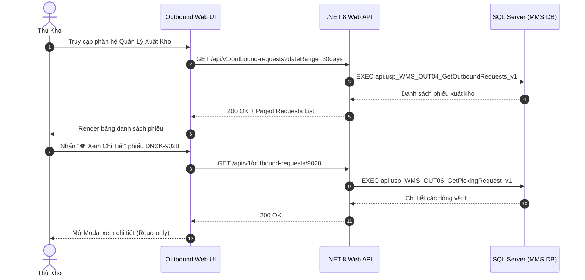

# Phân tích Thiết kế Logic UC-21 (OUT-04) - Tiếp Nhận & Thẩm Tra Danh Sách Đề Nghị Xuất Kho

Tài liệu này đi sâu vào phân tích và thiết kế hệ thống ở 5 khía cạnh bắt buộc: **Business Logic**, **UI/UX Guidelines**, **Programming Logic**, **Data Logic**, và **Diagrams (Mermaid)** dành cho chức năng **Tiếp Nhận & Thẩm Tra Danh Sách Đề Nghị Xuất Kho (OUT-04)** của Thủ kho / Quản lý kho.

---

## 1. Business Logic (Logic Nghiệp Vụ)

- **Mục tiêu cốt lõi:** Cung cấp cho Thủ kho và Quản lý kho bức tranh toàn cảnh về danh sách các đề nghị xuất kho từ tất cả các phân xưởng trong nhà máy (`tbl_phieu_yeucau`). Chức năng cho phép lọc theo trạng thái (`Chờ duyệt`, `Đã duyệt`, `Đang soạn`, `Đã xuất`, `Từ chối`), xem chi tiết số lượng yêu cầu vs Tồn kho khả dụng thực tế tại 540 ô kệ WMS, hủy phiếu không hợp lệ và theo dõi tiến độ cấp phát vật tư realtime.

- **Các quy tắc nghiệp vụ (Business Rules):**
  - `BR-OUT-04-01` **Bộ lọc đa chiều (Multi-dimension Query Filters):**
    - Lọc theo khoảng thời gian: Hôm nay, 7 ngày gần nhất, 30 ngày, Tất cả.
    - Lọc theo Phân xưởng / Bộ phận yêu cầu: NM1_Thành phẩm, NM2_Line Kéo, NM3_Tráng phủ kim loại, v.v.
    - Lọc theo Trạng thái phiếu: `ALL`, `PENDING_APPROVAL`, `APPROVED`, `PICKING`, `ISSUED`, `RECEIVED`, `REJECTED`.
  - `BR-OUT-04-02` **Tách bạch thao tác Phê duyệt (Approval Decoupling):**
    - Nhằm tuân thủ quy trình kiểm soát nội bộ và phân quyền độc lập, giao diện Tiếp nhận đề nghị xuất kho (OUT-01/02/03/04) đóng vai trò **Chỉ Xem (Read-only Detail)** đối với Thủ kho.
    - Mọi thao tác Phê duyệt / Từ chối được thực hiện trong phân hệ Phê duyệt đa cấp riêng biệt (`OUT-05`) dành cho Quản đốc và Ban Giám Đốc.
  - `BR-OUT-04-03` **Quyền hủy phiếu đề nghị (Cancellation Rules):**
    - Người lập phiếu hoặc Quản lý kho chỉ được phép hủy phiếu khi phiếu đang ở trạng thái `Chờ duyệt` (`trang_thai_phieu = '1'`) hoặc chưa bắt đầu soạn hàng (`status_soanhang = '0'`).
    - Khi hủy phiếu, hệ thống cập nhật `trang_thai_phieu = '0'`, ghi nhận lý do hủy và khóa phiếu vĩnh viễn.

- **Quy trình tương tác 5 bước (Interaction Flow):**
  - **Bước 1:** Thủ kho truy cập phân hệ "Quản Lý Xuất Kho" (`/outbound`).
  - **Bước 2:** Hệ thống tải bảng danh sách đề nghị xuất kho gần nhất (`api.usp_WMS_OUT04_GetOutboundRequests_v1`).
  - **Bước 3:** Thủ kho tìm kiếm theo mã phiếu, phân xưởng hoặc lọc theo tab trạng thái.
  - **Bước 4:** Nhấn nút **"👁️ Xem Chi Tiết"** tại dòng phiếu để mở Modal thông tin chi tiết (Hiển thị đầy đủ số lượng yêu cầu, tồn kho khả dụng, định mức).
  - **Bước 5:** Đối với phiếu cần hủy, nhấn nút "Hủy Phiếu", nhập lý do và xác nhận hủy.

---

## 2. Tiêu chuẩn Thiết kế Giao diện (UI/UX Guidelines)

- **Thiết bị đích:** Máy tính Desktop Web & Tablet.
- **Yêu cầu trải nghiệm (UX Principles):**
  - **Bảng dữ liệu công thái học (High-density Data Table):**
    - Hiển thị rõ: Mã phiếu (`DNXK-9025`), Loại đề nghị (Badge màu sắc), Phân xưởng, Người lập, Ngày cần, Số dòng hàng, Trạng thái.
    - Cột thao tác: Nút **`[ 👁️ Xem Chi Tiết ]`** màu xám nhẹ / viền slate tinh tế.
  - **Modal Chi Tiết Đề Nghị (Read-only Detail Modal):**
    - Hiển thị thông báo hướng dẫn: *"Phiếu đề nghị xuất kho này sẽ được Ban Quản Đốc / Ban Giám Đốc phê duyệt trong phân hệ và luồng phê duyệt riêng biệt."*
    - Bảng danh mục vật tư chi tiết, hỗ trợ in nháp hoặc xuất Excel.

---

## 3. Programming Logic (Logic Lập Trình)

### 3.1. Frontend Component (`OutboundPage.tsx`)

- **State Management & Detail View:**
```typescript
const [selectedRequestForDetail, setSelectedRequestForDetail] = useState<IssueRequest | null>(null);
const [requestLines, setRequestLines] = useState<OutboundRequestLineItem[]>([]);
const [isLoadingLines, setIsLoadingLines] = useState<boolean>(false);

const handleViewRequestDetail = async (req: IssueRequest) => {
  setSelectedRequestForDetail(req);
  setIsLoadingLines(true);
  try {
    const detail = await outboundService.getRequestDetail(Number(req.id));
    setRequestLines(detail?.lines || []);
  } catch (err) {
    console.error('Lỗi tải chi tiết dòng đề nghị:', err);
    setRequestLines([]);
  } finally {
    setIsLoadingLines(false);
  }
};
```

### 3.2. Backend API & Stored Procedure Execution

#### A. C# .NET 8 Web API (`OutboundRequestEndpoints.cs`)
- **Endpoint:** `GET /api/v1/outbound-requests` & `GET /api/v1/outbound-requests/{requestId}`

#### B. SQL Stored Procedure (`api.usp_WMS_OUT04_GetOutboundRequests_v1`)
```sql
ALTER PROCEDURE api.usp_WMS_OUT04_GetOutboundRequests_v1
    @UserId nvarchar(50),
    @DateFilter nvarchar(20) = N'30days',
    @DepartmentCode nvarchar(50) = NULL,
    @StatusCode nvarchar(20) = NULL,
    @Search nvarchar(100) = NULL,
    @Page int = 1,
    @PageSize int = 50
AS
BEGIN
    SET NOCOUNT ON;

    IF NOT EXISTS
    (
        SELECT 1 FROM api.vw_SEC_UserScreenAccess_v1
        WHERE UserId = @UserId AND ScreenCode IN (N'scr_dengatxuat', N'scr_main', N'scr_soanhang')
    ) THROW 51001, N'Khong co quyen xem danh sach de nghi xuat kho.', 1;

    DECLARE @FromDate datetime = CASE 
        WHEN @DateFilter = N'today' THEN CAST(GETDATE() AS date)
        WHEN @DateFilter = N'7days' THEN DATEADD(DAY, -7, GETDATE())
        WHEN @DateFilter = N'30days' THEN DATEADD(DAY, -30, GETDATE())
        ELSE '2000-01-01' END;

    SELECT 
        RequestId = req.id_phieu_yeucau,
        RequestCode = CONCAT(N'DNXK-', req.id_phieu_yeucau),
        Classification = req.phan_loai,
        DepartmentCode = req.bo_phan,
        DestinationName = req.ten_bravo_bophan,
        RequesterName = req.nguoi_lap_phieu,
        PlanningUnit = req.don_vi_ke_hoach,
        NeededAt = req.thoi_gian_can,
        ApprovedAt = req.time_duyet,
        CreatedAt = req.time_cre,
        RequestStatusCode = req.trang_thai_phieu,
        PickingStatusCode = ISNULL(req.status_soanhang, N'0'),
        TotalLines = COUNT(line.id_chitiet_phieu),
        TotalQuantity = SUM(ISNULL(line.so_luong, 0))
    FROM dbo.tbl_phieu_yeucau AS req
    LEFT JOIN dbo.tbl_phieu_yeucau_chitiet AS line ON line.id_phieu_yeucau = req.id_phieu_yeucau
    WHERE req.time_cre >= @FromDate
      AND (@DepartmentCode IS NULL OR req.bo_phan = @DepartmentCode)
      AND (@StatusCode IS NULL OR req.trang_thai_phieu = @StatusCode)
      AND (@Search IS NULL OR CONVERT(nvarchar, req.id_phieu_yeucau) LIKE N'%' + @Search + N'%' OR req.nguoi_lap_phieu LIKE N'%' + @Search + N'%')
    GROUP BY req.id_phieu_yeucau, req.phan_loai, req.bo_phan, req.ten_bravo_bophan, req.nguoi_lap_phieu, req.don_vi_ke_hoach, req.thoi_gian_can, req.time_duyet, req.time_cre, req.trang_thai_phieu, req.status_soanhang
    ORDER BY req.id_phieu_yeucau DESC
    OFFSET (@Page - 1) * @PageSize ROWS FETCH NEXT @PageSize ROWS ONLY;
END;
```

---

## 4. Data Logic & Schema Model (Cấu Trúc Dữ Liệu)

- **Bảng CSDL liên quan:**
  - `dbo.tbl_phieu_yeucau`: Truy vấn danh sách đề nghị xuất kho.
  - `dbo.tbl_phieu_yeucau_chitiet`: Danh mục chi tiết các dòng vật tư.

---

## 5. Diagrams (Mermaid Sơ Đồ Luồng Nghiệp Vụ)

