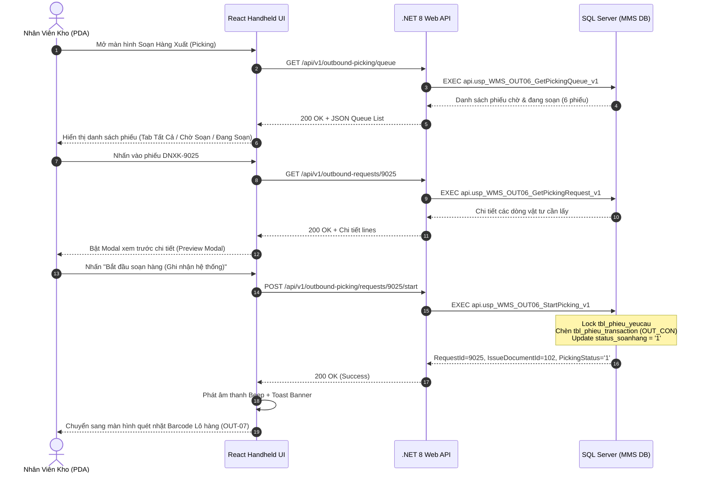

# Phân tích Thiết kế Logic UC-22 (OUT-06) - Lập Danh Sách Soạn Hàng & Phân Bổ Lộ Trình Picking

Tài liệu này đi sâu vào phân tích và thiết kế hệ thống ở 5 khía cạnh bắt buộc: **Business Logic**, **UI/UX Guidelines**, **Programming Logic**, **Data Logic**, và **Diagrams (Mermaid)** dành cho chức năng **Lập Danh Sách Soạn Hàng & Điều Phối Lộ Trình (OUT-06)** của Thủ kho / Nhân viên lấy hàng PDA.

---

## 1. Business Logic (Logic Nghiệp Vụ)

- **Mục tiêu cốt lõi:** Chuyển đổi các phiếu đề nghị xuất kho đã được phê duyệt hợp lệ (`trang_thai_phieu IN ('3', '4', '5')`) thành nhiệm vụ soạn hàng thực tế trong hàng đợi. Hệ thống tự động phân tích tồn kho khả dụng tại các Ô kệ theo nguyên tắc FIFO/FEFO, lập lộ trình di chuyển tối ưu cho nhân viên kho, tạo chứng từ xuất kho `tbl_phieu_transaction` (`nghiep_vu = 'OUT_CON'`) và chuyển trạng thái phiếu sang `status_soanhang = '1'` (Đang soạn hàng) ngay khi nhân viên bấm bắt đầu trên thiết bị PDA hoặc Web.

- **Các quy tắc nghiệp vụ (Business Rules):**
  - `BR-OUT-06-01` **Điều kiện tiếp nhận phiếu (Approval Prerequisite):** Chỉ các phiếu đề nghị xuất kho có trạng thái `trang_thai_phieu IN ('3', '4', '5')` và `ISNULL(status_soanhang, '0') IN ('0', '1')` mới được phép đưa vào hàng đợi soạn hàng trên màn hình Tivi Dashboard và thiết bị cầm tay PDA.
  - `BR-OUT-06-02` **Phân quyền thao tác (Screen Access Permission):** Người dùng phải có quyền truy cập các mã màn hình `scr_soanhang`, `scr_soanhang_chitiet`, `scr_mob_soanhang` trong `api.vw_SEC_UserScreenAccess_v1` để xem hàng đợi và bắt đầu soạn hàng.
  - `BR-OUT-06-03` **Kiểm tra tồn kho khả dụng (Available Stock Verification):** Lô hàng được đề xuất lấy phải thỏa mãn:
    - Trạng thái kiểm định: `status_qc IN ('PASS', 'PASS_CHO_NHAP')`.
    - Trạng thái lưu trữ: `status_kho IN ('STORED', 'ON_RACK')` hoặc `trang_thai_ton = '1'`.
    - Số lượng tồn khả dụng: `so_luong > 0`.
  - `BR-OUT-06-04` **Nguyên tắc ưu tiên lấy hàng (FIFO / FEFO Picking Strategy):** Các Lô nhập trước hoặc có hạn sử dụng gần nhất sẽ được hệ thống xếp lên đầu lộ trình lấy hàng để giảm thiểu tỷ lệ hàng hóa tồn đọng quá hạn.
  - `BR-OUT-06-05` **Khởi tạo chứng từ xuất kho nguyên tử (Atomic Transaction Initiation):** Khi nhân viên bấm "Bắt đầu soạn hàng", hệ thống tự động:
    1. Kiểm tra khóa `tbl_phieu_yeucau` với `UPDLOCK, HOLDLOCK`.
    2. Chèn bản ghi Header chứng từ `tbl_phieu_transaction` (`nghiep_vu = 'OUT_CON'`, `trang_thai_phieu = '1'`) nếu chưa tồn tại.
    3. Cập nhật `status_soanhang = '1'` và `time_cre = GETDATE()` vào `tbl_phieu_yeucau`.
    4. Toàn bộ chuỗi thao tác thực thi trong một SQL Transaction duy nhất, rollback 100% nếu có lỗi.
  - `BR-OUT-06-06` **Đồng bộ thời gian thực (Realtime Queue Synchronization):** Hàng đợi hiển thị đồng nhất trên cả 3 phân hệ: Màn hình Tivi giám sát (Dashboard), Màn hình Desktop Web của Thủ kho, và Màn hình thiết bị cầm tay PDA của nhân viên kho.

- **Quy trình tương tác 5 bước (Interaction Flow):**
  - **Bước 1:** Nhân viên kho mở phân hệ "Soạn Hàng Xuất (Picking)" trên PDA hoặc Web. Hệ thống tải danh sách các phiếu xuất đã duyệt sẵn sàng.
  - **Bước 2:** Nhân viên chạm/chọn vào một phiếu xuất cụ thể trong danh sách.
  - **Bước 3:** Hệ thống hiển thị hộp thoại xem trước (Preview Modal) đầy đủ thông tin: Phân xưởng nhận, Người lập, Thời gian cần, Mục đích, và danh sách các mã vật tư + số lượng cần lấy.
  - **Bước 4:** Nhân viên bấm nút **"Bắt đầu soạn hàng (Ghi nhận hệ thống)"**. Backend gọi SP `api.usp_WMS_OUT06_StartPicking_v1`, ghi nhận trạng thái Đang soạn (`status_soanhang = '1'`).
  - **Bước 5:** Màn hình chuyển sang giao diện quét nhặt hàng thực địa theo từng vị trí Ô kệ (Chuyển tiếp sang `OUT-07`).

---

## 2. Tiêu chuẩn Thiết kế Giao diện (UI/UX Guidelines)

- **Thiết bị đích:** Thiết bị cầm tay Handheld PDA (màn hình dọc 4.5" - 6"), Máy tính Desktop Web (Thủ kho điều phối), và Tivi Wallboard Dashboard giám sát.
- **Yêu cầu trải nghiệm (UX Principles):**
  - **Bố cục danh sách (Queue Layout):**
    - Hiển thị rõ mã phiếu dạng badge đậm (`DNXK-9025`), tên phân xưởng nhận, người đề nghị, thời gian cần.
    - Bộ lọc tab 3 trạng thái nhanh: `Tất Cả (n)`, `Chờ Soạn (n)` (Badge xanh lá `⏳ CHỜ SOẠN`), `Đang Soạn (n)` (Badge vàng cam `⚡ ĐANG SOẠN` có hiệu ứng pulse).
  - **Chỉ báo tiến độ:** Hiển thị tổng số lượng món vật tư cần nhặt trong phiếu (ví dụ: `4 món cần lấy →`).
  - **Nút hành động công thái học (Ergonomics Touch Targets):**
    - Nút bấm lớn tối thiểu 48px, áp dụng dải màu gradient nhận diện thương hiệu Kềm Nghĩa (`from-emerald-600 to-teal-700` với hiệu ứng glowing neon và độ nảy khi chạm `active:scale-95`).
    - Nút bắt đầu: **`[ 🚀 BẮT ĐẦU SOẠN HÀNG (GHI NHẬN HỆ THỐNG) ]`**.
  - **Phản hồi âm thanh & Trực quan:**
    - Âm thanh beep thành công (`soundManager.playSuccessBeep()`) khi kích hoạt đơn thành công.
    - Banner Toast màu xanh Emerald thông báo *"Đã ghi nhận bắt đầu soạn hàng cho phiếu DNXK-xxxx!"*.

---

## 3. Programming Logic (Logic Lập Trình)

### 3.1. Frontend Component (`HandheldPage.tsx` & `outboundApi.ts`)

- **State Management:**
```typescript
const [previewPickingOrder, setPreviewPickingOrder] = useState<IssueRequest | null>(null);
const [previewLines, setPreviewLines] = useState<OutboundRequestLineItem[]>([]);
const [isLoadingPreviewLines, setIsLoadingPreviewLines] = useState(false);
const [isStartingPicking, setIsStartingPicking] = useState(false);
const [pickingFilterTab, setPickingFilterTab] = useState<'ALL' | 'APPROVED' | 'PICKING'>('ALL');
```

- **Handling Open Preview & Start Picking:**
```typescript
const handleOpenPreviewPickingOrder = async (order: IssueRequest) => {
  setPreviewPickingOrder(order);
  setIsLoadingPreviewLines(true);
  try {
    const detail = await outboundService.getRequestDetail(Number(order.id));
    setPreviewLines(detail?.lines || []);
  } catch (err) {
    console.error('Lỗi tải chi tiết vật tư:', err);
    setPreviewLines([]);
  } finally {
    setIsLoadingPreviewLines(false);
  }
};

const handleConfirmStartPicking = async () => {
  if (!previewPickingOrder) return;
  setIsStartingPicking(true);
  try {
    if (previewPickingOrder.status === 'APPROVED') {
      await outboundService.startPicking(Number(previewPickingOrder.id));
      showBanner('success', `Đã ghi nhận bắt đầu soạn hàng cho phiếu ${previewPickingOrder.code}!`);
      soundManager.playSuccessBeep();
      if (refreshIssueRequests) refreshIssueRequests();
    }

    const items: IssueItem[] = previewLines.map(ln => ({
      id: ln.lineId.toString(),
      materialId: ln.materialId || '',
      materialCode: ln.materialId || '',
      materialName: ln.materialName || ln.materialId || 'Vật tư',
      unit: ln.unit || 'Cái',
      requestedQuantity: ln.quantity,
      approvedQuantity: ln.quantity,
      issuedQuantity: 0
    }));

    setSelectedIssueRequest({
      ...previewPickingOrder,
      status: 'PICKING',
      items
    });
    setPickingItemIndex(0);
    setPreviewPickingOrder(null);
  } catch (err: any) {
    showBanner('error', err.message || 'Lỗi khi bắt đầu soạn hàng');
    soundManager.playErrorBuzzer();
  } finally {
    setIsStartingPicking(false);
  }
};
```

### 3.2. Backend API & Stored Procedure Execution

#### A. C# .NET 8 Web API (`OutboundPickingEndpoints.cs`)
- **Endpoint:** `POST /api/v1/outbound-picking/requests/{requestId}/start`
```csharp
app.MapPost("/api/v1/outbound-picking/requests/{requestId:int}/start", async (
    int requestId,
    HttpContext httpContext,
    IOutboundPickingGateway gateway,
    CancellationToken ct) =>
{
    var userId = httpContext.User.FindFirst(ClaimTypes.NameIdentifier)?.Value 
                 ?? httpContext.Request.Headers["X-User-Id"].FirstOrDefault() 
                 ?? "SYSTEM";

    var result = await gateway.StartPickingAsync(userId, requestId, ct);
    return Results.Ok(ApiResponse<StartPickingResponse>.Success(result));
})
.WithName("StartPickingRequest")
.RequireAuthorization();
```

#### B. SQL Stored Procedure (`api.usp_WMS_OUT06_StartPicking_v1`)
```sql
ALTER PROCEDURE api.usp_WMS_OUT06_StartPicking_v1
    @UserId nvarchar(50), 
    @RequestId int
AS
BEGIN
    SET NOCOUNT ON;
    SET XACT_ABORT ON;

    IF NOT EXISTS
    (
        SELECT 1 FROM api.vw_SEC_UserScreenAccess_v1
        WHERE UserId = @UserId AND ScreenCode IN 
            (N'scr_soanhang', N'scr_soanhang_chitiet', N'scr_mob_soanhang', N'scr_main', N'scr_xuatkho_thutuc')
    ) THROW 51001, N'Khong co quyen bat dau soan hang.', 1;

    DECLARE @EmployeeCode nvarchar(50), @IssueDocumentId int, @Now datetime = GETDATE(),
        @Destination nvarchar(20), @Requester nvarchar(50), @PickingStatus nvarchar(20);

    SELECT @EmployeeCode = CONVERT(nvarchar(50), msnv) FROM dbo.tbl_dm_user
    WHERE user_n = @UserId AND ISNULL(status_active, 0) = 1;
    IF @EmployeeCode IS NULL SET @EmployeeCode = @UserId;

    BEGIN TRY
        BEGIN TRANSACTION;

        SELECT @Destination = LEFT(ma_bravo_bophan, 20), @Requester = nguoi_lap_phieu,
            @PickingStatus = ISNULL(status_soanhang, N'0')
        FROM dbo.tbl_phieu_yeucau WITH (UPDLOCK, HOLDLOCK)
        WHERE id_phieu_yeucau = @RequestId 
          AND trang_thai_phieu IN (N'3', N'4', N'5')
          AND ISNULL(status_soanhang, N'0') IN (N'0', N'1');

        IF @PickingStatus IS NULL THROW 51004, N'Phieu khong o trang thai cho hoac dang soan.', 1;

        SELECT TOP (1) @IssueDocumentId = id_phieu_trans
        FROM dbo.tbl_phieu_transaction WITH (UPDLOCK, HOLDLOCK)
        WHERE ma_yeucau = @RequestId AND nghiep_vu = N'OUT_CON'
          AND ISNULL(trang_thai_phieu, N'0') <> N'0' 
        ORDER BY id_phieu_trans DESC;

        IF @IssueDocumentId IS NULL
        BEGIN
            INSERT dbo.tbl_phieu_transaction
                (nghiep_vu, ma_kho_from, ma_kho_to, nguoi_nhan, user_cre, time_cre, trang_thai_phieu, ma_yeucau)
            VALUES (N'OUT_CON', N'20020100', @Destination, @Requester, @EmployeeCode, @Now, N'1', @RequestId);

            SET @IssueDocumentId = CONVERT(int, SCOPE_IDENTITY());
        END;

        IF @PickingStatus = N'0'
            UPDATE dbo.tbl_phieu_yeucau 
            SET status_soanhang = N'1', time_cre = @Now
            WHERE id_phieu_yeucau = @RequestId;

        COMMIT TRANSACTION;

        SELECT RequestId = @RequestId, IssueDocumentId = @IssueDocumentId,
            PickingStatusCode = N'1', StartedAt = @Now;
    END TRY
    BEGIN CATCH
        IF XACT_STATE() <> 0 ROLLBACK TRANSACTION;
        THROW;
    END CATCH;
END;
```

---

## 4. Data Logic & Schema Model (Cấu Trúc Dữ Liệu)

- **Bảng CSDL liên quan:**
  - `dbo.tbl_phieu_yeucau`: Header phiếu đề nghị xuất kho.
    - `id_phieu_yeucau` (PK, int): Mã định danh phiếu xuất (`DNXK-xxxx`).
    - `trang_thai_phieu` (nvarchar): Trạng thái duyệt (`'1'`: Chờ duyệt, `'3'`: QĐ duyệt, `'4'`: Chờ xuất, `'5'`: Hoàn tất duyệt).
    - `status_soanhang` (nvarchar): Trạng thái lấy hàng (`'0'`: Chờ soạn, `'1'`: Đang soạn, `'2'`: Đã soạn xong, `'3'`: Đã nhận tại xưởng).
    - `bo_phan`, `ten_bravo_bophan`: Phân xưởng / bộ phận nhận vật tư.
    - `thoi_gian_can`, `time_duyet`, `time_cre`: Dấu thời gian.
  - `dbo.tbl_phieu_yeucau_chitiet`: Danh mục chi tiết các món hàng trong phiếu.
    - `id_chitiet_phieu` (PK, int), `id_phieu_yeucau` (FK, int).
    - `id_vattu` (nvarchar), `id_bravo` (nvarchar), `ten_vattu` (nvarchar), `so_luong` (float), `unit` (nvarchar).
  - `dbo.tbl_phieu_transaction`: Chứng từ xuất kho thực tế.
    - `id_phieu_trans` (PK, int): Mã số phiếu xuất kho WMS.
    - `nghiep_vu` (`'OUT_CON'`), `ma_yeucau` (FK tới `id_phieu_yeucau`), `trang_thai_phieu` (`'1'`: Khởi tạo).

---

## 5. Diagrams (Mermaid Sơ Đồ Luồng Nghiệp Vụ)

