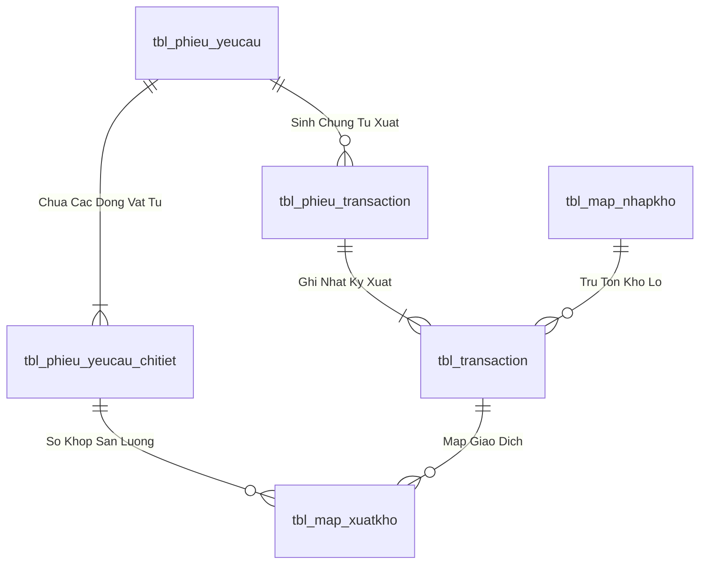
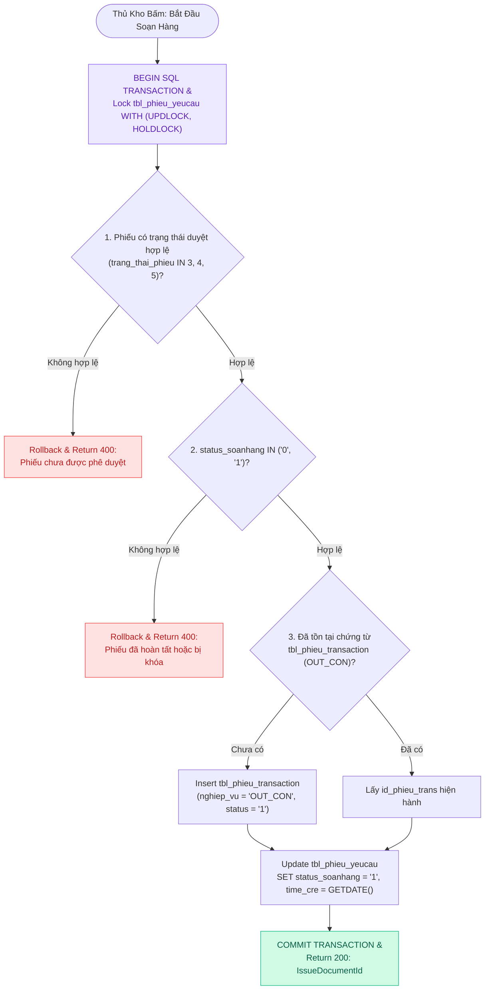
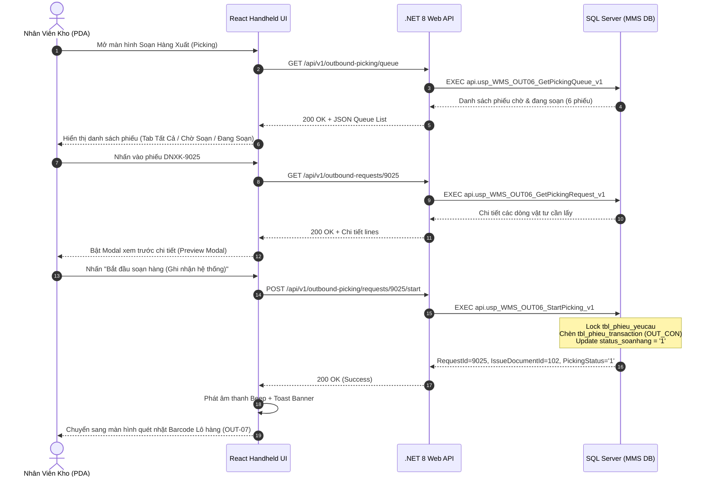
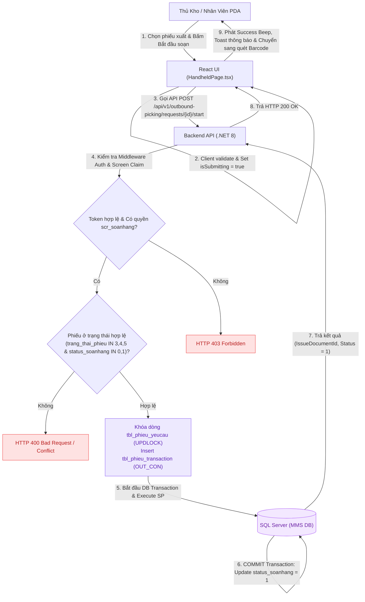

# Phân tích Thiết kế Logic UC-22 (OUT-06) - Lập Danh Sách Soạn Hàng & Phân Bổ Lộ Trình Picking

Tài liệu này đi sâu vào phân tích và thiết kế hệ thống ở 5 khía cạnh bắt buộc: **Business Logic**, **UI/UX Guidelines**, **Programming Logic**, **Data Logic**, và **Diagrams (Mermaid)** dành cho chức năng **Lập Danh Sách Soạn Hàng & Điều Phối Lộ Trình (OUT-06)** của Thủ kho / Nhân viên lấy hàng PDA.

---

## 1. Business Logic (Logic Nghiệp Vụ)

- **Mục tiêu cốt lõi:** Chuyển đổi các phiếu đề nghị xuất kho đã được phê duyệt hợp lệ (`trang_thai_phieu IN ('3', '4', '5')`) thành nhiệm vụ soạn hàng thực tế trong hàng đợi. Hệ thống tự động phân tích tồn kho khả dụng tại các Ô kệ theo nguyên tắc FIFO/FEFO, lập lộ trình di chuyển tối ưu cho nhân viên kho, tạo chứng từ xuất kho `tbl_phieu_transaction` (`nghiep_vu = 'OUT_CON'`) và chuyển trạng thái phiếu sang `status_soanhang = '1'` (Đang soạn hàng) ngay khi nhân viên bấm bắt đầu trên thiết bị PDA hoặc Web.

- **Các quy tắc nghiệp vụ (Business Rules):**
  - `BR-OUT-06-01` **Điều kiện tiếp nhận phiếu (Approval Prerequisite):** Chỉ các phiếu đề nghị xuất kho có trạng thái `trang_thai_phieu IN ('3', '4', '5')` và `ISNULL(status_soanhang, '0') IN ('0', '1')` mới được phép đưa vào hàng đợi soạn hàng trên màn hình Tivi Dashboard và thiết bị cầm tay PDA.
  - `BR-OUT-06-02` **Phân quyền thao tác (Screen Access Permission):** Người dùng phải có quyền truy cập các mã màn hình `scr_soanhang`, `scr_soanhang_chitiet`, `scr_mob_soanhang` trong `api.vw_SEC_UserScreenAccess_v1` để xem hàng đợi và bắt đầu soạn hàng.
  - `BR-OUT-06-03` **Kiểm tra tồn kho khả dụng (Available Stock Verification):** Lô hàng được đề xuất lấy phải thỏa mãn: Trạng thái kiểm định `status_qc IN ('PASS', 'PASS_CHO_NHAP')`, Trạng thái lưu trữ `status_kho IN ('STORED', 'ON_RACK')` hoặc `trang_thai_ton = '1'`, Số lượng tồn khả dụng `so_luong > 0`.
  - `BR-OUT-06-04` **Nguyên tắc ưu tiên lấy hàng (FIFO / FEFO Picking Strategy):** Các Lô nhập trước hoặc có hạn sử dụng gần nhất sẽ được hệ thống xếp lên đầu lộ trình lấy hàng để giảm thiểu tỷ lệ hàng hóa tồn đọng quá hạn.
  - `BR-OUT-06-05` **Khởi tạo chứng từ xuất kho nguyên tử (Atomic Transaction Initiation):** Khi nhân viên bấm "Bắt đầu soạn hàng", hệ thống tự động lock `tbl_phieu_yeucau` với `UPDLOCK, HOLDLOCK`, chèn Header chứng từ `tbl_phieu_transaction` (`nghiep_vu = 'OUT_CON'`, `trang_thai_phieu = '1'`) nếu chưa có, và cập nhật `status_soanhang = '1'`, `time_cre = GETDATE()` trong cùng một SQL Transaction.
  - `BR-OUT-06-06` **Đồng bộ thời gian thực (Realtime Queue Synchronization):** Hàng đợi hiển thị đồng nhất trên cả 3 phân hệ: Màn hình Tivi giám sát (Dashboard), Màn hình Desktop Web của Thủ kho, và Màn hình thiết bị cầm tay PDA của nhân viên kho.
  - `BR-OUT-06-07` **Ghi nhật ký bảo mật & Vết thao tác (Audit Trail):** Mọi thao tác bắt đầu soạn hàng hoặc hủy đơn đều được ghi nhận tự động vào bảng nhật ký giao dịch kèm theo thông tin `UserId`, `ClientIP` và `Dấu thời gian`.

- **Quy trình tương tác 5 bước (Interaction Flow):**
  - **Bước 1:** Nhân viên kho mở phân hệ "Soạn Hàng Xuất (Picking)" trên PDA (`HandheldPage.tsx`) hoặc Web. Hệ thống tải danh sách các phiếu xuất đã duyệt sẵn sàng.
  - **Bước 2:** Nhân viên chạm/chọn vào một phiếu xuất cụ thể trong danh sách (`handleOpenPreviewPickingOrder`). Màn hình hiển thị Modal xem trước chi tiết (Preview Modal).
  - **Bước 3:** Nhân viên kiểm tra danh mục vật tư, số lượng yêu cầu và bấm nút **"Bắt đầu soạn hàng (Ghi nhận hệ thống)"**. Frontend gửi request `POST /api/v1/outbound-picking/requests/{id}/start` kèm JWT Cookie/Bearer.
  - **Bước 4:** Backend kiểm tra Fail-fast: (Verify JWT $
ightarrow$ Check Screen Permission `scr_soanhang` $
ightarrow$ Verify Request Status IN ('3','4','5') $
ightarrow$ Lock Row `tbl_phieu_yeucau` $
ightarrow$ Insert/Fetch `tbl_phieu_transaction` $
ightarrow$ Update `status_soanhang = '1'` $
ightarrow$ Execute SP `usp_WMS_OUT06_StartPicking_v1`).
  - **Bước 5:** Backend trả về `200 OK` kèm `IssueDocumentId`. Frontend phát âm thanh `Success Beep`, hiển thị Toast banner và tự động chuyển sang giao diện quét nhặt Barcode Lô hàng thực địa (OUT-07).

---

## 2. Tiêu chuẩn Thiết kế Giao diện (UI/UX Guidelines)

- **Thiết bị đích:** Thiết bị cầm tay Handheld PDA (màn hình dọc 4.5" - 6"), Máy tính Desktop Web (Thủ kho điều phối), và Tivi Wallboard Dashboard giám sát.
- **Yêu cầu trải nghiệm (UX Principles):**
  - **Bố cục danh sách (Queue Layout):**
    - Hiển thị rõ mã phiếu dạng badge đậm (`DNXK-9025`), tên phân xưởng nhận, người đề nghị, thời gian cần.
    - Bộ lọc tab 3 trạng thái nhanh: `Tất Cả (n)`, `Chờ Soạn (n)` (Badge xanh lá `⏳ CHỜ SOẠN`), `Đang Soạn (n)` (Badge vàng cam `⚡ ĐANG SOẠN` có hiệu ứng pulse).
  - **Chỉ báo tiến độ:** Hiển thị tổng số lượng món vật tư cần nhặt trong phiếu (ví dụ: `4 món cần lấy →`).
  - **Nút hành động công thái học (Ergonomics Touch Targets):**
    - Nút bấm lớn tối thiểu 48px, áp dụng dải màu gradient nhận diện thương hiệu Kềm Nghĩa (`from-emerald-600 to-teal-700` với hiệu ứng glowing neon và độ nảy khi chạm `active:scale-95`).
    - Nút bắt đầu: **`[ 🚀 BẮT ĐẦU SOẠN HÀNG (GHI NHẬN HỆ THỐNG) ]`**.
  - **Phản hồi âm thanh & Trực quan:**
    - Âm thanh beep thành công (`soundManager.playSuccessBeep()`) khi kích hoạt đơn thành công.
    - Banner Toast màu xanh Emerald thông báo *"Đã ghi nhận bắt đầu soạn hàng cho phiếu DNXK-xxxx!"*.

---

## 3. Programming Logic (Logic Lập Trình)

Quy trình xử lý mã lệnh được chia thành 2 lớp rõ rệt: **Frontend (React - HandheldPage.tsx)** và **Backend (ASP.NET Core kết hợp SQL Stored Procedure)**.

### 3.1. Frontend (React - HandheldPage.tsx & outboundApi.ts)
- **State Management & Caching Cục Bộ:**
  - Gọi API `GET /api/v1/outbound-picking/queue` khi mở màn hình để kéo toàn bộ danh sách phiếu chờ và đang soạn hàng vào React State (`issueRequests`).
  - Sử dụng hàm JavaScript `useMemo()` và `Array.prototype.filter()` cục bộ để phân nhóm phiếu theo tiêu chí tab (`pickingFilterTab = 'ALL' | 'APPROVED' | 'PICKING'`) thay vì gọi lại API nhiều lần, tiết kiệm băng thông và đảm bảo phản hồi tức thì cho thao tác chuyển tab trên PDA.
- **Giao diện Xem Trước & Khởi Động Đơn Hàng (Preview Modal & Ergonomics):**
  - Khi nhân viên chạm vào 1 thẻ phiếu, hệ thống chỉ gọi API chi tiết `getRequestDetail()` 1 lần để lấy các dòng vật tư, lưu vào `previewLines`.
  - Sử dụng Modal tương phản cao hiển thị chi tiết vật tư, nút bấm lớn `btn-emerald-glow` kích hoạt lệnh bắt đầu soạn và cập nhật trạng thái Optimistic UI trước khi chuyển sang màn hình quét nhặt.

```typescript
// React State & Filter in HandheldPage.tsx
const [previewPickingOrder, setPreviewPickingOrder] = useState<IssueRequest | null>(null);
const [previewLines, setPreviewLines] = useState<OutboundRequestLineItem[]>([]);
const [pickingFilterTab, setPickingFilterTab] = useState<'ALL' | 'APPROVED' | 'PICKING'>('ALL');

const filteredPickingOrders = useMemo(() => {
  return approvedIssueOrders.filter(order => {
    if (pickingFilterTab === 'APPROVED') return order.status === 'APPROVED';
    if (pickingFilterTab === 'PICKING') return order.status === 'PICKING';
    return true;
  });
}, [approvedIssueOrders, pickingFilterTab]);
```

### 3.2. Backend (ASP.NET Core - OutboundPickingEndpoints.cs & SQL Server)
- **Kiến Trúc Thin API Gateway:**
  - Endpoint C# `POST /api/v1/outbound-picking/requests/{requestId}/start` không xử lý logic tính toán phức tạp mà chỉ trích xuất `UserId` từ Claims/Headers và ủy thác hoàn toàn cho Stored Procedure `api.usp_WMS_OUT06_StartPicking_v1`.
- **Tận Dụng Tính Năng Multi-Result Set Của SQL Server (`usp_WMS_OUT06_GetPickingRequest_v1`):**
  - **Result Set 1 (Request Header):** Cấu hình tổng quan của phiếu (`RequestId`, `DepartmentCode`, `RequesterName`, `NeededAt`, `RequestStatusCode`, `PickingStatusCode`, `CanStart`, `CanPick`).
  - **Result Set 2 (Line Items & Stock Summary):** Danh mục từng dòng vật tư kèm số lượng yêu cầu, số lượng đã xuất lũy kế và số lượng tồn khả dụng hiện tại trong kho (`AvailableQuantity`).
  - **Result Set 3 (Transaction History):** Chi tiết các lượt nhặt Lô đã phát sinh trước đó (`id_trans`, `id_batch`, `so_luong`, `location`).

```csharp
// ASP.NET Core Endpoint
app.MapPost("/api/v1/outbound-picking/requests/{requestId:int}/start", async (
    int requestId, HttpContext ctx, IOutboundPickingGateway gateway, CancellationToken ct) =>
{
    var userId = ctx.User.FindFirst(ClaimTypes.NameIdentifier)?.Value ?? "SYSTEM";
    var result = await gateway.StartPickingAsync(userId, requestId, ct);
    return Results.Ok(ApiResponse<StartPickingResponse>.Success(result));
}).RequireAuthorization();
```

```sql
-- SQL Stored Procedure với Multi-Result Set
ALTER PROCEDURE api.usp_WMS_OUT06_GetPickingRequest_v1
    @UserId nvarchar(50), @RequestId int
AS
BEGIN
    SET NOCOUNT ON;
    -- Result Set 1: Header Info
    SELECT RequestId = request.id_phieu_yeucau, DepartmentCode = request.bo_phan,
        RequestStatusCode = request.trang_thai_phieu, PickingStatusCode = ISNULL(request.status_soanhang, N'0')
    FROM dbo.tbl_phieu_yeucau AS request WHERE request.id_phieu_yeucau = @RequestId;

    -- Result Set 2: Line Items & Available Stock
    SELECT LineId = line.id_chitiet_phieu, MaterialId = line.id_vattu, MaterialName = line.ten_vattu,
        RequestedQuantity = line.so_luong, AvailableQuantity = ISNULL(stock.Qty, 0)
    FROM dbo.tbl_phieu_yeucau_chitiet AS line
    OUTER APPLY (SELECT Qty = SUM(so_luong) FROM dbo.tbl_batch_inv WHERE id_vattu = line.id_vattu AND trang_thai_ton = N'1') stock
    WHERE line.id_phieu_yeucau = @RequestId;

    -- Result Set 3: Picked Transactions
    SELECT TransactionId = t.id_trans, BatchId = t.id_batch, Quantity = t.so_luong, Location = b.location
    FROM dbo.tbl_transaction t
    LEFT JOIN dbo.tbl_batch_inv b ON b.id_batch = t.id_batch
    WHERE t.id_phieu_trans = @RequestId;
END;
```

---

## 4. Data Logic (Thiết kế Dữ Liệu)

### 4.1. Ma trận phân quyền CRUD

| Bảng / Thực thể Dữ Liệu | Create (Tạo) | Read (Đọc) | Update (Cập nhật) | Delete (Xóa) | Ý nghĩa nghiệp vụ trong Use Case |
| :--- | :---: | :---: | :---: | :---: | :--- |
| `dbo.tbl_phieu_yeucau` | - | **X** | **X** | - | Đọc thông tin đề nghị, Cập nhật `status_soanhang = '1'/'2'`, `time_cre`, `time_soan_xong` |
| `dbo.tbl_phieu_yeucau_chitiet` | - | **X** | - | - | Đọc danh mục vật tư SKU, quy cách và số lượng yêu cầu |
| `dbo.tbl_phieu_transaction` | **X** | **X** | **X** | - | Sinh Header chứng từ xuất kho Sổ Cái Kép (`nghiep_vu = 'OUT_CON'`), Cập nhật `trang_thai_phieu = '2'` |
| `dbo.tbl_batch_inv` / `tbl_map_nhapkho` | - | **X** | **X** | - | Trừ số lượng tồn kho vật lý khả dụng của Lô hàng (`so_luong = so_luong - @PickQty`) |
| `dbo.tbl_transaction` | **X** | **X** | - | - | Ghi Detail hạch toán xuất kho cấp Lô / Thùng vào Sổ Cái Kép |
| `dbo.tbl_map_xuatkho` | **X** | **X** | - | - | Ghi nhận quan hệ so khớp giữa dòng yêu cầu và bản ghi giao dịch xuất |
| `dbo.inventory_ledger` | **X** | **X** | - | - | Ghi Detail hạch toán kho cấp Thùng / Pallet |
| `dbo.item_ledger` | **X** | **X** | - | - | Ghi Detail hạch toán kho cấp Mã hàng SKU tổng hợp |
| `dbo.audit_log` | **X** | **X** | - | - | Ghi vết nhật ký truy cập kiểm toán hệ thống (`UserId`, `ClientIP`, `Time`) |

### 4.2. Định nghĩa Trạng thái (Conceptual State Model)

| Cột / Biến | Kiểu Dữ Liệu | Giá Trị Sau Confirm | Ý nghĩa Nghiệp vụ |
| :--- | :--- | :--- | :--- |
| `trang_thai_phieu` (trong `tbl_phieu_yeucau`) | `NVARCHAR(10)` | `'4'` / `'5'` | Đánh dấu phiếu đề nghị đã được phê duyệt hợp lệ, sẵn sàng chuyển cho Thủ kho soạn hàng |
| `status_soanhang` (trong `tbl_phieu_yeucau`) | `NVARCHAR(10)` | `'1'` (Đang soạn) / `'2'` (Đã soạn) | Hiển thị trạng thái soạn hàng realtime trên PDA và TV Dashboard |
| `trang_thai_phieu` (trong `tbl_phieu_transaction`) | `NVARCHAR(10)` | `'2'` (`'COMPLETED'`) | Khóa cứng chứng từ xuất kho WMS, đóng sổ không cho chèn thêm dòng |
| `status_qc` (trong `tbl_map_nhapkho`) | `VARCHAR(20)` | `'PASS'` / `'PASS_CHO_NHAP'` | Lô hàng đạt tiêu chuẩn chất lượng, mở khóa cho phép xuất dùng sản xuất |
| `trang_thai_ton` (trong `tbl_batch_inv`) | `NVARCHAR(10)` | `'1'` (`'AVAILABLE'`) | Tồn kho vật lý sẵn sàng cho xuất hàng / không bị khóa kiểm kê |
| `stock_type` | `VARCHAR(20)` | `'UNRESTRICTED'` | Loại kho tự do sử dụng (không bị giữ trong khu cách ly/quarantine) |

### 4.3. Data Layer Architecture (Data Flow & Transaction Locking)



- **Bảng Header (`dbo.tbl_phieu_yeucau`):**
  - Khóa chính: `id_phieu_yeucau` (INT IDENTITY, Clustered Index).
  - Trạng thái duyệt: `trang_thai_phieu` (`'0'`: Hủy, `'1'`: Chờ duyệt, `'3'`: QĐ duyệt, `'4'`: Sẵn sàng xuất, `'5'`: Hoàn tất duyệt).
  - Trạng thái soạn hàng: `status_soanhang` (`'0'`: Chờ soạn, `'1'`: Đang soạn, `'2'`: Đã soạn xong, `'3'`: Đã nhận tại xưởng).
  - Chỉ mục: `IX_tbl_phieu_yeucau_status` on `(trang_thai_phieu, status_soanhang) INCLUDE (time_duyet, time_cre, bo_phan)`.
- **Bảng Chi tiết (`dbo.tbl_phieu_yeucau_chitiet`):**
  - Khóa chính: `id_chitiet_phieu` (INT IDENTITY), Khóa ngoại: `id_phieu_yeucau`, `id_vattu`.

### 4.2. Data Layer Architecture (Data Flow & Transaction Locking)



---

## 5. Diagrams (Mermaid Sơ Đồ Luồng Nghiệp Vụ)

### 5.1. Sơ Đồ Tuần Tự (Sequence Diagram)



---

### 5.2. Data Flow Diagram: Luồng Tiếp Nhận & Bắt Đầu Soạn Hàng (OUT-06)


