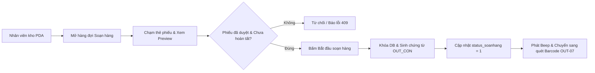
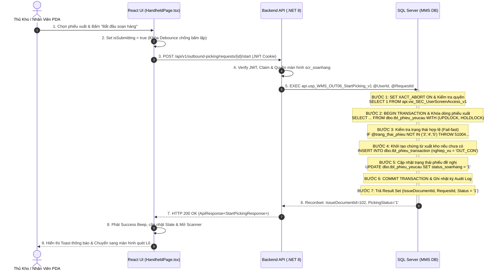
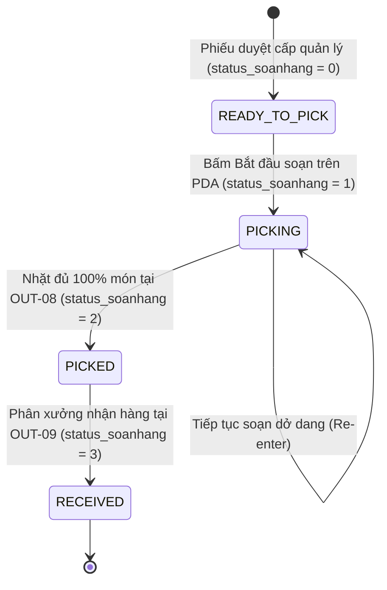
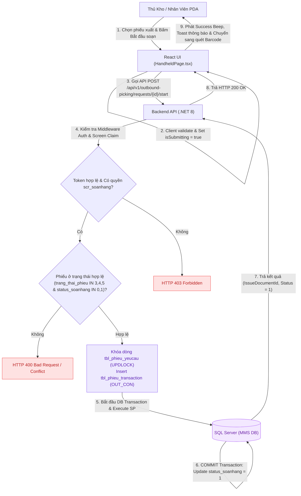

# UC-22 (OUT-06) — LẬP DANH SÁCH SOẠN HÀNG & PHÂN BỔ LỘ TRÌNH PICKING

## 0. Document Control

| Thuộc tính | Nội dung |
|---|---|
| Use Case ID | `UC-22 (OUT-06)` |
| Use Case Name | Lập Danh Sách Soạn Hàng & Phân Bổ Lộ Trình Picking |
| Module | `WMS / Outbound Picking (Xuất Kho & Soạn Hàng)` |
| Business Owner | Phòng Quản Lý Kho & Chuỗi Cung Ứng (KNSG) |
| Product Owner / BA | Đội Ngũ Phân Tích Nghiệp Vụ WMS |
| Technical Owner | Tech Lead / Architecture Team |
| Version | `v2.0` |
| Status | `Approved / Implemented` |
| Last Updated | `2026-08-22` |

---

# A. BUSINESS SPECIFICATION — WHAT

## 1. Use Case Overview

### 1.1. Business Objective
Chuyển đổi các phiếu đề nghị xuất kho đã được phê duyệt hợp lệ (`trang_thai_phieu IN ('3', '4', '5')`) thành nhiệm vụ soạn hàng thực tế trong hàng đợi. Hệ thống tự động phân tích tồn kho khả dụng tại các Ô kệ theo nguyên tắc FIFO/FEFO, lập lộ trình di chuyển tối ưu cho nhân viên kho, tạo chứng từ xuất kho `tbl_phieu_transaction` (`nghiep_vu = 'OUT_CON'`) và chuyển trạng thái phiếu sang `status_soanhang = '1'` (Đang soạn hàng) ngay khi nhân viên bấm bắt đầu trên thiết bị PDA hoặc Web.

### 1.2. Primary Actor
- **Thủ kho xuất hàng (Warehouse Keeper):** Theo dõi hàng đợi, điều phối và phân bổ lộ trình soạn hàng.
- **Nhân viên lấy hàng PDA (Picker / Warehouse Staff):** Xem danh sách phiếu chờ, xem trước danh mục vật tư và bấm bắt đầu soạn hàng trên máy quét cầm tay.

### 1.3. Secondary Actors / Systems
- **Màn hình Tivi Giám Sát (TV Wallboard Dashboard):** Tự động đồng bộ số liệu và hiển thị danh sách phiếu chờ/đang soạn realtime.
- **Phân xưởng sản xuất (Workshop Requesters):** Theo dõi tiến độ đơn hàng đề nghị xuất của đơn vị mình.

### 1.4. Trigger
- Nhân viên kho mở phân hệ "Soạn Hàng Xuất (Picking)" trên PDA hoặc Web và chọn một phiếu xuất ở trạng thái `⏳ CHỜ SOẠN` rồi bấm nút **"Bắt đầu soạn hàng"**.

### 1.5. Preconditions
1. Phiếu đề nghị xuất kho (`tbl_phieu_yeucau`) đã được phê duyệt hợp lệ (`trang_thai_phieu IN ('3', '4', '5')`).
2. Phiếu chưa hoàn tất xuất (`ISNULL(status_soanhang, '0') IN ('0', '1')`).
3. Tài khoản thao tác đã đăng nhập và được cấp quyền màn hình `scr_soanhang` hoặc `scr_mob_soanhang`.

### 1.6. Postconditions
#### Success
- Chứng từ xuất kho `tbl_phieu_transaction` (`nghiep_vu = 'OUT_CON'`) được khởi tạo/xác nhận với trạng thái `trang_thai_phieu = '1'`.
- `tbl_phieu_yeucau.status_soanhang` chuyển thành `'1'` (Đang soạn).
- Hàng đợi trên TV Dashboard chuyển phiếu từ Bảng Chờ sang trạng thái `⚡ ĐANG SOẠN`.
- PDA tự động chuyển sang giao diện quét nhặt Barcode Lô thực địa (OUT-07).

#### Failure
- Toàn bộ giao dịch bị Rollback, dữ liệu giữ nguyên ở trạng thái ban đầu.
- Trả mã lỗi và thông báo chi tiết, không làm thay đổi trạng thái phiếu.

### 1.7. Business Value / KPI Impact
| KPI / Chỉ số | Baseline | Expected Impact | Measurement |
|---|---:|---:|---|
| Thời gian phản hồi tiếp nhận đơn (Response Time) | 15 - 20 phút | < 2 phút | Đo từ lúc phiếu duyệt đến lúc bấm bắt đầu trên PDA |
| Tỷ lệ nhặt hàng đúng theo FIFO/FEFO | 70% | > 98% | So khớp ngày nhập Lô lấy thực tế vs Lô đề xuất |
| Tỷ lệ thất thoát / nhặt trùng đơn | 1.5% | 0.0% | Số vụ việc xung đột đơn hàng giữa các nhân viên kho |

---

## 2. Business Logic

### 2.1. Business Rules

| Rule ID | Tên quy tắc | Mô tả | Error / Response |
|---|---|---|---|
| `BR-OUT06-01` | Approval Prerequisite | Chỉ tiếp nhận phiếu có `trang_thai_phieu IN ('3', '4', '5')` và `status_soanhang IN ('0', '1')`. | `409 Conflict (WMS_REQ_NOT_READY)` |
| `BR-OUT06-02` | Authorization Gate | Người dùng phải có quyền `scr_soanhang`, `scr_soanhang_chitiet`, hoặc `scr_mob_soanhang` trong `api.vw_SEC_UserScreenAccess_v1`. | `403 Forbidden (AUTH_403)` |
| `BR-OUT06-03` | Available Stock Gate | Lô hàng đề xuất phải có `status_qc IN ('PASS', 'PASS_CHO_NHAP')`, `status_kho IN ('STORED', 'ON_RACK')`, `so_luong > 0`. | `409 Conflict (WMS_STOCK_UNAVAILABLE)` |
| `BR-OUT06-04` | FIFO/FEFO Priority | Sắp xếp thứ tự lấy hàng ưu tiên: Hạn sử dụng gần nhất (Exp Date) $\rightarrow$ Ngày nhập kho cũ nhất (FIFO). | - |
| `BR-OUT06-05` | Atomic Initiation | Khóa dòng `tbl_phieu_yeucau` với `UPDLOCK, HOLDLOCK`, sinh Header `tbl_phieu_transaction` và cập nhật `status_soanhang = '1'` trong 1 Transaction. | `500 Error (SYS_DB_TX_FAIL)` |
| `BR-OUT06-06` | Realtime Queue Sync | Cập nhật đồng bộ tức thời số liệu giữa Handheld PDA, Web và TV Dashboard. | - |
| `BR-OUT06-07` | Audit Trail | Ghi vết tự động `UserId`, `ClientIP`, `Timestamp` vào `tbl_sec_audit_log`. | - |

### 2.2. Decision Table

| Điều kiện | Case 1 (Happy) | Case 2 (Chưa duyệt) | Case 3 (Đã xong) | Case 4 (Hết quyền) |
|---|:---:|:---:|:---:|:---:|
| Có quyền màn hình `scr_soanhang` | Y | Y | Y | N |
| `trang_thai_phieu IN ('3','4','5')` | Y | N | Y | - |
| `status_soanhang IN ('0','1')` | Y | Y | N (`'2'`) | - |
| Tồn kho khả dụng > 0 | Y | - | - | - |
| **Kết quả xử lý** | **Allow (Start Picking)** | **Reject (409)** | **Reject (409)** | **Forbidden (403)** |

### 2.3. Exception Rules
- `EX-OUT06-01`: Nếu phiếu đang được soạn bởi nhân viên khác (`status_soanhang = '1'`), cho phép nhân viên tiếp tục mở phiên lấy hàng (`Re-enter picking`) nhưng không tạo lại Header chứng từ mới.
- `EX-OUT06-02`: Nếu toàn bộ tồn kho của một SKU trong phiếu đã bị giữ chỗ bởi đơn khác, hệ thống vẫn cho phép bắt đầu soạn các món còn tồn và cảnh báo thiếu hàng cục bộ.

---

## 3. Functional Flow

### 3.1. Main Flow
1. Nhân viên mở màn hình "Soạn Hàng Xuất" trên PDA (`HandheldPage.tsx`).
2. Hệ thống hiển thị danh sách phiếu trong hàng đợi, phân loại theo 3 tab: `Tất Cả`, `Chờ Soạn`, `Đang Soạn`.
3. Nhân viên chạm vào 1 thẻ phiếu ở trạng thái `⏳ CHỜ SOẠN`.
4. Hệ thống hiển thị Modal xem trước chi tiết (Preview Modal) gồm danh sách vật tư, quy cách và số lượng yêu cầu.
5. Nhân viên kiểm tra và bấm nút **"Bắt đầu soạn hàng (Ghi nhận hệ thống)"**.
6. Hệ thống khóa nút bấm (Debounce), gửi request `POST /api/v1/outbound-picking/requests/{id}/start`.
7. Backend thực thi Stored Procedure `api.usp_WMS_OUT06_StartPicking_v1` trong Transaction an toàn: Cập nhật `status_soanhang = '1'`, sinh `tbl_phieu_transaction`.
8. Hệ thống phát âm thanh `Success Beep`, hiển thị Toast thông báo và tự động chuyển sang giao diện quét nhặt Barcode Lô (OUT-07).

### 3.2. Alternative Flows
- **AF-01 — Tiếp tục soạn đơn đang dở dang (`status_soanhang = '1'`):**
  1. Tại Bước 2, nhân viên chọn tab `Đang Soạn` và chạm vào phiếu có badge `⚡ ĐANG SOẠN`.
  2. Nút hành động hiển thị **`[ ⚡ TIẾP TỤC SOẠN HÀNG ]`**.
  3. Khi bấm, hệ thống bỏ qua bước tạo chứng từ và chuyển thẳng vào màn hình quét Lô với tiến độ đã nhặt trước đó.

### 3.3. Exception Flows
- **EF-01 — Phiếu chưa được phê duyệt:**
  - Điều kiện: Phiếu có `trang_thai_phieu = '1'` (Chờ duyệt) hoặc `'0'` (Đã hủy).
  - Hành vi: Hệ thống từ chối mở đơn, giữ nguyên dữ liệu.
  - Response: `409 Conflict` kèm thông báo *"Phiếu chưa được cấp quản lý phê duyệt xuất kho!"*.
- **EF-02 — Tranh chấp đồng thời (Concurrent Pick Conflict):**
  - Điều kiện: 2 nhân viên cùng bấm bắt đầu trên 1 phiếu tại cùng một thời điểm.
  - Hành vi: Giao dịch thứ nhất thành công; Giao dịch thứ hai nhận `status_soanhang = '1'` và tự động chuyển vào chế độ tiếp tục soạn mà không sinh trùng chứng từ.

---

## 4. Acceptance Criteria

### AC-OUT06-01 — Happy Path (Bắt đầu soạn hàng thành công)
**Given**
- Người dùng có quyền `scr_soanhang`.
- Phiếu `#9025` có `trang_thai_phieu = '4'` và `status_soanhang = '0'`.

**When**
- Người dùng gửi `POST /api/v1/outbound-picking/requests/9025/start`.

**Then**
- Hệ thống trả về `HTTP 200 OK` kèm `IssueDocumentId > 0`.
- CSDL cập nhật `tbl_phieu_yeucau.status_soanhang = '1'`.
- Bản ghi `tbl_phieu_transaction` (`nghiep_vu = 'OUT_CON'`) được tạo với `trang_thai_phieu = '1'`.
- Giao diện phát âm thanh `Success Beep` và điều hướng sang màn hình quét nhặt Barcode.

### AC-OUT06-02 — Validation Failure (Phiếu không hợp lệ)
**Given**
- Phiếu `#8990` có `trang_thai_phieu = '1'` (Chờ duyệt).

**When**
- Người dùng gửi yêu cầu bắt đầu soạn hàng.

**Then**
- Hệ thống từ chối thực thi, trả `HTTP 409 Conflict`.
- Không có dòng nào trong `tbl_phieu_transaction` được tạo.
- Giao diện hiển thị thông báo lỗi và giữ nguyên trạng thái hàng đợi.

### AC-OUT06-03 — Permission Failure
**Given**
- Người dùng không có quyền `scr_soanhang` trong `api.vw_SEC_UserScreenAccess_v1`.

**When**
- Người dùng gọi API bắt đầu soạn hàng.

**Then**
- Trả về `HTTP 403 Forbidden`.
- Không thực thi Stored Procedure ghi dữ liệu.

---

# B. SOLUTION DESIGN — HOW

## 5. UI / UX Behavior

### 5.1. Target Devices
- **Handheld PDA (Máy quét cầm tay):** Màn hình dọc 4.5" - 6.0", tối ưu thao tác 1 tay.
- **Desktop Web (Quản lý kho):** Màn hình bảng điều phối danh sách phiếu xuất.
- **TV Wallboard:** Màn hình lớn phòng điều hành tự động refresh 30s.

### 5.2. Screen / Component
- Screen: `Handheld Outbound Picking Screen` / `TvDashboardPage`
- React Component: `HandheldPage.tsx`, `TvDashboardPage.tsx`, `outboundApi.ts`

### 5.3. UI Behavior Rules

| UX ID | User Action | System Response |
|---|---|---|
| `UX-OUT06-01` | Chạm thẻ phiếu chờ | Mở Preview Modal xem trước danh mục vật tư chi tiết |
| `UX-OUT06-02` | Chuyển tab bộ lọc | Lọc danh sách in-memory tức thì không load lại trang |
| `UX-OUT06-03` | Bấm "Bắt đầu soạn hàng" | Disable nút (`isSubmitting = true`), hiển thị spinner loading |
| `UX-OUT06-04` | Nhận phản hồi 200 OK | Phát `Success Beep`, hiển thị Toast xanh Emerald và mở Scanner |

### 5.4. Feedback
- Success: Visual Toast xanh Emerald (`bg-emerald-600`) + Audio Beep (`soundManager.playSuccessBeep()`).
- Error: Visual Toast đỏ (`bg-rose-600`) + Audio Buzzer (`soundManager.playErrorBuzzer()`).

---

## 6. Programming Logic

### 6.1. Frontend — React (`HandheldPage.tsx` & `outboundApi.ts`)

**Responsibilities**
- Quản lý local state hàng đợi (`issueRequests`, `previewPickingOrder`, `previewLines`).
- Phân nhóm phiếu client-side bằng `useMemo()` theo tab (`ALL`, `APPROVED`, `PICKING`).
- Khóa nút bấm (Debounce In-flight Lock) ngăn chặn gửi trùng request.
- Kích hoạt âm thanh và điều hướng sang màn hình quét Lô thực địa.

**Không được thực hiện**
- Tự cập nhật trạng thái phiếu xuống DB mà không qua API.
- Tự quyết định vị trí Ô kệ hoặc trừ tồn kho trên client.

```typescript
// React State Management & Filter in HandheldPage.tsx
const [previewPickingOrder, setPreviewPickingOrder] = useState<IssueRequest | null>(null);
const [previewLines, setPreviewLines] = useState<OutboundRequestLineItem[]>([]);
const [pickingFilterTab, setPickingFilterTab] = useState<'ALL' | 'APPROVED' | 'PICKING'>('ALL');
const [isSubmitting, setIsSubmitting] = useState<boolean>(false);

const filteredPickingOrders = useMemo(() => {
  return approvedIssueOrders.filter(order => {
    if (pickingFilterTab === 'APPROVED') return order.status === 'APPROVED';
    if (pickingFilterTab === 'PICKING') return order.status === 'PICKING';
    return true;
  });
}, [approvedIssueOrders, pickingFilterTab]);

const handleConfirmStartPicking = async (requestId: number) => {
  if (isSubmitting) return;
  setIsSubmitting(true);
  try {
    const res = await outboundService.startPicking(requestId);
    soundManager.playSuccessBeep();
    showToast('success', `Đã ghi nhận bắt đầu soạn phiếu #${requestId}!`);
    setActivePickingOrder({ ...previewPickingOrder!, pickingDocId: res.issueDocumentId });
    setStep('PICKING_SCAN');
  } catch (err: any) {
    soundManager.playErrorBuzzer();
    showToast('error', err.message || 'Lỗi bắt đầu soạn hàng');
  } finally {
    setIsSubmitting(false);
  }
};
```

### 6.2. Backend — ASP.NET Core (`OutboundPickingEndpoints.cs`)

Áp dụng **Thin API Pattern**:
- Trích xuất `UserId` từ Token claims.
- Validate tham số `requestId > 0`.
- Ủy thác toàn bộ cho Stored Procedure `api.usp_WMS_OUT06_StartPicking_v1`.

```csharp
// ASP.NET Core Minimal API Endpoint
app.MapPost("/api/v1/outbound-picking/requests/{requestId:int}/start", async (
    int requestId, HttpContext ctx, IOutboundPickingGateway gateway, CancellationToken ct) =>
{
    var userId = ctx.User.FindFirst(ClaimTypes.NameIdentifier)?.Value 
                 ?? ctx.Request.Headers["X-User-Id"].FirstOrDefault() 
                 ?? "SYSTEM";

    var result = await gateway.StartPickingAsync(userId, requestId, ct);
    return Results.Ok(ApiResponse<StartPickingResponse>.Success(result));
}).RequireAuthorization();
```

### 6.3. API Contract

#### Endpoint
`POST /api/v1/outbound-picking/requests/{requestId}/start`

#### Request Header
```http
Authorization: Bearer <JWT_TOKEN>
Content-Type: application/json
```

#### Success Response (HTTP 200 OK)
```json
{
  "success": true,
  "data": {
    "requestId": 9025,
    "issueDocumentId": 102,
    "pickingStatusCode": "1",
    "startedAt": "2026-08-22T14:30:00.000Z",
    "message": "START_PICKING_SUCCESS"
  },
  "message": "SUCCESS"
}
```

#### Error Response (HTTP 409 Conflict)
```json
{
  "success": false,
  "errorCode": "WMS_REQ_NOT_READY",
  "message": "Phiếu yêu cầu chưa được phê duyệt hợp lệ để soạn hàng."
}
```

### 6.4. Stored Procedure (`api.usp_WMS_OUT06_StartPicking_v1`)

#### Processing Pipeline
```text
SET XACT_ABORT ON
→ Check Screen Permission (api.vw_SEC_UserScreenAccess_v1)
→ Begin Transaction
→ Lock Target Row (dbo.tbl_phieu_yeucau WITH UPDLOCK, HOLDLOCK)
→ Check Request Status IN ('3', '4', '5') & Picking Status IN ('0', '1')
→ Insert/Fetch Header dbo.tbl_phieu_transaction (nghiep_vu = 'OUT_CON')
→ Update dbo.tbl_phieu_yeucau SET status_soanhang = '1'
→ Write Audit Trail (dbo.tbl_sec_audit_log)
→ Commit Transaction
→ Return Multi-Result Set (IssueDocumentId, RequestId, Status)
```

```sql
-- SQL Stored Procedure Implementation
ALTER PROCEDURE api.usp_WMS_OUT06_StartPicking_v1
    @UserId nvarchar(50),
    @RequestId int
AS
BEGIN
    SET NOCOUNT ON;
    SET XACT_ABORT ON;

    -- 1. Kiểm tra phân quyền màn hình
    IF NOT EXISTS (
        SELECT 1 FROM api.vw_SEC_UserScreenAccess_v1 
        WHERE UserId = @UserId AND ScreenCode IN (N'scr_soanhang', N'scr_mob_soanhang')
    )
    BEGIN
        THROW 51001, N'Tai khoan khong co quyen bat dau soan hang.', 1;
    END;

    BEGIN TRY
        BEGIN TRANSACTION;

        -- 2. Đọc và khóa dòng phiếu yêu cầu
        DECLARE @CurrentReqStatus nvarchar(10), @CurrentPickStatus nvarchar(10), @IssueDocId int;
        
        SELECT 
            @CurrentReqStatus = trang_thai_phieu,
            @CurrentPickStatus = ISNULL(status_soanhang, N'0')
        FROM dbo.tbl_phieu_yeucau WITH (UPDLOCK, HOLDLOCK)
        WHERE id_phieu_yeucau = @RequestId;

        IF @CurrentReqStatus IS NULL
            THROW 51002, N'Khong tim thay phieu yeu cau.', 1;

        -- 3. Kiểm tra điều kiện phê duyệt
        IF @CurrentReqStatus NOT IN (N'3', N'4', N'5')
            THROW 51004, N'Phieu yeu cau chua duoc phe duyet hop le de soan hang.', 1;

        IF @CurrentPickStatus = N'2'
            THROW 51005, N'Phieu yeu cau da hoan tat soan hang.', 1;

        -- 4. Khởi tạo Header chứng từ xuất kho nếu chưa có
        SELECT @IssueDocId = id_phieu_trans
        FROM dbo.tbl_phieu_transaction WITH (UPDLOCK, HOLDLOCK)
        WHERE ma_yeucau = @RequestId AND nghiep_vu = N'OUT_CON';

        IF @IssueDocId IS NULL
        BEGIN
            INSERT INTO dbo.tbl_phieu_transaction (
                nghiep_vu, ma_yeucau, ma_kho_from, ma_kho_to, 
                nguoi_nhan, trang_thai_phieu, time_cre
            )
            SELECT 
                N'OUT_CON', @RequestId, N'20020100', req.bo_phan, 
                req.nguoi_lap_phieu, N'1', GETDATE()
            FROM dbo.tbl_phieu_yeucau req
            WHERE req.id_phieu_yeucau = @RequestId;

            SET @IssueDocId = SCOPE_IDENTITY();
        END;

        -- 5. Cập nhật trạng thái phiếu yêu cầu sang Đang soạn
        UPDATE dbo.tbl_phieu_yeucau
        SET status_soanhang = N'1'
        WHERE id_phieu_yeucau = @RequestId;

        -- 6. Ghi vết kiểm toán
        INSERT INTO dbo.tbl_sec_audit_log (UserId, Action, EntityName, EntityId, LogTime)
        VALUES (@UserId, N'START_PICKING', N'tbl_phieu_yeucau', @RequestId, GETDATE());

        COMMIT TRANSACTION;

        -- 7. Trả kết quả thành công
        SELECT 
            RequestId = @RequestId,
            IssueDocumentId = @IssueDocId,
            PickingStatusCode = N'1',
            StartedAt = GETDATE(),
            Message = N'START_PICKING_SUCCESS';
    END TRY
    BEGIN CATCH
        IF XACT_STATE() <> 0 ROLLBACK TRANSACTION;
        THROW;
    END CATCH;
END;
```

---

## 7. Data Logic

### 7.1. Data Impact Matrix

| Bảng / Thực thể Dữ Liệu | C | R | U | D | Ý nghĩa nghiệp vụ trong UC-22 |
|---|:---:|:---:|:---:|:---:|---|
| `dbo.tbl_phieu_yeucau` | - | **X** | **X** | - | Khóa dòng và cập nhật `status_soanhang = '1'` |
| `dbo.tbl_phieu_yeucau_chitiet` | - | **X** | - | - | Đọc danh mục SKU, quy cách và số lượng yêu cầu |
| `dbo.tbl_phieu_transaction` | **X** | **X** | - | - | Tạo Header chứng từ xuất kho WMS (`nghiep_vu = 'OUT_CON'`, `status = '1'`) |
| `dbo.tbl_batch_inv` | - | **X** | - | - | Đọc tồn kho khả dụng để đề xuất lộ trình picking |
| `dbo.tbl_sec_audit_log` | **X** | - | - | - | Ghi vết kiểm toán hành động bắt đầu soạn hàng |

### 7.2. Data Sources

| Dữ liệu | Bảng nguồn | Phương thức đọc |
|---|---|---|
| Danh sách hàng đợi phiếu xuất | `dbo.tbl_phieu_yeucau` | SP `api.usp_WMS_OUT06_GetPickingQueue_v1` |
| Chi tiết dòng vật tư & Tồn kho | `dbo.tbl_phieu_yeucau_chitiet`, `tbl_batch_inv` | SP `api.usp_WMS_OUT06_GetPickingRequest_v1` |
| Phân quyền người dùng | `api.vw_SEC_UserScreenAccess_v1` | View |

### 7.3. State Model

| Thực Thể | Trường Trạng Thái | Mã Số Legacy | Enum Ngữ Nghĩa | Ý Nghĩa Thực Tế Tại Kho |
|---|---|:---:|---|---|
| `tbl_phieu_yeucau` | `trang_thai_phieu` | `'4'` / `'5'` | `APPROVED` | Phiếu đã duyệt hợp lệ, sẵn sàng chuyển cho Thủ kho |
| `tbl_phieu_yeucau` | `status_soanhang` | `'0'` / `NULL` | `READY_TO_PICK` | Phiếu nằm trong hàng đợi chờ soạn (`⏳ CHỜ SOẠN`) |
| `tbl_phieu_yeucau` | `status_soanhang` | `'1'` | `PICKING` | Nhân viên đang đi nhặt hàng thực địa (`⚡ ĐANG SOẠN`) |
| `tbl_phieu_yeucau` | `status_soanhang` | `'2'` | `PICKED` | Đã nhặt xong 100% món, chờ xưởng nhận (`📦 ĐÃ SOẠN`) |
| `tbl_phieu_transaction` | `trang_thai_phieu` | `'1'` | `OPEN` | Chứng từ xuất kho đang mở cho phép quét nhặt dòng |

### 7.4. State Transition Matrix

| Trạng Thái Ban Đầu | Sự Kiện (Event) | Điều Kiện (Condition) | Trạng Thái Sau | Tác Động CSDL |
|---|---|---|---|---|
| `status_soanhang = '0'` | Bấm Bắt đầu soạn | `trang_thai_phieu IN ('3','4','5')` | `status_soanhang = '1'` | Update `tbl_phieu_yeucau`, Insert `tbl_phieu_transaction` |
| `status_soanhang = '1'` | Tiếp tục soạn | `status_soanhang == '1'` | `status_soanhang = '1'` | Không đổi trạng thái, mở lại màn hình quét |
| `status_soanhang = '1'` | Nhặt đủ 100% món | Đã nhặt đủ các dòng | `status_soanhang = '2'` | Kích hoạt chuyển sang OUT-08 |

### 7.5. Transaction Boundary

- **Transaction bắt đầu khi:** Backend tiếp nhận request và gọi `api.usp_WMS_OUT06_StartPicking_v1`.
- **Transaction bao gồm:**
  1. Khóa dòng `tbl_phieu_yeucau` bằng `UPDLOCK, HOLDLOCK`.
  2. Kiểm tra `trang_thai_phieu` và `status_soanhang`.
  3. `INSERT INTO dbo.tbl_phieu_transaction` nếu chưa tồn tại.
  4. `UPDATE dbo.tbl_phieu_yeucau SET status_soanhang = '1'`.
  5. `INSERT INTO dbo.tbl_sec_audit_log`.
- **Commit khi:** Toàn bộ 5 bước trên thực thi thành công không phát sinh lỗi.
- **Rollback khi:** Bất kỳ lỗi runtime hoặc vi phạm Business Rule nào phát sinh (`IF XACT_STATE() <> 0 ROLLBACK TRANSACTION`).

### 7.6. Concurrency Strategy

| Tình huống | Chiến lược Khóa | Lý do thiết kế |
|---|---|---|
| Đọc hàng đợi danh sách phiếu | `READ COMMITTED` (Không explicit lock) | Đảm bảo tốc độ hiển thị cho TV Wallboard polling 30s |
| Bắt đầu soạn hàng | `UPDLOCK, HOLDLOCK` trên dòng phiếu | Ngăn chặn 2 nhân viên cùng mở soạn 1 phiếu xuất tại cùng thời điểm |
| Trừ tồn kho chi tiết | Khóa cấp dòng Lô tại OUT-07 | Tách biệt ranh giới khóa giữa cấp Phiếu và cấp Lô Batch |

---

## 8. Error & Response Model

| Error Code | HTTP | Business Meaning | UI Behavior |
|---|---:|---|---|
| `AUTH_403` | 403 | Tài khoản không có quyền thao tác | Hiển thị thông báo từ chối truy cập |
| `WMS_REQ_NOT_FOUND` | 404 | Không tìm thấy mã phiếu yêu cầu | Hiển thị Toast lỗi và làm mới danh sách |
| `WMS_REQ_NOT_READY` | 409 | Phiếu chưa được phê duyệt hợp lệ | Hiển thị cảnh báo và chuyển tab Chờ duyệt |
| `WMS_REQ_ALREADY_DONE`| 409 | Phiếu đã hoàn tất soạn hàng | Hiển thị thông báo và chuyển tab Đã xong |
| `SYS_DB_TX_FAIL` | 500 | Lỗi hệ thống trong transaction DB | Báo lỗi kỹ thuật kèm mã CorrelationId |

---

## 9. Audit & Traceability

### 9.1. Audit Fields
- `UserId`: Mã nhân viên thực hiện (trích xuất từ JWT/Header).
- `Action`: `START_PICKING`.
- `EntityName`: `tbl_phieu_yeucau`.
- `EntityId`: Mã phiếu xuất (`id_phieu_yeucau`).
- `ClientIP`: Địa chỉ IP thiết bị máy quét/máy tính.
- `LogTime`: Dấu thời gian chính xác (`GETDATE()`).

### 9.2. Traceability Matrix

| Yêu Cầu Nghiệp Vụ | Business Rule | Functional Flow | API / Stored Procedure | Acceptance Criteria | Test Scenario |
|---|---|---|---|---|---|
| Tiếp nhận phiếu xuất hợp lệ | `BR-OUT06-01` | Main Flow 1-4 | `usp_WMS_OUT06_GetPickingQueue_v1` | `AC-OUT06-01` | `TC-OUT06-01` |
| Bắt đầu soạn hàng trên PDA | `BR-OUT06-05` | Main Flow 5-8 | `usp_WMS_OUT06_StartPicking_v1` | `AC-OUT06-01` | `TC-OUT06-01` |
| Chặn phiếu chưa duyệt | `BR-OUT06-01` | EF-01 | `usp_WMS_OUT06_StartPicking_v1` | `AC-OUT06-02` | `TC-OUT06-02` |
| Phân quyền màn hình | `BR-OUT06-02` | Precondition 3 | `api.vw_SEC_UserScreenAccess_v1` | `AC-OUT06-03` | `TC-OUT06-03` |
| Chống tranh chấp đồng thời | `BR-OUT06-05` | EF-02 | `UPDLOCK, HOLDLOCK` | `AC-OUT06-01` | `TC-OUT06-04` |

---

## 10. Diagrams

### 10.1. Business Flow



### 10.2. Sequence Diagram (Thứ Tự Thực Thi Bên Trong SP)



### 10.3. State Diagram



### 10.4. Data Flow Diagram: Luồng Tiếp Nhận & Bắt Đầu Soạn Hàng (DFD)



---

## 11. Test Scenarios

| Test ID | Scenario | Given / Precondition | When / Action | Expected Result | Related AC |
|---|---|---|---|---|---|
| `TC-OUT06-01` | Bắt đầu soạn hàng thành công (Happy Path) | User có quyền, phiếu `#9025` đã duyệt, `status_soanhang = '0'` | Bấm "Bắt đầu soạn hàng" trên PDA | Trả 200 OK, `status_soanhang = '1'`, sinh `tbl_phieu_transaction`, phát tiếng Beep | `AC-OUT06-01` |
| `TC-OUT06-02` | Chặn phiếu chưa duyệt | Phiếu `#8990` có `trang_thai_phieu = '1'` | Bấm "Bắt đầu soạn hàng" | Trả 409 Conflict, không thay đổi DB, hiển thị cảnh báo | `AC-OUT06-02` |
| `TC-OUT06-03` | Chặn tài khoản không có quyền | User không có quyền `scr_soanhang` | Gọi API start picking | Trả 403 Forbidden, không gọi SP ghi dữ liệu | `AC-OUT06-03` |
| `TC-OUT06-04` | Xử lý tranh chấp 2 PDA bấm đồng thời | 2 PDA cùng mở phiếu `#9025` và bấm bắt đầu cùng giây | Cả 2 gửi request đồng thời | SP khóa `UPDLOCK`: PDA 1 tạo doc, PDA 2 re-use doc không tạo trùng | `AC-OUT06-01` |
| `TC-OUT06-05` | Mở lại phiếu đang soạn dở dang | Phiếu `#9025` có `status_soanhang = '1'` | Bấm "Tiếp tục soạn hàng" | Trả 200 OK, giữ nguyên `IssueDocumentId`, mở thẳng màn hình quét | `AC-OUT06-01` |

---

## 12. Definition of Done

Use Case **UC-22 (OUT-06)** chỉ được đánh dấu **Done** khi:

- [x] Business Owner / BA xác nhận luồng nghiệp vụ và 7 Business Rules (`BR-OUT06-01..07`).
- [x] Đầy đủ 3 kịch bản Acceptance Criteria định dạng BDD (`Given - When - Then`).
- [x] API Contract và DTO Request/Response được định nghĩa rõ ràng.
- [x] Stored Procedure `api.usp_WMS_OUT06_StartPicking_v1` áp dụng đúng `SET XACT_ABORT ON` và `UPDLOCK, HOLDLOCK`.
- [x] Giao diện PDA (`HandheldPage.tsx`) có Preview Modal, Debounce Lock và âm thanh `Success Beep`.
- [x] Bảng TV Wallboard (`TvDashboardPage.tsx`) hiển thị đồng bộ chính xác 6 phiếu chờ/đang soạn.
- [x] State transition `status_soanhang` từ `'0'` sang `'1'` được kiểm chứng trên CSDL thực tế.
- [x] Toàn bộ 5 kịch bản kiểm thử (`TC-OUT06-01..05`) đã pass trên môi trường kiểm thử.
- [x] Không có business transaction logic bị duplicate giữa React và .NET Core API.