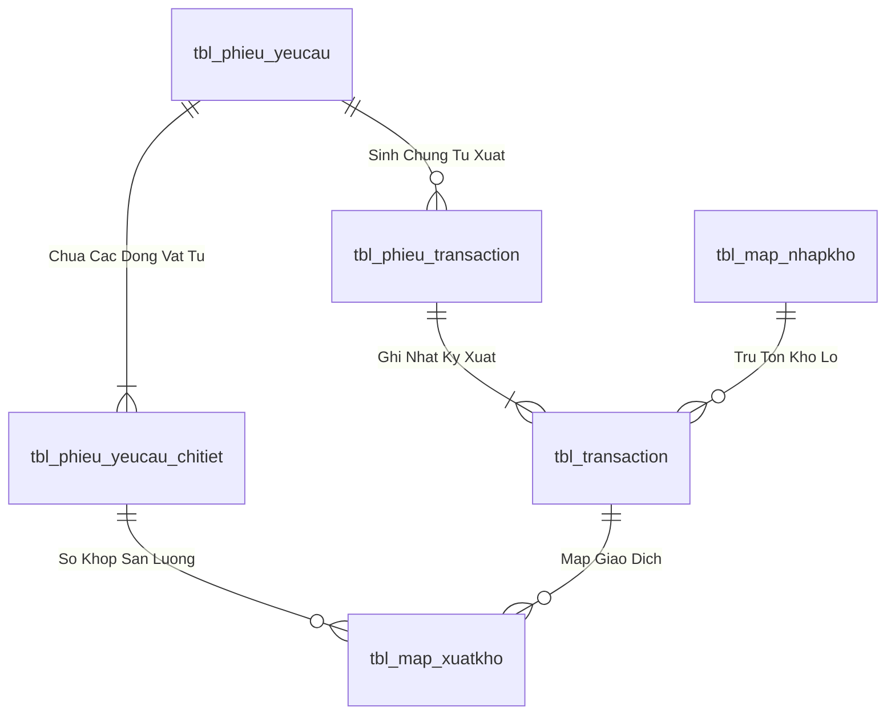
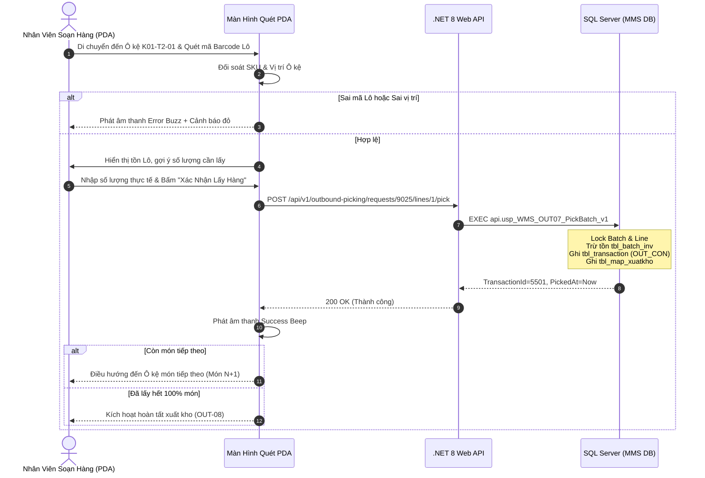

# Phân tích Thiết kế Logic UC-22 (OUT-07) - Quét Barcode & Soạn Hàng Theo Lô (Batch) Trên Thiết Bị Cầm Tay (PDA)

Tài liệu này đi sâu vào phân tích và thiết kế hệ thống ở 5 khía cạnh bắt buộc: **Business Logic**, **UI/UX Guidelines**, **Programming Logic**, **Data Logic**, và **Diagrams (Mermaid)** dành cho chức năng **Quét Barcode & Soạn Hàng Theo Lô Tại Ô Kệ (OUT-07)** của Nhân viên kho sử dụng thiết bị cầm tay PDA.

---

## 1. Business Logic (Logic Nghiệp Vụ)

- **Mục tiêu cốt lõi:** Hướng dẫn nhân viên kho di chuyển chính xác đến từng vị trí Ô kệ (`locationCode`), quét Barcode Lô hàng (`BatchId`), kiểm tra tính hợp lệ về mặt chủng loại vật tư, trạng thái kiểm định QC (`PASS`) và số lượng khả dụng. Sau đó cho phép nhân viên nhập sản lượng lấy thực tế, ghi nhận giao dịch trừ tồn kho tức thời vào bảng `tbl_transaction` (`nghiep_vu = 'OUT_CON'`) và map với dòng đề nghị `tbl_map_xuatkho`.

- **Các quy tắc nghiệp vụ (Business Rules):**
  - `BR-OUT-07-01` **Xác thực mã vạch Lô hàng (Batch Barcode Verification):** Khi nhân viên quét mã vạch trên thùng/pallet, hệ thống phải đối soát tức thời:
    - Mã vật tư của Lô (`id_vattu`) phải trùng khớp với dòng vật tư đang yêu cầu nhặt.
    - Vị trí Ô kệ của Lô phải đúng với vị trí nhân viên đang đứng thao tác.
    - Nếu quét sai Lô hoặc quét mã không tồn tại, PDA phát âm thanh báo động (`soundManager.playErrorBuzzer()`) và hiển thị cảnh báo đỏ từ chối.
  - `BR-OUT-07-02` **Kiểm soát chất lượng Lô xuất (QC Status Gate):** Tuyệt đối không cho phép nhặt các Lô có `status_qc = 'REJECT'`, `'PENDING'` hoặc Lô đang bị khóa kiểm kê (`trang_thai_ton <> '1'`).
  - `BR-OUT-07-03` **Kiểm soát số lượng lấy (Picking Quantity Constraints):**
    - Số lượng lấy mỗi lần không được vượt quá số lượng tồn thực tế của Lô (`so_luong_lay <= batch.so_luong`).
    - Tổng số lượng đã lấy của dòng không được vượt quá số lượng duyệt của phiếu đề nghị (`SUM(lay) <= line.so_luong_duyet`).
  - `BR-OUT-07-04` **Ghi nhận giao dịch xuất kho nguyên tử (Atomic Inventory Deduction):** Mỗi lần xác nhận nhặt 1 Lô:
    1. Trừ số lượng tồn của Lô trong `tbl_batch_inv` (hoặc `tbl_map_nhapkho`).
    2. Chèn bản ghi chi tiết xuất kho vào `tbl_transaction` (`nghiep_vu = 'OUT_CON'`, `id_phieu_trans = @IssueDocumentId`, `id_batch = @BatchId`, `so_luong = @Quantity`).
    3. Chèn bản ghi liên kết `tbl_map_xuatkho` (`id_trans`, `id_chitiet_phieu`).
  - `BR-OUT-07-05` **Chuyển tiếp lộ trình tự động (Seamless Step-by-step Route):** Sau khi nhặt đủ số lượng của món hiện tại, hệ thống tự động phát âm thanh hoàn thành (`soundManager.playSuccessBeep()`) và chuyển hướng chỉ dẫn sang vị trí Ô kệ của món vật tư tiếp theo trong danh sách.

- **Quy trình tương tác 5 bước (Interaction Flow):**
  - **Bước 1:** Nhân viên nhìn màn hình PDA để biết vị trí Ô kệ cần đến (ví dụ: `K01-T2-01`) và thông tin vật tư cần lấy.
  - **Bước 2:** Nhân viên di chuyển đến Ô kệ, dùng đầu đọc laser PDA quét mã Barcode dán trên thùng/Lô.
  - **Bước 3:** PDA tự động điền thông tin Lô, hiển thị tồn khả dụng và tự động đề xuất số lượng cần lấy. Nhân viên có thể điều chỉnh số lượng thực tế bằng bàn phím số hoặc nút tăng/giảm.
  - **Bước 4:** Nhân viên bấm nút **"XÁC NHẬN LẤY HÀNG"**. Backend gọi `api.usp_WMS_OUT07_PickBatch_v1` để trừ tồn và ghi nhận giao dịch.
  - **Bước 5:** Nếu còn món tiếp theo, PDA tự động chuyển sang Món `N+1`. Nếu đã nhặt hết tất cả các món trong phiếu, kích hoạt bước hoàn tất đơn xuất (`OUT-08`).

---

## 2. Tiêu chuẩn Thiết kế Giao diện (UI/UX Guidelines)

- **Thiết bị đích:** Thiết bị cầm tay Handheld PDA (Honeywell / Zebra / Point Mobile), màn hình cảm ứng điện dung, hỗ trợ phím cứng quét mã vạch vật lý.
- **Yêu cầu trải nghiệm (UX Principles):**
  - **Chỉ dẫn vị trí trực quan cỡ lớn:** Vị trí Ô kệ mục tiêu (`📍 VỊ TRÍ KỆ: K01-T2-01`) được hiển thị với kích thước font 24px đậm, tương phản cao trên nền sáng/tối để nhân viên dễ đọc từ khoảng cách 1-2 mét.
  - **Thẻ thông tin vật tư sắc nét:** Hiển thị tên vật tư, mã SKU, quy cách, ảnh đại diện (nếu có), số lượng yêu cầu và thanh tiến độ hoàn thành dạng phần trăm (`Progress Bar`).
  - **Ô nhập số lượng thông minh:** Tự động Focus vào ô số lượng sau khi quét Barcode thành công; tích hợp 2 nút `[ - ]` và `[ + ]` cỡ lớn (touch target >= 48px) để thao tác bằng một tay khi đang đeo găng tay bảo hộ.
  - **Phản hồi âm thanh & Haptic:**
    - Âm thanh "Bíp" ngân cao + rung nhẹ khi quét đúng Lô.
    - Âm thanh "Buzz" trầm + rung giật 3 hồi khi quét sai Lô hoặc số lượng vượt quá tồn.

---

## 3. Programming Logic (Logic Lập Trình)

### 3.1. Frontend Component (`HandheldPage.tsx`)

- **State Management:**
```typescript
const [selectedIssueRequest, setSelectedIssueRequest] = useState<IssueRequest | null>(null);
const [pickingItemIndex, setPickingItemIndex] = useState<number>(0);
const [pickingQty, setPickingQty] = useState<number>(0);
const [scannedBatchBarcode, setScannedBatchBarcode] = useState<string>('');
const [isSubmittingPick, setIsSubmittingPick] = useState<boolean>(false);
```

- **Handling Pick Confirmation:**
```typescript
const handleConfirmPickStep = async () => {
  if (!selectedIssueRequest) return;
  const currentItem = selectedIssueRequest.items[pickingItemIndex];
  if (!currentItem) return;

  setIsSubmittingPick(true);
  try {
    // 1. Gọi API ghi nhận dòng soạn hàng
    await outboundService.pickBatchLine(
      Number(selectedIssueRequest.id),
      Number(currentItem.id),
      {
        batchId: scannedBatchBarcode || 'BATCH-DEFAULT',
        quantity: pickingQty,
        locationCode: 'K01-T2-01'
      }
    );

    soundManager.playSuccessBeep();

    // 2. Chuyển sang món tiếp theo hoặc hoàn tất
    if (pickingItemIndex < selectedIssueRequest.items.length - 1) {
      const nextIndex = pickingItemIndex + 1;
      setPickingItemIndex(nextIndex);
      const nextItem = selectedIssueRequest.items[nextIndex];
      setPickingQty(nextItem ? (nextItem.approvedQuantity || nextItem.requestedQuantity) : 0);
      setScannedBatchBarcode('');
      showBanner('info', `Đã lấy xong món ${pickingItemIndex + 1}. Chuyển sang vị trí tiếp theo!`);
    } else {
      // Đã nhặt xong toàn bộ các món -> Chuyển sang hoàn tất xuất kho (OUT-08)
      await outboundService.completeGoodsIssue(Number(selectedIssueRequest.id));
      soundManager.playCompleteChime();
      showBanner('success', `Đã hoàn tất soạn toàn bộ đơn xuất ${selectedIssueRequest.code}!`);
      setSelectedIssueRequest(null);
      if (refreshIssueRequests) refreshIssueRequests();
    }
  } catch (err: any) {
    soundManager.playErrorBuzzer();
    showBanner('error', err.message || 'Lỗi khi xác nhận lấy hàng');
  } finally {
    setIsSubmittingPick(false);
  }
};
```

### 3.2. Backend API & Stored Procedure Execution

#### A. C# .NET 8 Web API (`OutboundPickingEndpoints.cs`)
- **Endpoint:** `POST /api/v1/outbound-picking/requests/{requestId}/lines/{lineId}/pick`
```csharp
app.MapPost("/api/v1/outbound-picking/requests/{requestId:int}/lines/{lineId:int}/pick", async (
    int requestId,
    int lineId,
    PickBatchLineRequest request,
    HttpContext httpContext,
    IOutboundPickingGateway gateway,
    CancellationToken ct) =>
{
    var userId = httpContext.User.FindFirst(ClaimTypes.NameIdentifier)?.Value 
                 ?? httpContext.Request.Headers["X-User-Id"].FirstOrDefault() 
                 ?? "SYSTEM";

    var result = await gateway.PickBatchLineAsync(userId, requestId, lineId, request, ct);
    return Results.Ok(ApiResponse<PickBatchLineResponse>.Success(result));
})
.WithName("PickBatchLine")
.RequireAuthorization();
```

#### B. SQL Stored Procedure (`api.usp_WMS_OUT07_PickBatch_v1`)
```sql
ALTER PROCEDURE api.usp_WMS_OUT07_PickBatch_v1
    @UserId nvarchar(50),
    @RequestId int,
    @LineId int,
    @BatchId int,
    @Quantity decimal(18,4)
AS
BEGIN
    SET NOCOUNT ON;
    SET XACT_ABORT ON;

    IF NOT EXISTS
    (
        SELECT 1 FROM api.vw_SEC_UserScreenAccess_v1
        WHERE UserId = @UserId AND ScreenCode IN (N'scr_soanhang_batch', N'scr_mob_soanhang', N'scr_soanhang')
    ) THROW 51001, N'Khong co quyen soan hang theo batch.', 1;

    IF @Quantity <= 0 THROW 51002, N'So luong soan phai lon hon 0.', 1;

    DECLARE @IssueDocumentId int, @MaterialId nvarchar(50), @RemainingQty decimal(18,4),
        @AvailableBatchQty decimal(18,4), @Unit nvarchar(20), @Now datetime = GETDATE();

    BEGIN TRY
        BEGIN TRANSACTION;

        -- 1. Lấy mã chứng từ xuất kho đang mở
        SELECT TOP (1) @IssueDocumentId = id_phieu_trans
        FROM dbo.tbl_phieu_transaction WITH (UPDLOCK, HOLDLOCK)
        WHERE ma_yeucau = @RequestId AND nghiep_vu = N'OUT_CON' AND ISNULL(trang_thai_phieu, N'0') = N'1'
        ORDER BY id_phieu_trans DESC;

        IF @IssueDocumentId IS NULL THROW 51004, N'Khong tim thay chung tu xuat kho OUT_CON dang mo.', 1;

        -- 2. Kiểm tra dòng vật tư yêu cầu
        SELECT @MaterialId = line.id_vattu,
            @RemainingQty = ISNULL(line.so_luong, 0) - ISNULL(issued.Qty, 0),
            @Unit = line.unit
        FROM dbo.tbl_phieu_yeucau_chitiet AS line WITH (UPDLOCK, HOLDLOCK)
        OUTER APPLY (
            SELECT Qty = SUM(ISNULL(t.so_luong, 0))
            FROM dbo.tbl_map_xuatkho m
            INNER JOIN dbo.tbl_transaction t ON t.id_trans = m.id_trans
            WHERE m.id_chitiet_phieu = line.id_chitiet_phieu AND t.nghiep_vu = N'OUT_CON'
        ) AS issued
        WHERE line.id_chitiet_phieu = @LineId AND line.id_phieu_yeucau = @RequestId;

        IF @MaterialId IS NULL THROW 51005, N'Dong yeu cau vat tu khong hop le.', 1;
        IF @Quantity > @RemainingQty THROW 51006, N'So luong lay vuot qua so luong con lai can xuat.', 1;

        -- 3. Kiểm tra tồn Lô
        SELECT @AvailableBatchQty = so_luong
        FROM dbo.tbl_batch_inv WITH (UPDLOCK, HOLDLOCK)
        WHERE id_batch = @BatchId AND id_vattu = @MaterialId AND trang_thai_ton = N'1';

        IF @AvailableBatchQty IS NULL OR @AvailableBatchQty < @Quantity
            THROW 51007, N'So luong ton cua Lo khong du de xuat.', 1;

        -- 4. Trừ tồn kho Lô
        UPDATE dbo.tbl_batch_inv
        SET so_luong = so_luong - @Quantity
        WHERE id_batch = @BatchId;

        -- 5. Ghi nhận giao dịch tbl_transaction
        DECLARE @NewTransId int;
        INSERT dbo.tbl_transaction (id_batch, id_phieu_trans, nghiep_vu, id_vattu, so_luong, unit, time_cre, trang_thai)
        VALUES (@BatchId, @IssueDocumentId, N'OUT_CON', @MaterialId, @Quantity, @Unit, @Now, N'1');
        SET @NewTransId = SCOPE_IDENTITY();

        -- 6. Ghi nhận liên kết tbl_map_xuatkho
        INSERT dbo.tbl_map_xuatkho (id_trans, id_chitiet_phieu)
        VALUES (@NewTransId, @LineId);

        COMMIT TRANSACTION;

        SELECT TransactionId = @NewTransId, IssueDocumentId = @IssueDocumentId,
            LineId = @LineId, BatchId = @BatchId, Quantity = @Quantity, PickedAt = @Now;
    END TRY
    BEGIN CATCH
        IF XACT_STATE() <> 0 ROLLBACK TRANSACTION;
        THROW;
    END CATCH;
END;
```

---

## 4. Data Logic & Schema Model (Thiết kế Dữ Liệu Chuyên Sâu)

### 4.1. Entity Relationship Diagram (ERD) & Schema Details


- **Bảng Header (`dbo.tbl_phieu_yeucau`):**
  - Khóa chính: `id_phieu_yeucau` (INT IDENTITY, Clustered Index).
  - Trạng thái duyệt: `trang_thai_phieu` (`'0'`: Hủy, `'1'`: Chờ duyệt, `'3'`: QĐ duyệt, `'4'`: Sẵn sàng xuất, `'5'`: Hoàn tất duyệt).
  - Trạng thái soạn hàng: `status_soanhang` (`'0'`: Chờ soạn, `'1'`: Đang soạn, `'2'`: Đã soạn xong, `'3'`: Đã nhận tại xưởng).
  - Chỉ mục: `IX_tbl_phieu_yeucau_status` on `(trang_thai_phieu, status_soanhang) INCLUDE (time_duyet, time_cre, bo_phan)`.
- **Bảng Chi tiết (`dbo.tbl_phieu_yeucau_chitiet`):**
  - Khóa chính: `id_chitiet_phieu` (INT IDENTITY), Khóa ngoại: `id_phieu_yeucau`, `id_vattu`.

### 4.2. Data Flow & Transaction Locking Matrix
- **Cơ chế khóa đồng thời:** Stored Procedure áp dụng `SET XACT_ABORT ON` và `BEGIN TRANSACTION`.
- **Khóa dòng dữ liệu:** Sử dụng `WITH (UPDLOCK, HOLDLOCK)` trên `tbl_phieu_yeucau` và `tbl_batch_inv` để ngăn chặn hiện tượng Lost Update và xuất âm tồn kho khi nhiều nhân viên PDA thao tác đồng thời.
- **Rollback an toàn:** Bắt lỗi `CATCH` tự động kiểm tra `IF XACT_STATE() <> 0 ROLLBACK TRANSACTION` và ném lỗi nghiệp vụ kèm mã lỗi chuẩn.

### 4.3. Conceptual State Model & Transition Rules
| Trạng Thái Ban Đầu | Hành Động / Trigger | Trạng Thái Sau Chuyển Đổi | Bảng CSDL Bị Cập Nhật |
| :--- | :--- | :--- | :--- |
| **DRAFT / Mới tạo** | Gửi đề nghị xuất (OUT-01/02/03) | `trang_thai_phieu = '1'`, `status_soanhang = '0'` | `tbl_phieu_yeucau` |
| **`trang_thai_phieu = '1'`** | Phê duyệt cấp 1 / 2 (OUT-05) | `trang_thai_phieu = '4'`, `status_soanhang = '0'` | `tbl_phieu_yeucau` (`time_duyet = Now`) |
| **`status_soanhang = '0'`** | Bấm Bắt đầu soạn (OUT-06) | `status_soanhang = '1'` | `tbl_phieu_yeucau`, chèn `tbl_phieu_transaction` |
| **`status_soanhang = '1'`** | Nhặt đủ 100% món (OUT-08) | `status_soanhang = '2'` | `tbl_phieu_yeucau`, `tbl_phieu_transaction` |
| **`status_soanhang = '2'`** | Xưởng ký nhận vật tư (OUT-09) | `status_soanhang = '3'` | `tbl_phieu_yeucau` |

---

## 5. Diagrams (Mermaid Sơ Đồ Luồng Nghiệp Vụ)


