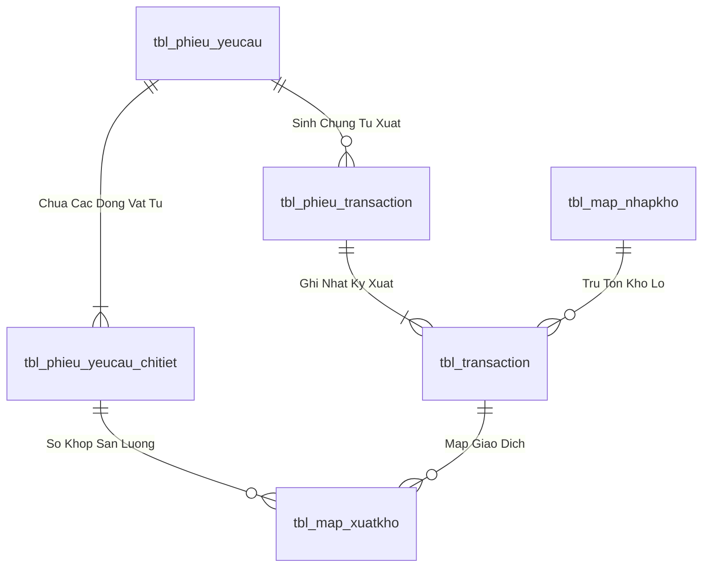
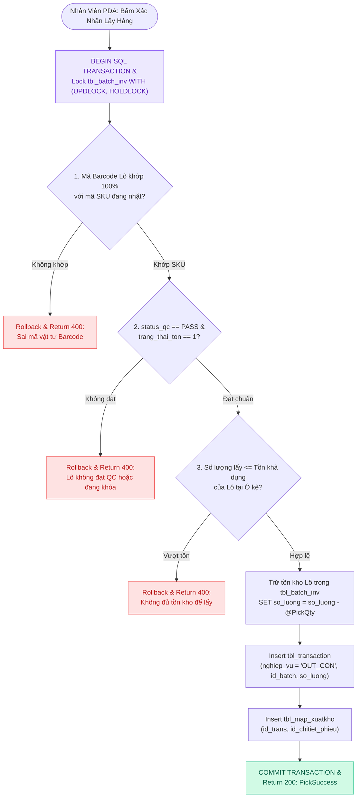
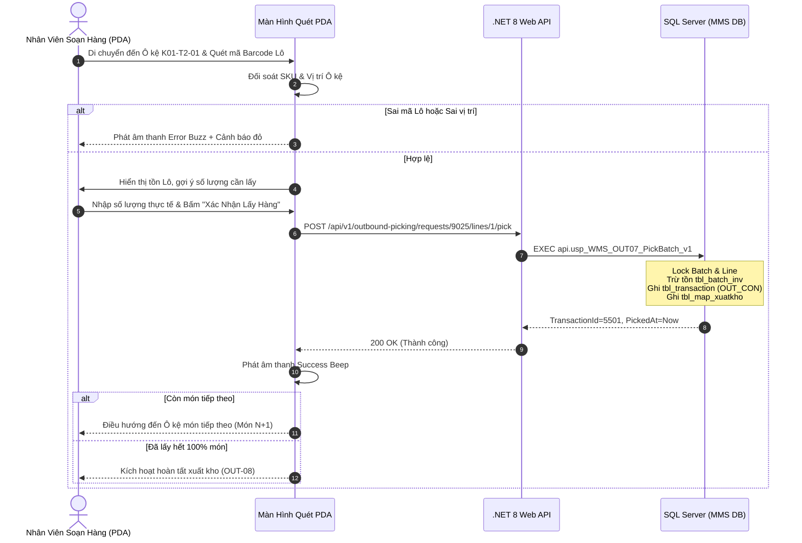

# Phân tích Thiết kế Logic UC-22 (OUT-07) - Quét Barcode & Soạn Hàng Theo Lô (Batch) Trên Thiết Bị Cầm Tay (PDA)

Tài liệu này đi sâu vào phân tích và thiết kế hệ thống ở 5 khía cạnh bắt buộc: **Business Logic**, **UI/UX Guidelines**, **Programming Logic**, **Data Logic**, và **Diagrams (Mermaid)** dành cho chức năng **Quét Barcode & Soạn Hàng Theo Lô Tại Ô Kệ (OUT-07)** của Nhân viên kho sử dụng thiết bị cầm tay PDA.

---

## 1. Business Logic (Logic Nghiệp Vụ)

- **Mục tiêu cốt lõi:** Hướng dẫn nhân viên kho di chuyển chính xác đến từng vị trí Ô kệ (`locationCode`), quét Barcode Lô hàng (`BatchId`), kiểm tra tính hợp lệ về mặt chủng loại vật tư, trạng thái kiểm định QC (`PASS`) và số lượng khả dụng. Sau đó cho phép nhân viên nhập sản lượng lấy thực tế, ghi nhận giao dịch trừ tồn kho tức thời vào bảng `tbl_transaction` (`nghiep_vu = 'OUT_CON'`) và map với dòng đề nghị `tbl_map_xuatkho`.

- **Các quy tắc nghiệp vụ (Business Rules):**
  - `BR-OUT-07-01` **Xác thực mã vạch Lô hàng (Batch Barcode Verification):** Quét mã vạch trên thùng/pallet phải khớp 100% với mã SKU của món đang yêu cầu nhặt và đúng vị trí Ô kệ quy định.
  - `BR-OUT-07-02` **Kiểm soát chất lượng Lô xuất (QC Status Gate):** Tuyệt đối cấm nhặt các Lô có `status_qc = 'REJECT'`, `'PENDING'` hoặc Lô đang bị khóa kiểm kê (`trang_thai_ton <> '1'`).
  - `BR-OUT-07-03` **Kiểm soát số lượng lấy (Picking Quantity Constraints):** Số lượng lấy mỗi lần `<= Số lượng tồn thực tế của Lô` và `Tổng số lượng đã lấy <= Số lượng duyệt của phiếu đề nghị`.
  - `BR-OUT-07-04` **Ghi nhận giao dịch xuất kho nguyên tử (Atomic Inventory Deduction):** Trừ tồn `tbl_batch_inv`, chèn dòng `tbl_transaction` (`OUT_CON`), chèn liên kết `tbl_map_xuatkho` trong 1 Transaction khép kín.
  - `BR-OUT-07-05` **Chuyển tiếp lộ trình tự động (Seamless Step-by-step Route):** Sau khi nhặt đủ số lượng của món hiện tại, hệ thống tự động phát âm thanh hoàn thành và chuyển hướng sang vị trí Ô kệ của món tiếp theo.
  - `BR-OUT-07-06` **Chống xuất âm kho (Non-negative Stock Protection):** Nếu số lượng tồn của Lô không đủ để lấy, hệ thống từ chối và yêu cầu nhặt tiếp từ Lô phụ.
  - `BR-OUT-07-07` **Ghi vết thao tác quét (Scan Audit Trail):** Ghi nhận `UserId`, `DeviceId` của máy quét PDA và thời điểm quét chính xác từng giây.

- **Quy trình tương tác 5 bước (Interaction Flow):**
  - **Bước 1:** Nhân viên nhìn màn hình PDA (`HandheldPage.tsx`) để biết vị trí Ô kệ cần đến (ví dụ: `K01-T2-01`) và thông tin vật tư cần lấy.
  - **Bước 2:** Di chuyển đến Ô kệ, dùng đầu đọc laser PDA quét mã Barcode dán trên thùng/Lô.
  - **Bước 3:** PDA tự động điền thông tin Lô, hiển thị tồn khả dụng và tự động đề xuất số lượng cần lấy. Nhân viên điều chỉnh số lượng thực tế và bấm **"Xác Nhận Lấy Hàng"**.
  - **Bước 4:** Backend kiểm tra Fail-fast: (Verify JWT $
ightarrow$ Verify Open Issue Doc $
ightarrow$ Check SKU Match $
ightarrow$ Check QC Status $
ightarrow$ Check Available Batch Qty $
ightarrow$ Deduct `tbl_batch_inv` $
ightarrow$ Insert `tbl_transaction` $
ightarrow$ Insert `tbl_map_xuatkho` $
ightarrow$ Execute SP `usp_WMS_OUT07_PickBatch_v1`).
  - **Bước 5:** Backend cập nhật CSDL và trả về kết quả thành công. Frontend phát âm thanh `Success Beep`, cập nhật tiến độ nhặt hàng và chuyển sang món tiếp theo (hoặc kích hoạt OUT-08 nếu đã xong 100%).

---

## 2. Tiêu chuẩn Thiết kế Giao diện (UI/UX Guidelines)

- **Thiết bị đích:** Thiết bị cầm tay Handheld PDA (Honeywell / Zebra / Point Mobile), màn hình cảm ứng điện dung, hỗ trợ phím cứng quét mã vạch vật lý.
- **Yêu cầu trải nghiệm (UX Principles):**
  - **Chỉ dẫn vị trí trực quan cỡ lớn:** Vị trí Ô kệ mục tiêu (`📍 VỊ TRÍ KỆ: K01-T2-01`) được hiển thị với kích thước font 24px đậm, tương phản cao trên nền sáng/tối để nhân viên dễ đọc từ khoảng cách 1-2 mét.
  - **Thẻ thông tin vật tư sắc nét:** Hiển thị tên vật tư, mã SKU, quy cách, ảnh đại diện (nếu có), số lượng yêu cầu và thanh tiến độ hoàn thành dạng phần trăm (`Progress Bar`).
  - **Ô nhập số lượng thông minh:** Tự động Focus vào ô số lượng sau khi quét Barcode thành công; tích hợp 2 nút `[ - ]` và `[ + ]` cỡ lớn (touch target >= 48px) để thao tác bằng một tay khi đang đeo găng tay bảo hộ.
  - **Phản hồi âm thanh & Haptic:**
    - Âm thanh "Bíp" ngân cao + rung nhẹ khi quét đúng Lô.
    - Âm thanh "Buzz" trầm + rung giật 3 hồi khi quét sai Lô hoặc số lượng vượt quá tồn.

---

## 3. Programming Logic (Logic Lập Trình)

Quy trình xử lý mã lệnh được chia thành 2 lớp: **Frontend (React)** và **Backend (ASP.NET Core kết hợp SQL Stored Procedure)**.

### 3.1. Frontend (React - HandheldPage.tsx)
- **State Management & Step Progression:**
  - Quản lý trạng thái dòng nhặt hiện tại qua `pickingItemIndex`. Sau khi xác nhận nhặt thành công món $N$, hệ thống tự động tăng `pickingItemIndex + 1` và tự động điền số lượng cần lấy của món tiếp theo.
  - Tự động Focus vào ô nhập số lượng hoặc đầu đọc quét Barcode sau mỗi bước, loại bỏ thao tác chạm tay không cần thiết.
- **Audio Feedback & Visual Indicators:**
  - Tích hợp `soundManager.playSuccessBeep()` cho quét đúng và `soundManager.playErrorBuzzer()` cho quét sai Lô.

### 3.2. Backend (ASP.NET Core - OutboundPickingEndpoints.cs & SQL Server)
- **API POST /api/v1/outbound-picking/requests/{id}/lines/{lineId}/pick:**
  - C# đẩy toàn bộ logic trừ tồn và ghi nhật ký xuống SQL Stored Procedure `api.usp_WMS_OUT07_PickBatch_v1`.
  - SP thực thi trong khối `BEGIN TRANSACTION` với `UPDLOCK, HOLDLOCK`, tự động trừ tồn `tbl_batch_inv`, chèn `tbl_transaction` (`OUT_CON`) và map với `tbl_map_xuatkho`.

---

## 4. Data Logic & Schema Model (Thiết kế Dữ Liệu Chuyên Sâu)

### 4.1. Entity Relationship Diagram (ERD) & Schema Details

- **Bảng Header (`dbo.tbl_phieu_yeucau`):**
  - Khóa chính: `id_phieu_yeucau` (INT IDENTITY, Clustered Index).
  - Trạng thái duyệt: `trang_thai_phieu` (`'0'`: Hủy, `'1'`: Chờ duyệt, `'3'`: QĐ duyệt, `'4'`: Sẵn sàng xuất, `'5'`: Hoàn tất duyệt).
  - Trạng thái soạn hàng: `status_soanhang` (`'0'`: Chờ soạn, `'1'`: Đang soạn, `'2'`: Đã soạn xong, `'3'`: Đã nhận tại xưởng).
  - Chỉ mục: `IX_tbl_phieu_yeucau_status` on `(trang_thai_phieu, status_soanhang) INCLUDE (time_duyet, time_cre, bo_phan)`.
- **Bảng Chi tiết (`dbo.tbl_phieu_yeucau_chitiet`):**
  - Khóa chính: `id_chitiet_phieu` (INT IDENTITY), Khóa ngoại: `id_phieu_yeucau`, `id_vattu`.

### 4.2. Data Layer Architecture (Data Flow & Transaction Locking)

### 4.3. Conceptual State Model & Transition Rules
| Trạng Thái Ban Đầu | Hành Động / Trigger | Trạng Thái Sau Chuyển Đổi | Bảng CSDL Bị Cập Nhật |
| :--- | :--- | :--- | :--- |
| **DRAFT / Mới tạo** | Gửi đề nghị xuất (OUT-01/02/03) | `trang_thai_phieu = '1'`, `status_soanhang = '0'` | `tbl_phieu_yeucau` |
| **`trang_thai_phieu = '1'`** | Phê duyệt cấp 1 / 2 (OUT-05) | `trang_thai_phieu = '4'`, `status_soanhang = '0'` | `tbl_phieu_yeucau` (`time_duyet = Now`) |
| **`status_soanhang = '0'`** | Bấm Bắt đầu soạn (OUT-06) | `status_soanhang = '1'` | `tbl_phieu_yeucau`, chèn `tbl_phieu_transaction` |
| **`status_soanhang = '1'`** | Nhặt đủ 100% món (OUT-08) | `status_soanhang = '2'` | `tbl_phieu_yeucau`, `tbl_phieu_transaction` |
| **`status_soanhang = '2'`** | Xưởng ký nhận vật tư (OUT-09) | `status_soanhang = '3'` | `tbl_phieu_yeucau` |

---

## 5. Diagrams (Mermaid Sơ Đồ Luồng Nghiệp Vụ)

