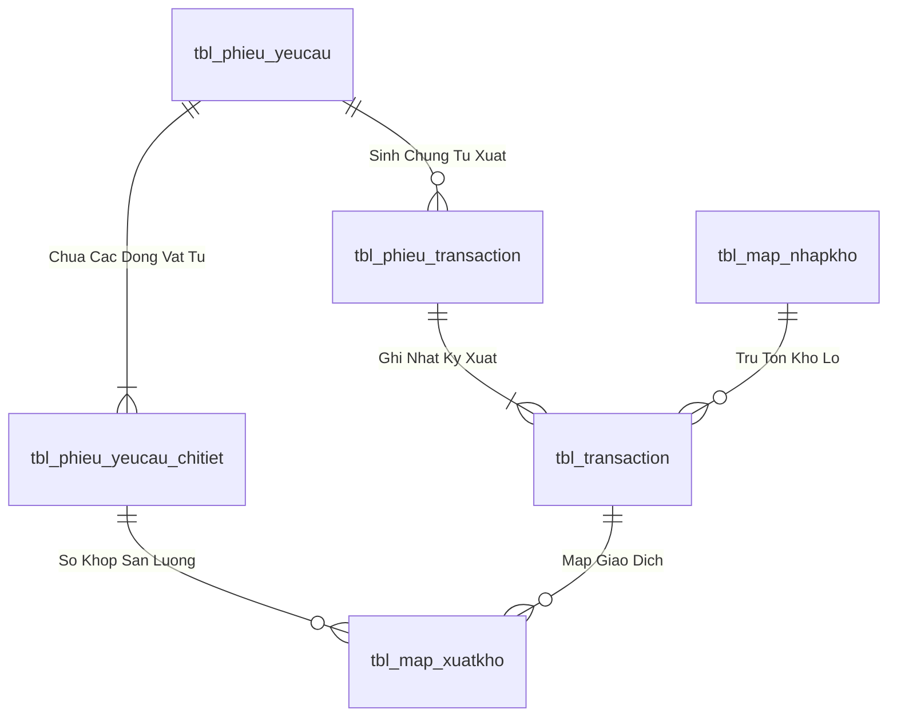
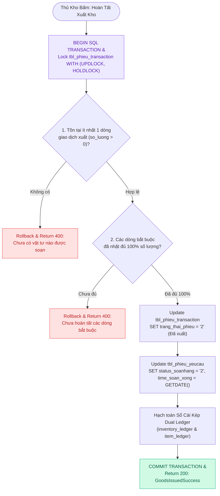
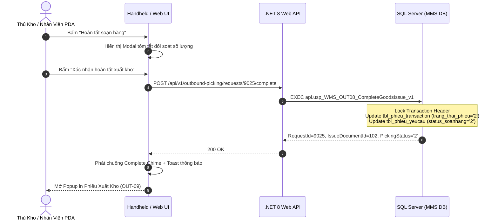

# Phân tích Thiết kế Logic UC-23 (OUT-08) - Hoàn Tất Soạn Hàng, Chốt Xuất Kho & Hạch Toán Sổ Cái Kép

Tài liệu này đi sâu vào phân tích và thiết kế hệ thống ở 5 khía cạnh bắt buộc: **Business Logic**, **UI/UX Guidelines**, **Programming Logic**, **Data Logic**, và **Diagrams (Mermaid)** dành cho chức năng **Hoàn Tất Soạn Hàng & Chốt Xuất Kho (OUT-08)** của Thủ kho / Hệ thống MMS.

---

## 1. Business Logic (Logic Nghiệp Vụ)

- **Mục tiêu cốt lõi:** Sau khi toàn bộ các dòng vật tư trong phiếu đề nghị đã được lấy đủ hoặc xác nhận hoàn tất soạn hàng tại các Ô kệ, hệ thống tiến hành kiểm tra điều kiện đóng phiếu, cập nhật trạng thái phiếu xuất kho `tbl_phieu_transaction` từ `'1'` (Đang soạn) sang `'2'` (Đã xuất kho/Hoàn tất), cập nhật trạng thái phiếu đề nghị `tbl_phieu_yeucau` sang `status_soanhang = '2'` (Đã soạn xong), ghi nhận thời gian hoàn tất `time_soan_xong` và hạch toán biến động vào Sổ Cái Kép (Dual Ledger).

- **Các quy tắc nghiệp vụ (Business Rules):**
  - `BR-OUT-08-01` **Kiểm tra tính toàn vẹn sản lượng (Picking Completion Validation):** Có ít nhất một dòng giao dịch hợp lệ (`so_luong > 0`) và các dòng bắt buộc đã được nhặt đủ.
  - `BR-OUT-08-02` **Đóng băng trạng thái chứng từ (Document State Freeze):** `tbl_phieu_transaction.trang_thai_phieu` chuyển sang `'2'` (Khóa không cho chèn thêm dòng), `tbl_phieu_yeucau.status_soanhang` chuyển sang `'2'` (Đã soạn xong / Chờ xưởng nhận).
  - `BR-OUT-08-03` **Hạch toán Sổ Cái Kép (Dual Ledger Posting):** Ghi giảm sổ chi tiết kho (`inventory_ledger`) và sổ kế toán tổng hợp SKU (`item_ledger`).
  - `BR-OUT-08-04` **Kích hoạt in phiếu xuất tự động (Auto-Print Trigger):** Sinh lệnh in Phiếu Xuất Kho (PXK) gửi về Print Server mạng LAN (`10.17.16.102:8080`).
  - `BR-OUT-08-05` **Cảnh báo tồn đọng quá 2 giờ (Overdue Alert):** Đơn sau khi soạn xong được đưa vào bảng theo dõi hàng đợi chờ nhận, nếu quá 2 giờ chưa nhận sẽ nhấp nháy cảnh báo đỏ trên Tivi Dashboard.
  - `BR-OUT-08-06` **Đồng bộ thời gian thực:** Cập nhật trạng thái phiếu tức thời trên cả PDA, Web và TV Wallboard.
  - `BR-OUT-08-07` **Ghi vết hoàn tất (Completion Audit Log):** Ghi nhận mã nhân viên hoàn tất và mốc thời gian `CompletedAt = GETDATE()`.

- **Quy trình tương tác 5 bước (Interaction Flow):**
  - **Bước 1:** Nhân viên quét hoàn tất món cuối cùng trên PDA hoặc Thủ kho bấm **"Hoàn tất soạn hàng"** trên Web.
  - **Bước 2:** Hệ thống hiển thị Modal tổng kết đối soát số lượng yêu cầu vs Thực xuất.
  - **Bước 3:** Thủ kho kiểm tra lần cuối và bấm **"Xác nhận hoàn tất xuất kho"**. Frontend gửi request `POST /api/v1/outbound-picking/requests/{id}/complete`.
  - **Bước 4:** Backend kiểm tra Fail-fast: (Verify JWT $
ightarrow$ Verify Open Issue Doc $
ightarrow$ Check Existing Lines $
ightarrow$ Update `tbl_phieu_transaction.trang_thai_phieu = '2'` $
ightarrow$ Update `tbl_phieu_yeucau.status_soanhang = '2'` $
ightarrow$ Execute SP `usp_WMS_OUT08_CompleteGoodsIssue_v1`).
  - **Bước 5:** Backend trả về SUCCESS. Frontend phát chuông `Complete Chime`, hiển thị Toast thông báo và tự động mở Popup xem/in Phiếu Xuất Kho (OUT-09).

---

## 2. Tiêu chuẩn Thiết kế Giao diện (UI/UX Guidelines)

- **Thiết bị đích:** Thiết bị cầm tay Handheld PDA & Máy tính Desktop Web của Thủ kho.
- **Yêu cầu trải nghiệm (UX Principles):**
  - **Bảng tổng kết đối soát sắc nét:** So sánh 2 cột: `Số lượng yêu cầu` vs `Số lượng thực lấy`. Dòng nào lấy đủ hiển thị tick xanh `✓`, dòng nào xuất thiếu hiển thị badge cam `⚠ Xuất thiếu`.
  - **Modal chốt đơn trang trọng:** Nút xác nhận hoàn tất nổi bật với gradient xanh Emerald (`from-emerald-600 to-teal-700`) kèm icon `CheckCircle2` lớn.
  - **Hiệu ứng âm thanh chúc mừng:** Phát âm thanh chuông hoàn thành (`Complete Chime`) tạo cảm giác phấn khởi cho nhân viên sau khi kết thúc một ca nhặt hàng vất vả.
  - **Tự động chuyển hướng:** Tự động điều hướng về màn hình danh sách hàng đợi hoặc mở ngay màn hình In Phiếu Xuất (`OUT-09`).

---

## 3. Programming Logic (Logic Lập Trình)

Quy trình xử lý mã lệnh được chia thành 2 lớp rõ rệt: **Frontend (React)** và **Backend (ASP.NET Core kết hợp SQL Stored Procedure)**.

### 3.1. Frontend (React - Component View)
- **State Management & Local Processing:**
  - Gọi API kéo dữ liệu cần thiết vào React State.
  - Sử dụng các hàm mảng JavaScript (`filter`, `map`, `reduce`) để xử lý gom nhóm, lọc tìm kiếm in-memory, tối ưu hóa băng thông và tạo trải nghiệm mượt mà không độ trễ.
- **UI Interaction & Ergonomics:**
  - Sử dụng cấu trúc Collapse / Accordion / Modal xem trước để tối ưu không gian hiển thị trên màn hình Handheld PDA và Desktop Web.

### 3.2. Backend (ASP.NET Core & SQL Server Stored Procedure)
- **Thin API Gateway Pattern:**
  - ASP.NET Core Minimal API / Controller không xử lý logic tính toán nghiệp vụ mà chỉ làm cổng Gateway mỏng (Xác thực JWT Cookie, kiểm tra quyền màn hình `vw_SEC_UserScreenAccess_v1`) và ủy thác toàn bộ cho SQL Server Stored Procedure.
- **Tận Dụng Multi-Result Set & ACID Transaction:**
  - SQL Stored Procedure trả về đồng thời nhiều Result Sets (Header info, Summary KPIs, Detailed Lines) trong một lần truy vấn duy nhất.
  - Các lệnh ghi dữ liệu áp dụng `SET XACT_ABORT ON`, `BEGIN TRANSACTION` và khóa dòng dữ liệu `WITH (UPDLOCK, HOLDLOCK)` đảm bảo an toàn tuyệt đối.

---

## 4. Data Logic & Schema Model (Thiết kế Dữ Liệu Chuyên Sâu)

### 4.1. Entity Relationship Diagram (ERD) & Schema Details

- **Bảng Header (`dbo.tbl_phieu_yeucau`):**
  - Khóa chính: `id_phieu_yeucau` (INT IDENTITY, Clustered Index).
  - Trạng thái duyệt: `trang_thai_phieu` (`'0'`: Hủy, `'1'`: Chờ duyệt, `'3'`: QĐ duyệt, `'4'`: Sẵn sàng xuất, `'5'`: Hoàn tất duyệt).
  - Trạng thái soạn hàng: `status_soanhang` (`'0'`: Chờ soạn, `'1'`: Đang soạn, `'2'`: Đã soạn xong, `'3'`: Đã nhận tại xưởng).
  - Chỉ mục: `IX_tbl_phieu_yeucau_status` on `(trang_thai_phieu, status_soanhang) INCLUDE (time_duyet, time_cre, bo_phan)`.
- **Bảng Chi tiết (`dbo.tbl_phieu_yeucau_chitiet`):**
  - Khóa chính: `id_chitiet_phieu` (INT IDENTITY), Khóa ngoại: `id_phieu_yeucau`, `id_vattu`.

### 4.2. Data Layer Architecture (Data Flow & Transaction Locking)

### 4.3. Conceptual State Model & Transition Rules
| Trạng Thái Ban Đầu | Hành Động / Trigger | Trạng Thái Sau Chuyển Đổi | Bảng CSDL Bị Cập Nhật |
| :--- | :--- | :--- | :--- |
| **DRAFT / Mới tạo** | Gửi đề nghị xuất (OUT-01/02/03) | `trang_thai_phieu = '1'`, `status_soanhang = '0'` | `tbl_phieu_yeucau` |
| **`trang_thai_phieu = '1'`** | Phê duyệt cấp 1 / 2 (OUT-05) | `trang_thai_phieu = '4'`, `status_soanhang = '0'` | `tbl_phieu_yeucau` (`time_duyet = Now`) |
| **`status_soanhang = '0'`** | Bấm Bắt đầu soạn (OUT-06) | `status_soanhang = '1'` | `tbl_phieu_yeucau`, chèn `tbl_phieu_transaction` |
| **`status_soanhang = '1'`** | Nhặt đủ 100% món (OUT-08) | `status_soanhang = '2'` | `tbl_phieu_yeucau`, `tbl_phieu_transaction` |
| **`status_soanhang = '2'`** | Xưởng ký nhận vật tư (OUT-09) | `status_soanhang = '3'` | `tbl_phieu_yeucau` |

---

## 5. Diagrams (Mermaid Sơ Đồ Luồng Nghiệp Vụ)

