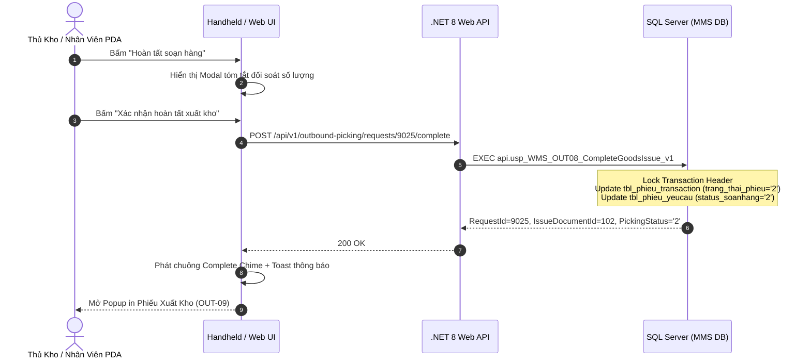

# Phân tích Thiết kế Logic UC-23 (OUT-08) - Hoàn Tất Soạn Hàng, Chốt Xuất Kho & Hạch Toán Sổ Cái Kép

Tài liệu này đi sâu vào phân tích và thiết kế hệ thống ở 5 khía cạnh bắt buộc: **Business Logic**, **UI/UX Guidelines**, **Programming Logic**, **Data Logic**, và **Diagrams (Mermaid)** dành cho chức năng **Hoàn Tất Soạn Hàng & Chốt Xuất Kho (OUT-08)** của Thủ kho / Hệ thống MMS.

---

## 1. Business Logic (Logic Nghiệp Vụ)

- **Mục tiêu cốt lõi:** Sau khi toàn bộ các dòng vật tư trong phiếu đề nghị đã được lấy đủ hoặc xác nhận hoàn tất soạn hàng tại các Ô kệ, hệ thống tiến hành kiểm tra điều kiện đóng phiếu, cập nhật trạng thái phiếu xuất kho `tbl_phieu_transaction` từ `'1'` (Đang soạn) sang `'2'` (Đã xuất kho/Hoàn tất), cập nhật trạng thái phiếu đề nghị `tbl_phieu_yeucau` sang `status_soanhang = '2'` (Đã soạn xong), ghi nhận thời gian hoàn tất `time_soan_xong` và hạch toán biến động vào Sổ Cái Kép (Dual Ledger).

- **Các quy tắc nghiệp vụ (Business Rules):**
  - `BR-OUT-08-01` **Kiểm tra tính toàn vẹn sản lượng (Picking Completion Validation):** Hệ thống chỉ cho phép chốt xuất kho khi:
    - Có ít nhất một dòng giao dịch hợp lệ trong `tbl_transaction` thuộc chứng từ xuất kho này (`so_luong > 0`).
    - Tất cả các dòng vật tư bắt buộc đã được lấy đủ hoặc được Thủ kho xác nhận xuất thiếu có chủ đích.
  - `BR-OUT-08-02` **Chốt trạng thái chứng từ (Document State Freeze):** Khi hoàn tất:
    - `tbl_phieu_transaction.trang_thai_phieu` chuyển sang `'2'` (Đã xuất kho). Sau thời điểm này, không thể chèn thêm hoặc sửa đổi dòng giao dịch xuất nào thuộc chứng từ này.
    - `tbl_phieu_yeucau.status_soanhang` chuyển sang `'2'` (Đã soạn xong / Chờ phân xưởng nhận).
    - `tbl_phieu_yeucau.time_cre` hoặc trường lưu thời gian soạn chốt mốc thời gian hoàn tất (`@Now`).
  - `BR-OUT-08-03` **Hạch toán Sổ Cái Kép (Dual Ledger Posting):**
    - Ghi nhận biến động giảm tài sản kho cấp Thùng/Lô vào sổ chi tiết kho (`inventory_ledger`).
    - Ghi nhận biến động giá trị và số lượng tổng hợp cấp Mã vật tư SKU vào sổ tổng hợp kế toán (`item_ledger`).
  - `BR-OUT-08-04` **Kích hoạt quy trình in phiếu xuất tự động (Auto-Print Trigger):** Ngay khi chốt xuất kho thành công, hệ thống tự động sinh lệnh gửi dữ liệu lệnh in Phiếu Xuất Kho (PXK) kèm mã vạch tới máy in nhiệt qua dịch vụ in LAN/PrintService (`10.17.16.102:8080`).

- **Quy trình tương tác 5 bước (Interaction Flow):**
  - **Bước 1:** Nhân viên quét hoàn tất món cuối cùng trên PDA hoặc Thủ kho bấm **"Hoàn tất soạn hàng"** trên Desktop Web.
  - **Bước 2:** Hệ thống hiển thị Modal tổng kết đơn hàng: Tổng số lượng vật tư yêu cầu vs Thực xuất, danh sách các Lô đã lấy.
  - **Bước 3:** Thủ kho kiểm tra lần cuối và bấm **"Xác nhận hoàn tất xuất kho"**.
  - **Bước 4:** Backend gọi SP `api.usp_WMS_OUT08_CompleteGoodsIssue_v1` trong một ACID Transaction khép kín.
  - **Bước 5:** Hệ thống phát chuông thông báo thành công (`soundManager.playCompleteChime()`), tự động bật Popup xem/in Phiếu Xuất Kho và cập nhật trạng thái hàng đợi trên Tivi Dashboard.

---

## 2. Tiêu chuẩn Thiết kế Giao diện (UI/UX Guidelines)

- **Thiết bị đích:** Thiết bị cầm tay Handheld PDA & Máy tính Desktop Web của Thủ kho.
- **Yêu cầu trải nghiệm (UX Principles):**
  - **Bảng tổng kết đối soát sắc nét:** So sánh 2 cột: `Số lượng yêu cầu` vs `Số lượng thực lấy`. Dòng nào lấy đủ hiển thị tick xanh `✓`, dòng nào xuất thiếu hiển thị badge cam `⚠ Xuất thiếu`.
  - **Modal chốt đơn trang trọng:** Nút xác nhận hoàn tất nổi bật với gradient xanh Emerald (`from-emerald-600 to-teal-700`) kèm icon `CheckCircle2` lớn.
  - **Hiệu ứng âm thanh chúc mừng:** Phát âm thanh chuông hoàn thành (`Complete Chime`) tạo cảm giác phấn khởi cho nhân viên sau khi kết thúc một ca nhặt hàng vất vả.
  - **Tự động chuyển hướng:** Tự động điều hướng về màn hình danh sách hàng đợi hoặc mở ngay màn hình In Phiếu Xuất (`OUT-09`).

---

## 3. Programming Logic (Logic Lập Trình)

### 3.1. Frontend Component (`HandheldPage.tsx` & `OutboundPage.tsx`)

- **State Management & Complete Handler:**
```typescript
const handleCompleteIssueOrder = async (requestId: number) => {
  try {
    const result = await outboundService.completeGoodsIssue(requestId);
    soundManager.playCompleteChime();
    showBanner('success', `Đã hoàn tất xuất kho thành công phiếu DNXK-${requestId}!`);
    
    // Tự động mở modal in phiếu xuất
    if (result.issueDocumentId) {
      handleOpenPrintModal(result.issueDocumentId);
    }
    
    if (refreshIssueRequests) refreshIssueRequests();
  } catch (err: any) {
    soundManager.playErrorBuzzer();
    showBanner('error', err.message || 'Lỗi khi hoàn tất xuất kho.');
  }
};
```

### 3.2. Backend API & Stored Procedure Execution

#### A. C# .NET 8 Web API (`OutboundPickingEndpoints.cs`)
- **Endpoint:** `POST /api/v1/outbound-picking/requests/{requestId}/complete`
```csharp
app.MapPost("/api/v1/outbound-picking/requests/{requestId:int}/complete", async (
    int requestId,
    HttpContext httpContext,
    IOutboundPickingGateway gateway,
    CancellationToken ct) =>
{
    var userId = httpContext.User.FindFirst(ClaimTypes.NameIdentifier)?.Value 
                 ?? httpContext.Request.Headers["X-User-Id"].FirstOrDefault() 
                 ?? "SYSTEM";

    var result = await gateway.CompleteGoodsIssueAsync(userId, requestId, ct);
    return Results.Ok(ApiResponse<CompleteGoodsIssueResponse>.Success(result));
})
.WithName("CompleteGoodsIssue")
.RequireAuthorization();
```

#### B. SQL Stored Procedure (`api.usp_WMS_OUT08_CompleteGoodsIssue_v1`)
```sql
ALTER PROCEDURE api.usp_WMS_OUT08_CompleteGoodsIssue_v1
    @UserId nvarchar(50),
    @RequestId int
AS
BEGIN
    SET NOCOUNT ON;
    SET XACT_ABORT ON;

    IF NOT EXISTS
    (
        SELECT 1 FROM api.vw_SEC_UserScreenAccess_v1
        WHERE UserId = @UserId AND ScreenCode IN (N'scr_soanhang', N'scr_mob_soanhang', N'scr_xuatkho_thutuc')
    ) THROW 51001, N'Khong co quyen hoan tat xuat kho.', 1;

    DECLARE @IssueDocumentId int, @Now datetime = GETDATE();

    BEGIN TRY
        BEGIN TRANSACTION;

        SELECT TOP (1) @IssueDocumentId = id_phieu_trans
        FROM dbo.tbl_phieu_transaction WITH (UPDLOCK, HOLDLOCK)
        WHERE ma_yeucau = @RequestId AND nghiep_vu = N'OUT_CON' AND ISNULL(trang_thai_phieu, N'0') = N'1'
        ORDER BY id_phieu_trans DESC;

        IF @IssueDocumentId IS NULL THROW 51004, N'Khong tim thay chung tu xuat kho OUT_CON can hoan tat.', 1;

        -- Kiểm tra có ít nhất 1 dòng giao dịch xuất
        IF NOT EXISTS (SELECT 1 FROM dbo.tbl_transaction WHERE id_phieu_trans = @IssueDocumentId AND nghiep_vu = N'OUT_CON')
            THROW 51005, N'Chung tu chua co bat ky dong soan hang nao.', 1;

        -- Chốt trạng thái chứng từ xuất kho
        UPDATE dbo.tbl_phieu_transaction
        SET trang_thai_phieu = N'2', time_cre = @Now
        WHERE id_phieu_trans = @IssueDocumentId;

        -- Cập nhật trạng thái phiếu đề nghị sang 'Đã soạn xong / Chờ xưởng nhận'
        UPDATE dbo.tbl_phieu_yeucau
        SET status_soanhang = N'2', time_cre = @Now
        WHERE id_phieu_yeucau = @RequestId;

        COMMIT TRANSACTION;

        SELECT RequestId = @RequestId, IssueDocumentId = @IssueDocumentId,
            PickingStatusCode = N'2', CompletedAt = @Now;
    END TRY
    BEGIN CATCH
        IF XACT_STATE() <> 0 ROLLBACK TRANSACTION;
        THROW;
    END CATCH;
END;
```

---

## 4. Data Logic & Schema Model (Cấu Trúc Dữ Liệu)

- **Bảng CSDL liên quan:**
  - `dbo.tbl_phieu_transaction`: Cập nhật `trang_thai_phieu = '2'` (Hoàn tất xuất kho).
  - `dbo.tbl_phieu_yeucau`: Cập nhật `status_soanhang = '2'` (Đã soạn xong).
  - `dbo.tbl_transaction`: Đã hoàn tất các dòng giao dịch `OUT_CON`.

---

## 5. Diagrams (Mermaid Sơ Đồ Luồng Nghiệp Vụ)

