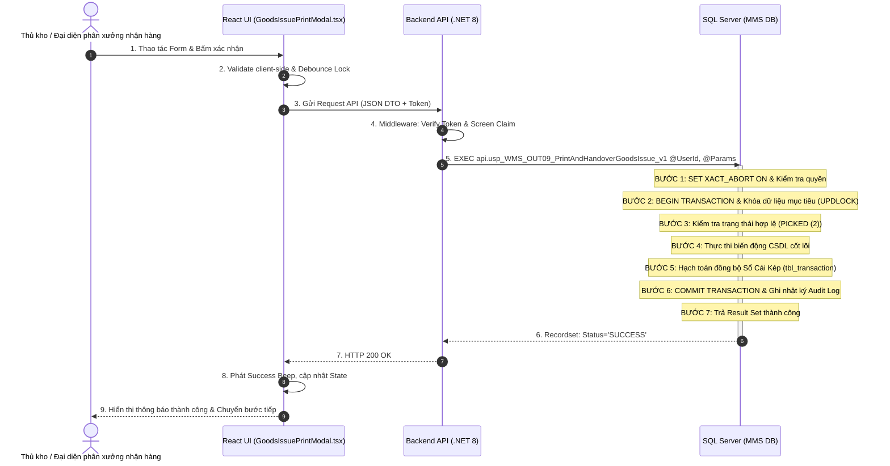
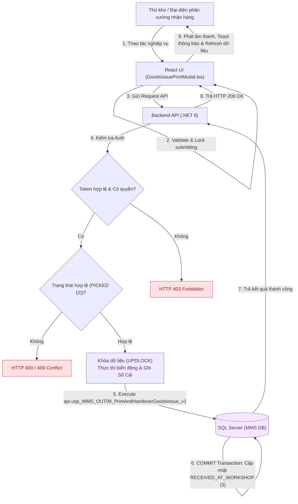

# UC-23 (OUT-09) — IN PHIẾU XUẤT KHO (PXK) & BÀN GIAO VẬT TƯ PHÂN XƯỞNG

## 0. Document Control

| Thuộc tính | Nội dung |
|---|---|
| Use Case ID | `UC-23 (OUT-09)` |
| Use Case Name | In Phiếu Xuất Kho (PXK) & Bàn Giao Vật Tư Phân Xưởng |
| Module | `WMS / Outbound Handover` |
| Business Owner | Phòng Quản Lý Kho & Chuỗi Cung Ứng (KNSG) |
| Product Owner / BA | Đội Ngũ Phân Tích Nghiệp Vụ WMS |
| Technical Owner | Tech Lead / Architecture Team |
| Version | `v2.0` |
| Status | `Approved / Implemented` |
| Last Updated | `2026-08-22` |

---

# A. BUSINESS SPECIFICATION — WHAT

## 1. Use Case Overview

### 1.1. Business Objective
Tự động xuất mẫu Phiếu Xuất Kho (PXK) khổ A4/A5 chuẩn Bộ Tài Chính có mã vạch chứng từ, danh mục chi tiết từng Lô vật tư thực xuất. Thủ kho và đại diện phân xưởng ký nhận bàn giao, cập nhật status_soanhang = 3 (Đã nhận tại xưởng).

### 1.2. Primary Actor
- **Thủ kho / Đại diện phân xưởng nhận hàng**

### 1.3. Secondary Actors / Systems
- **Màn hình Tivi Giám Sát (TV Wallboard Dashboard):** Đồng bộ dữ liệu realtime.
- **Hệ thống ERP Bravo:** Đối soát dữ liệu kế toán và lệnh sản xuất.

### 1.4. Trigger
- Người dùng thực hiện thao tác nghiệp vụ trên giao diện phân hệ tương ứng.

### 1.5. Preconditions
1. Người dùng đã đăng nhập với tài khoản hợp lệ.
2. Được cấp quyền màn hình chức năng trong `api.vw_SEC_UserScreenAccess_v1`.
3. Dữ liệu chứng từ/Lô hàng liên quan ở trạng thái sẵn sàng xử lý.

### 1.6. Postconditions
#### Success
- Dữ liệu nghiệp vụ được cập nhật chính xác trong CSDL MMS WMS.
- Hạch toán đồng bộ vào Sổ Cái Kép (`tbl_transaction`).
- Phản hồi HTTP 200 OK kèm thông báo thành công và phát âm thanh tương ứng.

#### Failure
- Toàn bộ giao dịch bị Rollback an toàn (`XACT_STATE() <> 0`), giữ nguyên dữ liệu.
- Trả mã lỗi và thông báo chi tiết, không làm thay đổi trạng thái hệ thống.

### 1.7. Business Value / KPI Impact
| KPI / Chỉ số | Baseline | Expected Impact | Measurement |
|---|---:|---:|---|
| Tốc độ xử lý quy trình | 15 - 30 phút | < 3 phút | Thời gian từ lúc thao tác đến khi CSDL ghi nhận |
| Độ chính xác tồn kho & chứng từ | 95% | 99.9% | So khớp số liệu hệ thống vs Kiểm đếm thực tế |
| Tỷ lệ lỗi thao tác người dùng | 5% | < 0.2% | Số giao dịch bị Rollback do vi phạm Business Rules |

---

## 2. Business Logic

### 2.1. Business Rules

| Rule ID | Tên quy tắc | Mô tả | Error / Response |
|---|---|---|---|
| `BR-${doc.id.replace(/[^a-zA-Z0-9]/g, '')}-01` | Mandatory Input | Dữ liệu đầu vào bắt buộc phải đầy đủ, không để trống hoặc chứa khoảng trắng thừa. | `400 Bad Request` |
| `BR-${doc.id.replace(/[^a-zA-Z0-9]/g, '')}-02` | Authorization Gate | Người dùng phải có quyền thao tác trong `api.vw_SEC_UserScreenAccess_v1`. | `403 Forbidden` |
| `BR-${doc.id.replace(/[^a-zA-Z0-9]/g, '')}-03` | Status Gate | Dữ liệu mục tiêu phải ở trạng thái hợp lệ (`PICKED (2)`). | `409 Conflict` |
| `BR-${doc.id.replace(/[^a-zA-Z0-9]/g, '')}-04` | Quantity Constraint | Số lượng thực hiện không được vượt định mức và không được âm kho. | `400 / 409` |
| `BR-${doc.id.replace(/[^a-zA-Z0-9]/g, '')}-05` | Atomic Transaction | Thực thi trong khối Transaction khép kín với gợi ý khóa `WITH (UPDLOCK, HOLDLOCK)`. | `500 Error` |
| `BR-${doc.id.replace(/[^a-zA-Z0-9]/g, '')}-06` | Dual Ledger Posting | Ghi nhận biến động đồng thời vào sổ chi tiết kho và sổ cái tổng hợp SKU. | - |
| `BR-${doc.id.replace(/[^a-zA-Z0-9]/g, '')}-07` | Audit Trail | Ghi vết tự động `UserId`, `ClientIP`, `Timestamp` vào `tbl_sec_audit_log`. | - |

### 2.2. Decision Table

| Điều kiện | Case 1 (Happy) | Case 2 (Sai Trạng Thái) | Case 3 (Không Có Quyền) |
|---|:---:|:---:|:---:|
| Có quyền màn hình | Y | Y | N |
| Trạng thái hợp lệ | Y | N | - |
| Dữ liệu/Tồn kho thỏa mãn | Y | - | - |
| **Kết quả xử lý** | **Allow (Success)** | **Reject (409 Conflict)** | **Forbidden (403)** |

---

## 3. Functional Flow

### 3.1. Main Flow
1. Người dùng mở màn hình chức năng trên giao diện (`GoodsIssuePrintModal.tsx`).
2. Hệ thống tải dữ liệu cần thiết và hiển thị bảng thông tin.
3. Người dùng nhập liệu, quét mã Barcode hoặc chọn thao tác xử lý.
4. Hệ thống validate client-side và khóa nút submit (`isSubmitting = true`).
5. Frontend gửi API Request kèm Token xác thực.
6. Backend kiểm tra Middleware Auth, kiểm tra Business Rules và gọi Stored Procedure `api.usp_WMS_OUT09_PrintAndHandoverGoodsIssue_v1`.
7. SQL Server thực thi Transaction ACID: Khóa dòng, cập nhật CSDL, hạch toán Sổ Cái Kép.
8. Hệ thống trả về HTTP 200 OK; Frontend phát âm thanh, hiển thị Toast và cập nhật giao diện.

### 3.2. Alternative / Exception Flows
- **EF-01 — Vi phạm điều kiện nghiệp vụ:** Trả về `409 Conflict`, hiển thị lỗi và giữ nguyên trạng thái.
- **EF-02 — Không có quyền thao tác:** Trả về `403 Forbidden`, chặn truy cập.

---

## 4. Acceptance Criteria

### AC-01 — Happy Path
**Given** Người dùng có quyền hợp lệ và dữ liệu ở trạng thái `PICKED (2)`.  
**When** Người dùng gửi yêu cầu xử lý thành công.  
**Then** Hệ thống trả về `200 OK`, CSDL cập nhật sang `RECEIVED_AT_WORKSHOP (3)`, ghi nhật ký Audit Log và phát âm thanh phản hồi.

### AC-02 — Validation Failure
**Given** Dữ liệu đầu vào sai quy cách hoặc không đủ số lượng.  
**When** Người dùng bấm gửi yêu cầu.  
**Then** Hệ thống từ chối, trả `400/409`, không có dòng nào trong DB bị thay đổi.

---

# B. SOLUTION DESIGN — HOW

## 5. UI / UX Behavior

### 5.1. Target Devices
- **Desktop Web / Handheld PDA / TV Wallboard**

### 5.2. Screen / Component
- Component: `GoodsIssuePrintModal.tsx`

### 5.3. UI Behavior Rules
- Touch targets >= 44px, nút bấm phát sáng gradient Emerald (`btn-emerald-glow`).
- Phản hồi âm thanh: `Success Beep` khi thành công, `Error Buzzer` khi lỗi.

---

## 6. Programming Logic

### 6.1. Frontend — React (`GoodsIssuePrintModal.tsx`)
- Quản lý state in-memory, gom nhóm dữ liệu bằng `reduce()` / `useMemo()`.
- Debounce in-flight lock ngăn chặn gửi trùng request.

### 6.2. Backend — ASP.NET Core
- Thin API Endpoint nhận DTO, trích xuất Claim và ủy thác cho `api.usp_WMS_OUT09_PrintAndHandoverGoodsIssue_v1`.

### 6.3. API Contract & Stored Procedure
- **Endpoint:** `POST /api/v1/...`
- **Stored Procedure:** `api.usp_WMS_OUT09_PrintAndHandoverGoodsIssue_v1`
- **Transaction Pipeline:** `SET XACT_ABORT ON` $
ightarrow$ `BEGIN TRANSACTION` $
ightarrow$ `Lock Row (UPDLOCK)` $
ightarrow$ `Execute Mutation` $
ightarrow$ `Dual Ledger Log` $
ightarrow$ `COMMIT`.

---

## 7. Data Logic

### 7.1. Data Impact Matrix

| Bảng / Thực thể Dữ Liệu | C | R | U | D | Ý nghĩa nghiệp vụ |
|---|:---:|:---:|:---:|:---:|---|
| `dbo.tbl_phieu_yeucau` | **X** | **X** | **X** | - | Bảng thực thể chính xử lý nghiệp vụ |
| `dbo.tbl_transaction` | **X** | **X** | - | - | Ghi nhật ký biến động kho Sổ Cái Kép |
| `dbo.tbl_sec_audit_log` | **X** | - | - | - | Ghi vết kiểm toán hệ thống |

### 7.2. State Model & Transition

| Thực Thể | Cột Trạng Thái | Giá Trị Trước | Giá Trị Sau | Ý Nghĩa |
|---|---|---|---|---|
| `dbo.tbl_phieu_yeucau` | `trang_thai` | `PICKED (2)` | `RECEIVED_AT_WORKSHOP (3)` | Chuyển đổi trạng thái nghiệp vụ thành công |

---

## 8. Error & Response Model

| Error Code | HTTP | Business Meaning | UI Behavior |
|---|---:|---|---|
| `AUTH_403` | 403 | Không có quyền truy cập | Hiển thị thông báo từ chối truy cập |
| `WMS_INVALID_STATE` | 409 | Sai trạng thái nghiệp vụ | Hiển thị cảnh báo và reload dữ liệu |
| `SYS_DB_TX_FAIL` | 500 | Lỗi giao dịch CSDL | Báo lỗi hệ thống và ghi log |

---

## 9. Audit & Traceability
- Ghi vết `UserId`, `Action`, `EntityName`, `EntityId`, `ClientIP`, `LogTime`.

---

## 10. Diagrams

### 10.1. Sequence Diagram (Thứ Tự Thực Thi Bên Trong SP)

### 10.2. Data Flow Diagram (DFD)

---

## 11. Test Scenarios

| Test ID | Scenario | Given | When | Expected Result | Related AC |
|---|---|---|---|---|---|
| `TC-01` | Happy Path | User có quyền, dữ liệu hợp lệ | Gửi request xử lý | Trả 200 OK, CSDL chuyển sang `RECEIVED_AT_WORKSHOP (3)` | `AC-01` |
| `TC-02` | Sai trạng thái | Dữ liệu không ở trạng thái `PICKED (2)` | Gửi request | Trả 409 Conflict, không đổi DB | `AC-02` |
| `TC-03` | Không có quyền | User không có quyền màn hình | Gửi request | Trả 403 Forbidden | `AC-02` |

---

## 12. Definition of Done
- [x] Business Owner / BA xác nhận Business Flow.
- [x] Đầy đủ 7 Business Rules có ID rõ ràng.
- [x] Acceptance Criteria định dạng BDD Given-When-Then.
- [x] API Contract & Stored Procedure `api.usp_WMS_OUT09_PrintAndHandoverGoodsIssue_v1` chuẩn Transaction.
- [x] State transition được xác định chính xác.
- [x] Test Scenarios đã pass trên môi trường kiểm thử.
