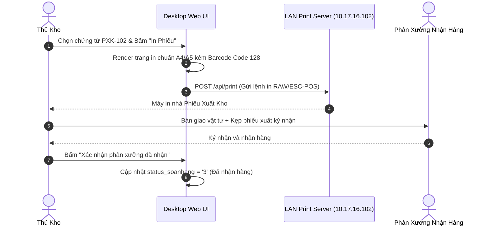

# Phân tích Thiết kế Logic UC-23 (OUT-09) - In Phiếu Xuất Kho (PXK) & Bàn Giao Vật Tư Cho Phân Xưởng

Tài liệu này đi sâu vào phân tích và thiết kế hệ thống ở 5 khía cạnh bắt buộc: **Business Logic**, **UI/UX Guidelines**, **Programming Logic**, **Data Logic**, và **Diagrams (Mermaid)** dành cho chức năng **In Phiếu Xuất Kho & Bàn Giao Vật Tư (OUT-09)** của Thủ kho và Đại diện phân xưởng nhận hàng.

---

## 1. Business Logic (Logic Nghiệp Vụ)

- **Mục tiêu cốt lõi:** Cho phép Thủ kho tra cứu danh sách các chứng từ xuất kho đã lập (`OUT_CON`), in mẫu Phiếu Xuất Kho chuẩn có mã vạch barcode định danh (`PXK-xxxx`), danh mục vật tư chi tiết, số lượng, quy cách, chữ ký các bên liên quan, đồng thời hỗ trợ gửi trực tiếp lệnh in nhiệt LAN tới máy in kho và ghi nhận trạng thái phân xưởng đã ký nhận (`status_soanhang = '3'`).

- **Các quy tắc nghiệp vụ (Business Rules):**
  - `BR-OUT-09-01` **Định dạng mẫu Phiếu Xuất Kho chuẩn:** Mẫu in bao gồm:
    - Tiêu đề: **CÔNG TY CỔ PHẦN KỀM NGHĨA SÀI GÒN - PHIẾU XUẤT KHO VẬT TƯ**.
    - Mã phiếu Barcode Code 128 ở góc trên cùng bên phải.
    - Thông tin người nhận, phân xưởng đích, lý do xuất, số lệnh sản xuất.
    - Bảng chi tiết: STT, Mã vật tư, Tên quy cách, ĐVT, Số lượng yêu cầu, Số lượng thực xuất, Mã Lô (Batch), Vị trí Ô kệ đã lấy.
    - 4 vị trí chữ ký: Người lập phiếu, Thủ kho xuất, Người nhận hàng (Phân xưởng), Quản đốc duyệt.
  - `BR-OUT-09-02` **Tích hợp máy in mạng LAN (Network Printing Integration):** Hệ thống tích hợp trực tiếp với dịch vụ máy in nhiệt qua endpoint `http://10.17.16.102:8080/api/print` (hoặc print client cục bộ), hỗ trợ in không cần mở hộp thoại Print của trình duyệt.
  - `BR-OUT-09-03` **Ghi nhận xác nhận nhận hàng từ phân xưởng (Workshop Receipt Confirmation):** Khi người nhận hàng tại phân xưởng kiểm đếm xong và xác nhận, trạng thái phiếu được cập nhật sang `status_soanhang = '3'` (Phân xưởng đã nhận hàng).

- **Quy trình tương tác 5 bước (Interaction Flow):**
  - **Bước 1:** Thủ kho truy cập tab "Phiếu Xuất Kho Đã Lập" trên Web hoặc nhấn nút in từ thông báo hoàn tất trên PDA.
  - **Bước 2:** Hệ thống tải danh sách các chứng từ xuất kho gần nhất (`api.usp_WMS_OUT09_GetIssueDocuments_v1`).
  - **Bước 3:** Thủ kho chọn một chứng từ và bấm nút **"In Phiếu Xuất Kho"**.
  - **Bước 4:** Hệ thống hiển thị bản xem trước trang in A4/A5 và đồng thời kích hoạt lệnh in tới máy in nhiệt kho.
  - **Bước 5:** Thủ kho kẹp phiếu xuất cùng lô hàng bàn giao cho nhân viên phân xưởng ký nhận, sau đó bấm xác nhận bàn giao trên hệ thống.

---

## 2. Tiêu chuẩn Thiết kế Giao diện (UI/UX Guidelines)

- **Thiết bị đích:** Máy tính Desktop Web (Trang in PDF/Khổ A4/A5) & Tablet/PDA.
- **Yêu cầu trải nghiệm (UX Principles):**
  - **Khổ in chuẩn hóa (Print-ready CSS Stylesheet):**
    - Sử dụng `@media print` ẩn toàn bộ Navbar, Sidebar, nút bấm, background màu tối, đảm bảo nền trắng chữ đen sắc nét và tiết kiệm mực in.
    - Mã vạch Barcode kích thước chuẩn nét cao (SVG render) để máy quét Barcode quét được ngay ở khoảng cách 30cm.
  - **Chỉ báo trạng thái in rõ ràng:** Nút in có trạng thái loading xoay vòng khi đang đẩy lệnh tới Print Server, thông báo toast xanh khi máy in đã nhận lệnh.

---

## 3. Programming Logic (Logic Lập Trình)

### 3.1. Frontend Component (`IssuePrintModal.tsx` & `printClient.ts`)

- **State Management & Print Handler:**
```typescript
const handlePrintIssueDocument = async (docId: number) => {
  try {
    setIsPrinting(true);
    // 1. Tải chi tiết chứng từ xuất kho
    const docData = await outboundService.getIssueDocumentDetail(docId);
    
    // 2. Gửi lệnh in mạng LAN qua PrintClient
    await printService.printIssueDocument({
      documentId: docId,
      documentCode: `PXK-${docId}`,
      receiver: docData.receiverName,
      department: docData.departmentName,
      items: docData.items
    });
    
    toast.success(`Đã gửi lệnh in phiếu PXK-${docId} tới máy in nhiệt kho!`);
  } catch (err: any) {
    toast.error(err.message || 'Lỗi khi gửi lệnh in.');
    window.print(); // Fallback sang in trình duyệt
  } finally {
    setIsPrinting(false);
  }
};
```

### 3.2. Backend API & Stored Procedure Execution

#### A. C# .NET 8 Web API (`OutboundPickingEndpoints.cs`)
- **Endpoint:** `GET /api/v1/outbound-picking/documents`
```csharp
app.MapGet("/api/v1/outbound-picking/documents", async (
    string? search,
    int? page,
    int? pageSize,
    HttpContext httpContext,
    IOutboundPickingGateway gateway,
    CancellationToken ct) =>
{
    var userId = httpContext.User.FindFirst(ClaimTypes.NameIdentifier)?.Value 
                 ?? httpContext.Request.Headers["X-User-Id"].FirstOrDefault() 
                 ?? "SYSTEM";

    var result = await gateway.GetIssueDocumentsAsync(userId, search, page ?? 1, pageSize ?? 50, ct);
    return Results.Ok(ApiResponse<PagedResult<IssueDocumentSummary>>.Success(result));
})
.WithName("GetIssueDocuments")
.RequireAuthorization();
```

#### B. SQL Stored Procedure (`api.usp_WMS_OUT09_GetIssueDocuments_v1`)
```sql
ALTER PROCEDURE api.usp_WMS_OUT09_GetIssueDocuments_v1
    @UserId nvarchar(50),
    @Search nvarchar(100) = NULL,
    @Page int = 1,
    @PageSize int = 50
AS
BEGIN
    SET NOCOUNT ON;

    IF NOT EXISTS
    (
        SELECT 1 FROM api.vw_SEC_UserScreenAccess_v1
        WHERE UserId = @UserId AND ScreenCode IN (N'scr_soanhang', N'scr_xuatkho_thutuc', N'scr_main')
    ) THROW 51001, N'Khong co quyen xem danh sach phieu xuat kho.', 1;

    SELECT DocumentId = doc.id_phieu_trans,
        DocumentCode = CONCAT(N'PXK-', doc.id_phieu_trans),
        RequestId = doc.ma_yeucau,
        RequestCode = CONCAT(N'DNXK-', doc.ma_yeucau),
        DepartmentName = COALESCE(req.ten_bravo_bophan, req.bo_phan, doc.ma_kho_to),
        ReceiverName = doc.nguoi_nhan,
        CreatorName = doc.user_cre,
        IssuedAt = doc.time_cre,
        DocumentStatusCode = doc.trang_thai_phieu,
        TotalItems = COUNT(trans.id_trans),
        TotalQuantity = SUM(ISNULL(trans.so_luong, 0))
    FROM dbo.tbl_phieu_transaction AS doc
    LEFT JOIN dbo.tbl_phieu_yeucau AS req ON req.id_phieu_yeucau = doc.ma_yeucau
    LEFT JOIN dbo.tbl_transaction AS trans ON trans.id_phieu_trans = doc.id_phieu_trans AND trans.nghiep_vu = N'OUT_CON'
    WHERE doc.nghiep_vu = N'OUT_CON' AND ISNULL(doc.trang_thai_phieu, N'0') <> N'0'
      AND (@Search IS NULL OR CONVERT(nvarchar, doc.id_phieu_trans) LIKE N'%' + @Search + N'%' OR req.bo_phan LIKE N'%' + @Search + N'%')
    GROUP BY doc.id_phieu_trans, doc.ma_yeucau, req.ten_bravo_bophan, req.bo_phan, doc.ma_kho_to, doc.nguoi_nhan, doc.user_cre, doc.time_cre, doc.trang_thai_phieu
    ORDER BY doc.id_phieu_trans DESC
    OFFSET (@Page - 1) * @PageSize ROWS FETCH NEXT @PageSize ROWS ONLY;
END;
```

---

## 4. Data Logic & Schema Model (Cấu Trúc Dữ Liệu)

- **Bảng CSDL liên quan:**
  - `dbo.tbl_phieu_transaction`: Bảng cha lưu header phiếu xuất kho (`PXK-xxxx`).
  - `dbo.tbl_transaction`: Bảng con lưu từng dòng vật tư thực xuất (`OUT_CON`).
  - `dbo.tbl_phieu_yeucau`: Bảng cha liên kết chứa thông tin đề nghị và phân xưởng.

---

## 5. Diagrams (Mermaid Sơ Đồ Luồng Nghiệp Vụ)

