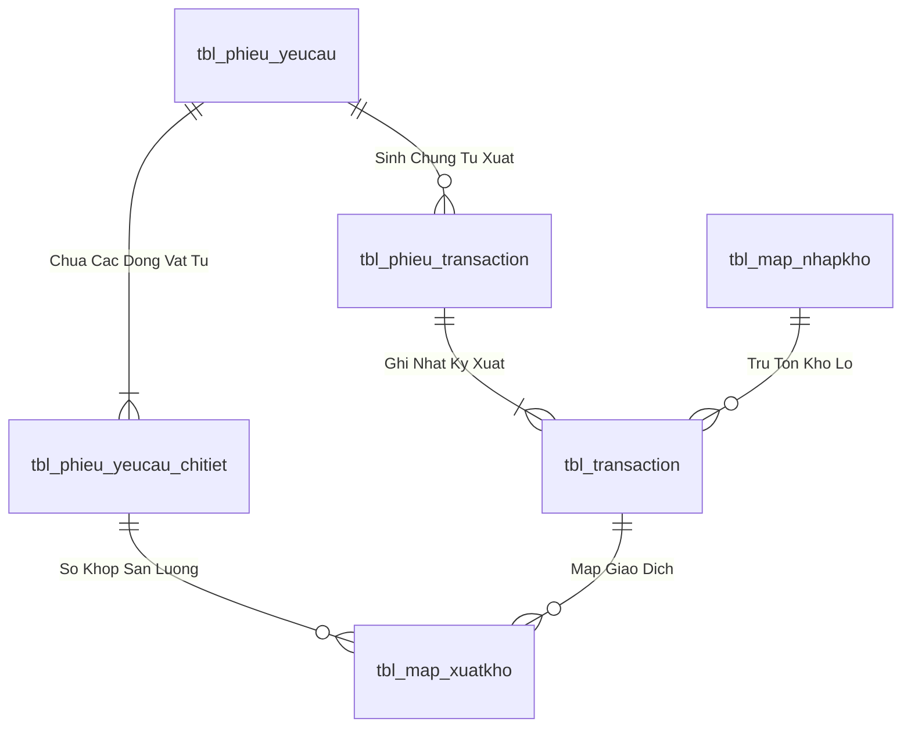
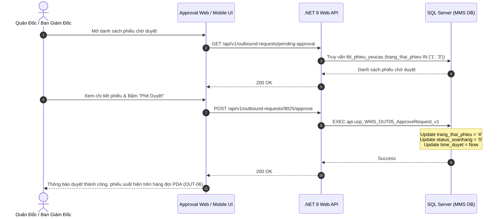

# Phân tích Thiết kế Logic UC-24 (OUT-05) - Phê Duyệt Đề Nghị Xuất Kho Đa Cấp (Quản Đốc / Ban Giám Đốc)

Tài liệu này đi sâu vào phân tích và thiết kế hệ thống ở 5 khía cạnh bắt buộc: **Business Logic**, **UI/UX Guidelines**, **Programming Logic**, **Data Logic**, và **Diagrams (Mermaid)** dành cho chức năng **Phê Duyệt Đề Nghị Xuất Kho Đa Cấp (OUT-05)** của Quản Đốc Phân Xưởng, Trưởng Phòng Sản Xuất và Ban Giám Đốc.

---

## 1. Business Logic (Logic Nghiệp Vụ)

- **Mục tiêu cốt lõi:** Cung cấp phân hệ phê duyệt chuyên biệt dành cho cấp quản lý để thẩm định, xét duyệt hoặc từ chối các phiếu đề nghị xuất kho (`tbl_phieu_yeucau`). Hỗ trợ cơ chế phê duyệt 2 cấp linh hoạt: Cấp 1 (Quản đốc phân xưởng duyệt `trang_thai_phieu = '3'`) và Cấp 2 (Ban Giám Đốc phê duyệt cuối cùng `trang_thai_phieu = '4'` hoặc `'5'`). Khi được phê duyệt, phiếu lập tức xuất hiện trên hàng đợi soạn hàng của Thủ kho (`OUT-06`).

- **Các quy tắc nghiệp vụ (Business Rules):**
  - `BR-OUT-05-01` **Phân quyền phê duyệt theo vai trò (Role-based Approval Rights):**
    - Quản đốc phân xưởng (`role_manager`, `truongphong`): Phê duyệt các phiếu xuất trong định mức (`phan_loai = 'trong'`) và thẩm định bước 1 các phiếu xuất ngoài định mức/vượt định mức (`trang_thai_phieu = '3'`).
    - Ban Giám Đốc / Ban Tổng Giám Đốc (`role_director`, `bgd`): Phê duyệt cấp cuối cùng cho các phiếu vượt định mức (`phan_loai = 'vuot'`) hoặc phiếu xuất đột xuất giá trị lớn (`trang_thai_phieu = '4'` hoặc `'5'`).
  - `BR-OUT-05-02` **Cơ chế Từ chối phiếu (Rejection Rules):**
    - Khi từ chối, người duyệt bắt buộc phải nhập lý do từ chối vào trường `ghi_chu_duyet`.
    - Hệ thống cập nhật `trang_thai_phieu = '0'` (Từ chối/Hủy), gửi thông báo lý do về cho người lập phiếu.
  - `BR-OUT-05-03` **Tính toàn vẹn của giao dịch phê duyệt (Atomic Approval):**
    - Khi phê duyệt, hệ thống cập nhật `time_duyet = GETDATE()`, `nguoi_duyet = @UserId`, `status_soanhang = '0'` (Sẵn sàng soạn hàng).
    - Phiếu ngay lập tức được đẩy vào hàng đợi thời gian thực của màn hình Tivi Dashboard và thiết bị PDA.

- **Quy trình tương tác 5 bước (Interaction Flow):**
  - **Bước 1:** Quản đốc / Ban Giám Đốc đăng nhập vào phân hệ "Phê Duyệt Đề Nghị Xuất Kho" (`/approval/outbound`).
  - **Bước 2:** Xem danh sách các phiếu đang chờ duyệt (`trang_thai_phieu = '1'` hoặc `'3'`).
  - **Bước 3:** Nhấn vào một phiếu để xem toàn bộ thông tin chi tiết: Lệnh sản xuất, danh mục vật tư, số lượng yêu cầu, lý do giải trình.
  - **Bước 4:** Chọn hành động:
    - Bấm **"Phê Duyệt Đề Nghị"** (Màu xanh lá Emerald).
    - Bấm **"Từ Chối Đề Nghị"** (Màu đỏ Rose, nhập lý do từ chối).
  - **Bước 5:** Backend gọi SP `api.usp_WMS_OUT05_ApproveRequest_v1`, cập nhật trạng thái phiếu và ghi log audit.

---

## 2. Tiêu chuẩn Thiết kế Giao diện (UI/UX Guidelines)

- **Thiết bị đích:** Máy tính Desktop Web, Tablet & Mobile Responsive (Dành cho Lãnh đạo duyệt nhanh trên điện thoại).
- **Yêu cầu trải nghiệm (UX Principles):**
  - **Thẻ phiếu tóm tắt trực quan (Approval Card View):**
    - Nổi bật: Tên phân xưởng, Tổng giá trị / Tổng sản lượng, Mã LSX, Lý do đề nghị.
    - Cảnh báo trực quan nếu là phiếu vượt định mức `[ ⚠ VƯỢT ĐỊNH MỨC ]`.
  - **2 Nút hành động dứt khoát:**
    - Nút **`[ ✓ PHÊ DUYỆT ĐỀ NGHỊ ]`**: Gradient xanh Emerald (`from-emerald-600 to-teal-700`).
    - Nút **`[ ✕ TỪ CHỐI ]`**: Màu đỏ viền nổi, bật hộp thoại nhập lý do.

---

## 3. Programming Logic (Logic Lập Trình)

### 3.1. Frontend Component (`ApprovalPage.tsx`)

- **Approval Handling Logic:**
```typescript
const handleApprove = async (requestId: number, comment?: string) => {
  try {
    setIsSubmitting(true);
    await outboundService.approveRequest(requestId, comment);
    toast.success(`Đã phê duyệt thành công đề nghị DNXK-${requestId}!`);
    refreshApprovalList();
  } catch (err: any) {
    toast.error(err.message || 'Lỗi khi phê duyệt đề nghị.');
  } finally {
    setIsSubmitting(false);
  }
};

const handleReject = async (requestId: number, reason: string) => {
  try {
    setIsSubmitting(true);
    await outboundService.rejectRequest(requestId, reason);
    toast.info(`Đã từ chối đề nghị DNXK-${requestId}.`);
    refreshApprovalList();
  } catch (err: any) {
    toast.error(err.message || 'Lỗi khi từ chối đề nghị.');
  } finally {
    setIsSubmitting(false);
  }
};
```

### 3.2. Backend API & Stored Procedure Execution

#### A. C# .NET 8 Web API (`OutboundApprovalEndpoints.cs`)
- **Endpoint:** `POST /api/v1/outbound-requests/{requestId}/approve` & `POST /api/v1/outbound-requests/{requestId}/reject`

#### B. SQL Stored Procedure (`api.usp_WMS_OUT05_ApproveRequest_v1`)
```sql
ALTER PROCEDURE api.usp_WMS_OUT05_ApproveRequest_v1
    @UserId nvarchar(50),
    @RequestId int,
    @Action nvarchar(20), -- 'APPROVE' hoặc 'REJECT'
    @Comment nvarchar(500) = NULL
AS
BEGIN
    SET NOCOUNT ON;
    SET XACT_ABORT ON;

    IF NOT EXISTS
    (
        SELECT 1 FROM api.vw_SEC_UserScreenAccess_v1
        WHERE UserId = @UserId AND ScreenCode IN (N'scr_duyet_xuat', N'scr_main', N'scr_admin')
    ) THROW 51001, N'Khong co quyen phe duyet de nghi xuat kho.', 1;

    DECLARE @Now datetime = GETDATE(), @CurrentStatus nvarchar(20);

    BEGIN TRY
        BEGIN TRANSACTION;

        SELECT @CurrentStatus = trang_thai_phieu
        FROM dbo.tbl_phieu_yeucau WITH (UPDLOCK, HOLDLOCK)
        WHERE id_phieu_yeucau = @RequestId;

        IF @CurrentStatus IS NULL THROW 51004, N'Khong tim thay phieu de nghi xuat kho.', 1;
        IF @CurrentStatus NOT IN (N'1', N'3') THROW 51005, N'Phieu khong o trang thai cho duyet.', 1;

        IF @Action = N'APPROVE'
        BEGIN
            -- Quản đốc duyệt -> chuyển sang trạng thái sẵn sàng xuất kho ('4')
            UPDATE dbo.tbl_phieu_yeucau
            SET trang_thai_phieu = N'4',
                status_soanhang = N'0',
                time_duyet = @Now,
                ghi_chu_duyet = @Comment
            WHERE id_phieu_yeucau = @RequestId;
        END
        ELSE IF @Action = N'REJECT'
        BEGIN
            -- Từ chối duyệt -> chuyển sang trạng thái đã hủy ('0')
            UPDATE dbo.tbl_phieu_yeucau
            SET trang_thai_phieu = N'0',
                time_duyet = @Now,
                ghi_chu_duyet = @Comment
            WHERE id_phieu_yeucau = @RequestId;
        END;

        COMMIT TRANSACTION;

        SELECT RequestId = @RequestId, Action = @Action, ApprovedAt = @Now;
    END TRY
    BEGIN CATCH
        IF XACT_STATE() <> 0 ROLLBACK TRANSACTION;
        THROW;
    END CATCH;
END;
```

---

## 4. Data Logic & Schema Model (Thiết kế Dữ Liệu Chuyên Sâu)

### 4.1. Entity Relationship Diagram (ERD) & Schema Details


- **Bảng Header (`dbo.tbl_phieu_yeucau`):**
  - Khóa chính: `id_phieu_yeucau` (INT IDENTITY, Clustered Index).
  - Trạng thái duyệt: `trang_thai_phieu` (`'0'`: Hủy, `'1'`: Chờ duyệt, `'3'`: QĐ duyệt, `'4'`: Sẵn sàng xuất, `'5'`: Hoàn tất duyệt).
  - Trạng thái soạn hàng: `status_soanhang` (`'0'`: Chờ soạn, `'1'`: Đang soạn, `'2'`: Đã soạn xong, `'3'`: Đã nhận tại xưởng).
  - Chỉ mục: `IX_tbl_phieu_yeucau_status` on `(trang_thai_phieu, status_soanhang) INCLUDE (time_duyet, time_cre, bo_phan)`.
- **Bảng Chi tiết (`dbo.tbl_phieu_yeucau_chitiet`):**
  - Khóa chính: `id_chitiet_phieu` (INT IDENTITY), Khóa ngoại: `id_phieu_yeucau`, `id_vattu`.

### 4.2. Data Flow & Transaction Locking Matrix
- **Cơ chế khóa đồng thời:** Stored Procedure áp dụng `SET XACT_ABORT ON` và `BEGIN TRANSACTION`.
- **Khóa dòng dữ liệu:** Sử dụng `WITH (UPDLOCK, HOLDLOCK)` trên `tbl_phieu_yeucau` và `tbl_batch_inv` để ngăn chặn hiện tượng Lost Update và xuất âm tồn kho khi nhiều nhân viên PDA thao tác đồng thời.
- **Rollback an toàn:** Bắt lỗi `CATCH` tự động kiểm tra `IF XACT_STATE() <> 0 ROLLBACK TRANSACTION` và ném lỗi nghiệp vụ kèm mã lỗi chuẩn.

### 4.3. Conceptual State Model & Transition Rules
| Trạng Thái Ban Đầu | Hành Động / Trigger | Trạng Thái Sau Chuyển Đổi | Bảng CSDL Bị Cập Nhật |
| :--- | :--- | :--- | :--- |
| **DRAFT / Mới tạo** | Gửi đề nghị xuất (OUT-01/02/03) | `trang_thai_phieu = '1'`, `status_soanhang = '0'` | `tbl_phieu_yeucau` |
| **`trang_thai_phieu = '1'`** | Phê duyệt cấp 1 / 2 (OUT-05) | `trang_thai_phieu = '4'`, `status_soanhang = '0'` | `tbl_phieu_yeucau` (`time_duyet = Now`) |
| **`status_soanhang = '0'`** | Bấm Bắt đầu soạn (OUT-06) | `status_soanhang = '1'` | `tbl_phieu_yeucau`, chèn `tbl_phieu_transaction` |
| **`status_soanhang = '1'`** | Nhặt đủ 100% món (OUT-08) | `status_soanhang = '2'` | `tbl_phieu_yeucau`, `tbl_phieu_transaction` |
| **`status_soanhang = '2'`** | Xưởng ký nhận vật tư (OUT-09) | `status_soanhang = '3'` | `tbl_phieu_yeucau` |

---

## 5. Diagrams (Mermaid Sơ Đồ Luồng Nghiệp Vụ)


