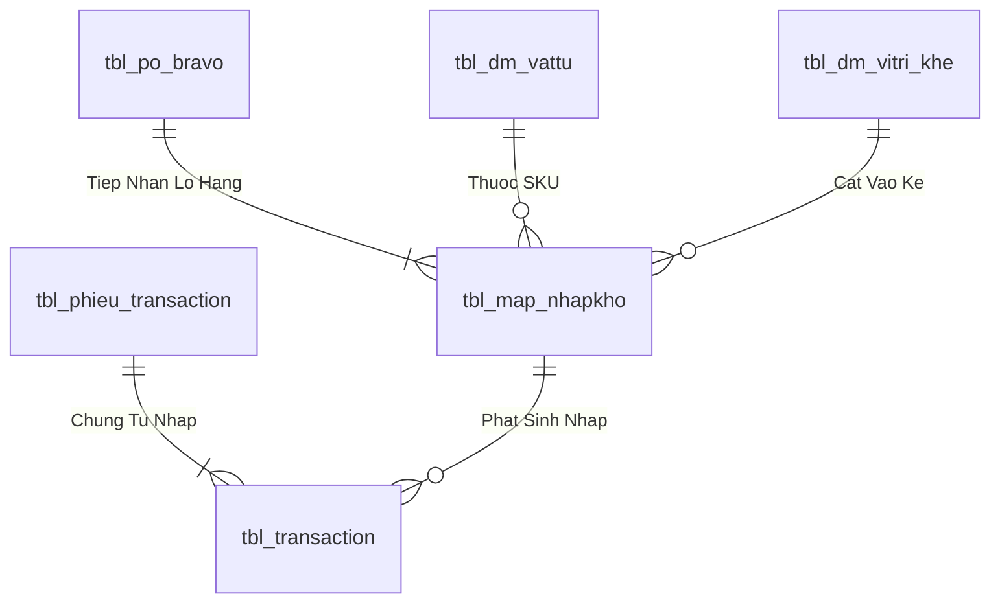

# Phân tích Thiết kế Logic UC-25 (RET-03) - Kiểm Đếm & Xác Nhận Nhập Trả Hàng Vào Kho Trên PDA

Tài liệu này đi sâu vào phân tích và thiết kế hệ thống ở 5 khía cạnh bắt buộc: **Business Logic**, **UI/UX Guidelines**, **Programming Logic**, **Data Logic**, và **Diagrams (Mermaid)** dành cho chức năng **Xác Nhận Nhập Trả Trên PDA (RET-03)** của Thủ kho.

---

## 1. Business Logic (Logic Nghiệp Vụ)
- **Mục tiêu cốt lõi:** Thủ kho dùng PDA quét kiểm đếm hàng trả lại, phân loại hàng còn dùng được vs Hàng phế liệu, cất vào Ô kệ quy định và chốt cộng tồn kho.
- **Endpoint:** `POST /api/v1/returns/confirm-pda`
- **SP:** `api.usp_WMS_RET03_ConfirmReturnPda_v1`

---

## 4. Data Logic & Schema Model (Thiết kế Dữ Liệu Chuyên Sâu)

### 4.1. Entity Relationship Diagram (ERD) & Schema Details

- **Bảng Tiếp Nhận & Lô (`dbo.tbl_map_nhapkho`):**
  - Khóa chính: `id_nhapkho` (INT IDENTITY).
  - Trạng thái tiếp nhận: `status_kho` (`'RECEIVING'` $
ightarrow$ `'ON_RACK'` $
ightarrow$ `'STORED'`).
  - Trạng thái kiểm tra: `status_qc` (`'PENDING'` $
ightarrow$ `'PASS'` / `'REJECT'`).

### 4.2. Data Flow & Transaction Locking Matrix
- **Khóa tiếp nhận PO Bravo:** Sử dụng `WITH (UPDLOCK, HOLDLOCK)` trên dòng PO Bravo để đảm bảo số lượng thực nhận không vượt quá dung sai PO cho phép và chống tạo trùng Lô khi quét liên tục.

### 4.3. Conceptual State Model & Transition Rules
| Bước Tiếp Nhận | Sự Kiện | Trạng Thái Kho / QC | Hành Động Kế Tiếp |
| :--- | :--- | :--- | :--- |
| **1. Cửa kho Staging** | Quét in tem Lô (INB-03) | `status_kho = 'RECEIVING'`, `status_qc = 'PENDING'` | Đưa vào hàng đợi QC (QC-01) |
| **2. KCS Kiểm tra** | QC Duyệt Đạt (QC-04) | `status_qc = 'PASS'` | Đề xuất vị trí Ô kệ (INB-04) |
| **3. Cất vào dầm kệ** | Quét cất Ô kệ PDA (INB-05) | `status_kho = 'ON_RACK'` | Chờ Thủ kho duyệt nhập chính thức |
| **4. Hạch toán chính thức** | Xác nhận nhập kho (INB-06) | `status_kho = 'STORED'` | Ghi Nợ/Có Sổ Cái Kép & In PNK (INB-07) |
